<!--~~~~~~~~~~~~~~~~~~~~~~~~~~~~~~~~~~~~~~~~~~~~~~~~~~~~~~~~~~~~~~~~~~~~~~~~~~~~~~~~~~~~~~~~~~~~-->
<!--~~~~~~~~~~~~~~~~~~~~~~~~~~ 01.  (xx) ~~~~~~~~~~~~~~~~~~~~~~~~~~~-->
<!--~~~~~~~~~~~~~~~~~~~~~~~~~~~~~~~~~~~~~~~~~~~~~~~~~~~~~~~~~~~~~~~~~~~~~~~~~~~~~~~~~~~~~~~~~~~~-->
<p align="center" width="100%">


</p>
<!-- {width="2.0in" height="1.773685476815398in"}{width="2.0995866141732282in" height="1.77in"} -->

## About this Course {#about-this-course }

This course introduces the programming language JavaScript and shows the
websites that include the type of interactions students will eventually
be able to develop. Learners will understand the importance of how
JavaScript was developed and why such history impacts the way JavaScript
is currently written and in future releases. Learners will write their
first scripts, have their HTML and CSS skills assessed, create variables
and arrays and assign values to them. If student's skills are lacking,
resources and recommendations are provided to improve these skills.
There is ample opportunity for students to practice these first, core
skills.

# Syllabus {#syllabus }

### Week 1 {#week-1 }

### Getting Started, Introduction to JavaScript, Variables, and Arrays {#getting-started-introduction-to-javascript-variables-and-arrays }

In this module, you will be introduced to JavaScript and what it can do.
You will be able to identify websites that include the types of
interactions you will be able to produce at the end of the entire
Specialization. You will also be able to discuss the history of
JavaScript and explore why this history impacts how we write JavaScript.
On the web, JavaScript is used to manipulate the HTML and CSS of a
webpage, after it has loaded from the server. You will be able to assess
your understanding of HTML and CSS and have the opportunity through
resources and recommendations for improving your skills in this area, if
necessary. You will write simple JavaScript statements in the web
browser console and be able to create variables and arrays. You will be
able to assign values to these variables and arrays and be able to read
values from them.

### 12 videos, 5 readings {#videos-5-readings }

-   **1.00.A Note From UC Davis**

-   [**1.00.Welcome/Intro to this
    Course!**](https://www.coursera.org/lecture/javascript-basics/welcome-to-this-course-EGMim)

1.  **Introduction to JavaScript - Part 1**

2.  **Introduction to JavaScript - Part 2**

3.  **Introduction to JavaScript - Part 3**

4.  **Tools Needed for Success**

5.  **Skills Needed for Success**

-   **1.05.Additional Resources**

6.  **JavaScript Variables**

7.  **JavaScript Variables Practice - Part 1**

8.  **JavaScript Variables Practice - Part 2**

9.  **JavaScript Variables Practice - Part 3**

10. **JavaScript Arrays - Part 1**

11. **JavaScript Arrays - Part 2**

12. **JavaScript Arrays Practice**

-   **Additional Resources**

-   **Module 1 Reflection**

# Week 2 {#week-2 }

## Controlling Logical Flow in JavaScript {#controlling-logical-flow-in-javascript }

In this module, you will be able to download, install and use of a code
editor as a tool for writing code, and properly save and manage their
files. You will be introduced to the selection control structure. This
basic control structure allows programs to follow a path based on
conditions, and is one of the three major logic and flow control
structures found in any modern programming language. You will be able to
identify, write, and trouble shoot scripts using this basic control
structure. You will be able to correctly identify loop structures and
practice using some of the syntax available in JavaScript to create
loops. You will then be able to put all three logical flow control
structures (sequence, selection, and loop) together to create basic
JavaScript programs that can be tested. Finally you will be able to
combine sets of program instructions into named functions and create
custom functions that can be called to complete the instructions they
contain.

### 25 videos, 5 readings {#videos-5-readings-1 }

1.  [**[Module 2
    Introduction]{.underline}**](https://www.coursera.org/lecture/javascript-basics/module-2-introduction-8y2ue)

2.  **Visual Studio - Part 1**

3.  **Visual Studio - Part 2**

4.  **Visual Studio - Part 3**

5.  **Operators, Booleans & Selection in JavaScript**

6.  **Try This!**

7.  **Comparing Values**

8.  **Else If**

9.  **Switch Statements**

10. **Using &&**

-   **Additional Resources**

11. **Loops in JavaScript**

12. **Working With Arrays**

13. **The For..Of Loop**

14. **While Loops**

-   **Additional Resource**

15. **Structured Programming, Sequence - Part 1**

16. **Sequence - Part 2**

17. **Sequence - Part 3, Loop**

18. **Loop + Selection**

19. **JavaScript Basic Challenges Introduction**

-   **JavaScript Basic Challenges 01-09**

20. **Functions in JavaScript**

21. **Passing In and Returning Data**

22. **Useful Example - Step 1**

23. **Useful Example - Steps 2-4**

24. **Useful Example - Step 5**

25. **More On Functions**

-   **Additional Resource**

-   **JavaScript Function Challenges 10-16**

-   **Module 2 Reflection**

# Week 3 {#week-3 }

## Using JavaScript in the Web Browser {#using-javascript-in-the-web-browser }

In this module, you will be introduced to the methods built into
JavaScript for accessing and manipulating DOM elements in the web
browser. You will be able to capture user events with JavaScript and use
those events to trigger changes to the DOM using the document methods
and element properties. You will be able to identify how scope works in
JavaScript and be introduced to best practices for working with
variables in JavaScript so that scope does not become a problem. You
will be able to practice all the skills and techniques learned so far in
the course by putting together a simple slideshow on a web page.

36 videos, 7 readings

1.  [**[Module 3
    > Introduction]{.underline}**](https://www.coursera.org/lecture/javascript-basics/module-3-introduction-xK7aE)

2.  **JavaScript and the DOM**

3.  **Dot Syntax and Methods**

4.  **DOM: getElementsByTagName();**

5.  **DOM: getElementsByClassName();**

6.  **DOM: querySelector();**

7.  **DOM: querySelectorAll();**

8.  **innerHTML**

9.  **className**

10. **Creating Elements and Text Nodes**

11. **Video: Removing Elements**

-   **Additional Resource**

-   **JavaScript DOM Challenges 17-21**

12. **Capturing Events with JavaScript**

13. **Event Listeners**

14. **The Event Object**

15. **More On Events**

16. **Mouseover, Mouseover Events: HTML**

17. **Scroll Events: HTML**

18. **deo: Window Resizing**

19. **Key Down Event**

-   **Additional Resources**

20. **JavaScript Event Challenges 22-30**

21. **Scope in JavaScript**

22. **Strategy 1: Never Use Global Scope**

23. **Strategy 2: &ldquo;use strict;&rdquo;**

24. **Strategy 3: const and let**

25. **Scope in JavaScript Summary**

-   **Additional Resources**

-   **Simple Slide Show Start Files**

26. **Simple JS Slideshow - Part 1**

27. **Simple JS Slideshow - Part 2**

28. **Simple JS Slideshow - Part 3**

29. **Simple JS Slideshow - Part 4**

30. **Simple JS Slideshow - Part 5**

-   **Discussion Prompt: Simple JS Slideshow Open Discussion**

-   **Advanced Slide Show Start Files**

31. **Slideshow with Cross Fade Effect - Part 1**

32. **Slideshow with Cross Fade Effect - Part 2**

33. **Slideshow with Cross Fade Effect - Part 3**

34. **Slideshow with Cross Fade Effect - Part 4**

35. **Slideshow with Cross Fade Effect - Part 5**

36. **Slideshow with Cross Fade Effect - Part 6**

37. **Slideshow with Cross Fade Effect - Part 7**

-   **Slideshow With Cross Fade Effect Open Discussion**

-   **Prompt: Module 3 Reflection**

# Week 4 {#week-4 }

## Basic JavaScript Application Projects {#basic-javascript-application-projects }

In this module, you will be able to apply and practice the skills and
techniques you have learned in the course by building a basic and a more
advanced distance converter. You will be able to further apply and
practice to extend your skills and techniques by building a simple
vacation destination list application.

### 26 videos, 4 readings {#videos-4-readings }

1.  [**[Module 4
    > Introduction]{.underline}**](https://www.coursera.org/lecture/javascript-basics/module-4-introduction-FqHR0)

    -   **Basic Distance Converter Start Files**

2.  **Basic Distance Converter Project - Part 1**

3.  **Basic Distance Converter Project - Part 2**

4.  **Basic Distance Converter Project - Part 3**

5.  **Basic Distance Converter Project - Part 4**

6.  **Basic Distance Converter Project - Part 5**

    -   **Basic Distance Converter Project Open Discussion**

    ```{=html}
    <!-- -->
    ```
    -   **Advanced Distance Converter Start Files**

7.  **Advanced Distance Converter Project - Part 1**

8.  **Advanced Distance Converter Project - Part 2**

9.  **Advanced Distance Converter Project - Part 3**

10. **Advanced Distance Converter Project - Part 4**

11. **Advanced Distance Converter Project - Part 5**

    -   **Advanced Distance Converter Project Open Discussion**

    -   **Vacation Desitnation Project - Part 1 Start Files**

12. **Vacation Destination Project: HTML & CSS - Part 1**

13. **Vacation Destination Project: HTML & CSS - Part 2**

14. **Vacation Destination Project: HTML & CSS - Part 3**

15. **Vacation Destination Project: HTML & CSS - Part 4**

16. **Vacation Destination Project: HTML & CSS - Part 5**

17. **Vacation Destination Project: HTML & CSS - Part 6**

    -   **Vacation Destination Project: Part 1 Open Discussion**

    -   **Vacation Destination Project - Part 2 Start Files**

18. **Vacation Destination Project: JavaScript - Part 1**

19. **Vacation Destination Project: JavaScript - Part 2**

20. **Vacation Destination Project: JavaScript - Part 3**

21. **Vacation Destination Project: JavaScript - Part 4**

22. **Vacation Destination Project: JavaScript - Part 5**

23. **Vacation Destination Project: JavaScript - Part 6**

24. **Vacation Destination Project: JavaScript - Part 7**

25. **Vacation Destination Project: JavaScript - Part 8**

    -   **Vacation Destination Project: Part 2 Open Discussion**

    -   **Module 4 Reflection**

26. **Course Summary**

-   **Self-Reflection**

# A Note From UC Davis {#a-note-from-uc-davis }

### Welcome to this course! {#welcome-to-this-course }

We are delighted to be a part of your continuing education. This course
will provide you with a variety of tools and learning opportunities, to
include video lectures, readings, assessments, peer reviews, and an
opportunity to contribute to the Coursera learning community in the
discussion forums.

In each of the lesson sections, you'll find learning objectives, lecture
videos, readings, activities, and an opportunity to test your knowledge
in quiz format. In some of the module sections you'll also work on
assignments and grade the work of your peers. A peer-review assignment,
is one where you and your fellow learners have an opportunity to review
and grade each other's work. We'll dive more into peer reviews later on
in this course.

When navigating the course, you can find available **course resources**
under each of the lecture videos in a section labeled
"[Downloads]{.underline}" -- here you can download the lecture video,
view transcripts, PDFs of the lecture slides, and **find additional
readings or files**.

If you run into any issues during this course, **learner support** is
available to all Coursera students. The link for Coursera's Learner
support is included below. The [Help Center/Learner
Support](https://learner.coursera.help/hc/en-us)

includes topics such as account setup, payments, enrollment questions,
and troubleshooting common problems.

If you find any content issues, be sure to let the course staff know by
**flagging the lecture**, assignment, reading, or quiz and this will
inform us of where these issues occur. Here is the link for more
information on how to [Flag an
Issue](https://learner.coursera.help/hc/en-us/articles/208280106-Report-a-problem-with-a-course)

&dash; it is also listed below.

One of the great things about Coursera courses is that they are
self-paced. The course dates are based on the average time it takes to
complete a course. However, if you need additional time to complete a
course you can **reset your deadlines** with no penalties. More
information on resetting deadlines can be found here: [Assignment
Deadlines](https://learner.coursera.help/hc/en-us/articles/208279866-Assignment-deadlines)

Need additional help during your course session? Be sure to utilize the
**discussion forums** and interact with your fellow peers. In this area,
you can ask questions or search for similar issues that have already
been posted in the forums. Learner support is also a great place to find
answers, but specific course content questions can typically be found
and answered in the discussion forums. This is also a great place to
post your assignment if additional peer reviews are needed. Here is a
link with more information on the discussion forums: [Discussion
Forums](https://learner.coursera.help/hc/en-us/articles/208279996-Get-help-with-course-content-in-the-discussion-forums)

Because of the self-paced nature of Coursera courses, this is an
excellent opportunity to show your commitment to your work and the work
of your peers through academic integrity. Be sure to read the Coursera
guidelines and the **Coursera Honor Code** here: [Coursera Honor
Code](https://learner.coursera.help/hc/en-us/articles/209818863-Coursera-Honor-Code)

We look forward to having you in this course. Happy learning!

***UC Davis Coursera Team***

## **Additional Links**: {#additional-links }

#### Coursera's Learner Support/Help Center: {#courseras-learner-supporthelp-center }

<https://learner.coursera.help/hc/en-us>

#### Flagging a Lecture: {#flagging-a-lecture }

<https://learner.coursera.help/hc/en-us/articles/208280106-Report-a-problem-with-a-course>

#### Assignment Deadlines:  {#assignment-deadlines }

<https://learner.coursera.help/hc/en-us/articles/208279866-Assignment-deadlines>

#### Peer Reviewed Assignments: {#peer-reviewed-assignments }

<https://learner.coursera.help/hc/en-us/sections/201895903-Peer-reviewed-assignments>

#### Coursera's Honor Code: {#courseras-honor-code }

<https://learner.coursera.help/hc/en-us/articles/209818863-Coursera-Honor-Code>

# Week One:  {#week-one }

# 1.00 Welcome to JavaScript Basics (1.01) {#welcome-to-javascript-basics-1.01 }

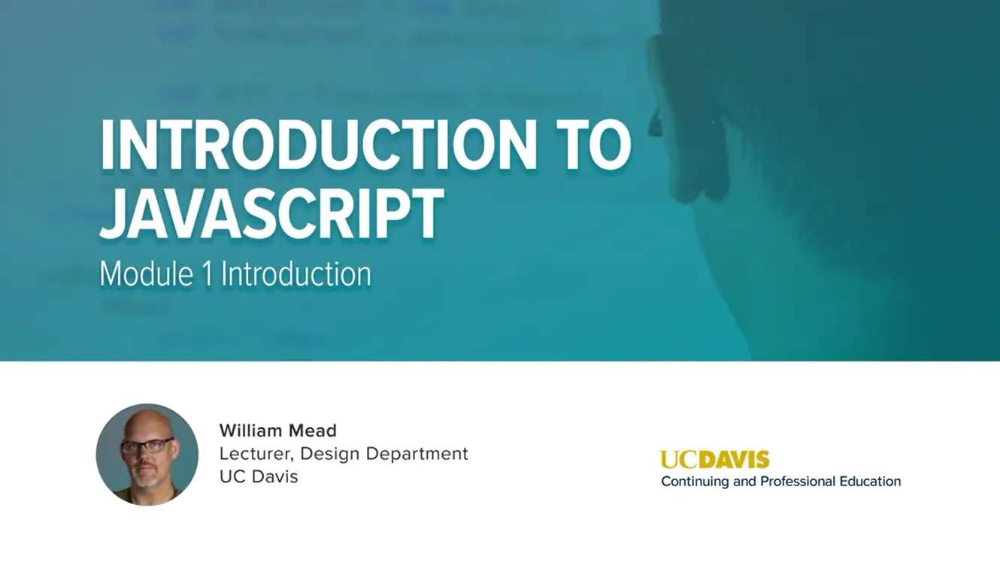{width="4.0in"
height="2.261538713910761in"}

Hello, and welcome to our course on JavaScript. My name is Bill Mead,
and I&apos;ve been teaching and learning about JavaScript for many years.
Here I am in California, outside on this beautiful day not that many
miles away from where JavaScript was invented over 25 years ago. It&apos;s a
fun programming language, I think you&apos;ll enjoy learning it. It can be
frustrating and maddening at times when you can&apos;t get it to work, but
when you do get things to work the way you want them to work, it&apos;s
super satisfying. It&apos;s become one of the most popular programming
languages in the planet.

As we go through this course and through this specialization, I think
you&apos;ll start to understand why it&apos;s satisfying and easy to get started
with and if you&apos;re new to programming, don&apos;t worry, we&apos;re going to
start at the very beginning and get you going all on the right track.
Buckle in and let&apos;s get started learning JavaScript.

# 1.00. Week 1 Introduction (0:57) {#week-1-introduction-057 }

Welcome to the first module on JavaScript. In this module we&apos;ll get
into the basics of the language. We&apos;ll talk about variables and arrays
and these kinds of things that you see in a lot of programming
languages. But we&apos;ll also talk about the history of JavaScript and do a
real introduction to the language. And the history of JavaScript is
super interesting because it has an impact on how we write JavaScript.
And that&apos;s really interesting to see how a language has evolved and
developed and how that affects the way you write modern, up to date
JavaScript. And I think you&apos;ll learn a lot from this and you&apos;ll be
able to do some interesting things with JavaScript as you go along. So
stick with me and we will have a lot of fun in this first module
learning about JavaScript in the basics of the language.

# Intro to JavaScript -- Part 1 (3:13)

{width="4.0in"
height="2.261538713910761in"}

Unlike a pillbox which really can&apos;t hold much more than just pills, you
can put anything into an array in JavaScript.

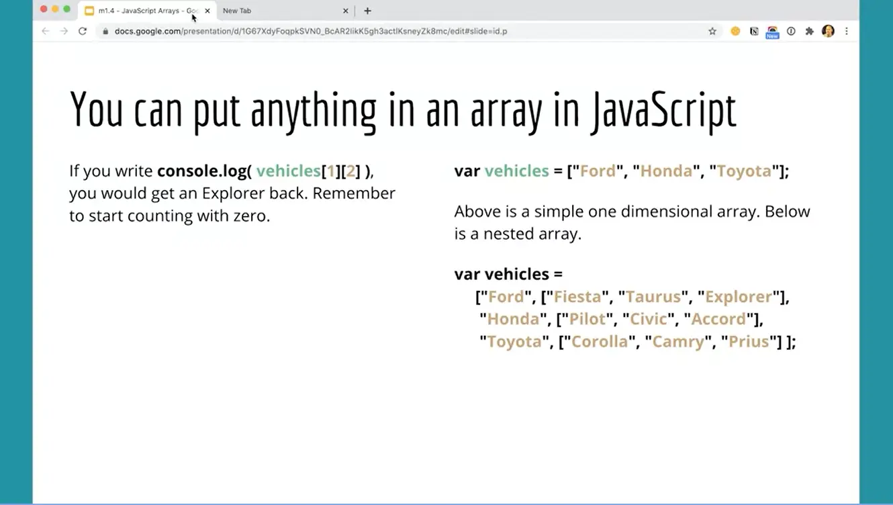{width="5.0in"
height="2.8269225721784776in"}

You can even put in an array and an array. You think about a pillbox
with a sub-container with even smaller divisions in it.

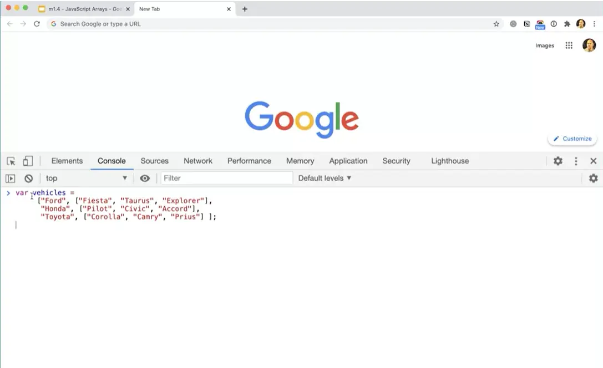{width="5.0in"
height="3.0544870953630796in"}

Let&apos;s take a look at what that looks like. Let me switch back over to
my tab here. I&apos;m just going to paste this in, but you might want to
type it. It&apos;s a little bit hard to type and get right, but it&apos;s worth
trying if you can. I&apos;m going to paste this vehicle&apos;s array in here.

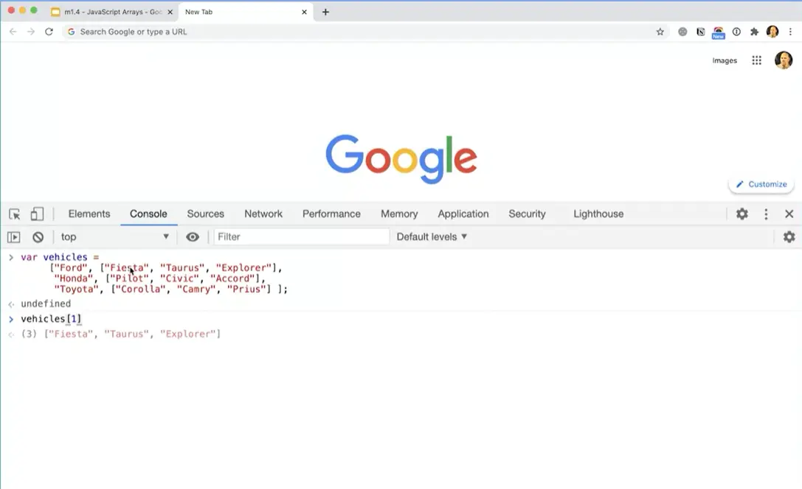{width="3.5in"
height="2.138140857392826in"}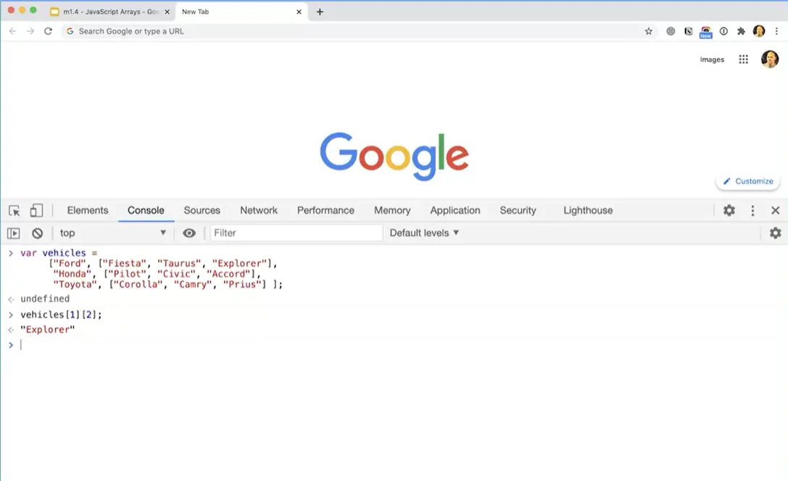{width="3.5in"
height="2.138140857392826in"}

Now if I do, if I want to access an element from this array, I could do
vehicles, square bracket one. That&apos;s going to go and get the line that
starts with which element. There we go. Then, it&apos;s going to give me
this because this is zero, and now this is one. Right? It&apos;s going to
get me that into that sub-array. You can see it&apos;s sort of showing up
down there. Then if I do square bracket two, that&apos;s going to get me the
explorer elements in that sub-array. You can do things like that with
arrays.

That&apos;s kind of complicated and you&apos;re not probably going to be doing
arrays inside of arrays to start off with. But it&apos;s an important thing
to understand about arrays is that they&apos;re very flexible tools that you
can use to hold groups of data, and that&apos;s very useful.

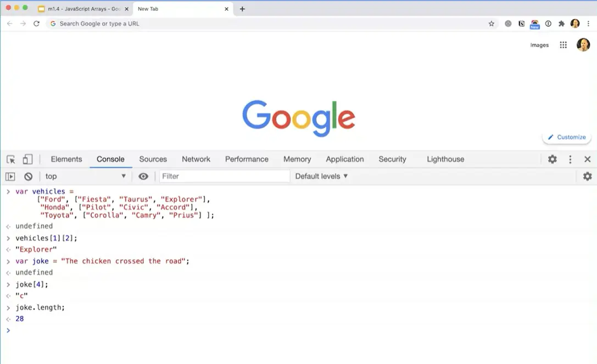{width="5.0in"
height="3.0544870953630796in"}

Another thing that&apos;s interesting is that a regular variable holding a
string can be treated as an array in JavaScript. If I make a variable
var joke equals the chicken crossed the road, now I&apos;ve got a variable
called joke, but I can actually treat it as an array. I could do. Joke
square bracket four, and that&apos;s going to get me the C in chicken.
Because zero, one, two, three, four is going to get me that C in
chicken. Or I could do, joke dot length, and it will tell me that there
are 28 characters in that string. That&apos;s kind of an interesting thing
to understand about arrays as well.

# Intro to JavaScript -- Part 2

{width="4.0in"
height="2.261538713910761in"}

A great place to go to find some websites that will show you the way
JavaScript can interact with the website is this Awwwards website with
the extra w&apos;s in here.

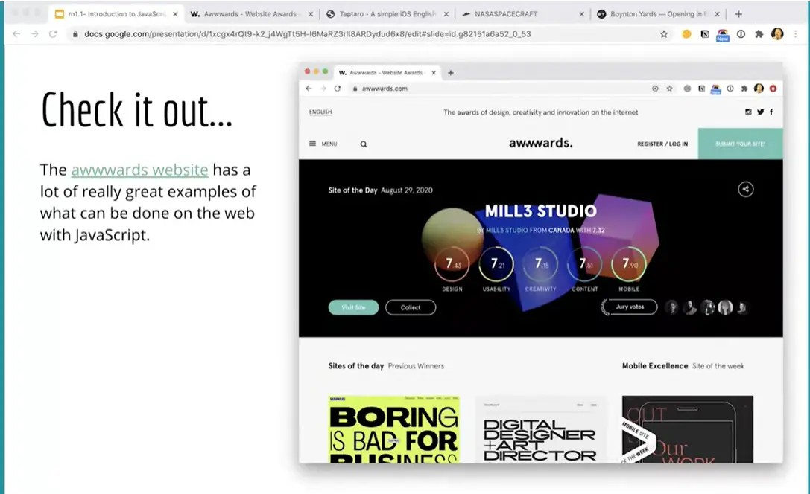{width="5.0in"
height="3.0544870953630796in"}

I have that website pulled up over here. You can come here and look
through some of the different sites that have won awards on
awwwards.com. <https://www.awwwards.com/>. They tend to be pretty
innovative and interesting sites.

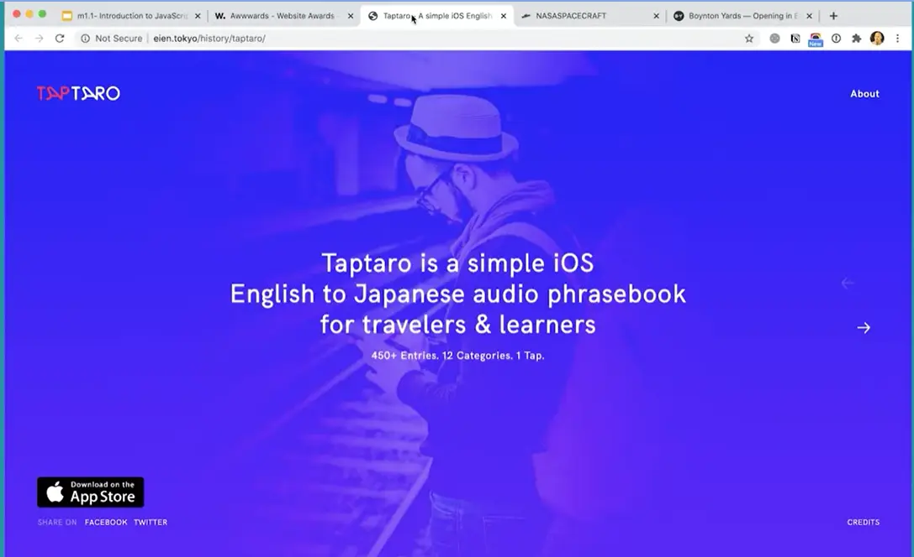{width="5.0in"
height="3.0544870953630796in"}

I have this one (<https://www.awwwards.com/sites/taptaro>). Whether
you&apos;re talking about following the mouse, or coming over here and the
animation around the circle, or the way these images pop in, this is all
being done with JavaScript, this kind of thing.

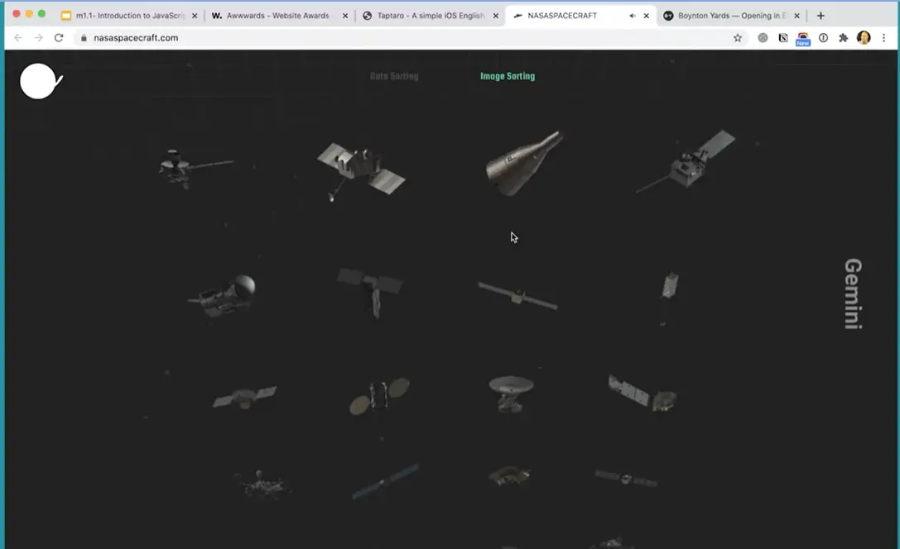{width="5.0in"
height="3.0544870953630796in"}

Then here we are in one of the NASA spacecraft website here (no longer
active). Click on one of these things it will come up and show you the
different pictures and give you some other interactions including some
sounds as you work around it.

{width="5.0in"
height="3.0544870953630796in"}

Or this website (<https://boyntonyards.com/>) over here which as you
scroll through does some interesting interactions as you&apos;re scrolling
through the website, that kind of stuff.

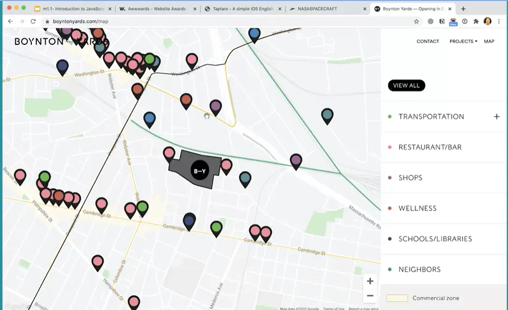{width="5.0in"
height="3.0544870953630796in"}

Yeah, look around on the web and wherever you see interactions
happening, whether it&apos;s a map like this or all kinds of interactions
are being created by JavaScript. You&apos;ve seen some interactions and
websites and you&apos;ve probably seen plenty of others in other websites or
you&apos;ve gone off and found your own.

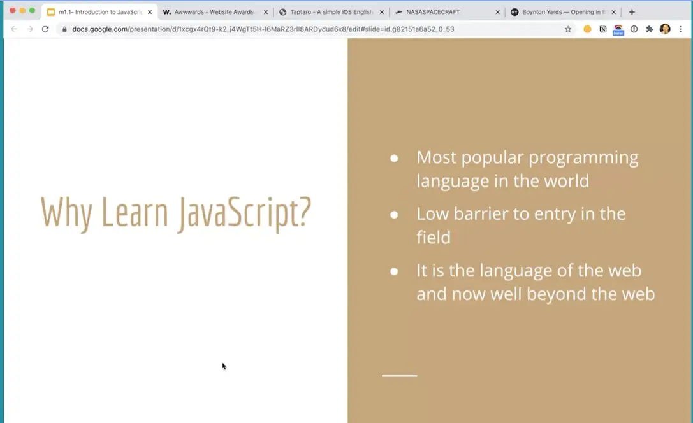{width="5.0in"
height="3.0544870953630796in"}

But let&apos;s talk about some other reasons why we should learn JavaScript.
First of all, it&apos;s the most popular programming language in the world.
That&apos;s a really exciting thing to find out about JavaScript and a good
reason to learn JavaScript.

There&apos;s also a low barrier of entry to the field. Whereas if you&apos;re
learning Java, or C, or C++, you&apos;re going to need a lot of experience
before you can get to a really good paying job. But JavaScript in the
web is the gateway to programming into the tech industry in this way.
It&apos;s really good to learn JavaScript for that reason.

Then finally, it is the language of the web. Now it goes well beyond the
web. We have Raspberry Pi and other devices that can all be programmed
with JavaScript robots and all kinds of things where JavaScript exists.
The Unity gaming engine uses JavaScript as well as C#. There are lots of
places where you can use JavaScript, but it is ultimately the language
of the web. It is the programming, the scripting language for the web
browser, and it&apos;s native to the web browser. That&apos;s a really great
place to start with programming.

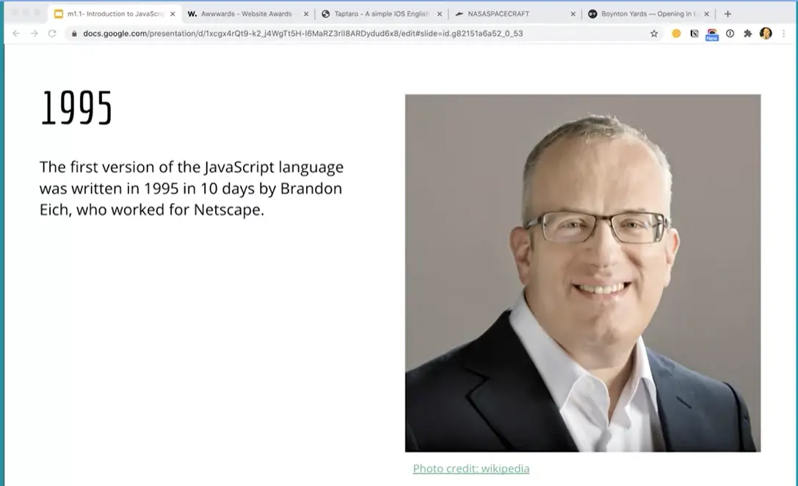{width="5.0in"
height="3.0544870953630796in"}

The story of JavaScript is really interesting. It really is the story of
an underdog who became king. JavaScript didn&apos;t start off as the most
popular programming language. It&apos;s really important to understand this
path that JavaScript has taken through history because it has a big
impact on how we write JavaScript. JavaScript was written by this
gentleman here, Brendan Eich, in 1995 over the course of 10 days while
he was working at Netscape. I&apos;m not going to go into great detail on
the history here, but it&apos;s a really good thing to look up. It&apos;s a very
interesting story in and of itself. But he wrote the language in a very
short amount of time and that&apos;s an important thing to understand about
this language.

Another important thing to understand about the JavaScript programming
language is it&apos;s not the same language as Java. It was originally a
language called Mocha and they changed the name to JavaScript, really as
a marketing ploy. But it&apos;s not actually the same language as Java,
they&apos;re two completely different languages. It&apos;s easy as a beginner to
get confused between Java and JavaScript.

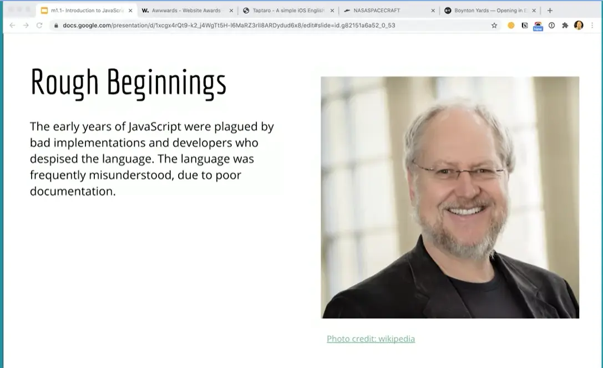{width="5.0in"
height="3.0544870953630796in"}

As I said before, JavaScript had some rough beginnings. The early years
of JavaScript were plagued by bad implementations, developers who just
despised the language mostly due to poor documentation and it was
greatly misunderstood as a language. This gentleman, Douglas Crockford,
did a lot to help people understand the incredible value of JavaScript
as a language and its strengths as well as its weaknesses.

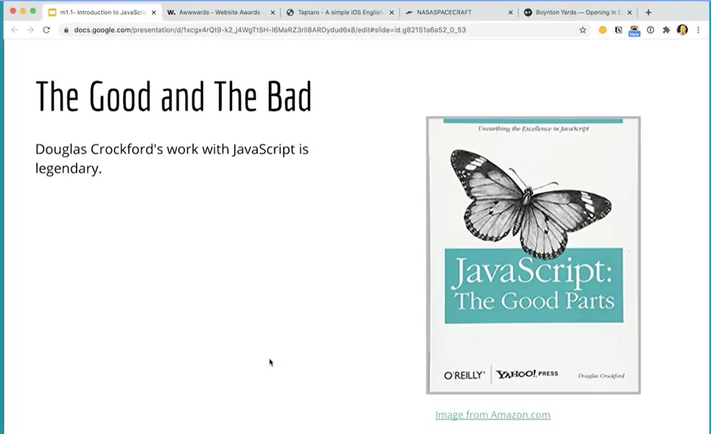{width="5.0in"
height="3.0544870953630796in"}

He wrote a book called JavaScript: The Good Parts. It&apos;s a legendary
book because in this book he really talks about how JavaScript has some
of the best features any programming language has ever had right
alongside some of the worst features. Becoming a good JavaScript
developer is about understanding how to leverage the best parts of the
language while minimizing the worst parts of the language. We&apos;ll be
seeing some examples of some parts of the language that are good and
not-so-good right off the bat, and I&apos;ll be pointing those out. You&apos;ll
see that as we go along, we write JavaScript in ways to minimize the bad
features of the language. When I say bad features, what I mean are
features that can lead to more errors, lead to confusion in the
programming, and so on and so forth. But it&apos;s also a very expressive
language, it&apos;s a very powerful language. Some of the ideas behind it
are very interesting and very powerful, even though they&apos;re different
from other languages, which was behind some of the frustration that
people had with it initially is they just didn&apos;t understand it because
it was different.

# Intro to JavaScript -- Part 3 (5:33)

{width="4.0in"
height="2.261538713910761in"}

It&apos;s really important to understand the development of JavaScript over
the years, and this is because the way JavaScript is developed has
really impacted the way that we write JavaScript.

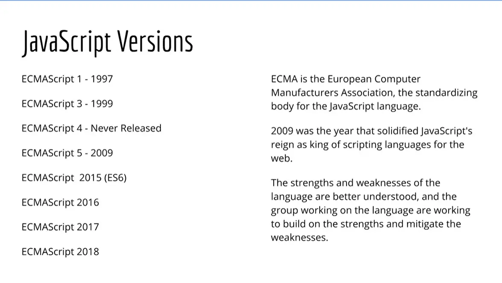{width="5.0in"
height="2.823183508311461in"}

So having a little bit of understanding of this history is really
important as you learn the language. Again, I&apos;m just going to cover
just the very basics, but there&apos;s a lot of this history. It&apos;s a
fascinating history and worth looking into if you&apos;re interested in that
kind of thing and you can find out about it by looking it up on the web
where there&apos;s plenty of books about it and that kind of stuff.

We know that JavaScript was originally written in 1995 in 10 days by
Brendan Eich and his team at Netscape. Then in 1997, the first version
of the standard was released, and the standard is created by the
European Computer Manufacturers Association. Essentially the people in
California went to Europe to this association to get this language
rubber-stamped. It didn&apos;t turn out to be quite that easy, but that&apos;s a
longer story. But in 1997, the first version, **ECMAScript 1,** was
standardized and released, and then a third version. The second version
never really quite happened, but the third version came out in 1999 with
some minor changes and fixes. The fourth version is an interesting story
and one that I won&apos;t go into great depth on, but again, you can look it
up for yourself. But essentially, if you&apos;ll recall, I had said earlier
that there was a lot of arguing about the direction of JavaScript and
there were a lot of developers that didn&apos;t really understand it. There
was some push to make JavaScript more like other programming languages
that we&apos;re already familiar with and comfortable with. Douglas
Crockford really stepped in and said,&ldquo; Wait, look, JavaScript is its
own language and it has its own powerful features in its own right and
if you understand it and make use of that power then it really is
valuable to keep it the way it is&rdquo;. It took a while for him to convince
people of that.

But in 2009, they released **ECMAScript 5**, and **ECMAScript 4** was
scrapped. They started to go a different direction entirely and then
they scrapped that direction entirely. They released **ECMAScript 5** in
2009. This is the version that when it was released, everybody had kind
of come together around the table and said, &ldquo;JavaScript is going to be
the scripting language for the web&rdquo;. Because everybody had agreed with
that, this is when JavaScript really took off and made it past its
troubled beginnings and its difficult beginnings was here in 2009. In
2009 is when JavaScript became King of the web because all of the major
players agreed that this is going to be the scripting language, the
programming language of the web. They built in a lot of features.
There&apos;s a lot that&apos;s built into **ECMAScript 5** that we&apos;ll be using
throughout this course.

Over the next 10 years, there was a lot of work on JavaScript. They
really wanted to move it from being a scripting language to a general
all-purpose language, something that was very powerful. In 2015,
**ES6**, what is commonly referred to as **ES6**, was released,
sometimes it&apos;s called **ECMAScript 2015**. These two terms are
interchangeable, but **ES6** was released and it&apos;s a big release, a lot
changed and a lot was added, and a lot of JavaScript has been made more
powerful and turned into a more general all purpose programming
language. A lot of what you&apos;ll be learning in this course are pieces
from the **2009 ECMAScript 5** standard and pieces from the **ECMAScript
2015 ES6** standard together, which really make up the major part of
JavaScript.

Since 2015, the standardizing body has been in a nice cadence of
releasing new versions each year. From then on, instead of calling it
**ES7** and **ES8** and that kind of stuff, they stuck with the year.
They came out with **ECMAScript 2016, ECMAScript 2017**, and so on and
so forth. In each year there are smaller new additions added, but on the
whole, these additions are fairly small and they are being more advanced
pieces that we won&apos;t see nearly as much of in this course because this
is a beginner&apos;s course, but we will be doing a lot with **ECMAScript
5** and **ES6** or **ECMAScript 2015**. Dive in and I hope you enjoy
learning about JavaScript as we go along here.

# Tools Needed for Success

{width="4.0in"
height="2.261538713910761in"}

Tools and skills needed for success for learning JavaScript.

<!--~~~~~~~~~~~~~~~~~~~~~~~~~~~~~~~~~~~~~~~~~~~~~~~~~~~~~~~~~~~~~~~~~~~~~~~~~~~~~~~~~~~~~~~~~~~~-->
<!--~~~~~~~~~~~~~~~~~~~~~~~~~~ 23.  (xx) ~~~~~~~~~~~~~~~~~~~~~~~~~~~-->
<!--~~~~~~~~~~~~~~~~~~~~~~~~~~~~~~~~~~~~~~~~~~~~~~~~~~~~~~~~~~~~~~~~~~~~~~~~~~~~~~~~~~~~~~~~~~~~-->
<p align="center" width="100%">

</p>
<!-- 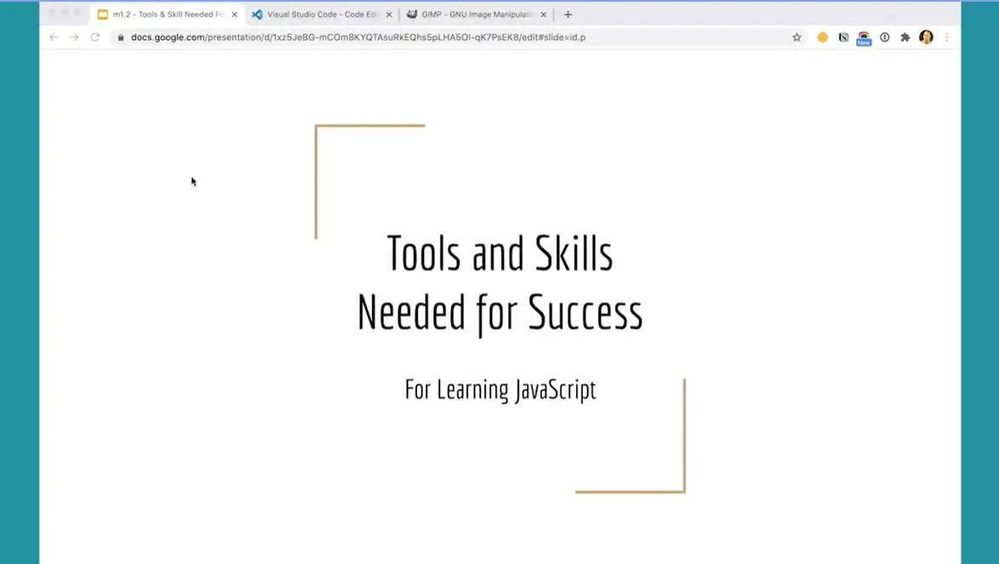{width="4.0in" height="2.258546587926509in"} -->

First, we&apos;ll talk about software and then we&apos;ll talk a little bit
about hardware.


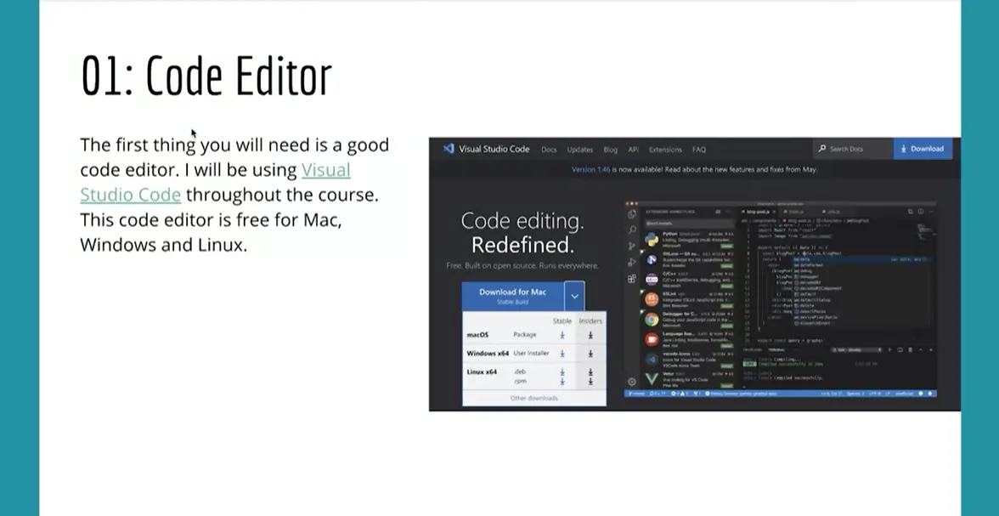{width="3.5in"
height="1.8064632545931758in"}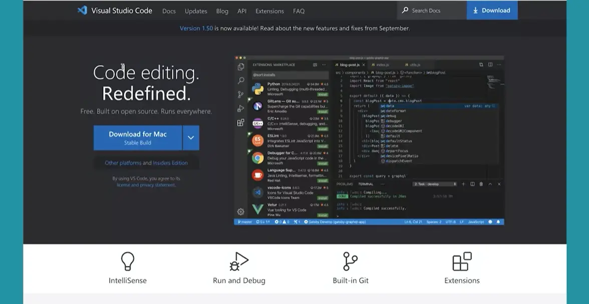{width="3.5in"
height="1.8064632545931758in"}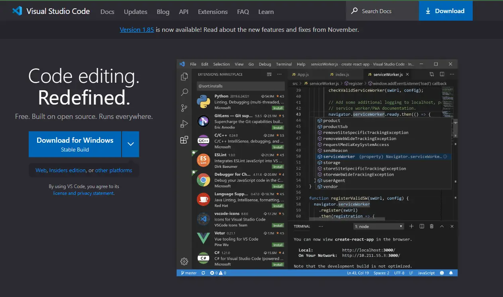{width="5.0in"
height="2.9594017935258092in"}

The first thing you&apos;re going to need in order to work with JavaScript
and write JavaScript is a good code editor, and I recommend using Visual
Studio Code. Not to be confused with Visual Studio product, but Visual
Studio Code, and I have that in this browser tab here. You can download
that for Mac or for Windows, or I believe also for Linux you can get
Visual Studio Code. It&apos;s a really good code editor. It&apos;s very popular
these days. There are plenty of other code editors out there.

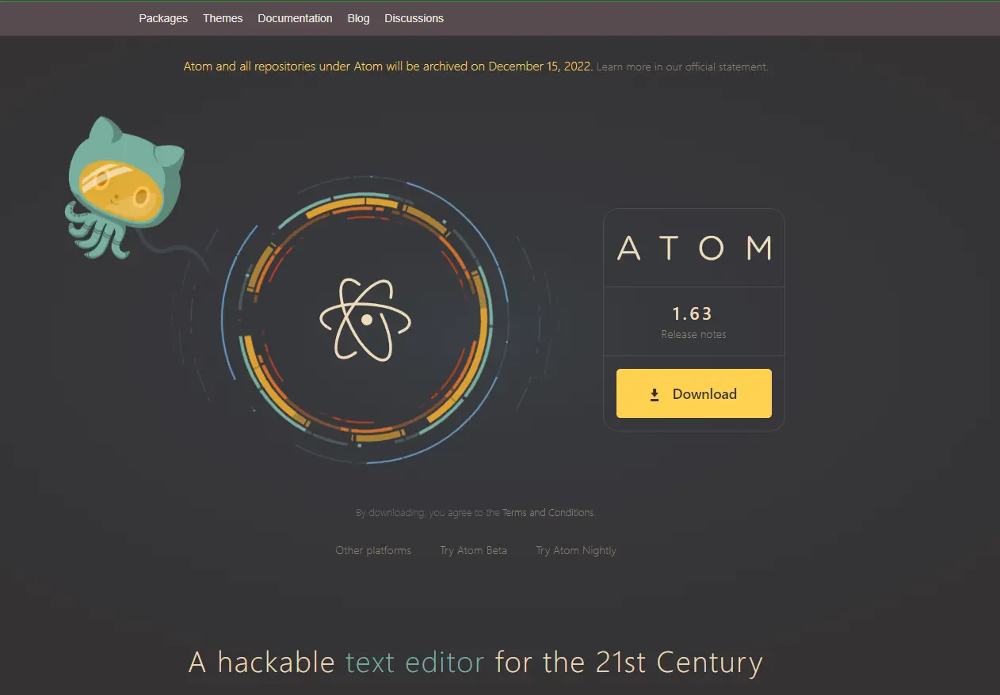{width="3.5in"
height="2.435042650918635in"}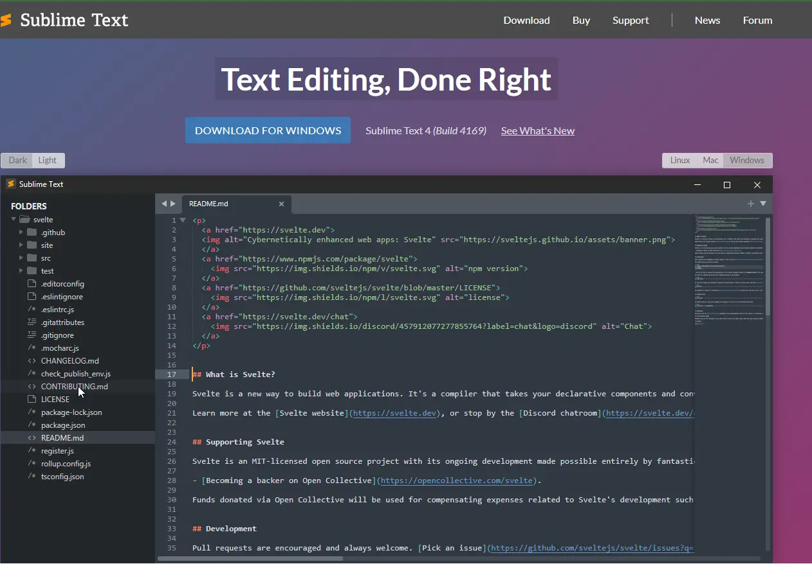{width="3.5in"
height="2.435042650918635in"}

You could use Atom, you could use Sublime Text, even if you have
Dreamweaver, you could use that as a code editor.

<!--~~~~~~~~~~~~~~~~~~~~~~~~~~~~~~~~~~~~~~~~~~~~~~~~~~~~~~~~~~~~~~~~~~~~~~~~~~~~~~~~~~~~~~~~~~~~-->
<!--~~~~~~~~~~~~~~~~~~~~~~~~~~ 29.  (xx) ~~~~~~~~~~~~~~~~~~~~~~~~~~~-->
<!--~~~~~~~~~~~~~~~~~~~~~~~~~~~~~~~~~~~~~~~~~~~~~~~~~~~~~~~~~~~~~~~~~~~~~~~~~~~~~~~~~~~~~~~~~~~~-->
<p align="center" width="100%">

<!-- 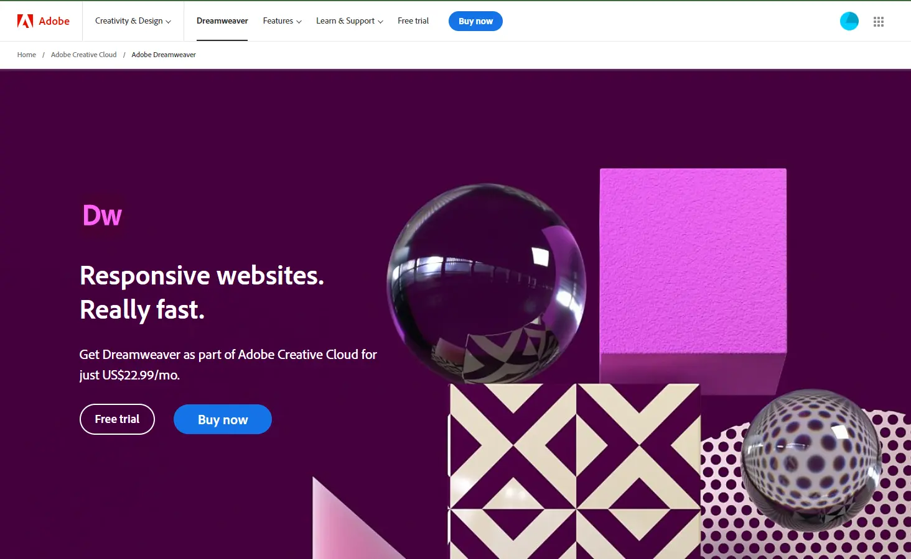{width="5.0in" height="3.073718285214348in"} -->

Dreamweaver has a lot of other stuff built into it that you don&apos;t need,
but it works perfectly fine as code editor if you want to use that as
well.

<!--~~~~~~~~~~~~~~~~~~~~~~~~~~~~~~~~~~~~~~~~~~~~~~~~~~~~~~~~~~~~~~~~~~~~~~~~~~~~~~~~~~~~~~~~~~~~-->
<!--~~~~~~~~~~~~~~~~~~~~~~~~~~ 30.  (xx) ~~~~~~~~~~~~~~~~~~~~~~~~~~~-->
<!--~~~~~~~~~~~~~~~~~~~~~~~~~~~~~~~~~~~~~~~~~~~~~~~~~~~~~~~~~~~~~~~~~~~~~~~~~~~~~~~~~~~~~~~~~~~~-->
<p align="center" width="100%">

<!-- 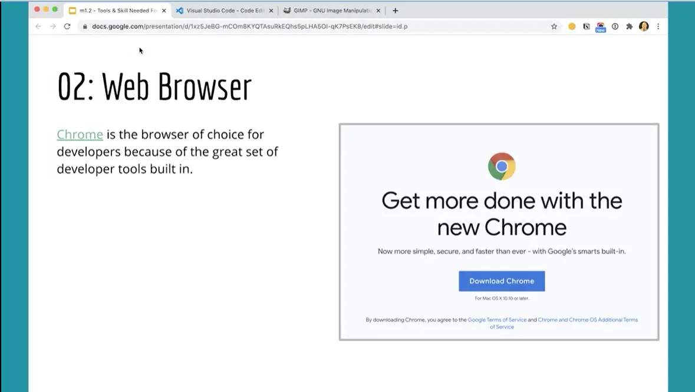{width="4.0in" height="2.259401793525809in"} -->

The second thing you&apos;re going to need is a web browser, and I&apos;m going
to recommend that you use **Chrome**. **Chrome** has a lot of the
developer tools that developers use. They&apos;re built right into
**Chrome** and they&apos;re easy to access. You can also use **Safari** or
**Firefox** or **Microsoft Edge** or **Brave**. There are other browsers
out there as well and many of them also have developer tools, but most
developers use **Chrome** and get comfortable with the **Chrome**
developer tools. So I recommend that you download **Chrome** and use
that browser. Do NOT use **IE** or **Edge** developed by Microsoft.
Unless you LOVE advertisements and poor coding techniques.
<!--~~~~~~~~~~~~~~~~~~~~~~~~~~~~~~~~~~~~~~~~~~~~~~~~~~~~~~~~~~~~~~~~~~~~~~~~~~~~~~~~~~~~~~~~~~~~-->
<!--~~~~~~~~~~~~~~~~~~~~~~~~~~ 31.  (xx) ~~~~~~~~~~~~~~~~~~~~~~~~~~~-->
<!--~~~~~~~~~~~~~~~~~~~~~~~~~~~~~~~~~~~~~~~~~~~~~~~~~~~~~~~~~~~~~~~~~~~~~~~~~~~~~~~~~~~~~~~~~~~~-->
<p align="center" width="100%">

<!-- 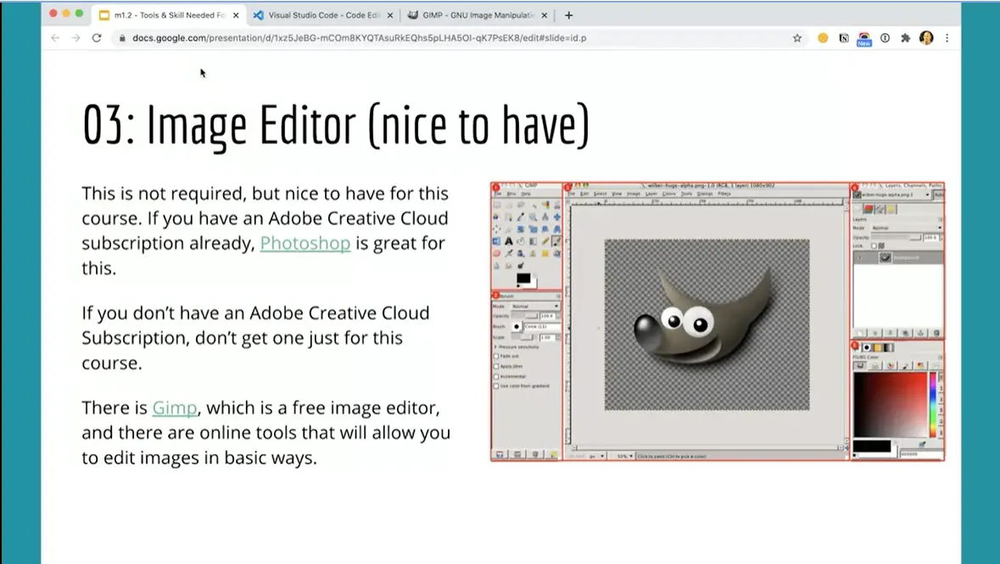{width="4.0in" height="2.259401793525809in"} -->

You&apos;re also going to need an image editor. If you have access to
Photoshop, that&apos;s great. Photoshop is fantastic for this kind of thing,
but if you don&apos;t have access to Photoshop, there&apos;s another one called
GIMP, which is free.
<!--~~~~~~~~~~~~~~~~~~~~~~~~~~~~~~~~~~~~~~~~~~~~~~~~~~~~~~~~~~~~~~~~~~~~~~~~~~~~~~~~~~~~~~~~~~~~-->
<!--~~~~~~~~~~~~~~~~~~~~~~~~~~ 32.  (xx) ~~~~~~~~~~~~~~~~~~~~~~~~~~~-->
<!--~~~~~~~~~~~~~~~~~~~~~~~~~~~~~~~~~~~~~~~~~~~~~~~~~~~~~~~~~~~~~~~~~~~~~~~~~~~~~~~~~~~~~~~~~~~~-->
<p align="center" width="100%">

<!-- {width="5.0in" height="2.824251968503937in"} -->

You can go download **GIMP** and I have that pulled up here. You can
actually download **GIMP** for Mac or for Windows and that kind of
stuff. **IrfanView** is even better & easier. There are also online
tools, webpages that will allow you to upload your image and optimize it
for the web and do some different kinds of image editing right through
your browser. You might find some of those types of tools as well, but
you will need some image editor to help you working with images. That&apos;s
a nice to have. It&apos;s not absolutely necessary, but it&apos;s really nice to
have.

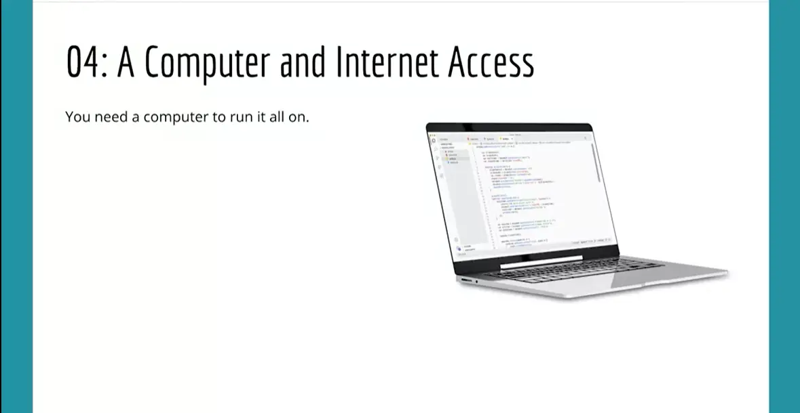{width="4.0in"
height="2.06965769903762in"}

Next, you&apos;re going to need a computer and internet access. It may sound
obvious that you&apos;re going to need internet access to do an internet
class, but you are going to need that and you will need a computer,
whether it&apos;s a laptop or desktop.

What&apos;s not going to work very well is either a Chromebook or a tablet
or a phone. You&apos;re really going to need something that you can write
code on and save files to. iOS you can make it work, but it&apos;s not
really up to the task. You&apos;ll be fighting it every step along the way.
You want to be working with Mac OS X or Windows 10 on a computer in
order to really make this work.

<!--~~~~~~~~~~~~~~~~~~~~~~~~~~~~~~~~~~~~~~~~~~~~~~~~~~~~~~~~~~~~~~~~~~~~~~~~~~~~~~~~~~~~~~~~~~~~-->
<h2><a href="ch1-x">1.0x Skills Needed for Success (5:38)</a></h2>
<!--~~~~~~~~~~~~~~~~~~~~~~~~~~~~~~~~~~~~~~~~~~~~~~~~~~~~~~~~~~~~~~~~~~~~~~~~~~~~~~~~~~~~~~~~~~~~-->

{width="4.0in"
height="2.261538713910761in"}

Let&apos;s talk about some of the skills you need in order to be successful
learning JavaScript.

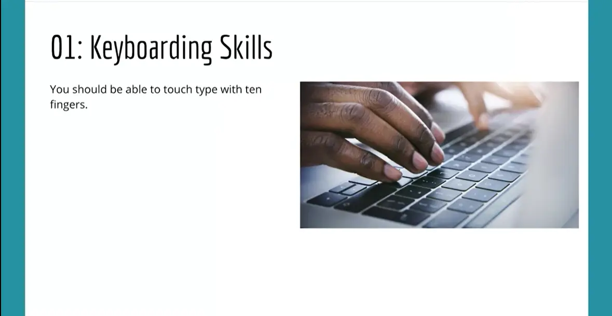{width="4.0in"
height="2.06965769903762in"}

**First and foremost**, you need to be able to talk type. And by typing,
I mean typing with 10 fingers without looking at your fingers, touch
typing. And it will really help you to be able to do this. If you&apos;re
somebody who hunts in packs with one finger or two fingers, you may be
pretty fast at it. But it really will slow you down for programming. And
so I recommend that you do some online typing programs. There&apos;s plenty
of places online where you can learn how to type. You don&apos;t have to be
terribly fast at typing. But you do need to be accurate. Or if you&apos;re
not accurate with typing, you have to at least stop and go back and fix
every single error. And I have known a lot of students over the years
that struggle a lot with typing. And it really impedes their ability to
learn something like JavaScript. So I really recommend that you get
those keyboarding skills if you don&apos;t have them already.

<!--~~~~~~~~~~~~~~~~~~~~~~~~~~~~~~~~~~~~~~~~~~~~~~~~~~~~~~~~~~~~~~~~~~~~~~~~~~~~~~~~~~~~~~~~~~~~-->
<!--~~~~~~~~~~~~~~~~~~~~~~~~~~ 36.  (xx) ~~~~~~~~~~~~~~~~~~~~~~~~~~~-->
<!--~~~~~~~~~~~~~~~~~~~~~~~~~~~~~~~~~~~~~~~~~~~~~~~~~~~~~~~~~~~~~~~~~~~~~~~~~~~~~~~~~~~~~~~~~~~~-->
<p align="center" width="100%">

<!-- 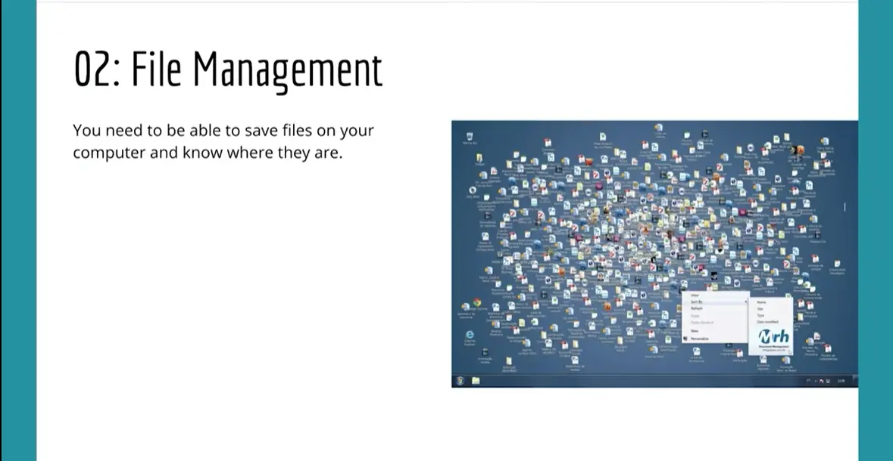{width="4.0in" height="2.06965769903762in"} -->

The **second** thing that you need is you need to be able to manage your
files. That means when you save a file on your computer, you know where
it is. Not just going into the file menu and choosing the most recent
files thing. If that&apos;s what you do to find your files, then you need to
really get good at file management. And if your desktop looks like the
picture here, then you&apos;re going to be in trouble. Make sure you&apos;re
comfortable with saving files into folders. And you know how to do that
and where those folders are on the web, everything is linked. So if a
file cannot be found, if a file is not in the right place, then your
project will break. And we don&apos;t want that to happen. So make sure you
clean up all of your files. And work with a clean desktop. And for every
project, you should have a folder and all the files you need for that
project should be in that folder.

<!--~~~~~~~~~~~~~~~~~~~~~~~~~~~~~~~~~~~~~~~~~~~~~~~~~~~~~~~~~~~~~~~~~~~~~~~~~~~~~~~~~~~~~~~~~~~~-->
<!--~~~~~~~~~~~~~~~~~~~~~~~~~~ 37.  (xx) ~~~~~~~~~~~~~~~~~~~~~~~~~~~-->
<!--~~~~~~~~~~~~~~~~~~~~~~~~~~~~~~~~~~~~~~~~~~~~~~~~~~~~~~~~~~~~~~~~~~~~~~~~~~~~~~~~~~~~~~~~~~~~-->
<p align="center" width="100%">

<!-- 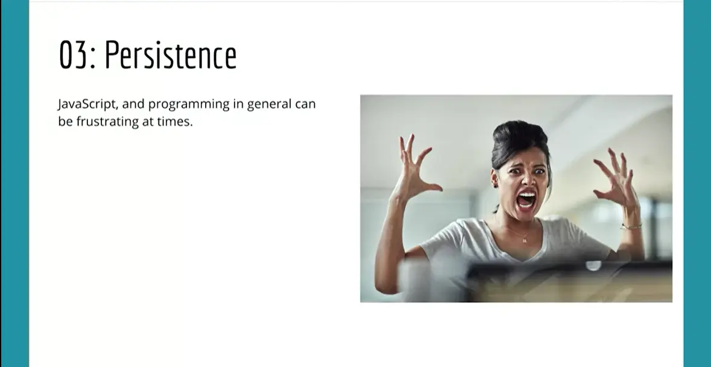{width="4.0in" height="2.06965769903762in"} -->

The **third** thing that you need is persistence. Learning JavaScript is
not easy. It&apos;s challenging and maybe that&apos;s true for every programming
language. But JavaScript in particular it&apos;s got some quirks to it and
it takes some getting used to. And there will be times when you&apos;re
frustrated when things aren&apos;t working the way you think they should.
And you just need to take a break, step away from it and then come back
to it. But come back to it, because it&apos;s worth learning. And even
though it&apos;s hard, it&apos;s definitely worth putting in the effort and
being persistent to get there. I&apos;ve told many students over the years
if you&apos;re not banging your head against the wall, you&apos;re not learning
JavaScript. All my students will tell you that I say that over and over
and over again. And it&apos;s frustrating especially in that moment when you
realize you just left that one character or semi colon or something like
that, and that broke the entire script. But stick with it, keep working
at it, stay calm, keep pushing forward. And you&apos;ll make a lot of
progress with it, I promise.
<!--~~~~~~~~~~~~~~~~~~~~~~~~~~~~~~~~~~~~~~~~~~~~~~~~~~~~~~~~~~~~~~~~~~~~~~~~~~~~~~~~~~~~~~~~~~~~-->
<!--~~~~~~~~~~~~~~~~~~~~~~~~~~ 38.  (xx) ~~~~~~~~~~~~~~~~~~~~~~~~~~~-->
<!--~~~~~~~~~~~~~~~~~~~~~~~~~~~~~~~~~~~~~~~~~~~~~~~~~~~~~~~~~~~~~~~~~~~~~~~~~~~~~~~~~~~~~~~~~~~~-->
<p align="center" width="100%">

<!-- 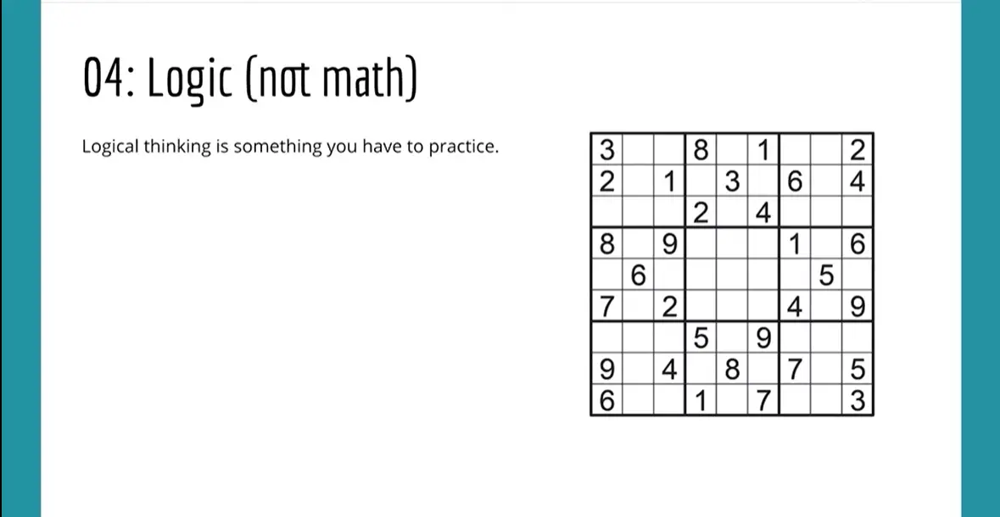{width="4.0in" -->
height="2.06965769903762in"}

The **fourth** skill that you need is to be good with logic. And logic
is a learned skill. Some people are naturally very logical but it&apos;s
something that you can practice and develop. And there are lots of tools
and games out there that will help you build your logic skills. Sudoku
is a great place to go for puzzles that will help you build your ability
to use logic. Programmers often use math as well. But math is not that
important to begin with. It&apos;s really the logic skills that you need.
You might need some basic arithmetic. But I don&apos;t do a lot of
programming that involves very sophisticated math and a lot of
programmers don&apos;t. There are programmers that do. But we don&apos;t need
that in order to get good at JavaScript. But you do need to be good with
logic.
<!--~~~~~~~~~~~~~~~~~~~~~~~~~~~~~~~~~~~~~~~~~~~~~~~~~~~~~~~~~~~~~~~~~~~~~~~~~~~~~~~~~~~~~~~~~~~~-->
<!--~~~~~~~~~~~~~~~~~~~~~~~~~~ 39.  (xx) ~~~~~~~~~~~~~~~~~~~~~~~~~~~-->
<!--~~~~~~~~~~~~~~~~~~~~~~~~~~~~~~~~~~~~~~~~~~~~~~~~~~~~~~~~~~~~~~~~~~~~~~~~~~~~~~~~~~~~~~~~~~~~-->
<p align="center" width="100%">

<!-- 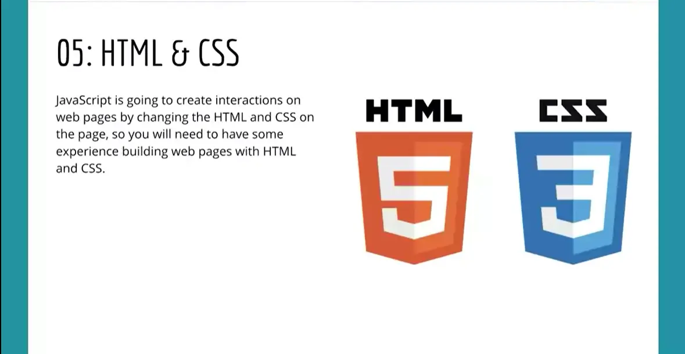{width="4.0in" height="2.06965769903762in"} -->

The next thing is, you really should know HTML and CSS as well as you
can. JavaScript manipulates the HTML and CSS that makes up the page.
That&apos;s how it works, that&apos;s what it does. And if you don&apos;t know HTML
and CSS, you don&apos;t really know what you&apos;re manipulating. So I
recommend building some skills with HTML and CSS if you don&apos;t already
have them.
<!--~~~~~~~~~~~~~~~~~~~~~~~~~~~~~~~~~~~~~~~~~~~~~~~~~~~~~~~~~~~~~~~~~~~~~~~~~~~~~~~~~~~~~~~~~~~~-->
<!--~~~~~~~~~~~~~~~~~~~~~~~~~~ 40.  (xx) ~~~~~~~~~~~~~~~~~~~~~~~~~~~-->
<!--~~~~~~~~~~~~~~~~~~~~~~~~~~~~~~~~~~~~~~~~~~~~~~~~~~~~~~~~~~~~~~~~~~~~~~~~~~~~~~~~~~~~~~~~~~~~-->
<p align="center" width="100%">

<!-- 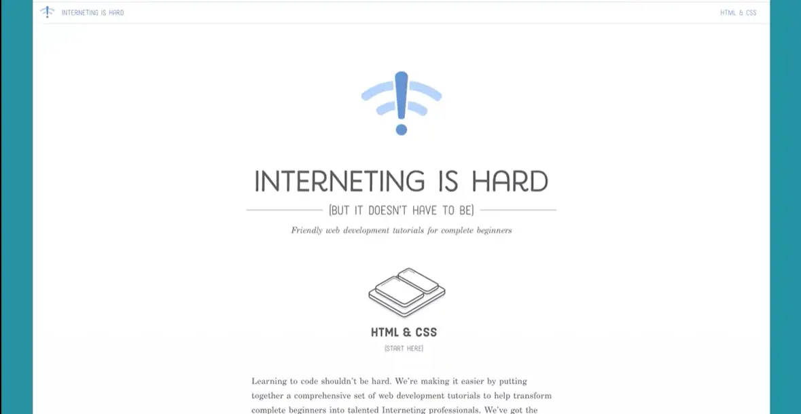{width="4.0in" height="2.06965769903762in"} -->

And a good place to go is this Interneting Is Hard website here. This is
a really great tutorial. They&apos;ve got a lot of really great, it&apos;s very
simple the way they&apos;ve explained things. And they&apos;ve got a lot of
great examples and tutorials here that will help you with learning HTML
and CSS, and it&apos;s free. So I recommend going and looking through the
Interneting Is Hard website if you need to get caught up I need you to
know in CSS. Well, if you&apos;ve never done any HTML and CSS at all, then
maybe take a course in HTML and CSS before diving into JavaScript. In
summary, there&apos;s a low barrier for entry to this class. The software is
free. You don&apos;t need a super fast, or super fancy computer. And getting
good at JavaScript can be a ticket to a high paying job, and a good
life. But it&apos;s not easy. You&apos;re going to have to work hard to get
there. But it really is worth it if you keep working at it. And I hope
that you continue with us and see all the cool things that you can do
with JavaScript.

## Assessing your Skills in HTML & CSS {#assessing-your-skills-in-html-css }

## Additional Resources {#additional-resources }

### Here are resources related to these lessons: {#here-are-resources-related-to-these-lessons }

-   [Awwwards website](https://www.awwwards.com/)

-   [Visual Studio Code](https://code.visualstudio.com/)

-   [Google Chrome](https://www.google.com/chrome/)

-   [Adobe Photoshop](https://www.adobe.com/products/photoshop.html)

-   [GNU Gimp](https://www.gimp.org/)

# JavaScript Variables

<!--~~~~~~~~~~~~~~~~~~~~~~~~~~~~~~~~~~~~~~~~~~~~~~~~~~~~~~~~~~~~~~~~~~~~~~~~~~~~~~~~~~~~~~~~~~~~-->
<!--~~~~~~~~~~~~~~~~~~~~~~~~~~ 41.  (xx) ~~~~~~~~~~~~~~~~~~~~~~~~~~~-->
<!--~~~~~~~~~~~~~~~~~~~~~~~~~~~~~~~~~~~~~~~~~~~~~~~~~~~~~~~~~~~~~~~~~~~~~~~~~~~~~~~~~~~~~~~~~~~~-->
<p align="center" width="100%">

<!-- {width="4.0in" height="2.261538713910761in"} -->

JavaScript variables. It&apos;s good practice when programming to write code
that is as generalizable as possible. It allows the code to be reused
and helps limit the effort of writing and maintaining redundant code.
Imagine somebody gave you a robot as a gift to do chores around your
house. You have to teach it how to do your chores. What if you wanted to
teach it to wash the dishes? That would be great. It will be really
helpful to have a robot wash the dishes for you. But what if you had to
write different instructions for each dish in your house? That would be
a lot of dishes and perhaps a lot of instructions. That wouldn&apos;t be so
great. What we can do with a variable is that we can treat it as like a
container, and then we can write a set of directions and pass each item
through that set of directions. Here in this diagram, currently, we&apos;re
going to rinse the food off the silverware and then wash the silverware
with soap and water, and then dry the silverware with towel and then
move on to the next thing which perhaps might be a cup. The red box that
you see here is really the variable. It&apos;s a temporary container that we
can pass these items through, and we can teach our robot to wash all of
the items one at a time using this container. That will make your
instructions more modular and more reusable and that&apos;s really helpful.
There are many ways of declaring a variable in JavaScript. We&apos;ll start
with one of the most basic ways which is using the var keyword V-A-R.
Here I have a variable called x, I&apos;m creating and JavaScript will then
recognize x as a variable and I&apos;m assigning it an empty string, two
sets of quote marks there followed by a semicolon. That means that
variable x holds an empty string. On the next example, I have a variable
called cheese that I&apos;ve created, and it&apos;s holding a string called
yummy. The equal sign here is an assignment operator, it means assigned.
So yummy is assigned to cheese. It&apos;s easy to use the word equals
because we&apos;re used to seeing the symbol in association with math, where
we see 2 plus 2 equals 4 and we say equals but in programming, we want
to say assigned. Yummy is assigned to cheese. Then the next example we
have a variable called age and it&apos;s assigned a value of 25. Twenty-five
is a number. It doesn&apos;t need to go inside quotes because JavaScript
knows what a 25 is. In JavaScript, variables are case-sensitive. They
have to follow certain rules. For example, a variable has to start with
a letter, you can&apos;t start with a number. This variable over here that
says 1cat is not going to work because it starts with a number. Also,
you should not start variables with something like a dollar sign.
They&apos;re used a lot by libraries, so you should not do that as well. The
third example, my-cat is not going to work because JavaScript sees the
dash as a minus sign. It thinks your just trying to subtract cat from my
which is not going to work it all either. Also, you can&apos;t have a space
in a variable name because var my might be a variable, but then it
doesn&apos;t know what to do with cat because it sees that as a separate
thing because there&apos;s a space in there. Finally, there are certain
keywords in JavaScript that you can use as names of variables like new
is a keyword. Over here I have some of the keywords pulled up on the
W3Schools website. W3Schools is one of the places you can go to get a
lot of information about JavaScript, basic information. We&apos;ll also look
a lot at the MDN, the Mozilla Developer Network, which is really the
most authoritative place to get information about JavaScript, but it can
be a little bit overwhelming at first as well. The W3Schools is a little
bit easier to understand. You can see here that there are a bunch of
keywords. You&apos;ll notice that some of them have an asterisk in here.
Words marked with an asterisk are new in **ECMAScript 5 and 6**.
Remember, we talked about the versions of JavaScript, so now when you
see **ECMAScript 5 and 6,** you know that we&apos;re talking about
**ECMAScript 5** which was released in 2009, that was the big release
then, and **ECMAScript 6** or **ES6** was the version that was released
in 2015. These are all keywords that you can use as names for variables
in JavaScript. Over on the right in this image here you&apos;ll see we have
variable cat with lowercase c, variable cat all in uppercase letters,
and variable Cat with a capital C. These are three different variables
that hold three different values. It&apos;s generally better practice to use
lowercase letters when creating variables or to do what&apos;s called camel
casing like we have done at the bottom here; myCat with a capital C in
the middle, so it&apos;s like a hump in the middle. We like camels in
JavaScript. That&apos;s called camel casing. That&apos;s not specific to
JavaScript but it&apos;s something that is in a lot of programming
languages. But we use that frequently in JavaScript. You&apos;ll frequently
see variables that are using camel casing.

# JavaScript Variables Practice -- Part 1

# JavaScript Variables Practice -- Part 2

# JavaScript Variables Practice -- Part 3

# JavaScript Arrays -- Part 1

# JavaScript Arrays -- Part 2

# JavaScript Arrays Practice

# Week Two:  {#week-two }

# 2.00 Controlling Logical Flow in JS {#controlling-logical-flow-in-js }

# 2.01 Module 2 Introduction {#module-2-introduction }

#  {#section }

#  {#section-1 }

# 2.02 Visual Studio -- Part 1 {#visual-studio-part-1 }

#  {#section-2 }

#  {#section-3 }

# 2.03 Visual Studio -- Part 2 {#visual-studio-part-2 }

#  {#section-4 }

#  {#section-5 }

# 2.04 Visual Studio -- Part 3 {#visual-studio-part-3 }

# 2.05 Operators, Booleans & Selection in JavaScript {#operators-booleans-selection-in-javascript }

# 2.06 Try This! {#try-this }

# 2.07 Comparing Values {#comparing-values }

# 2.08 Else If {#else-if }

#  {#section-6 }

# 2.09 Switch Statements {#switch-statements }

# 2.10 Using && {#using }

### 2.10.Additional Resources: Reading-Materials.pdf

# 2.11  {#section-7 }

# 2.12  {#section-8 }

# 2.13  {#section-9 }

# 2.14  {#section-10 }

# 2.15  {#section-11 }

# 2.16  {#section-12 }

# 2.17  {#section-13 }

# 2.18  {#section-14 }

# 2.19  {#section-15 }

# 2.20  {#section-16 }

# 2.21  {#section-17 }

#  {#section-18 }

# 2.22  {#section-19 }

# 2.23  {#section-20 }

#  {#section-21 }

# 2.24  {#section-22 }

# 2.25  {#section-23 }

# Week Three:  {#week-three }

# 3.00  {#section-24 }

# 3.01 Module 3 Introduction {#module-3-introduction }

# 3.02  {#section-25 }

# 3.03  {#section-26 }

# 3.04  {#section-27 }

# 3.05  {#section-28 }

# 3.06  {#section-29 }

# 3.07  {#section-30 }

# 3.08  {#section-31 }

# 3.09  {#section-32 }

# 3.10  {#section-33 }

# 3.11  {#section-34 }

#  {#section-35 }

# 3.12  {#section-36 }

# 3.13  {#section-37 }

# 3.14  {#section-38 }

# 3.15  {#section-39 }

# 3.16  {#section-40 }

# 3.17  {#section-41 }

# 3.18  {#section-42 }

# 3.19  {#section-43 }

# 3.20  {#section-44 }

# 3.21  {#section-45 }

# 3.22  {#section-46 }

# 3.23  {#section-47 }

# 3.24  {#section-48 }

# 3.25  {#section-49 }

# 3.26  {#section-50 }

# 3.27  {#section-51 }

# 3.28  {#section-52 }

# 3.29  {#section-53 }

# 3.30  {#section-54 }

# 3.31  {#section-55 }

# 3.32  {#section-56 }

# 3.33  {#section-57 }

# 3.34  {#section-58 }

# 3.35  {#section-59 }

# Week Four:  {#week-four }

# 4.00  {#section-60 }

# 4.01 Module 4 Introduction {#module-4-introduction }

# 4.02  {#section-61 }

# 4.03  {#section-62 }

# 4.04  {#section-63 }

# 4.05  {#section-64 }

# 4.06  {#section-65 }

# 4.07  {#section-66 }

# 4.08  {#section-67 }

# 4.09  {#section-68 }

# 4.10  {#section-69 }

# 4.11  {#section-70 }

# 4.12  {#section-71 }

# 4.13  {#section-72 }

# 4.14  {#section-73 }

# 4.15  {#section-74 }

# 4.16  {#section-75 }

# 4.17  {#section-76 }

# 4.18  {#section-77 }

# 4.19  {#section-78 }

# 4.20  {#section-79 }

# 4.21  {#section-80 }

#  {#section-81 }

# 4.22  {#section-82 }

#  {#section-83 }

# 4.23  {#section-84 }

#  {#section-85 }

# 4.24  {#section-86 }

#  {#section-87 }

# 4.25  {#section-88 }

#  {#section-89 }

# 4.26  {#section-90 }

#  {#section-91 }

#  {#section-92 }

#  {#section-93 }
