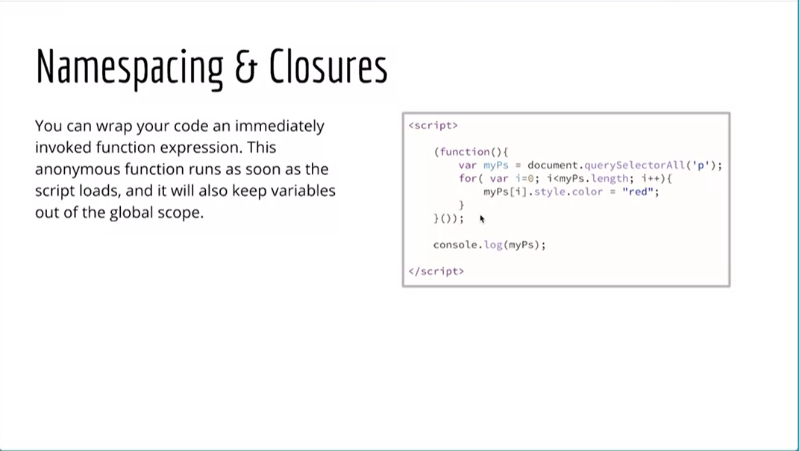
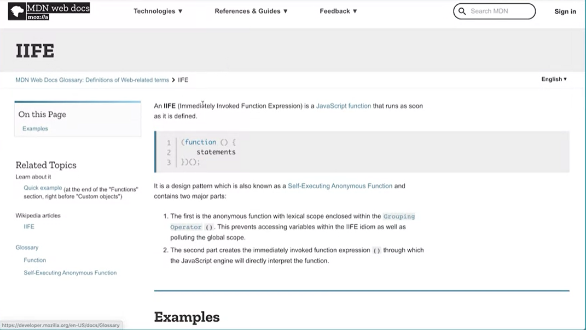

<h1 align="center">JavaScript Basics</h1>

<h6 align="center">(by William Mead, Lecturer - University of California @Davis)</h6>
<!--~~~~~~~~~~~~~~~~~~~~~~~~~~~~~~~~~~~~~~~~~~~~~~~~~~~~~~~~~~~~~~~~~~~~~~~~~~~~~~~~~~~~~~~~~~~~-->
<!--~~~~~~~~~~~~~~~~~~~ readme.md of UC-Davis-JS-Basics in bbauska.github.io ~~~~~~~~~~~~~~~~~~~-->
<!--~~~~~~~~~~~~~~~~~~~~~~~~~~~~~~~~~~~~~~~~~~~~~~~~~~~~~~~~~~~~~~~~~~~~~~~~~~~~~~~~~~~~~~~~~~~~-->
<!--~~~~~~~~~~~~~~~~ 01/02. javascript (coffee cup) logo / UC Davis log (01) ~~~~~~~~~~~~~~~~~~~-->
<p align="center" width="100%">


</p>
<!-- {width="2.0in" height="1.773685476815398in"}{width="2.0995866141732282in" height="1.77in"} -->

<!--~~~~~~~~~~~~~~~~~~~~~~~~~~~~~~~~~ about javascript basics ~~~~~~~~~~~~~~~~~~~~~~~~~~~~~~~~~~-->
<h2 id="#about">About this Course</h2>
<!--~~~~~~~~~~~~~~~~~~~~~~~~~~~~~~~~~~~~~~~~~~~~~~~~~~~~~~~~~~~~~~~~~~~~~~~~~~~~~~~~~~~~~~~~~~~~-->
<p>This course introduces the programming language JavaScript and shows the
websites that include the type of interactions students will eventually
be able to develop. Learners will understand the importance of how
JavaScript was developed and why such history impacts the way JavaScript
is currently written and in future releases. Learners will write their
first scripts, have their HTML and CSS skills assessed, create variables
and arrays and assign values to them. If student's skills are lacking,
resources and recommendations are provided to improve these skills.
There is ample opportunity for students to practice these first, core
skills.</p>

<!--~~~~~~~~~~~~~~~~~~~~~~~~~~~~~~~~~~~~ table of contents ~~~~~~~~~~~~~~~~~~~~~~~~~~~~~~~~~~~~~-->
<h2><a href="#table-of-contents">Table of Contents</a></h2>

### [**Week 1: Getting Started; Intro to JavaScript Variables and Arrays**](#ch1)
>	- #### [**1.00 A Note from UC Davis**](#ch1-00-note)
>	- #### [**1.00 Learning Objectives**](#ch1-00-obj)
>	- #### [**1.00 Welcome to JavaScript Basics**](#ch1-00-welcome)
>	- #### [**1.00 Module 1 Introduction; JavaScript Variables &amp; Arrays**](#ch1-00-intro)
>#### [**1.01 Intro to JavaScript - Part 1**](#ch1-01)
>#### [**1.02 Intro to JavaScript - Part 2**](#ch1-02)
>#### [**1.03 Intro to JavaScript - Part 3**](#ch1-03)
>#### [**1.04 Tools Needed for Success**](#ch1-04)
>#### [**1.05 Skills Needed for Success**](#ch1-05)
>	- #### [**1.05.Assessing Your Skills in HTML &amp; CSS**](#ch1-05-assess)
>	- #### [**1.05.Additional Resources (awwwards.com &amp; software)**](#ch1-05-add)
>#### [**1.06 JavaScript Variables**](#ch1-06)
>#### [**1.07 JavaScript Variables Practice - Part 1**](#ch1-07)
>#### [**1.08 JavaScript Variables Practice - Part 2**](#ch1-08)
>#### [**1.09 JavaScript Variables Practice - Part 3**](#ch1-09)
>#### [**1.10 JavaScript Arrays - Part 1**](#ch1-10)
>#### [**1.11 JavaScript Arrays - Part 2**](#ch1-11)
>#### [**1.12 JavaScript Arrays Practice**](#ch1-12)
>	- #### [**1.12.Reserved Words**](#ch1-12-res)
>	- #### [**1.12.Array Methods**](#ch1-12-array)

### [**Week 2: Controlling Logical Flow in JavaScript**](#ch2)
>	- #### [**2.00 Learning Objectives**](#ch2-00-obj)
>	- #### [**2.00 Module 2 Introduction; Controlling Logical Flow in JavaScript**](#ch2-00-intro)
>#### [**2.01 Visual Studio - Part 1**](#ch2-01)
>#### [**2.02 Visual Studio - Part 2**](#ch2-02)
>#### [**2.03 Visual Studio - Part 3**](#ch2-03)
>#### [**2.04 Operators, Boolean &amp; Selection in JavaScript**](#ch2-04)
>#### [**2.05 Try This!**](#ch2-05)
>#### [**2.06 Comparing Values**](#ch2-06)
>#### [**2.07 Else If**](#ch2-07)
>#### [**2.08 Switch Statements**](#ch2-08)
>#### [**2.09 Using &amp;&amp;**](#ch2-09)
>	- #### [**2.09.JavaScript Operators**](#ch2-09-oper)
>	- #### [**2.09.JavaScript Booleans**](#ch2-09-bool)
>#### [**2.10 Loops in JavaScript**](#ch2-10)
>#### [**2.11 Working With Arrays**](#ch2-11)
>#### [**2.12 The For...Of Loop**](#ch2-12)
>#### [**2.13 While Loops**](#ch2-13)
>	- #### [**2.13.JavaScript Loops**](#ch2-13-loop)
>#### [**2.14 Structured Programming, Sequence - Part 1**](#ch2-14)
>#### [**2.15 Sequence - Part 2**](#ch2-15)
>#### [**2.16 Sequence - Part 3, Loop**](#ch2-16)
>#### [**2.17 Loop + Selection**](#ch2-17)
>	- #### [**2.17.JavaScript Basic Challenges Introduction 1-9**](#ch2-17-1thru9)
>#### [**2.18 JavaScript Basic Challenges**](#ch2-18)
>#### [**2.19 JavaScript Basic Challenges**](#ch2-19)
>#### [**2.20 JavaScript Basic Challenges**](#ch2-20)
>#### [**2.21 Useful Example - Step 1**](#ch2-21)
>#### [**2.22 Useful Example - Steps 2-4**](#ch2-22)
>#### [**2.23 Useful Example - Step 5**](#ch2-23)
>#### [**2.24 More on Functions**](#ch2-24)
>	- #### [**2.24.JavaScript Functions**](#ch2-24-func)
>	- #### [**2.24.JavaScript Function Challenges 10-16**](#ch2-24-10thru16)

### [**Week 3: Using JavaScript in the Web Browser**](#ch3)
>	- #### [**3.00 Learning Objectives**](#ch3-00-obj)
>	- #### [**3.00 Module 3 Introduction; Using JavaScript in the Web Browser**](#ch3-00-intro)
>#### [**3.01 JavaScript and the DOM**](#ch3-01)
>#### [**3.02 Dot Syntax and Methods**](#ch3-02)
>#### [**3.03 DOM; getElementsByTagName();**](#ch3-03)
>#### [**3.04 DOM; getElementsByClassName();**](#ch3-04)
>#### [**3.05 DOM; querySelector()**](#ch3-05)
>#### [**3.06 DOM; querySelectorAll();**](#ch3-06)
>#### [**3.07 innerHTML**](#ch3-07)
>#### [**3.08 className**](#ch3-08)
>#### [**3.09 Creating Elements and Text Nodes**](#ch3-09)
>#### [**3.10 Removing Elements**](#ch3-10)
>	- #### [**3.10.JavaScript and the DOM**](#ch3-10-dom)
>	- #### [**3.10.JavaScript DOM Challenges 17-21**](#ch3-10-17thru21)
>#### [**3.11 Capture Events with JavaScript**](#ch3-11)
>#### [**3.12 Event Listeners**](#ch3-12)
>#### [**3.13 The Event Object**](#ch3-13)
>#### [**3.14 More On Events**](#ch3-14)
>#### [**3.15 Mouseover, Mouseover Events: HTML**](#ch3-15)
>#### [**3.16 Scroll Events: HTML**](#ch3-10)
>#### [**3.17 deo: Window Resizing**](#ch3-17)
>#### [**3.18 Key Down Event**](#ch3-18)
>	- #### [**3.18.Intro to Events in JS**](#ch3-18-ev1)
>	- #### [**3.18.Event Reference**](#ch3-18-ev2)
>	- #### [**3.18.JavaScript Event Challenges 22-30**](#ch3-18-22thru30)
>#### [**3.19 Scope in JavaScript**](#ch3-19)
>#### [**3.20 Strategy 1: Never Use Global Scope**](#ch3-20)
>#### [**3.21 Strategy 2: 'use strict;'**](#ch3-21)
>#### [**3.22 Strategy 3: const and let**](#ch3-22)
>#### [**3.23 Scope in JavaScript Summary**](#ch3-23)
>	- #### [**3.23.Additional Resources**](ch#3-23-add)
>	- #### [**3.23.Simple Slide Show START Files**](#ch3-23-start)
>#### [**3.24 Simple JS Slideshow - Part 1**](#ch3-24)
>#### [**3.25 Simple JS Slideshow - Part 2**](#ch3-25)
>#### [**3.26 Simple JS Slideshow - Part 3**](#ch3-26)
>#### [**3.27 Simple JS Slideshow - Part 4**](#ch3-27)
>#### [**3.28 Simple JS Slideshow - Part 5**](#ch3-28)
>	- #### [**3.28.Advanced Slide Show START Files**](#ch3-28-start)
>#### [**3.29 Slideshow with Cross Fade Effect - Part 1**](#ch3-29)
>#### [**3.30 Slideshow with Cross Fade Effect - Part 2**](#ch3-30)
>#### [**3.31 Slideshow with Cross Fade Effect - Part 3**](#ch3-31)
>#### [**3.32 Slideshow with Cross Fade Effect - Part 4**](#ch3-32)
>#### [**3.33 Slideshow with Cross Fade Effect - Part 5**](#ch3-33)
>#### [**3.34 Slideshow with Cross Fade Effect - Part 6**](#ch3-34)
>#### [**3.35 Slideshow with Cross Fade Effect - Part 7**](#ch3-35)

### [**Week 4: Basic JavaScript Application Projects**](#ch4)
>	- #### [**4.00 Learning Objectives**](#ch4-00-obj)
>	- #### [**4.00 Module 4 Introduction; Basic JavaScript Application Projects**](#ch4-00-intro)
>	- #### [**4.00 Basic Distance Converter START Files**](#ch4-00-start)
>#### [**4.01 Basic Distance Converter Project - Part 1**](#ch4-01)
>#### [**4.02 Basic Distance Converter Project - Part 2**](#ch4-02)
>#### [**4.03 Basic Distance Converter Project - Part 3**](#ch4-03)
>#### [**4.04 Basic Distance Converter Project - Part 4**](#ch4-04)
>#### [**4.05 Basic Distance Converter Project - Part 5**](#ch4-05)
>	- #### [**4.05 Advanced Distance Converter START Files**](#ch4-05-start)
>#### [**4.06 Advanced Distance Converter Project - Part 1**](#ch4-06)
>#### [**4.07 Advanced Distance Converter Project - Part 2**](#ch4-07)
>#### [**4.08 Advanced Distance Converter Project - Part 3**](#ch4-08)
>#### [**4.09 Advanced Distance Converter Project - Part 4**](#ch4-09)
>#### [**4.10 Advanced Distance Converter Project - Part 5**](#ch4-10)
>	- #### [**4.10 Vacation Destination Project - Part 1 START Files**](#ch4-10-start)
>#### [**4.11 Vacation Destination Project: HTML & CSS - Part 1**](#ch4-11)
>#### [**4.12 Vacation Destination Project: HTML & CSS - Part 2**](#ch4-12)
>#### [**4.13 Vacation Destination Project: HTML & CSS - Part 3**](#ch4-13)
>#### [**4.14 Vacation Destination Project: HTML & CSS - Part 4**](#ch4-14)
>#### [**4.15 Vacation Destination Project: HTML & CSS - Part 5**](#ch4-15)
>#### [**4.16 Vacation Destination Project: HTML & CSS - Part 6**](#ch4-16)
>	- #### [**4.16 Vacation Destination Project - Part 2 START Files**](#ch4-16-start)
>#### [**4.17 Vacation Destination Project: JavaScript - Part 1**](#ch4-17)
>#### [**4.18 Vacation Destination Project: JavaScript - Part 2**](#ch4-18)
>#### [**4.19 Vacation Destination Project: JavaScript - Part 3**](#ch4-19)
>#### [**4.20 Vacation Destination Project: JavaScript - Part 4**](#ch4-20)
>#### [**4.21 Vacation Destination Project: JavaScript - Part 5**](#ch4-21)
>#### [**4.22 Vacation Destination Project: JavaScript - Part 6**](#ch4-22)
>#### [**4.23 Vacation Destination Project: JavaScript - Part 7**](#ch4-23)
>#### [**4.24 Vacation Destination Project: JavaScript - Part 8**](#ch4-24)
>#### [**4.25 Course Summary - JavaScript Basics**](#ch4-25)
>	- #### [**4.25 Self-Reflection - What Next?**](#ch4-25-refl)

<!--~~~~~~~~~~~~~~~~~~~~~~~~~~~~~~ syllabus for javascript basics ~~~~~~~~~~~~~~~~~~~~~~~~~~~~~~-->
<h2><a href="#syllabus">Syllabus - what's in store?</a></h2>
<!--~~~~~~~~~~~~~~~~~~~~~~~~~~~~~~~~~~~~~~~~~~~~~~~~~~~~~~~~~~~~~~~~~~~~~~~~~~~~~~~~~~~~~~~~~~~~-->
<h3>Week 1</h3>

<h3>Getting Started, Introduction to JavaScript, Variables, and Arrays</h3>

<p>In this module, you will be introduced to JavaScript and what it can do. You will be 
able to identify websites that include the types of interactions you will be able to 
produce at the end of the entire Specialization. You will also be able to discuss the 
history of JavaScript and explore why this history impacts how we write JavaScript.</p>

<p>On the web, JavaScript is used to manipulate the HTML and CSS of a webpage, after it 
has loaded from the server. You will be able to assess your understanding of HTML and 
CSS and have the opportunity through resources and recommendations for improving your 
skills in this area, if necessary. You will write simple JavaScript statements in the 
web browser console and be able to create variables and arrays. You will be able to assign 
values to these variables and arrays and be able to read values from them.</p>

<h4>12 videos, 5 readings</h4>

<ul>
  <li>1.00.A Note From UC Davis</li>
  <li>1.00.Learning Objectives</li>
  <li><a href="https://www.coursera.org/lecture/javascript-basics/welcome-to-this-course-EGMim">
    1.00.Welcome/Intro to this Course!</a></li>
</ul>

<ol type="1">
  <li>Introduction to JavaScript - Part 1</li>
  <li>Introduction to JavaScript - Part 2</li>
  <li>Introduction to JavaScript - Part 3</li>
  <li>Tools Needed for Success</li>
  <li>Skills Needed for Success</li>
</ol>

<ul>
  <li>1.05.Assessing Your Skills</li>
  <li>1.05.Additional Resources (awwwards.com &amp; software)</li>
</ul>

<ol type="1" start="6">
  <li>JavaScript Variables</li>
  <li>JavaScript Variables Practice - Part 1</li>
  <li>JavaScript Variables Practice - Part 2</li>
  <li>JavaScript Variables Practice - Part 3</li>
  <li>JavaScript Arrays - Part 1</li>
  <li>JavaScript Arrays - Part 2</li>
  <li>JavaScript Arrays Practice</li>
</ol>

<ul>
  <li>1.12.Reserved Words</li>
  <li>1.12.Array Methods</li>
</ul>

<h3>Week 2</h3>

<h3>Controlling Logical Flow in JavaScript</h3>

<p>In this lesson, you will be able to download, install and use a code editor as a tool 
for writing code, and properly save and manage the files. You will be introduced to the 
selection control structure. This basic control structure allows programs to follow 
a path based on conditions, and is one of the three major logic and flow control structures 
found in any modern programming language.</p>

<p>You will be able to identify, write, and troubleshoot scripts using this basic control 
structure. You will be able to correctly identify loop structures and practice using some 
of the syntax available in JavaScript to create loops. You will then be able to put all 
three logical flow control structures (<b><i>sequence, selection, and loop</i></b>) together 
to create basic JavaScript programs that can be tested.</p>

<p>Finally, you will be able to combine sets of program instructions into named functions 
and create custom functions that can be called to complete the instructions they contain.</p>

<h4>24 lessons/videos, 8 readings</h4>

<ul>
  <li>2.00.Learning Objectives</li>
  <li><a href="https://www.coursera.org/lecture/javascript-basics/module-2-introduction-8y2ue">2.00.Module 2 Introduction</a></li>
</ul>

<ol>
  <li>Visual Studio - Part 1</li>
  <li>Visual Studio - Part 2</li>
  <li>Visual Studio - Part 3</li>
  <li>Operators, Booleans & Selection in JavaScript</li>
  <li>Try This!</li>
  <li>Comparing Values</li>
  <li>Else If</li>
  <li>Switch Statements</li>
  <li>Using &&</li>
</ol>

<ul>
  <li>2.09.Operators</li>
  <li>2.09.Booleans</li>
</ul>

<ol type="1" start="10">
  <li>Loops in JavaScript</li>
  <li>Working With Arrays</li>
  <li>The For..Of Loop</li>
  <li>While Loops</li>
</ol>

<ul>
  <li>2.13.JavaScript Loops</li>
</ul>

<ol type="1" start="14">
  <li>Structured Programming, Sequence - Part 1</li>
  <li>Sequence - Part 2</li>
  <li>Sequence - Part 3, Loop</li>
  <li>Loop + Selection</li>
</ol>

<ul>
  <li>2.17.JavaScript Basic Challenges Introduction 01-09</li>
</ul>

<ol type="1" start="18">
  <li>Functions in JavaScript</li>
  <li>Passing In and Returning Data</li>
  <li>Useful Example - Step 1</li>
  <li>Useful Example - Steps 2-4</li>
  <li>Useful Example - Step 5</li>
  <li>More On Functions</li>
</ol>

<ul>
  <li>2.23.JavaScript Functions</li>
  <li>2.23.JavaScript Function Challengs 10-16</li>
</ul>


<h3>Week 3</h3>

<h3>Using JavaScript in the Web Browser</h3>

<p>In this module, you will be introduced to the methods built into
JavaScript for accessing and manipulating DOM elements in the web
browser. You will be able to capture user events with JavaScript and use
those events to trigger changes to the DOM using the document methods
and element properties. You will be able to identify how scope works in
JavaScript and be introduced to best practices for working with
variables in JavaScript so that scope does not become a problem. You
will be able to practice all the skills and techniques learned so far in
the course by putting together a simple slideshow on a web page.</p>

<h4>36 lessons/videos, 10+ readings</h4>

<ul>
  <li>3.00.Learning Objectives</li>
  <li><a href="https://www.coursera.org/lecture/javascript-basics/module-3-introduction-xK7aE">3.00.Module 3 Introduction</a></li>
</ul>

<ol type="1">
  <li>JavaScript and the DOM</li>
  <li>Dot Syntax and Methods</li>
  <li>DOM: getElementsByTagName();</li>
  <li>DOM: getElementsByClassName();</li>
  <li>DOM: querySelector();</li>
  <li>DOM: querySelectorAll();</li>
  <li>innerHTML</li>
  <li>className</li>
  <li>Creating Elements and Text Nodes</li>
  <li>Removing Elements</li>
</ol>

<ul>
  <li>3.10.JavaScript and the DOM</li>
  <li>3.10.JavaScript DOM Challenges 17-21</li>
</ul>

<ol type="1" start="11">
  <li>Capturing Events with JavaScript</li>
  <li>Event Listeners</li>
  <li>The Event Object</li>
  <li>More On Events</li>
  <li>Mouseover, Mouseover Events: HTML</li>
  <li>Scroll Events: HTML</li>
  <li>deo: Window Resizing</li>
  <li>Key Down Event</li>
</ol>

<ul>
  <li>3.18.Intro to Events in JavaScript</li>
  <li>3.18.Event Reference</li>
  <li>3.18.JavaScript Event Challenges 22-30</li>
</ul>

<ol type="1" start="19">
  <li>Scope in JavaScript</li>
  <li>Strategy 1: Never Use Global Scope</li>
  <li>Strategy 2: &ldquo;use strict;&rdquo;</li>
  <li>Strategy 3: const and let</li>
  <li>Scope in JavaScript Summary</li>
</ol>

<ul>
  <li>3.24.Additional Resources</li>
  <li>3.24.Simple Slide Show START Files</li>
</ul>

<ol type="1" start="25">
  <li>Simple JS Slideshow - Part 1</li>
  <li>Simple JS Slideshow - Part 2</li>
  <li>Simple JS Slideshow - Part 3</li>
  <li>Simple JS Slideshow - Part 4</li>
  <li>Simple JS Slideshow - Part 5</li>
</ol>

<ul>
  <li>3.29.Advanced Slide Show START Files</li>
</ul>

<ol type="1" start="30">
  <li>Slideshow with Cross Fade Effect - Part 1</li>
  <li>Slideshow with Cross Fade Effect - Part 2</li>
  <li>Slideshow with Cross Fade Effect - Part 3</li>
  <li>Slideshow with Cross Fade Effect - Part 4</li>
  <li>Slideshow with Cross Fade Effect - Part 5</li>
  <li>Slideshow with Cross Fade Effect - Part 6</li>
  <li>Slideshow with Cross Fade Effect - Part 7</li>
</ol>

<ul>
  <li>3.36.Prompt: Module 3 Reflection</li>
</ul>

<h3>Week 4</h3>

<h3>Basic JavaScript Application Projects</h3>

<p>In this module, you will be able to apply and practice the skills and
techniques you have learned in the course by building a basic and a more
advanced distance converter. You will be able to further apply and
practice to extend your skills and techniques by building a simple
vacation destination list application.</p>

<h4>25 lessons/videos, 4 readings, 4 zip uploadable files</h4>

<ul>
  <li>4.00.Learning Objectives</li>
  <li><a href="https://www.coursera.org/lecture/javascript-basics/module-4-introduction-FqHR0">4.00.Module 4 - Intro to Basic JS Application Projects</a></li>
  <li>4.00.Basic Distance Converter START Files</li>
</ul>

<ol type="1" start="1">
  <li>Basic Distance Converter Project - Part 1</li>
  <li>Basic Distance Converter Project - Part 2</li>
  <li>Basic Distance Converter Project - Part 3</li>
  <li>Basic Distance Converter Project - Part 4</li>
  <li>Basic Distance Converter Project - Part 5</li>
</ol>

<ul>
  <li>4.05.Advanced Distance Converter START Files</li>
</ul>

<ol type="1" start="6">
  <li>Advanced Distance Converter Project - Part 1</li>
  <li>Advanced Distance Converter Project - Part 2</li>
  <li>Advanced Distance Converter Project - Part 3</li>
  <li>Advanced Distance Converter Project - Part 4</li>
  <li>Advanced Distance Converter Project - Part 5</li>
</ol>

<ul>
  <li>4.10.Vacation Destination Project - Part 1 START Files</li>
</ul>

<ol type="1" start="11">
  <li>Vacation Destination Project: HTML & CSS - Part 1</li>
  <li>Vacation Destination Project: HTML & CSS - Part 2</li>
  <li>Vacation Destination Project: HTML & CSS - Part 3</li>
  <li>Vacation Destination Project: HTML & CSS - Part 4</li>
  <li>Vacation Destination Project: HTML & CSS - Part 5</li>
  <li>Vacation Destination Project: HTML & CSS - Part 6</li>
</ol>

<ul>
  <li>4.16.Vacation Destination Project - Part 2 START Files</li>
</ul>

<ol type="1" start="17">
  <li>Vacation Destination Project: JavaScript - Part 1</li>
  <li>Vacation Destination Project: JavaScript - Part 2</li>
  <li>Vacation Destination Project: JavaScript - Part 3</li>
  <li>Vacation Destination Project: JavaScript - Part 4</li>
  <li>Vacation Destination Project: JavaScript - Part 5</li>
  <li>Vacation Destination Project: JavaScript - Part 6</li>
  <li>Vacation Destination Project: JavaScript - Part 7</li>
  <li>Vacation Destination Project: JavaScript - Part 8</li>
</ol>

<ul>
  <li>4.24.Module 4 Reflection - Basic Application Projects</li>
</ul>

<ol type="1" start="25">
  <li>Course Summary: JavaScript Basics</li>
</ol>

<ul>
  <li>4.25.Self-Reflection - What Next?</li>
</ul>
<!--~~~~~~~~~~~~~~~~~~~~~~ start of course: uc-davis - javascript basics ~~~~~~~~~~~~~~~~~~~~~~~-->
<!--~~~~~~~~~~~~~~~~~~~~~~~~~~~~~~~~~~~~~~~~~~~~~~~~~~~~~~~~~~~~~~~~~~~~~~~~~~~~~~~~~~~~~~~~~~~~-->
<!--~~~~~ week 1 - getting started, introduction to javascript, variables and arrays (09) ~~~~~~-->
<!--~~~~~~~~~~~~~~~~~~~~~~~~~~~~~~~~~~~~~~~~~~~~~~~~~~~~~~~~~~~~~~~~~~~~~~~~~~~~~~~~~~~~~~~~~~~~-->
<h1 id="ch1">Week One: Getting Started, Introduction to JavaScript, Variables, and Arrays</h1>
<!--~~~~~~~~~~~~~~~~~~~~~~~~~~~~~~~~~~~~~~~~~~~~~~~~~~~~~~~~~~~~~~~~~~~~~~~~~~~~~~~~~~~~~~~~~~~~-->
<h2 id="ch1-00-note">1.00 A Note From UC Davis</h2>
<!--~~~~~~~~~~~~~~~~~~~~~~~~~~~~~~~~~~~~~~~~~~~~~~~~~~~~~~~~~~~~~~~~~~~~~~~~~~~~~~~~~~~~~~~~~~~~-->
<h3>Welcome to this course!</h3>

<p>We are delighted to be a part of your continuing education. This course will provide you 
with a variety of tools and learning opportunities, to include video lectures, readings, 
assessments, peer reviews, and an opportunity to contribute to the Coursera learning 
community in the discussion forums.</p>

<p>In each of the lesson sections, you'll find learning objectives, lecture videos, readings, 
activities, and an opportunity to test your knowledge in quiz format. In some of the module 
sections you'll also work on assignments and grade the work of your peers. A peer-review 
assignment, is one where you and your fellow learners have an opportunity to review and 
grade each other's work. We'll dive more into peer reviews later on in this course.</p>

<p>When navigating the course, you can find available <b>course resources</b> under each of 
the lecture videos in a section labeled "[Downloads]" -- here you can download the lecture 
video, view transcripts, PDFs of the lecture slides, and <b>find additional readings or 
files</b>.</p>

<p>If you run into any issues during this course, <b>learner support</b> is available to all 
Coursera students. The link for Coursera's Learner support is included below. The 
<a href="https://learner.coursera.help/hc/en-us">Help Center/Learner Support</a> includes 
topics such as account setup, payments, enrollment questions, and troubleshooting common problems.</p>

<p>If you find any content issues, be sure to let the course staff know by <b>flagging the 
lecture</b>, assignment, reading, or quiz and this will inform us of where these issues occur. 
Here is the link for more information on how to 
<a href="https://learner.coursera.help/hc/en-us/articles/208280106-Report-a-problem-with-a-course">
Flag an Issue</a> &minus; it is also listed below.</p>

<p>One of the great things about Coursera courses is that they are
self-paced. The course dates are based on the average time it takes to
complete a course. However, if you need additional time to complete a
course you can <b>reset your deadlines</b> with no penalties. More
information on resetting deadlines can be found here: 
<a href="https://learner.coursera.help/hc/en-us/articles/208279866-Assignment-deadlines">
Assignment Deadlines</a>.</p>

<p>Need additional help during your course session? Be sure to utilize the
<b>discussion forums</b> and interact with your fellow peers. In this area,
you can ask questions or search for similar issues that have already
been posted in the forums. Learner support is also a great place to find
answers, but specific course content questions can typically be found
and answered in the discussion forums. This is also a great place to
post your assignment if additional peer reviews are needed. Here is a
link with more information on the discussion forums: 
<a href="https://learner.coursera.help/hc/en-us/articles/208279996-Get-help-with-course-content-in-the-discussion-forums">
Discussion Forums</a>.</p>

<p>Because of the self-paced nature of Coursera courses, this is an excellent opportunity 
to show your commitment to your work and the work of your peers through academic integrity. 
Be sure to read the Coursera guidelines and the <b>Coursera Honor Code</b> here: 
<a href="https://learner.coursera.help/hc/en-us/articles/209818863-Coursera-Honor-Code">
Coursera Honor Code</a>.</p>

<p>We look forward to having you in this course. Happy learning!<br>
<b><i>UC Davis Coursera Team</i></b></p>

<h3>Additional Links:</h3>

<ul>
  <li><a href="https://learner.coursera.help/hc/en-us">1.00.Coursera's Learner Support/Help Center:</a></li>
</ul>
<!--~~~~~~~~~~~~~~~~~~~~~~~~~~~~~~~~~~~~~~~~~~~~~~~~~~~~~~~~~~~~~~~~~~~~~~~~~~~~~~~~~~~~~~~~~~~~-->
<h1 id="ch1">Week One:</h1>
<!--~~~~~~~~~~~~~~~~~~~~~~~~~~~~~~~~~~~~~~~~~~~~~~~~~~~~~~~~~~~~~~~~~~~~~~~~~~~~~~~~~~~~~~~~~~~~-->
<h2 id="ch1-00-obj">1.00 Learning Objectives</h2>
<!--~~~~~~~~~~~~~~~~~~~~~~~~~~~~~~~~~~~~~~~~~~~~~~~~~~~~~~~~~~~~~~~~~~~~~~~~~~~~~~~~~~~~~~~~~~~~-->
<ul>
  <li>Identify interactions on web pages created with JavaScript.</li>
  <li>Articulate, in general terms, the importance of how JavaScript was developed and how that impacts the way JavaScript is written.</li>
  <li>Identify properly formed semantic HTML.</li>
  <li>Articulate major concepts in CSS.</li>
  <li>Identify properly formed CSS syntax.</li>
  <li>Write simple JavaScript statements in the web browser console.</li>
  <li>Assign and retrieve values from variables and arrays in JavaScript.</li>
</ul>
<!--~~~~~~~~~~~~~~~~~~~~~~~~~~~~~~~~~~~~~~~~~~~~~~~~~~~~~~~~~~~~~~~~~~~~~~~~~~~~~~~~~~~~~~~~~~~~-->
<h2 id="ch1-00-welcome">1.00 Welcome to JavaScript Basics (1:01)</h2>
<!--~~~~~~~~~~~~~~~~~~~~~~~~~~~~~~~~~~~~~~~~~~~~~~~~~~~~~~~~~~~~~~~~~~~~~~~~~~~~~~~~~~~~~~~~~~~~-->
<!--~~~~~~~~~~~~~~~~~~~~~~~~~ 03. module 1 welcome to js basics (09) ~~~~~~~~~~~~~~~~~~~~~~~~~~~-->
<p align="center" width="100%">

</p>

<p>Hello, and welcome to our course on JavaScript. My name is Bill Mead,
and I&apos;ve been teaching and learning about JavaScript for many years.
Here I am in California, outside on this beautiful day not that many
miles away from where JavaScript was invented over 25 years ago. It&apos;s a
fun programming language, I think you&apos;ll enjoy learning it. It can be
frustrating and maddening at times when you can&apos;t get it to work, but
when you do get things to work the way you want them to work, it&apos;s
super satisfying. It&apos;s become one of the most popular programming
languages in the planet.</p>

<p>As we go through this course and through this specialization, I think
you&apos;ll start to understand why it&apos;s satisfying and easy to get started
with and if you&apos;re new to programming, don&apos;t worry, we&apos;re going to
start at the very beginning and get you going all on the right track.
Buckle in and let&apos;s get started learning JavaScript.</p>
<!--~~~~~~~~~~~~~~~~~~~~~~~~~~~~~~~~~~~~~~~~~~~~~~~~~~~~~~~~~~~~~~~~~~~~~~~~~~~~~~~~~~~~~~~~~~~~-->
<h2 id="ch1-00-intro">1.00 Introduction to JavaScript Variables &amp; Arrays (0:57)</h2>
<!--~~~~~~~~~~~~~~~~~~~~~~~~~~~~~~~~~~~~~~~~~~~~~~~~~~~~~~~~~~~~~~~~~~~~~~~~~~~~~~~~~~~~~~~~~~~~-->
<p>Welcome to the first module on JavaScript. In this module we&apos;ll get
into the basics of the language. We&apos;ll talk about variables and arrays
and these kinds of things that you see in a lot of programming
languages. But we&apos;ll also talk about the history of JavaScript and do a
real introduction to the language. And the history of JavaScript is
super interesting because it has an impact on how we write JavaScript.
And that&apos;s really interesting to see how a language has evolved and
developed and how that affects the way you write modern, up to date
JavaScript. And I think you&apos;ll learn a lot from this and you&apos;ll be
able to do some interesting things with JavaScript as you go along. So
stick with me and we will have a lot of fun in this first module
learning about JavaScript in the basics of the language.</p>
<!--~~~~~~~~~~~~~~~~~~~~~~~~~~~~~~~~~~~~~~~~~~~~~~~~~~~~~~~~~~~~~~~~~~~~~~~~~~~~~~~~~~~~~~~~~~~~-->
<h2 id="ch1-01">1.01 Intro to JavaScript -- Part 1 (3:13)</h2>
<!--~~~~~~~~~~~~~~~~~~~~~~~~~~~~~~~~~~~~~~~~~~~~~~~~~~~~~~~~~~~~~~~~~~~~~~~~~~~~~~~~~~~~~~~~~~~~-->
<!--~~~~~~~~~~~~~~~~~~~ 04. intro to javascript - part 1 (1.01) (3:13) (10) ~~~~~~~~~~~~~~~~~~~~-->
<!--~~~~~~~~~~~~~~~~~~~~~~~~~~~~~~~~~~~~~~~~~~~~~~~~~~~~~~~~~~~~~~~~~~~~~~~~~~~~~~~~~~~~~~~~~~~~-->
<p align="center" width="100%">

</p>

<p>Unlike a pillbox which really can&apos;t hold much more than just pills, you can put 
anything into an array in JavaScript.</p>
<!--~~~~~~~~~~~~~~~~~~~~~~~~~~~~~~~~~~~~~~~~~~~~~~~~~~~~~~~~~~~~~~~~~~~~~~~~~~~~~~~~~~~~~~~~~~~~-->
<!--~~~~~~~~~~~~~~~~~~~~~~~~~~~~~~ 05. arrays in javascript (11) ~~~~~~~~~~~~~~~~~~~~~~~~~~~~~~~-->
<!--~~~~~~~~~~~~~~~~~~~~~~~~~~~~~~~~~~~~~~~~~~~~~~~~~~~~~~~~~~~~~~~~~~~~~~~~~~~~~~~~~~~~~~~~~~~~-->
<p align="center" width="100%">

</p>

<p>You can even put in an array and an array. You think about a pillbox with a sub-container 
with even smaller divisions in it.</p>
<!--~~~~~~~~~~~~~~~~~~~~~~~~~~~~~~~~~~~~~~~~~~~~~~~~~~~~~~~~~~~~~~~~~~~~~~~~~~~~~~~~~~~~~~~~~~~~-->
<!--~~~~~~~~~~~~~~~~~~~~~~~~~~~~~ 06. inspect console arrays (11) ~~~~~~~~~~~~~~~~~~~~~~~~~~~~~~-->
<p align="center" width="100%">

</p>

<p>Let&apos;s take a look at what that looks like. Let me switch back over to
my tab here. I&apos;m just going to paste this in, but you might want to
type it. It&apos;s a little bit hard to type and get right, but it&apos;s worth
trying if you can. I&apos;m going to paste this vehicle&apos;s array in here.</p>
<!--~~~~~~~~~~~~~~~~~~~~~~~~~~~~~~~~~~~~~~~~~~~~~~~~~~~~~~~~~~~~~~~~~~~~~~~~~~~~~~~~~~~~~~~~~~~~-->
<!--~~~~~~~~~~~~~~~~~~~~~~~ 07/08. console inspect array elements (12) ~~~~~~~~~~~~~~~~~~~~~~~~~-->
<p align="center" width="100%">


</p>

<p>Now if I do, if I want to access an element from this array, I could do
vehicles, square bracket one. That&apos;s going to go and get the line that
starts with which element. There we go. Then, it&apos;s going to give me
this because this is zero, and now this is one. Right? It&apos;s going to
get me that into that sub-array. You can see it&apos;s sort of showing up
down there. Then if I do square bracket two, that&apos;s going to get me the
explorer elements in that sub-array. You can do things like that with
arrays.</p>

<p>That&apos;s kind of complicated and you&apos;re not probably going to be doing
arrays inside of arrays to start off with. But it&apos;s an important thing
to understand about arrays is that they&apos;re very flexible tools that you
can use to hold groups of data, and that&apos;s very useful.</p>
<!--~~~~~~~~~~~~~~~~~~~~~~~~~~~~~~~~~~~~~~~~~~~~~~~~~~~~~~~~~~~~~~~~~~~~~~~~~~~~~~~~~~~~~~~~~~~~-->
<!--~~~~~~~~~~~~~~~~~~~~~~~ 09. console inspect array elements, #3 (12) ~~~~~~~~~~~~~~~~~~~~~~~~-->
<p align="center" width="100%">

</p>

<p>Another thing that&apos;s interesting is that a regular variable holding a string can 
be treated as an array in JavaScript. If I make a variable var joke equals the chicken 
crossed the road, now I&apos;ve got a variable called joke, but I can actually treat 
it as an array. I could do. Joke square bracket four, and that&apos;s going to get me 
the C in chicken. Because zero, one, two, three, four is going to get me that C in
chicken. Or I could do, joke dot length, and it will tell me that there are 28 characters 
in that string. That&apos;s kind of an interesting thing to understand about arrays as well.</p>
<!--~~~~~~~~~~~~~~~~~~~~~~~~~~~~~~~~~~~~~~~~~~~~~~~~~~~~~~~~~~~~~~~~~~~~~~~~~~~~~~~~~~~~~~~~~~~~-->
<h2 id="ch1-02">1.02 Intro to JavaScript -- Part 2</h2>
<!--~~~~~~~~~~~~~~~~~~~~~~~~~~~~~~~~~~~~~~~~~~~~~~~~~~~~~~~~~~~~~~~~~~~~~~~~~~~~~~~~~~~~~~~~~~~~-->
<!--~~~~~~~~~~~~~~~~~~~~~~ 10. inro to javascript - part 2 (1.02) (13) ~~~~~~~~~~~~~~~~~~~~~~~~~-->
<p align="center" width="100%">

</p>

<p>A great place to go to find some websites that will show you the way JavaScript can 
interact with the website is this Awwwards website with the extra w&apos;s in here.</p>
<!--~~~~~~~~~~~~~~~~~~~~~~~~~~~~~~~~~~~~~~~~~~~~~~~~~~~~~~~~~~~~~~~~~~~~~~~~~~~~~~~~~~~~~~~~~~~~-->
<!--~~~~~~~~~~~~~~~~~~~~~~ 11. javascript interaction: awwwards.com (14) ~~~~~~~~~~~~~~~~~~~~~~~-->
<p align="center" width="100%">

</p>

<p>I have that website pulled up over here. You can come here and look through some of 
the different sites that have won awards on <a href="https://www.awwwards.com/">
awwwards.com.</a>. They tend to be pretty innovative and interesting sites.</p>
<!--~~~~~~~~~~~~~~~~~~~~~~~~~~~~~~~~~~~~~~~~~~~~~~~~~~~~~~~~~~~~~~~~~~~~~~~~~~~~~~~~~~~~~~~~~~~~-->
<!--~~~~~~~~~~~~~~~~~~~~~~~~~ 12. taptaro example in awwwards.com (14) ~~~~~~~~~~~~~~~~~~~~~~~~~-->
<p align="center" width="100%">

</p>

<p>I have <a href="https://www.awwwards.com/sites/taptaro">this one</a>. Whether you&apos;re 
talking about following the mouse, or coming over here and the animation around the circle, 
or the way these images pop in, this is all being done with JavaScript, this kind of thing.</p>
<!--~~~~~~~~~~~~~~~~~~~~~~~~~~~~~~~~~~~~~~~~~~~~~~~~~~~~~~~~~~~~~~~~~~~~~~~~~~~~~~~~~~~~~~~~~~~~-->
<!--~~~~~~~~~~~~~~~~~~~~~~ 13. javascript example, no longer there (15) ~~~~~~~~~~~~~~~~~~~~~~~~-->
<p align="center" width="100%">

</p>

<p>Then here we are in one of the NASA spacecraft website here (no longer active). Click 
on one of these things it will come up and show you the different pictures and give you 
some other interactions including some sounds as you work around it.</p>
<!--~~~~~~~~~~~~~~~~~~~~~~~~~~~~~~~~~~~~~~~~~~~~~~~~~~~~~~~~~~~~~~~~~~~~~~~~~~~~~~~~~~~~~~~~~~~~-->
<!--~~~~~~~~~~~~~~~~~~~~~~~~ 14. boyntonyards.com - awwwards.com (15) ~~~~~~~~~~~~~~~~~~~~~~~~~~-->
<p align="center" width="100%">

</p>

<p>Or <a href="https://boyntonyards.com/">this website</a> which has some interesting 
interactions as you&apos;re scrolling through the website.</p>
<!--~~~~~~~~~~~~~~~~~~~~~~~~~~~~~~~~~~~~~~~~~~~~~~~~~~~~~~~~~~~~~~~~~~~~~~~~~~~~~~~~~~~~~~~~~~~~-->
<!--~~~~~~~~~~~~~~~~~~~~~~~~~~~~ 15. boyntonyards.com, cont'd (16) ~~~~~~~~~~~~~~~~~~~~~~~~~~~~~-->
<p align="center" width="100%">

</p>

<p>Yeah, look around on the web and wherever you see interactions happening, whether it&apos;s 
a map like this or all kinds of interactions are being created by JavaScript. You&apos;ve 
seen some interactions and websites and you&apos;ve probably seen plenty of others in other 
websites or you&apos;ve gone off and found your own.</p>
<!--~~~~~~~~~~~~~~~~~~~~~~~~~~~~~~~~~~~~~~~~~~~~~~~~~~~~~~~~~~~~~~~~~~~~~~~~~~~~~~~~~~~~~~~~~~~~-->
<!--~~~~~~~~~~~~~~~~~~~~~~~~~~~~~~ 16. why learn javascript? (17) ~~~~~~~~~~~~~~~~~~~~~~~~~~~~~~-->
<p align="center" width="100%">

</p>

<p>But let&apos;s talk about some other reasons why we should learn JavaScript.
First of all, it&apos;s the most popular programming language in the world.</p>

<p>There&apos;s also a low barrier of entry to the field. Whereas if you&apos;re
learning Java, or C, or C++, you&apos;re going to need a lot of experience
before you can get to a really good paying job. But JavaScript in the
web is the gateway to programming into the tech industry in this way.
It&apos;s really good to learn JavaScript for that reason.</p>

<p>Then finally, it is the language of the web. Now it goes well beyond the
web. We have Raspberry Pi and other devices that can all be programmed
with JavaScript robots and all kinds of things where JavaScript exists.
The Unity gaming engine uses JavaScript as well as C#. There are lots of
places where you can use JavaScript, but it is ultimately the language
of the web. It is the programming, the scripting language for the web
browser, and it&apos;s native to the web browser. That&apos;s a really great
place to start with programming.</p>
<!--~~~~~~~~~~~~~~~~~~~~~~~~~~~~~~~~~~~~~~~~~~~~~~~~~~~~~~~~~~~~~~~~~~~~~~~~~~~~~~~~~~~~~~~~~~~~-->
<!--~~~~~~~~~~~~~~~~~~~~~~~~ 17. 1995 - beginnings of javascript (18) ~~~~~~~~~~~~~~~~~~~~~~~~~~-->
<p align="center" width="100%">

</p>

<p>The story of JavaScript is really interesting. It really is the story of
an underdog who became king. JavaScript didn&apos;t start off as the most
popular programming language. It&apos;s really important to understand this
path that JavaScript has taken through history because it has a big
impact on how we write JavaScript. JavaScript was written by this
gentleman here, Brendan Eich, in 1995 over the course of 10 days while
he was working at Netscape. I&apos;m not going to go into great detail on
the history here, but it&apos;s a really good thing to look up. It&apos;s a very
interesting story in and of itself. But he wrote the language in a very
short amount of time and that&apos;s an important thing to understand about
this language.</p>

<p>Another important thing to understand about the JavaScript programming
language is it&apos;s not the same language as Java. It was originally a
language called Mocha and they changed the name to JavaScript, really as
a marketing ploy. But it&apos;s not actually the same language as Java,
they&apos;re two completely different languages. It&apos;s easy as a beginner to
get confused between Java and JavaScript.</p>
<!--~~~~~~~~~~~~~~~~~~~~~~~~~~~~~~~~~~~~~~~~~~~~~~~~~~~~~~~~~~~~~~~~~~~~~~~~~~~~~~~~~~~~~~~~~~~~-->
<!--~~~~~~~~~~~~~~~~~~~~~~~~~~ 18. javascript rough beginnings (19) ~~~~~~~~~~~~~~~~~~~~~~~~~~~~-->
<p align="center" width="100%">

</p>

<p>As I said before, JavaScript had some rough beginnings. The early years
of JavaScript were plagued by bad implementations, developers who just
despised the language mostly due to poor documentation and it was
greatly misunderstood as a language. This gentleman, Douglas Crockford,
did a lot to help people understand the incredible value of JavaScript
as a language and its strengths as well as its weaknesses.</p>
<!--~~~~~~~~~~~~~~~~~~~~~~~~~~~~~~~~~~~~~~~~~~~~~~~~~~~~~~~~~~~~~~~~~~~~~~~~~~~~~~~~~~~~~~~~~~~~-->
<!--~~~~~~~~~~~~~~~~~~~~~~~ 19. javascript - the good and the bad  (19) ~~~~~~~~~~~~~~~~~~~~~~~~-->
<p align="center" width="100%">

</p>

<p>He wrote a book called JavaScript: The Good Parts. It&apos;s a legendary
book because in this book he really talks about how JavaScript has some
of the best features any programming language has ever had right
alongside some of the worst features. Becoming a good JavaScript
developer is about understanding how to leverage the best parts of the
language while minimizing the worst parts of the language. We&apos;ll be
seeing some examples of some parts of the language that are good and
not-so-good right off the bat, and I&apos;ll be pointing those out.</p>

<p>You&apos;ll see that as we go along, we write JavaScript in ways to minimize
the bad features of the language. When I say bad features, what I mean
are features that can lead to more errors, lead to confusion in the
programming, and so on and so forth. But it&apos;s also a very expressive
language, it&apos;s a very powerful language. Some of the ideas behind it
are very interesting and very powerful, even though they&apos;re different
from other languages, which was behind some of the frustration that
people had with it initially is they just didn&apos;t understand it because
it was different.</p>
<!--~~~~~~~~~~~~~~~~~~~~~~~~~~~~~~~~~~~~~~~~~~~~~~~~~~~~~~~~~~~~~~~~~~~~~~~~~~~~~~~~~~~~~~~~~~~~-->
<h2 id="ch1-03">1.03 Intro to JavaScript -- Part 3 (5:33)</h2>
<!--~~~~~~~~~~~~~~~~~~~~~~~~~~~~~~~~~~~~~~~~~~~~~~~~~~~~~~~~~~~~~~~~~~~~~~~~~~~~~~~~~~~~~~~~~~~~-->
<!--~~~~~~~~~~~~~~~~~~~~~~~~~~ 20. intro to javascript - part 3 (20) ~~~~~~~~~~~~~~~~~~~~~~~~~~~-->
<p align="center" width="100%">

</p>

<p>It&apos;s really important to understand the development of JavaScript over
the years, and this is because the way JavaScript is developed has
really impacted the way that we write JavaScript.</p>
<!--~~~~~~~~~~~~~~~~~~~~~~~~~~~~~~~~~~~~~~~~~~~~~~~~~~~~~~~~~~~~~~~~~~~~~~~~~~~~~~~~~~~~~~~~~~~~-->
<!--~~~~~~~~~~~~~~~~~~~~~~~~~~~~~~ 21. javascript versions (21) ~~~~~~~~~~~~~~~~~~~~~~~~~~~~~~~~-->
<p align="center" width="100%">

</p>

<p>So having a little bit of understanding of this history is really important as you 
learn the language. Again, I&apos;m just going to cover just the very basics, but 
there&apos;s a lot of this history. It&apos;s a fascinating history and worth looking 
into if you&apos;re interested in that kind of thing and you can find out about it by 
looking it up on the web where there&apos;s plenty of books about it and that kind of 
stuff.</p>

<p>We know that JavaScript was originally written in 1995 in 10 days by Brendan Eich and 
his team at Netscape. Then in 1997, the first version of the standard was released, and 
the standard is created by the European Computer Manufacturers Association. Essentially 
the people in California went to Europe to this association to get this language rubber-
stamped. It didn&apos;t turn out to be quite that easy, but that&apos;s a longer story. 
But in 1997, the first version, <b>ECMAScript 1,</b> was standardized and released, and 
then a third version.</p>

<p>The second version never really quite happened, but the third version came out in 1999 
with some minor changes and fixes. The fourth version is an interesting story and one 
that I won&apos;t go into great depth on, but again, you can look it up for yourself. But 
essentially, if you&apos;ll recall, I had said earlier that there was a lot of arguing 
about the direction of JavaScript and there were a lot of developers that didn&apos;t
really understand it. There was some push to make JavaScript more like other programming 
languages that we&apos;re already familiar with and comfortable with. Douglas Crockford 
really stepped in and said,&quot; Wait, look, JavaScript is its own language and it has 
its own powerful features in its own right and if you understand it and make use of that
power then it really is valuable to keep it the way it is&quot;. It took a while for him 
to convince people of that.</p>

<p>But in 2009, they released <b>ECMAScript 5</b>, and <b>ECMAScript 4</b> was scrapped. 
They started to go a different direction entirely and then they scrapped that direction 
entirely. They released <b>ECMAScript 5</b> in 2009. This is the version that when it was 
released, everybody had kind of come together around the table and said, &quot;JavaScript 
is going to be the scripting language for the web&quot;. Because everybody had agreed with
that, this is when JavaScript really took off and made it past its troubled beginnings and 
its difficult beginnings was here in 2009. In 2009 is when JavaScript became King of the 
web because all of the major players agreed that this is going to be the scripting language, 
the programming language of the web. They built in a lot of features. There&apos;s a lot 
that&apos;s built into <b>ECMAScript 5</b> that we&apos;ll be using throughout this course.</p>

<p>Over the next 10 years, there was a lot of work on JavaScript. They really wanted to move 
it from being a scripting language to a general all-purpose language, something that was very 
powerful. In 2015, <b>ES6</b>, what is commonly referred to as <b>ES6</b>, was released,
sometimes it&apos;s called <b>ECMAScript 2015</b>. These two terms are interchangeable, but 
<b>ES6</b> was released and it&apos;s a big release, a lot changed and a lot was added, and a 
lot of JavaScript has been made more powerful and turned into a more general all purpose 
programming language. A lot of what you&apos;ll be learning in this course are pieces from 
the <b>2009 ECMAScript 5</b> standard and pieces from the <b>ECMAScript 2015 ES6</b> standard 
together, which really make up the major part of JavaScript.</p>

<p>Since 2015, the standardizing body has been in a nice cadence of
releasing new versions each year. From then on, instead of calling it
<b>ES7</b> and <b>ES8</b> and that kind of stuff, they stuck with the year.
They came out with <b>ECMAScript 2016, ECMAScript 2017</b>, and so on and
so forth. In each year there are smaller new additions added, but on the
whole, these additions are fairly small and they are being more advanced
pieces that we won&apos;t see nearly as much of in this course because this
is a beginner&apos;s course, but we will be doing a lot with <b>ECMAScript
5</b> and <b>ES6</b> or <b>ECMAScript 2015</b>. Dive in and I hope you enjoy
learning about JavaScript as we go along here.</p>
<!--~~~~~~~~~~~~~~~~~~~~~~~~~~~~~~~~~~~~~~~~~~~~~~~~~~~~~~~~~~~~~~~~~~~~~~~~~~~~~~~~~~~~~~~~~~~~-->
<h2 id="ch1-04">1.04 Tools Needed for Success</h2>
<!--~~~~~~~~~~~~~~~~~~~~~~~~~~~~~~~~~~~~~~~~~~~~~~~~~~~~~~~~~~~~~~~~~~~~~~~~~~~~~~~~~~~~~~~~~~~~-->
<!--~~~~~~~~~~~~~~~~ 22. tools needed for success in learning javascript (23) ~~~~~~~~~~~~~~~~~~-->
<p align="center" width="100%">

</p>

<p>Tools and skills needed for success for learning JavaScript.</p>

<!--~~~~~~~~~~~~~~~~~~~~~~~~~~~~~~~~~~~~~~~~~~~~~~~~~~~~~~~~~~~~~~~~~~~~~~~~~~~~~~~~~~~~~~~~~~~~-->
<!--~~~~~~~~~~~~~~~~~~~~~~~ 23. tools and skills needed for success (23) ~~~~~~~~~~~~~~~~~~~~~~~-->
<p align="center" width="100%">

</p>

<p>First, we&apos;ll talk about software and then we&apos;ll talk a little bit about hardware.</p>
<!--~~~~~~~~~~~~~~~~~~~~~~~~~~~~~~~~~~~~~~~~~~~~~~~~~~~~~~~~~~~~~~~~~~~~~~~~~~~~~~~~~~~~~~~~~~~~-->
<!--~~~~~~~~~~~~~~~~~~~~~~~~~~~~~~~~~ 24/25. code editor (24) ~~~~~~~~~~~~~~~~~~~~~~~~~~~~~~~~~~-->
<p align="center" width="100%">


</p>
<!--~~~~~~~~~~~~~~~~~~~~~~~~~~~~~~~~~~~~~~~~~~~~~~~~~~~~~~~~~~~~~~~~~~~~~~~~~~~~~~~~~~~~~~~~~~~~-->
<!--~~~~~~~~~~~~~~~~~~~~~~~~~~ 26. visual studio code editor (24) ~~~~~~~~~~~~~~~~~~~~~~~~~~~-->
<p align="center" width="100%">

</p>

<p>The first thing you&apos;re going to need in order to work with JavaScript and write 
JavaScript is a good code editor, and I recommend using Visual Studio Code. Not to be 
confused with Visual Studio product, but Visual Studio Code, and I have that in this 
browser tab here. You can download that for Mac or for Windows, or I believe also for 
Linux you can get Visual Studio Code. It&apos;s a really good code editor. It&apos;s 
very popular these days. There are plenty of other code editors out there.</p>
<!--~~~~~~~~~~~~~~~~~~~~~~~~~~~~~~~~~~~~~~~~~~~~~~~~~~~~~~~~~~~~~~~~~~~~~~~~~~~~~~~~~~~~~~~~~~~~-->
<!--~~~~~~~~~~~~~~~~~~~~~~~~~~~~~~ 27/28. atom and sublime (25) ~~~~~~~~~~~~~~~~~~~~~~~~~~~~~~~~-->
<p align="center" width="100%">


</p>

<p>You could use Atom, you could use Sublime Text, even if you have Dreamweaver, you could 
use that as a code editor.</p>
<!--~~~~~~~~~~~~~~~~~~~~~~~~~~~~~~~~~~~~~~~~~~~~~~~~~~~~~~~~~~~~~~~~~~~~~~~~~~~~~~~~~~~~~~~~~~~~-->
<!--~~~~~~~~~~~~~~~~~~~~~~~~~~~~~~~ 29. adobe dreamweaver (25) ~~~~~~~~~~~~~~~~~~~~~~~~~~~~~~~~~-->
<p align="center" width="100%">


<p>Dreamweaver has a lot of other stuff built into it that you don&apos;t need, but it works 
perfectly fine as code editor if you want to use that as well.</p>
<!--~~~~~~~~~~~~~~~~~~~~~~~~~~~~~~~~~~~~~~~~~~~~~~~~~~~~~~~~~~~~~~~~~~~~~~~~~~~~~~~~~~~~~~~~~~~~-->
<!--~~~~~~~~~~~~~~~~~~~~~~~~~~~~~~~~~~ 30. web browser (26) ~~~~~~~~~~~~~~~~~~~~~~~~~~~~~~~~~~~~-->
<p align="center" width="100%">


<p>The second thing you&apos;re going to need is a web browser, and I&apos;m going
to recommend that you use <b>Chrome</b>. <b>Chrome</b> has a lot of the
developer tools that developers use. They&apos;re built right into
<b>Chrome</b> and they&apos;re easy to access. You can also use <b>Safari</b> or
<b>Firefox</b> or <b>Microsoft Edge</b> or <b>Brave</b>. There are other browsers
out there as well and many of them also have developer tools, but most
developers use <b>Chrome</b> and get comfortable with the <b>Chrome</b>
developer tools. So I recommend that you download <b>Chrome</b> and use
that browser. Do NOT use <b>IE</b> or <b>Edge</b> developed by Microsoft.
Unless you LOVE advertisements and poor coding techniques.</p>
<!--~~~~~~~~~~~~~~~~~~~~~~~~~~~~~~~~~~~~~~~~~~~~~~~~~~~~~~~~~~~~~~~~~~~~~~~~~~~~~~~~~~~~~~~~~~~~-->
<!--~~~~~~~~~~~~~~~~~~~~~~~~~~ 31. image editor - nice to have (26) ~~~~~~~~~~~~~~~~~~~~~~~~~~~~-->
<p align="center" width="100%">


<p>You&apos;re also going to need an image editor. If you have access to
Photoshop, that&apos;s great. Photoshop is fantastic for this kind of thing,
but if you don&apos;t have access to Photoshop, there&apos;s another one called
GIMP, which is free.</p>
<!--~~~~~~~~~~~~~~~~~~~~~~~~~~~~~~~~~~~~~~~~~~~~~~~~~~~~~~~~~~~~~~~~~~~~~~~~~~~~~~~~~~~~~~~~~~~~-->
<!--~~~~~~~~~~~~~~~~~~~~~~~~~~~~~~~~~~~~~~ 32. gimp (27) ~~~~~~~~~~~~~~~~~~~~~~~~~~~~~~~~~~~~~~~-->
<p align="center" width="100%">


<p>You can go download <b>GIMP</b> and I have that pulled up here. You can actually download 
<b>GIMP</b> for Mac or for Windows and that kind of stuff. <b>IrfanView</b> is even better 
&amp; easier. There are also online tools, webpages that will allow you to upload your image 
and optimize it for the web and do some different kinds of image editing right through your 
browser. You might find some of those types of tools as well, but you will need some image 
editor to help you working with images. That&apos;s a nice to have. It&apos;s not absolutely 
necessary, but it&apos;s really nice to have.</p>
<!--~~~~~~~~~~~~~~~~~~~~~~~~~~~~~~~~~~~~~~~~~~~~~~~~~~~~~~~~~~~~~~~~~~~~~~~~~~~~~~~~~~~~~~~~~~~~-->
<!--~~~~~~~~~~~~~~~~~~~~~~~~~~ 33. computer and internet access (27) ~~~~~~~~~~~~~~~~~~~~~~~~~~~-->
<p align="center" width="100%">


<p>Next, you&apos;re going to need a computer and internet access. It may sound
obvious that you&apos;re going to need internet access to do an internet
class, but you are going to need that and you will need a computer,
whether it&apos;s a laptop or desktop.</p>

<p>What&apos;s not going to work very well is either a Chromebook or a tablet
or a phone. You&apos;re really going to need something that you can write
code on and save files to. iOS you can make it work, but it&apos;s not
really up to the task. You&apos;ll be fighting it every step along the way.
You want to be working with <b>Mac OS X</b> or <b>Windows 10</b> on a computer
in order to really make this work.</p>
<!--~~~~~~~~~~~~~~~~~~~~~~~~~~~~~~~~~~~~~~~~~~~~~~~~~~~~~~~~~~~~~~~~~~~~~~~~~~~~~~~~~~~~~~~~~~~~-->
<h2 id="ch1-05">1.05 Skills Needed for Success (5:38)</h2>
<!--~~~~~~~~~~~~~~~~~~~~~~~~~~~~~~~~~~~~~~~~~~~~~~~~~~~~~~~~~~~~~~~~~~~~~~~~~~~~~~~~~~~~~~~~~~~~-->
<!--~~~~~~~~~~~~~~~~~~~ 34. skills needed for success with javascript (28) ~~~~~~~~~~~~~~~~~~~~~-->
<p align="center" width="100%">

</p>

<p>Let&apos;s talk about some of the skills you need in order to be successful learning 
JavaScript.</p>
<!--~~~~~~~~~~~~~~~~~~~~~~~~~~~~~~~~~~~~~~~~~~~~~~~~~~~~~~~~~~~~~~~~~~~~~~~~~~~~~~~~~~~~~~~~~~~~-->
<!--~~~~~~~~~~~~~~~~~~~~~~~~~~~~~~~ 35. keyboarding skills (28) ~~~~~~~~~~~~~~~~~~~~~~~~~~~~~~~~-->
<p align="center" width="100%">


<p><b>First and foremost</b>, you need to be able to type. I mean typing with 10 fingers 
without looking at your fingers, touch typing. And it will really help you to be able to 
do this. If you&apos;re somebody who hunts in packs with one finger or two fingers, you 
may be pretty fast at it. But it really will slow you down for programming. And so I 
recommend that you do some online typing programs. There&apos;s plenty of places online
where you can learn how to type. You don&apos;t have to be terribly fast at typing. But 
you do need to be accurate. Or if you&apos;re not accurate with typing, you have to at 
least stop and go back and fix every single error. And I have known a lot of students 
over the years that struggle a lot with typing. And it really impedes their ability to 
learn something like JavaScript. So I recommend that you get those keyboarding skills 
if you don&apos;t have them already.</p>
<!--~~~~~~~~~~~~~~~~~~~~~~~~~~~~~~~~~~~~~~~~~~~~~~~~~~~~~~~~~~~~~~~~~~~~~~~~~~~~~~~~~~~~~~~~~~~~-->
<!--~~~~~~~~~~~~~~~~~~~~~~~~~~~~~~~~ 36. file management (29) ~~~~~~~~~~~~~~~~~~~~~~~~~~~~~~~~~~-->
<p align="center" width="100%">


<p>The <b>second</b> thing that you need is you need to be able to manage your
files. That means when you save a file on your computer, you know where
it is. Not just going into the file menu and choosing the most recent
files thing. If that&apos;s what you do to find your files, then you need to
get good at file management. And if your desktop looks like the picture
here, then you&apos;re going to be in trouble.</p>
<p>Make sure you&apos;re comfortable
with saving files into folders. And you know how to do that and where
those folders are on the web, everything is linked. So if a file cannot
be found, if a file is not in the right place, then your project will
break. And we don&apos;t want that to happen. So make sure you clean up all
of your files. And work with a clean desktop. And for every project, you
should have a folder and all the files you need for that project should
be in that folder.</p>
<!--~~~~~~~~~~~~~~~~~~~~~~~~~~~~~~~~~~~~~~~~~~~~~~~~~~~~~~~~~~~~~~~~~~~~~~~~~~~~~~~~~~~~~~~~~~~~-->
<!--~~~~~~~~~~~~~~~~~~~~~~~~~~~~~~~~~~ 37. persistence (30) ~~~~~~~~~~~~~~~~~~~~~~~~~~~~~~~~~~~~-->
<p align="center" width="100%">


<p>The <b>third</b> thing that you need is persistence. Learning JavaScript is
not easy. It&apos;s challenging and maybe that&apos;s true for every programming
language. But JavaScript in particular it&apos;s got some quirks to it and
it takes some getting used to. And there will be times when you&apos;re
frustrated when things aren&apos;t working the way you think they should.
And you just need to take a break, step away from it and then come back
to it. But come back to it, because it&apos;s worth learning. And even
though it&apos;s hard, it&apos;s definitely worth putting in the effort and
being persistent to get there.</p>

<p>I&apos;ve told many students over the years
if you&apos;re not banging your head against the wall, you&apos;re not learning
JavaScript. All my students will tell you that I say that over and over
and over again. And it&apos;s frustrating especially in that moment when you
realize you just left that one character or semi colon or something like
that, and that broke the entire script. But stick with it, keep working
at it, stay calm, keep pushing forward. And you&apos;ll make a lot of
progress with it, I promise.</p>
<!--~~~~~~~~~~~~~~~~~~~~~~~~~~~~~~~~~~~~~~~~~~~~~~~~~~~~~~~~~~~~~~~~~~~~~~~~~~~~~~~~~~~~~~~~~~~~-->
<!--~~~~~~~~~~~~~~~~~~~~~~~~~~~~~~~~ 38. logic (not math) (30) ~~~~~~~~~~~~~~~~~~~~~~~~~~~~~~~~~-->
<p align="center" width="100%">


<p>The <b>fourth</b> skill that you need is to be good with logic. And logic
is a learned skill. Some people are naturally very logical but it&apos;s
something that you can practice and develop. And there are lots of tools
and games out there that will help you build your logic skills. Sudoku
is a great place to go for puzzles that will help you build your ability
to use logic. Programmers often use math as well. But math is not that
important to begin with. It&apos;s really the logic skills that you need.
You might need some basic arithmetic. But I don&apos;t do a lot of
programming that involves very sophisticated math and a lot of
programmers don&apos;t. There are programmers that do. But we don&apos;t need
that in order to get good at JavaScript. But you do need to be good with
logic.</p>
<!--~~~~~~~~~~~~~~~~~~~~~~~~~~~~~~~~~~~~~~~~~~~~~~~~~~~~~~~~~~~~~~~~~~~~~~~~~~~~~~~~~~~~~~~~~~~~-->
<!--~~~~~~~~~~~~~~~~~~~~~~~~~~~~~~~~~~ 39. html and css (31) ~~~~~~~~~~~~~~~~~~~~~~~~~~~~~~~~~~~-->
<p align="center" width="100%">


<p>The next thing is, you really should know HTML and CSS as well as you
can. JavaScript manipulates the HTML and CSS that makes up the page.
That&apos;s how it works, that&apos;s what it does. And if you don&apos;t know HTML
and CSS, you don&apos;t really know what you&apos;re manipulating. So I
recommend building some skills with HTML and CSS if you don&apos;t already
have them.</p>
<!--~~~~~~~~~~~~~~~~~~~~~~~~~~~~~~~~~~~~~~~~~~~~~~~~~~~~~~~~~~~~~~~~~~~~~~~~~~~~~~~~~~~~~~~~~~~~-->
<!--~~~~~~~~~~~~~~~~~ 40. interneting is hard: great place for learning (31) ~~~~~~~~~~~~~~~~~~~-->
<p align="center" width="100%">


<p>And a good place to go is this <a href="https://internetishard.com">
Interneting Is Hard website</a>. This is a really great tutorial. They&apos;ve got 
a lot of really great, it&apos;s very simple the way they&apos;ve explained things. 
And they&apos;ve got a lot of great examples and tutorials here that will help you 
with learning HTML and CSS, and it&apos;s free. So I recommend going and looking 
through the Interneting Is Hard website if you need to get caught up I need you to 
know in CSS. Well, if you&apos;ve never done any HTML and CSS at all, then maybe 
take a course in HTML and CSS before diving into JavaScript.</p>
<!--~~~~~~~~~~~~~~~~~~~~~~~~~~~~~~~~~~~~~~~~~~~~~~~~~~~~~~~~~~~~~~~~~~~~~~~~~~~~~~~~~~~~~~~~~~~~-->
<!--~~~~~~~~~~~~~~~~~~~~~~~ 41. summary: learn javascript for free (32) ~~~~~~~~~~~~~~~~~~~~~~~~-->
<p align="center" width="100%">


<p>In summary, there&apos;s a low barrier for entry to this class. The software
is free. You don&apos;t need a super fast, or super fancy computer. And
getting good at JavaScript can be a ticket to a high paying job, and a
good life. But it&apos;s not easy. You&apos;re going to have to work hard to get
there. But it really is worth it if you keep working at it. And I hope
that you continue with us and see all the cool things that you can do
with JavaScript.</p>

<!-- <h4>Here are resources related to these lessons:</h4> -->
<ul>
  <li><h3 id="ch1-05-assess">
  <a href="https://www.coursera.org/learn/javascript-basics/quiz/Ff15D/assessing-your-skills-in-html-css">
  1.05.Assessing your Skills in HTML & CSS</a></h3></li>
  <li><h3 id="ch1-05-add">1.05.Additional Resources;</a></h3>
    <ul>
      <li><a href="https://www.awwwards.com/">Awwwards website</a></li>
      <li><a href="https://code.visualstudio.com/">Visual Studio Code</a></li>
      <li><a href="https://www.google.com/chrome/">Google Chrome</a></li>
      <li><a href="https://www.adobe.com/products/photoshop.html">Adobe Photoshop</a></li>
      <li><a href="https://www.gimp.org/) https://www.gimp.org/">GNU Gimp</a></li>
    </ul>
  </li>
</ul>
<!--~~~~~~~~~~~~~~~~~~~~~~~~~~~~~~~~~~~~~~~~~~~~~~~~~~~~~~~~~~~~~~~~~~~~~~~~~~~~~~~~~~~~~~~~~~~~-->
<h2 id="ch1-06">1.06 JavaScript Variables (6:27)</h2>
<!--~~~~~~~~~~~~~~~~~~~~~~~~~~~~~~~~~~~~~~~~~~~~~~~~~~~~~~~~~~~~~~~~~~~~~~~~~~~~~~~~~~~~~~~~~~~~-->
<!--~~~~~~~~~~~~~~~~~~~~~~~~~~~~~~ 42. javascript variables (33) ~~~~~~~~~~~~~~~~~~~~~~~~~~~~~~~-->
<p align="center" width="100%">


<p>JavaScript variables.</p>
<!--~~~~~~~~~~~~~~~~~~~~~~~~~~~~~~~~~~~~~~~~~~~~~~~~~~~~~~~~~~~~~~~~~~~~~~~~~~~~~~~~~~~~~~~~~~~~-->
<!--~~~~~~~~~~~~~~~~~~~~~~~~~~~~~~ 43. javascript variables (33) ~~~~~~~~~~~~~~~~~~~~~~~~~~~~~~~-->
<p align="center" width="100%">


<p>It&apos;s good practice when programming to write code that is as
generalizable as possible. It allows the code to be reused and helps
limit the effort of writing and maintaining redundant code. Imagine
somebody gave you a robot as a gift to do chores around your house. You
have to teach it how to do your chores.</p>
<!--~~~~~~~~~~~~~~~~~~~~~~~~~~~~~~~~~~~~~~~~~~~~~~~~~~~~~~~~~~~~~~~~~~~~~~~~~~~~~~~~~~~~~~~~~~~~-->
<!--~~~~~~~~~~~~~~~~~~~~~~~~~~~~~~~ 44. washing the dishes (34) ~~~~~~~~~~~~~~~~~~~~~~~~~~~~~~~~-->
<p align="center" width="100%">


<p>What if you wanted to teach it to wash the dishes? That would be great.
It will be really helpful to have a robot wash the dishes for you. But
what if you had to write different instructions for each dish in your
house? That would be a lot of dishes and perhaps a lot of instructions.
That wouldn&apos;t be so great.</p>
<!--~~~~~~~~~~~~~~~~~~~~~~~~~~~~~~~~~~~~~~~~~~~~~~~~~~~~~~~~~~~~~~~~~~~~~~~~~~~~~~~~~~~~~~~~~~~~-->
<!--~~~~~~~~~~~~~~~~~~~~~~~~~~~~~~~~ 45. using a variable (34) ~~~~~~~~~~~~~~~~~~~~~~~~~~~~~~~~~-->
<p align="center" width="100%">


<p>What we can do with a variable is that we can treat it as like a
container, and then we can write a set of directions and pass each item
through that set of directions. Here in this diagram, currently, we&apos;re
going to rinse the food off the silverware and then wash the silverware
with soap and water, and then dry the silverware with towel and then
move on to the next thing which perhaps might be a cup. The red box that
you see here is really the variable. It&apos;s a temporary container that we
can pass these items through, and we can teach our robot to wash all of
the items one at a time using this container. That will make your
instructions more modular and more reusable and that&apos;s really helpful.</p>
<!--~~~~~~~~~~~~~~~~~~~~~~~~~~~~~~~~~~~~~~~~~~~~~~~~~~~~~~~~~~~~~~~~~~~~~~~~~~~~~~~~~~~~~~~~~~~~-->
<!--~~~~~~~~~~~~~~~~~~~~~~~ 46. declaring a variable in javascript (35) ~~~~~~~~~~~~~~~~~~~~~~~~-->
<p align="center" width="100%">


<p>There are many ways of declaring a variable in JavaScript. We&apos;ll start
with one of the most basic ways which is using the <b>var</b> keyword
<b>V-A-R</b>. Here I have a variable called <b>x</b>, I&apos;m creating and
JavaScript will then recognize <b>x</b> as a variable and I&apos;m assigning it
an empty string, two sets of quote marks there followed by a semicolon.
That means that variable x holds an empty string.</p>

<p>On the next example, I have a variable called <b>cheese</b> that I&apos;ve
created, and it&apos;s holding a string called yummy. The equal sign here is
an assignment operator, it means assigned. So yummy is assigned to
<b>cheese</b>. It&apos;s easy to use the word equals because we&apos;re used to
seeing the symbol in association with math, where we see 2 plus 2 equals
4 and we say equals but in programming, we want to say assigned. Yummy
is assigned to <b>cheese</b>.</p>

<p>Then the next example we have a variable called <b>age</b> and it&apos;s
assigned a value of 25. Twenty-five is a number. It doesn&apos;t need to go
inside quotes because JavaScript knows what a 25 is.</p>
<!--~~~~~~~~~~~~~~~~~~~~~~~~~~~~~~~~~~~~~~~~~~~~~~~~~~~~~~~~~~~~~~~~~~~~~~~~~~~~~~~~~~~~~~~~~~~~-->
<!--~~~~~~~~~~~~~~~~~~~~~~~~~~ 47. variables are case sensitive (35) ~~~~~~~~~~~~~~~~~~~~~~~~~~~-->
<p align="center" width="100%">


<p>In JavaScript, variables are case-sensitive. They have to follow certain
rules. For example, a variable has to start with a letter, you can&apos;t
start with a number.</p>

<p>This variable over here that says <b>1cat</b> is not going to work because
it starts with a number. Also, you should not start variables with
something like a dollar sign. They&apos;re used a lot by libraries, so you
should not do that as well. The third example, <b>my-cat</b> is not going
to work because JavaScript sees the dash as a minus sign. It thinks your
just trying to subtract cat from my which is not going to work it all
either.</p>

<p>Also, you can&apos;t have a space in a variable name because <b>var</b> my
might be a variable, but then it doesn&apos;t know what to do with cat
because it sees that as a separate thing because there&apos;s a space in
there.</p>
<!--~~~~~~~~~~~~~~~~~~~~~~~~~~~~~~~~~~~~~~~~~~~~~~~~~~~~~~~~~~~~~~~~~~~~~~~~~~~~~~~~~~~~~~~~~~~~-->
<!--~~~~~~~~~~~~~~~~~~~~~~~~~ 48. reserved keywords in javascript (36) ~~~~~~~~~~~~~~~~~~~~~~~~~-->
<p align="center" width="100%">


<p>Finally, there are certain keywords in JavaScript that you can use as
names of variables like <b>new</b> is a keyword. Up here I have some of the
keywords pulled up on the W3Schools website. W3Schools is one of the
places you can go to get a lot of information about JavaScript, basic
information. We&apos;ll also look a lot at the MDN, the Mozilla Developer
Network, which is really the most authoritative place to get information
about JavaScript, but it can be a little bit overwhelming at first as
well. The W3Schools is a little bit easier to understand.</p>

<p>You can see here that there are a bunch of keywords. You&apos;ll notice that
some of them have an asterisk in here. Words marked with an asterisk are
new in <b>ECMAScript 5 and 6</b>. Remember, we talked about the versions of
JavaScript, so now when you see <b>ECMAScript 5 and 6,</b> you know that
we&apos;re talking about <b>ECMAScript 5</b> which was released in 2009, that
was the big release then, and <b>ECMAScript 6</b> or <b>ES6</b> was the
version that was released in 2015. These are all keywords that you can
use as names for variables in JavaScript.</p>
<!--~~~~~~~~~~~~~~~~~~~~~~~~~~~~~~~~~~~~~~~~~~~~~~~~~~~~~~~~~~~~~~~~~~~~~~~~~~~~~~~~~~~~~~~~~~~~-->
<!--~~~~~~~~~~~~~~~~~~~~~~~~~~ 49. variable rules and examples (37) ~~~~~~~~~~~~~~~~~~~~~~~~~~~~-->
<p align="center" width="100%">


<p>Over on the right in this image here you&apos;ll see we have variable cat
with lowercase c, variable cat all in uppercase letters, and variable
Cat with a capital C. These are three different variables that hold
three different values. It&apos;s generally better practice to use lowercase
letters when creating variables or to do what&apos;s called camel casing
like we have done at the bottom here; myCat with a capital C in the
middle, so it&apos;s like a hump in the middle. We like camels in
JavaScript. That&apos;s called camel casing. That&apos;s not specific to
JavaScript but it&apos;s something that is in a lot of programming
languages. But we use that frequently in JavaScript. You&apos;ll frequently
see variables that are using camel casing.</p>
<!--~~~~~~~~~~~~~~~~~~~~~~~~~~~~~~~~~~~~~~~~~~~~~~~~~~~~~~~~~~~~~~~~~~~~~~~~~~~~~~~~~~~~~~~~~~~~-->
<h2 id="ch1-07">1.07 JavaScript Variables Practice -- Part 1 (7:12)</h2>
<!--~~~~~~~~~~~~~~~~~~~~~~~~~~~~~~~~~~~~~~~~~~~~~~~~~~~~~~~~~~~~~~~~~~~~~~~~~~~~~~~~~~~~~~~~~~~~-->
<!--~~~~~~~~~~~~~~~~~~~~~ 50. javascript variables practice - part 1 (38) ~~~~~~~~~~~~~~~~~~~~~~-->
<p align="center" width="100%">


<p>We&apos;ve been talking long enough about JavaScript. So now it&apos;s time to
actually get down and write some. And I hope you&apos;re ready to do that
because it&apos;s pretty exciting to start seeing you come alive on web
pages. And it&apos;ll be a little while before we start making really
interesting things, but we&apos;ll be working with the basics now. So let&apos;s
get started with that.</p>
<!--~~~~~~~~~~~~~~~~~~~~~~~~~~~~~~~~~~~~~~~~~~~~~~~~~~~~~~~~~~~~~~~~~~~~~~~~~~~~~~~~~~~~~~~~~~~~-->
<!--~~~~~~~~~~~~~~~~~~~~~~~~ 51. practice chrome inspect console (38) ~~~~~~~~~~~~~~~~~~~~~~~~~~-->
<p align="center" width="100%">


<p>And what we can do with our browser is we can actually open just a new
browser tab and use the console to write some JavaScript. Because
JavaScript is native to the browser, we can write it right into the
browser and it&apos;ll actually do stuff in the browser. I have a new tab
over here and you can create a new tab for yourself. And I&apos;m just going
to right click and choose <b>inspect</b>.</p>
<!--~~~~~~~~~~~~~~~~~~~~~~~~~~~~~~~~~~~~~~~~~~~~~~~~~~~~~~~~~~~~~~~~~~~~~~~~~~~~~~~~~~~~~~~~~~~~-->
<!--~~~~~~~~~~~~~~~~~~~~~~~~~ 52. google chrome inspect console (39) ~~~~~~~~~~~~~~~~~~~~~~~~~~~-->
<p align="center" width="100%">


<p>And you have to right click on the white area, you can&apos;t right click on
an element.</p>
<!--~~~~~~~~~~~~~~~~~~~~~~~~~~~~~~~~~~~~~~~~~~~~~~~~~~~~~~~~~~~~~~~~~~~~~~~~~~~~~~~~~~~~~~~~~~~~-->
<!--~~~~~~~~~~~~~~~~~~~~~~~~~~~ 53. inspect console right side (39) ~~~~~~~~~~~~~~~~~~~~~~~~~~~~-->
<p align="center" width="100%">


<p>Right click on the white area and choose inspect. And that&apos;ll bring up
the inspector in Chrome. And again, I&apos;m in Chrome. And when I do that,
it might put the inspector over here it might do some different kinds of
things. Some different buttons might be selected. But what you can do is
you can use these buttons here. You can arrange this thing, make it
bigger or smaller. You can use these buttons to move this inspector
around. So this button here will allow me to choose where I want it to
display.</p>
<!--~~~~~~~~~~~~~~~~~~~~~~~~~~~~~~~~~~~~~~~~~~~~~~~~~~~~~~~~~~~~~~~~~~~~~~~~~~~~~~~~~~~~~~~~~~~~-->
<!--~~~~~~~~~~~~~~~~~~~~~~~~ 54. inspect console docking button (40) ~~~~~~~~~~~~~~~~~~~~~~~~~~~-->
<p align="center" width="100%">


<p>Right now, it&apos;s on the right but I could put it on the left or I could
put it on the bottom. I want it on the bottom in this case.</p>
<!--~~~~~~~~~~~~~~~~~~~~~~~~~~~~~~~~~~~~~~~~~~~~~~~~~~~~~~~~~~~~~~~~~~~~~~~~~~~~~~~~~~~~~~~~~~~~-->
<!--~~~~~~~~~~~~~~~~~~~~~~~~ 55. inspect console dock to bottom (40) ~~~~~~~~~~~~~~~~~~~~~~~~~~~-->
<p align="center" width="100%">


<p>Sometimes, it&apos;s helpful to tear it off entirely into a different
window, which is this icon, but I&apos;m going to leave it down here on the
bottom. And then I want to close this thing down here because that&apos;s
just giving me some information. And I&apos;m going to make this come up
here.</p>
<!--~~~~~~~~~~~~~~~~~~~~~~~~~~~~~~~~~~~~~~~~~~~~~~~~~~~~~~~~~~~~~~~~~~~~~~~~~~~~~~~~~~~~~~~~~~~~-->
<!--~~~~~~~~~~~~~~~~~~~~~~~~ 56. select elements tab to highlight (41) ~~~~~~~~~~~~~~~~~~~~~~~~~-->
<p align="center" width="100%">


<p>And right now and on the elements tab, and I can see the HTML that is
making up this page. And you can actually drag around on here and
you&apos;ll see different elements of the page will get highlighted.</p>
<!--~~~~~~~~~~~~~~~~~~~~~~~~~~~~~~~~~~~~~~~~~~~~~~~~~~~~~~~~~~~~~~~~~~~~~~~~~~~~~~~~~~~~~~~~~~~~-->
<!--~~~~~~~~~~~~~~~~~~~~~~~~ 57. select console tab to write js (41) ~~~~~~~~~~~~~~~~~~~~~~~~~~~-->
<p align="center" width="100%">


<p>But what I really want to do to write some JavaScript is the console. So
click on the console. And click the garbage can to clear console screen.
And now I can do things like create a variable, var cheese = &quot;yummy&quot;.
And again, yummy is assigned to cheese, the variable cheese here, put a
semi colon and press Enter.</p>
<!--~~~~~~~~~~~~~~~~~~~~~~~~~~~~~~~~~~~~~~~~~~~~~~~~~~~~~~~~~~~~~~~~~~~~~~~~~~~~~~~~~~~~~~~~~~~~-->
<!--~~~~~~~~~~~~~~~~~~~~~~~~~~~~~ 58. var cheese = "yummy"; (42) ~~~~~~~~~~~~~~~~~~~~~~~~~~~~~~~-->
<p align="center" width="100%">


<p>Now before I do this, another thing that&apos;s useful is if this is seeming
very small in your screen, you can use Ctrl on Windows or Cmd at Mac and
the plus key to make the text larger or the minus key to make it
smaller. Plus and minus or you can do command zero to put it back to the
default size. So, a lot of times when I&apos;m working with students, they
have trouble seeing the syntax and I recommend making the actual code
larger so that you can see it better. So I&apos;m going to make it larger
like that. So var cheese = &quot;yummy&quot;. Great, undefined is sort of the
return value. This doesn&apos;t have a return value. I&apos;m just assigning a
variable here so don&apos;t worry factor that says undefined here. Now that
I&apos;ve defined this variable, if I type cheese, you&apos;ll see that I get
yummy. That comes back. That&apos;s the return value for that variable, for
that variable name.</p>
<!--~~~~~~~~~~~~~~~~~~~~~~~~~~~~~~~~~~~~~~~~~~~~~~~~~~~~~~~~~~~~~~~~~~~~~~~~~~~~~~~~~~~~~~~~~~~~-->
<!--~~~~~~~~~~~~~~~~~~~~~~~~ 59. practice chrome inspect console (43) ~~~~~~~~~~~~~~~~~~~~~~~~~~-->
<p align="center" width="100%">


<p>I&apos;m going to make a new variable. Line and assign it a value of 5. And
I get a 5 back. That returns the value of 5. So I could make another
variable. When I created my num, you&apos;ll notice I forgot to use the var
keyword. And that&apos;s fine. JavaScript will adjust for that in this case
and we&apos;ll talk later about what happens when you don&apos;t use the var
keyword. But in this case, it&apos;s fine. It actually created a variable
called <b>myNum</b> and assigned it 5.</p>
<!--~~~~~~~~~~~~~~~~~~~~~~~~~~~~~~~~~~~~~~~~~~~~~~~~~~~~~~~~~~~~~~~~~~~~~~~~~~~~~~~~~~~~~~~~~~~~-->
<!--~~~~~~~~~~~~~~~~~~~~~~ 60/61. without var, value is undefined (43) ~~~~~~~~~~~~~~~~~~~~~~~~~-->
<p align="center" width="100%">


</p>

<p>But it would be better to use the var keyword for <b>myOtherNum</b> = 6,
that comes back undefined. And this came back with 5 because of the fact
that I didn&apos;t use the var keyword. But if I do <b>myNum</b>, you&apos;ll see
I&apos;ll still get 5. If I do <b>myOtherNum</b>, and you&apos;ll notice that in
Chrome, it&apos;s predicting what I&apos;m going to type. And if I press tab on
the keyboard, I don&apos;t even have to type that whole thing. I can do
something like, Var sum = myNum Plus myOtherNum, I can even pick it from
the list using my keyboard here. So I don&apos;t even have to type it. Now
if I do sum, you&apos;ll notice I get an 11 because it&apos;s doing basic
arithmetic.</p>
<!--~~~~~~~~~~~~~~~~~~~~~~~~~~~~~~~~~~~~~~~~~~~~~~~~~~~~~~~~~~~~~~~~~~~~~~~~~~~~~~~~~~~~~~~~~~~~-->
<!--~~~~~~~~~~~~~~~~~~~~~~~~ 62. examples utilizing console.log (44) ~~~~~~~~~~~~~~~~~~~~~~~~~~~-->
<p align="center" width="100%">


<p>I can also use a method called <b>console.log</b>. <b>Console.log</b>, and I
could do <b>myNum, Times, MyOtherNum</b>. Semi colon, and you&apos;ll notice
that I get 30 because it&apos;s taken 5 and multiplied it by 6. Now we&apos;re
in the console, so we don&apos;t have to use the <b>console.log</b> statement
here. The <b>console.log</b> method, but because I can just do <b>myNum</b>
times <b>myOtherNum</b>. And you&apos;ll see I still get 30. But I&apos;m showing
you the <b>console.log</b> method because when we start working with files,
we&apos;ll use this method a lot to send things to this console. While I&apos;m
in the console, I don&apos;t actually need to use it.</p>
<!--~~~~~~~~~~~~~~~~~~~~~~~~~~~~~~~~~~~~~~~~~~~~~~~~~~~~~~~~~~~~~~~~~~~~~~~~~~~~~~~~~~~~~~~~~~~~-->
<h2 id="ch1-08">1.08 JavaScript Variables Practice -- Part 2</h2>
<!--~~~~~~~~~~~~~~~~~~~~~~~~~~~~~~~~~~~~~~~~~~~~~~~~~~~~~~~~~~~~~~~~~~~~~~~~~~~~~~~~~~~~~~~~~~~~-->
<!--~~~~~~~~~~~~~~~~~ 63. javascript variables practice - part 2 (1.08) (45) ~~~~~~~~~~~~~~~~~~~-->
<p align="center" width="100%">


<p>Here you can see a cleared out the console by clicking this clear thing here.</p>

<p>That won&apos;t actually forget any of the code that you&apos;ve put.</p>
<!--~~~~~~~~~~~~~~~~~~~~~~~~~~~~~~~~~~~~~~~~~~~~~~~~~~~~~~~~~~~~~~~~~~~~~~~~~~~~~~~~~~~~~~~~~~~~-->
<!--~~~~~~~~~~~~~~~~~~~~~~~~ 64. click refresh to forget variable (45) ~~~~~~~~~~~~~~~~~~~~~~~~~-->
<!--~~~~~~~~~~~~~~~~~~~~~~~~~~~~~~~~~~~~~~~~~~~~~~~~~~~~~~~~~~~~~~~~~~~~~~~~~~~~~~~~~~~~~~~~~~~~-->
<p align="center" width="100%">


<p>If you do want to actually forget the variables, you can click the
Refresh button up here that will actually forget everything.</p>
<!--~~~~~~~~~~~~~~~~~~~~~~~~~~~~~~~~~~~~~~~~~~~~~~~~~~~~~~~~~~~~~~~~~~~~~~~~~~~~~~~~~~~~~~~~~~~~-->
<!--~~~~~~~~~~~~~~~~~~~~~~~~~ 65. add number to string = string (46) ~~~~~~~~~~~~~~~~~~~~~~~~~~~-->
<p align="center" width="100%">


<p>Now I&apos;m getting the error that came back just with the Google page, but
I can clear that here. I can actually create variables fresh that way.
But let&apos;s do this, I&apos;m going to make a variable <b>var notNum</b>, I&apos;m
going to assign it a value of five. But I&apos;m putting it in quotes
because it&apos;s not really a number. It&apos;s a string with a number in it. I
can make another <b>var newNum</b>, I&apos;m going to assign it a value of ten.
That&apos;s actually a number. Now watch this. If I do <b>newNum</b> plus
<b>notNum</b>, it gives me 105 inside quotes.</p>

<p>Now, JavaScript is loosely typed. You do not have to specify what type
of data a variable&apos;s going to hold when you create the variable. A lot
of people don&apos;t like that about JavaScript. Way back in the day when
they were working on ECMAScript 4, you&apos;ll remember that version was
never released. They were thinking seriously about switching JavaScript
to being a more strongly typed language. Like other languages, where you
have to declare what type of data a particular variable will hold when
you create the variable. But in JavaScript, you don&apos;t have to do that.</p>

<p>Douglas Crockford, who we mentioned earlier, made a strong argument that
the loosely-typed nature of JavaScript is actually very expressive and
very powerful in its own way if you know how to use it properly. But it
can lead to confusion. Here&apos;s a good example of that, where we might
get something that we don&apos;t expect. Perhaps we expected to add 10 to 5
and get 15, but instead, we got 105 in a string. So that&apos;s an important
distinction and something important to understand about the way
JavaScript works.</p>
<!--~~~~~~~~~~~~~~~~~~~~~~~~~~~~~~~~~~~~~~~~~~~~~~~~~~~~~~~~~~~~~~~~~~~~~~~~~~~~~~~~~~~~~~~~~~~~-->
<!--~~~~~~~~~~~~~~~~~~~~~~ 66. plus operator to add or concatenate (47) ~~~~~~~~~~~~~~~~~~~~~~~~-->
<p align="center" width="100%">

</p>

<p>Another thing to know is that the plus operator in JavaScript does
double duty. It will <b>add numbers</b> together, so we can make another
variable, var newNum 2, and assign it a value of six. Then I could do
newNum plus newnum2 and it&apos;ll give me 16. So it&apos;ll add numbers
together, but it will also <b>concatenate</b> strings. Here we were seeing
the plus sign actually doing some <b>concatenating</b> because one of those
elements was a string. So it can <b>concatenate</b> it together and I got
105. Then here, when we use the plus sign, it&apos;s actually adding. This
is a problem in JavaScript and they&apos;ve done some things in the language
to help mitigate the fact that the plus sign does both things. We&apos;ll
look at what we can do to deal with that. We&apos;ll look at some better
ways of putting strings together other than using the plus sign. But
these features of JavaScript that were built in from the beginning,
persists to this day.</p>

<p>The plus signs still does two things, it <b>concatenates</b> and it adds.
Here we&apos;re seeing already, very much at the beginning of the course,
things about JavaScript that are a little bit different. We&apos;re seeing
that it is a loosely typed language and that&apos;s unusual. We&apos;re also
seeing that the plus sign does double duty. That&apos;s not only unusual but
a little bit problematic. Already you&apos;re learning a little bit about
why we use JavaScript in certain ways or why we type in certain ways.
We&apos;ll get into more detail about that as we go along.</p>
<!--~~~~~~~~~~~~~~~~~~~~~~~~~~~~~~~~~~~~~~~~~~~~~~~~~~~~~~~~~~~~~~~~~~~~~~~~~~~~~~~~~~~~~~~~~~~~-->
<h2 id="ch1-09">1.09 JavaScript Variables Practice -- Part 3 (5:21)</h2>
<!--~~~~~~~~~~~~~~~~~~~~~~~~~~~~~~~~~~~~~~~~~~~~~~~~~~~~~~~~~~~~~~~~~~~~~~~~~~~~~~~~~~~~~~~~~~~~-->
<!--~~~~~~~~~~~~~~~~~ 67. javascript variables practice - part 3 (1.09) (48) ~~~~~~~~~~~~~~~~~~~-->
<p align="center" width="100%">

</p>

<p>I&apos;m going to clear out my console here, press the clear button there,
and then I&apos;m going to create a new variable, var myNum equals 10,
We&apos;ll put that in there.</p>
<!--~~~~~~~~~~~~~~~~~~~~~~~~~~~~~~~~~~~~~~~~~~~~~~~~~~~~~~~~~~~~~~~~~~~~~~~~~~~~~~~~~~~~~~~~~~~~-->
<!--~~~~~~~~~~~~~~~~~~~~ 68. differentiating between num and string (48) ~~~~~~~~~~~~~~~~~~~~~~~-->
<p align="center" width="100%">

</p>

<p>Then I&apos;m going to make another variable, var, myNumAsString. I&apos;m going
to make a variable there and we&apos;ll call it five. But that variable
again is a string. Now it&apos;s important to note that even though
JavaScript is loosely typed, it doesn&apos;t mean that variables don&apos;t have
a type. If I do typed, which is a method that allows me to pass in a
variable like myNum. It&apos;ll tell me that it is in fact a number. Whereas
if I do typeof myNumAsString, I can actually pick it from the list here
so I don&apos;t have to type the whole thing. It&apos;ll tell me that&apos;s a
string. If I make a variable, var undefinedvariable, and leave it empty,
so there&apos;s nothing in here. I could do typeof undefinedvariable to get
my variable here. You&apos;ll see that I get undefined. Or I could do var
nothingAtAll and assign it null, and I could do typeof nothingAtAll, and
I get object, so that&apos;s kind of interesting. These are all very
different variables with different values. That&apos;s an important thing to
understand about JavaScript, but they do have type associated with them.</p>
<!--~~~~~~~~~~~~~~~~~~~~~~~~~~~~~~~~~~~~~~~~~~~~~~~~~~~~~~~~~~~~~~~~~~~~~~~~~~~~~~~~~~~~~~~~~~~~-->
<!--~~~~~~~~~~~~~~~~~~~~~~~~~~~~~~~~ 69. var empty string (49) ~~~~~~~~~~~~~~~~~~~~~~~~~~~~~~~~~-->
<p align="center" width="100%">

</p>

<p>Let&apos;s try one more. I&apos;m going to make another variable var
emptyString. I&apos;m going to assign it a couple of quotes, and if I do
typeof emptyString, you&apos;ll see even though there&apos;s nothing in there,
there&apos;s nothing really assigned to this variable. The fact that I put a
pair of quotes there means that it is in fact a string. It&apos;s also kind
of important to note that I could use single quotes or double quotes in
JavaScript.</p>
<!--~~~~~~~~~~~~~~~~~~~~~~~~~~~~~~~~~~~~~~~~~~~~~~~~~~~~~~~~~~~~~~~~~~~~~~~~~~~~~~~~~~~~~~~~~~~~-->
<!--~~~~~~~~~~~~~~~~~~~~~~~~~~~~~ 70/71. mdn & w3schools.com (50) ~~~~~~~~~~~~~~~~~~~~~~~~~~~~~~-->
<p align="center" width="100%">


</p>

<p>Now if you want to find out more about the type of method, you could
come over here and just Google JavaScript typeof. The MDN will come up
very quickly, if not the first, sometimes you&apos;ll get W3Schools. The
MDN, which is the Mozilla Developer Network, is the definitive resource
for web technologies such as HTML and CSS and will give you a lot of
information about different methods and different things you can use.</p>
<!--~~~~~~~~~~~~~~~~~~~~~~~~~~~~~~~~~~~~~~~~~~~~~~~~~~~~~~~~~~~~~~~~~~~~~~~~~~~~~~~~~~~~~~~~~~~~-->
<!--~~~~~~~~~~~~~~~~~~~~~~~~~~~~~ 72. console.log(typeof x) (50) ~~~~~~~~~~~~~~~~~~~~~~~~~~~~~~~-->
<p align="center" width="100%">

</p>

<p>We&apos;ll be referring a lot to the MDN throughout this course, sometimes
the W3Schools website as well, but the MDN really is sort of the
definitive resource, but it can be a little bit confusing at first.
Sometimes the W3Schools website is a little bit easier to understand,
but the MDN is very thorough. That gives us a very basic start at
creating some variables that can hold different pieces of data. At this
point, you&apos;re probably wondering yeah, so what? But remember that as
we&apos;re learning a language, right now we&apos;re just learning the alphabet
and the letters by themselves don&apos;t really do all that much. It&apos;s not
until you start putting them together to form words they can start to
have meaning.</p>

<p>We&apos;ll be working on some more of these very basic elements of
JavaScript, but then pretty quickly we&apos;re going to be getting into more
interesting aspects of the language, and you&apos;ll be creating more
interesting little programs that will actually do things on web pages
and on websites.</p>
<!--~~~~~~~~~~~~~~~~~~~~~~~~~~~~~~~~~~~~~~~~~~~~~~~~~~~~~~~~~~~~~~~~~~~~~~~~~~~~~~~~~~~~~~~~~~~~-->
<h2 id="ch1-10">1.10 JavaScript Arrays -- Part 1 (5:27)</h2>
<!--~~~~~~~~~~~~~~~~~~~~~~~~~~~~~~~~~~~~~~~~~~~~~~~~~~~~~~~~~~~~~~~~~~~~~~~~~~~~~~~~~~~~~~~~~~~~-->
<!--~~~~~~~~~~~~~~~~~~~~~~~ 73. javascript arrays - part 1 (1.10) (51) ~~~~~~~~~~~~~~~~~~~~~~~~~-->
<p align="center" width="100%">


<p>JavaScript arrays.</p>
<!--~~~~~~~~~~~~~~~~~~~~~~~~~~~~~~~~~~~~~~~~~~~~~~~~~~~~~~~~~~~~~~~~~~~~~~~~~~~~~~~~~~~~~~~~~~~~-->
<!--~~~~~~~~~~~~~~~~~~ 74. an array is a container with sub-containers (51) ~~~~~~~~~~~~~~~~~~~~-->
<p align="center" width="100%">


<p>An array is really just a container with sub-containers and it&apos;s the
next piece of the puzzle that we need to talk about in terms of
JavaScript. We talked about variables, and an array is just another type
of variable. But instead of holding one piece of data, it can hold
multiple pieces of data. Think of it like a pillbox. Perhaps you or a
friend or relative has to take medications each day and perhaps they
have a box that looks like the image here on your screen where you have
different containers that are going to hold different pills for the
week. Frequently in JavaScript, we have to deal with groups of things.</p>
<!--~~~~~~~~~~~~~~~~~~~~~~~~~~~~~~~~~~~~~~~~~~~~~~~~~~~~~~~~~~~~~~~~~~~~~~~~~~~~~~~~~~~~~~~~~~~~-->
<!--~~~~~~~~~~~~~~~~~~~~~~~~~~~~~~ 75. working with groups (52) ~~~~~~~~~~~~~~~~~~~~~~~~~~~~~~~~-->
<p align="center" width="100%">


<p>If we go back to our robot analogy, if we&apos;re teaching our robot how to
wash the dishes, perhaps glasses need to be handled in a certain way or
perhaps plates need to be handled in a certain way. Then when it comes
to working with the silverware, the silverware needs to be handled in a
certain way, but then we&apos;ve got a subgroup of spoons, and knives, and
forks, and maybe other pieces of silverware. That&apos;s a group within a
group. The analogy that works best for that is thinking about groups of
things with arrays.</p>
<!--~~~~~~~~~~~~~~~~~~~~~~~~~~~~~~~~~~~~~~~~~~~~~~~~~~~~~~~~~~~~~~~~~~~~~~~~~~~~~~~~~~~~~~~~~~~~-->
<!--~~~~~~~~~~~~~~~~~~~~~~~~ 76. creating an array in javascript (53) ~~~~~~~~~~~~~~~~~~~~~~~~~~-->
<p align="center" width="100%">


<p>Let&apos;s take a look at what that looks like. In JavaScript, we can create
a new array in a couple of different ways. We can use the new keyword
with array and parentheses as shown here or we can create it more
explicitly using the square brackets as shown below on the right here.
Let&apos;s actually do this over the console. I think it&apos;s helpful to
actually see us create these elements.</p>
<!--~~~~~~~~~~~~~~~~~~~~~~~~~~~~~~~~~~~~~~~~~~~~~~~~~~~~~~~~~~~~~~~~~~~~~~~~~~~~~~~~~~~~~~~~~~~~-->
<!--~~~~~~~~~~~~~~~~~~~~~ 77. inspect, console.log new array example (53) ~~~~~~~~~~~~~~~~~~~~~~-->
<p align="center" width="100%">


<p>I&apos;m going to come over here and make a new tab, and choose Inspect,
right-click and choose Inspect. Then I&apos;m going to run the console here,
clear out this area. Then I&apos;m going to make an array, var. I&apos;m going
to call it colors one equals new array. Then in here, in quotes, I&apos;m
going to put some colors, &quot;red,&quot; &quot;green,&quot; &quot;blue.&quot; Now I&apos;ve
created that array. I can access those colors by typing
<b>colors1&lbrack;0&rbrack;.</b> That will get me the first color in that array.
That&apos;ll give me the red or I could make an array more explicitly. This
is the more common way that you&apos;ll see it done is var colors 2 equals
square bracket and then &quot;yellow,&quot; &quot;orange,&quot; &quot;purple,&quot; square
bracket, semicolon. Now I&apos;ve created a second array and I could do
colors 2 square bracket 2. That will get me the third element in the
array.</p>

<p>Now, square bracket two gets me the third element. Arrays are
zero-indexed. The length of the array is 3, <b>colors2.length</b>. Because
there are three elements in the array. It&apos;s just they&apos;re numbered 0,
1, and 2. Normally, we start counting with 1 first, 1, 2, 3. But in
programming, frequently we start counting with 0 first, 0, 1, 2, but the
length of the array is 3. That&apos;s an important distinction and something
to be aware of.</p>
<!--~~~~~~~~~~~~~~~~~~~~~~~~~~~~~~~~~~~~~~~~~~~~~~~~~~~~~~~~~~~~~~~~~~~~~~~~~~~~~~~~~~~~~~~~~~~~-->
<h2 id="ch1-11">1.11 JavaScript Arrays -- Part 2 (3:17)</h2>
<!--~~~~~~~~~~~~~~~~~~~~~~~~~~~~~~~~~~~~~~~~~~~~~~~~~~~~~~~~~~~~~~~~~~~~~~~~~~~~~~~~~~~~~~~~~~~~-->
<!--~~~~~~~~~~~~~~~~~~~~~~~ 78. javascript arrays - part 2 (1.11) (54) ~~~~~~~~~~~~~~~~~~~~~~~~~-->
<p align="center" width="100%">


<p>Unlike a pill box, which really can&apos;t hold much more than just pills,
you can put anything into an array in JavaScript.</p>
<!--~~~~~~~~~~~~~~~~~~~~~~~~~~~~~~~~~~~~~~~~~~~~~~~~~~~~~~~~~~~~~~~~~~~~~~~~~~~~~~~~~~~~~~~~~~~~-->
<!--~~~~~~~~~~~~~~~~~~~~~~~~ 79. you can put anything in an array (55) ~~~~~~~~~~~~~~~~~~~~~~~~~-->
<p align="center" width="100%">


<p>You can even put in an array in array. So you think about a pillbox with
a sub container with even smaller divisions in it. So let&apos;s take a look
at what that looks like.</p>
<!--~~~~~~~~~~~~~~~~~~~~~~~~~~~~~~~~~~~~~~~~~~~~~~~~~~~~~~~~~~~~~~~~~~~~~~~~~~~~~~~~~~~~~~~~~~~~-->
<!--~~~~~~~~~~~~~~~~~~~~ 80. example array; vehicles, make and model (55) ~~~~~~~~~~~~~~~~~~~~~~-->
<p align="center" width="100%">


<p>Let me switch back over to my tab here. And I&apos;m going to clear out this
tab by clicking the clear button there. And I&apos;m just going to paste
this in but you might want to type it, it&apos;s a little bit hard to type
and get right but it&apos;s worth trying if you can, but I&apos;m going to paste
this vehicles array in here. And now if I do, if I want to access an
element from this array I could do vehicles &lbrack;1&rbrack;. That&apos;s going to go
and get the line that starts with which element, there we go. And then
so it&apos;s going to give me this because this is zero, and then this is
one, right? So that&apos;s going to get me that into that sub array. You can
see it sort of showing up down there. And then if I do &lbrack;2&rbrack;, that&apos;s
going to get me the Explorer element in that sub array. So you can do
things like that with arrays. That&apos;s kind of complicated. And you&apos;re
not probably going to be doing arrays inside of arrays to start off
with. But it&apos;s an important thing to understand about arrays is
they&apos;re very flexible tools for you can use to hold groups of data, and
that&apos;s very useful.</p>
<!--~~~~~~~~~~~~~~~~~~~~~~~~~~~~~~~~~~~~~~~~~~~~~~~~~~~~~~~~~~~~~~~~~~~~~~~~~~~~~~~~~~~~~~~~~~~~-->
<!--~~~~~~~~~~~~~~~~~~~~~~ 81. example string variable as an array (56) ~~~~~~~~~~~~~~~~~~~~~~~~-->
<p align="center" width="100%">


<p>Another thing that&apos;s interesting is that a regular variable holding a
string can be treated like an array in JavaScript. So if I make a
variable, var joke = &quot;The chicken crossed the road&quot;. Now I&apos;ve got a
variable called joke, but I can actually treat it like an array. I can
do joke &lbrack;4&rbrack;, and that&apos;s going to get me the c in chicken because
zero, one, two, three, four is going to give me that c in chicken. Or I
could do joke.length and it&apos;ll tell me that there are 28 characters in
that string. So that&apos;s kind of an interesting thing to understand about
arrays as well.</p>
<!--~~~~~~~~~~~~~~~~~~~~~~~~~~~~~~~~~~~~~~~~~~~~~~~~~~~~~~~~~~~~~~~~~~~~~~~~~~~~~~~~~~~~~~~~~~~~-->
<h2 id="ch1-12">1.12 JavaScript Arrays Practice (6:16)</h2>
<!--~~~~~~~~~~~~~~~~~~~~~~~~~~~~~~~~~~~~~~~~~~~~~~~~~~~~~~~~~~~~~~~~~~~~~~~~~~~~~~~~~~~~~~~~~~~~-->
<!--~~~~~~~~~~~~~~~~~~~~~~~ 82. javascript arrays practice (1.12) (57) ~~~~~~~~~~~~~~~~~~~~~~~~~-->
<p align="center" width="100%">


<p>Let&apos;s do a little bit of practice with arrays, so I can make a new
variable bar Animals and assign an array.</p>
<!--~~~~~~~~~~~~~~~~~~~~~~~~~~~~~~~~~~~~~~~~~~~~~~~~~~~~~~~~~~~~~~~~~~~~~~~~~~~~~~~~~~~~~~~~~~~~-->
<!--~~~~~~~~~~~~~~~~ 83. define var animals = ['cat', 'dog', 'chicken']; (57) ~~~~~~~~~~~~~~~~~~-->
<p align="center" width="100%">


<p>Cat, dog, chicken and all of those animals will be in the array. So if I
just do animals. You&apos;ll see that I get back an array with three
elements, cat, dog and chicken. Now, arrays come with certain array
methods that you can do to arrays specifically, so if I do animals.</p>
<!--~~~~~~~~~~~~~~~~~~~~~~~~~~~~~~~~~~~~~~~~~~~~~~~~~~~~~~~~~~~~~~~~~~~~~~~~~~~~~~~~~~~~~~~~~~~~-->
<!--~~~~~~~~~~~~~~~~~~~~~~~~ 84. animals.push('llama'); to array (58) ~~~~~~~~~~~~~~~~~~~~~~~~~~-->
<p align="center" width="100%">


<p>That push llama, now there are four elements in the animals array. The
cat, dog, chicken and the llama are all in the array.</p>
<!--~~~~~~~~~~~~~~~~~~~~~~~~~~~~~~~~~~~~~~~~~~~~~~~~~~~~~~~~~~~~~~~~~~~~~~~~~~~~~~~~~~~~~~~~~~~~-->
<!--~~~~~~~~~~~~~~~~~~~~~~~~~~~~~~~ 85. push array method (58) ~~~~~~~~~~~~~~~~~~~~~~~~~~~~~~~~~-->
<p align="center" width="100%">


Remember, we can use the console log method we don&apos;t really need to
hear in the console, but we will when we go to using file shortly. So
it&apos;s worth remembering that we can do console dot log. Parentheses,
that&apos;s a parentheses, animals. Square bracket, one or two. Let&apos;s do
two since I put a two in their square bracket, and then the parentheses,
console log animals square bracket two. And then if I press return
there, it&apos;ll give me the chicken. I don&apos;t really need to use the
console log method here in the console. But you can, and it&apos;s worth
remembering that you can do that.
<!--~~~~~~~~~~~~~~~~~~~~~~~~~~~~~~~~~~~~~~~~~~~~~~~~~~~~~~~~~~~~~~~~~~~~~~~~~~~~~~~~~~~~~~~~~~~~-->
<!--~~~~~~~~~~~~~~~~~~~~~~~~~ 86. splice array method to remove (59) ~~~~~~~~~~~~~~~~~~~~~~~~~~~-->
<p align="center" width="100%">


<p>Now, what if I wanted to remove an element from the array or we could do
animals that splice (1, 1) and that will take the dog out of the array.
Now, if I do animals, you can see it&apos;s got the cat, chicken, and the
lama, but not the dog.</p>
<!--~~~~~~~~~~~~~~~~~~~~~~~~~~~~~~~~~~~~~~~~~~~~~~~~~~~~~~~~~~~~~~~~~~~~~~~~~~~~~~~~~~~~~~~~~~~~-->
<!--~~~~~~~~~~~~~~~~~~~~~~~~~~ 87. push and sort array methods (59) ~~~~~~~~~~~~~~~~~~~~~~~~~~~~-->
<p align="center" width="100%">


And I could do push and push the dog back into the array. Let&apos;s do
that, animals don&apos;t push, dog and now the dog is back in the array.
Another array method is sort, animals. dot sort. And notice now that the
order of the animals in the array has changed slightly, so that the dog
is in the third position based on alphabetical order. So there are a lot
of array methods that you can use.
<!--~~~~~~~~~~~~~~~~~~~~~~~~~~~~~~~~~~~~~~~~~~~~~~~~~~~~~~~~~~~~~~~~~~~~~~~~~~~~~~~~~~~~~~~~~~~~-->
<!--~~~~~~~~~~~~~~~~~~~~~~ 88. w3schools javascript arrays methods (60) ~~~~~~~~~~~~~~~~~~~~~~~~-->
<p align="center" width="100%">

<!--~~~~~~~~~~~~~~~~~~~~~~~~~~~~~~~~~~~~~~~~~~~~~~~~~~~~~~~~~~~~~~~~~~~~~~~~~~~~~~~~~~~~~~~~~~~~-->
<!--~~~~~~~~~~~~~~~~~~~~~~~~~~~~~~~ 89. basic array methods (60) ~~~~~~~~~~~~~~~~~~~~~~~~~~~~~~~-->
<p align="center" width="100%">


<p>And a really good place to go look at them would be the <b>W3schools.com</b> website or the 
MDN JavaScript arrays. And here it is here and then they&apos;ll have array methods here. 
There are all kinds of examples of array methods that you can use. You can join, we can 
do all kinds of things. And it&apos;s worth exploring some of the different methods and 
trying them out on your own with just messing around with arrays. And just working in the 
console and getting used to how this works, because that&apos;s a really great way of 
learning sort of the basics of JavaScript.</p>
<!--~~~~~~~~~~~~~~~~~~~~~~~~~~~~~~~~~~~~~~~~~~~~~~~~~~~~~~~~~~~~~~~~~~~~~~~~~~~~~~~~~~~~~~~~~~~~-->
<!--~~~~~~~~~~~~~~~~~~~~~~~~~~~~~ 90. array of four animals (61) ~~~~~~~~~~~~~~~~~~~~~~~~~~~~~~~-->
<p align="center" width="100%">


<p>Here&apos;s a challenge for you, we have an array for animals here, and we
can see that the length of the array is four but you could also find out
by doing animals dot length and you&apos;ll get four. Now, what if you
didn&apos;t know how long the array was? How could you always get the last
element in the array? What would be the code that I could type in here
that would always give me the final element in the array no matter how
long it is. <b>animals&lbrack;animals.length-1&rbrack;;</b> Here&apos;s what I would do. I
would do animals, then square bracket, then I want to get the length,
animals dot length but I need to subtract one because the length of the
array is four. Actually the last element is element number three and
you&apos;ll see that that will in fact get me the Llama at the very end.</p>

<p>So I&apos;m going into my animals array and what I&apos;m passing in is
<b>animals&lbrack;animals.length-1&rbrack;;</b> animals dot length, which will be a 4-
1 which gets me this element here. Zero, one, two three and that may
seem a little counterintuitive to begin with, but you&apos;ll get used to
working with arrays and with the lengths of arrays and with different
ways of getting elements out of arrays.</p>
<!--~~~~~~~~~~~~~~~~~~~~~~~~~~~~~~~~~~~~~~~~~~~~~~~~~~~~~~~~~~~~~~~~~~~~~~~~~~~~~~~~~~~~~~~~~~~~-->
<h3>Additional Resources</h3>
<!--~~~~~~~~~~~~~~~~~~~~~~~~~~~~~~~~~~~~~~~~~~~~~~~~~~~~~~~~~~~~~~~~~~~~~~~~~~~~~~~~~~~~~~~~~~~~-->
<p>Here are resources related to these lessons:</p>

<ul>
  <li id="ch1-12-res"><a href="https://www.w3schools.com/js/js_reserved.asp">
    1.12.Reserved Words</a></li>
  <li id="ch1-12-array"><a href="https://developer.mozilla.org/en-US/docs/Web/JavaScript/Reference/Global_Objects/Array">
    1.12.Array Methods</a></li>
</ul>
<!--~~~~~~~~~~~~~~~~~~~~~~~~~~~~~~~~~~~~~~~~~~~~~~~~~~~~~~~~~~~~~~~~~~~~~~~~~~~~~~~~~~~~~~~~~~~~-->
<h1 id="ch2">Week Two: Controlling Logical Flow in JavaScript</h1>
<!--~~~~~~~~~~~~~~~~~~~~~~~~~~~~~~~~~~~~~~~~~~~~~~~~~~~~~~~~~~~~~~~~~~~~~~~~~~~~~~~~~~~~~~~~~~~~-->
<h2 id="ch2-00-obj">2.00 Learning Objectives</h2>
<!--~~~~~~~~~~~~~~~~~~~~~~~~~~~~~~~~~~~~~~~~~~~~~~~~~~~~~~~~~~~~~~~~~~~~~~~~~~~~~~~~~~~~~~~~~~~~-->
  <ul>
    <li>Download and install a code editor.</li>
    <li>Use the code editor to create HTML files.</li>
    <li>Manage files and folders.</li>
    <li>Use the explorer in Visual Studio Code to organize and link to files.</li>
    <li>Identify selection structures within programs.</li>
    <li>Identify expressions that evaluate to true or false in JavaScript.</li>
    <li>Write the syntax necessary for creating selection structures in JavaScript.</li>
    <li>Troubleshoot scripts when they have errors.</li>
    <li>Use a code editor to write scripts.</li>
    <li>Correctly identify loop structures in programming.</li>
    <li>Use correct syntax to write loops in JavaScript.</li>
    <li>Identify and fix errors in the program when they occur.</li>
    <li>Write basic JavaScript programs in a code editor and run them in the browser.</li>
    <li>Combine logic flow control structures within simple programs.</li>
    <li>Output program results to the console window.</li>
    <li>Create custom functions that can be called to complete the instructions they contain.</li>
    <li>Practice working with combining control structures (<b><i>sequence, selection</i></b> and <b><i>loop</i></b>) and creating functions to create
	  basic programs that output to the browser console.</li>
</ul>
<!--~~~~~~~~~~~~~~~~~~~~~~~~~~~~~~~~~~~~~~~~~~~~~~~~~~~~~~~~~~~~~~~~~~~~~~~~~~~~~~~~~~~~~~~~~~~~-->
<h2 id="ch2-00-intro">2.00 Module 2 - Controlling Logical Flow in JS (0:51)</h2>
<!--~~~~~~~~~~~~~~~~~~~~~~~~~~~~~~~~~~~~~~~~~~~~~~~~~~~~~~~~~~~~~~~~~~~~~~~~~~~~~~~~~~~~~~~~~~~~-->
<!--~~~~~~~~~~~~~~~~~~~~~~~~~~~~~ 91. module 2 introduction (63) ~~~~~~~~~~~~~~~~~~~~~~~~~~~~~~~-->
<p align="center" width="100%">

</p>

<p>Welcome to the second module. In this module, we'll get further into the basics of the 
JavaScript language. There are certain things that you'll find in many modern programming 
languages, such as control structures, such as being able to figure out if something is 
true or how to handle something in a <b><i>loop</i></b> and these kinds of things. We'll be doing that 
sort of work in this second module. There's a lot of practice and there's a lot of 
opportunities along the way to get used to the JavaScript syntax. I encourage you to do 
as much of that as you possibly can.</p>
<!--~~~~~~~~~~~~~~~~~~~~~~~~~~~~~~~~~~~~~~~~~~~~~~~~~~~~~~~~~~~~~~~~~~~~~~~~~~~~~~~~~~~~~~~~~~~~-->
<h2 id="ch2-01">2.01 Visual Studio – Part 1 (4:39)</h2>
<!--~~~~~~~~~~~~~~~~~~~~~~~~~~~~~~~~~~~~~~~~~~~~~~~~~~~~~~~~~~~~~~~~~~~~~~~~~~~~~~~~~~~~~~~~~~~~-->
<!--~~~~~~~~~~~~~~~~~~~~~~~~~ 92. visual studio - part 1 (2.01) (63) ~~~~~~~~~~~~~~~~~~~~~~~~~~~-->
<p align="center" width="100%">

</p>
 
<p>In this lesson, we're going to be talking about working with the code editor and I'm 
going to be specifically looking at Visual Studio Code, which I have pictured here 
on this slide (see below). But I also have it open over here in this tab and you 
can go down the download Visual Studio Code for Mac or Windows for free and it's a 
great code editor if you prefer to use a different code editor such as Atom or Sublime 
Text or something else. That's fine too. As long as it's got great features for editing 
code and it's not a word processor like Microsoft Word. But I'll be using Visual Studio 
Code throughout this course, so it might be helpful for you to use that as well.</p>
<!--~~~~~~~~~~~~~~~~~~~~~~~~~~~~~~~~~~~~~~~~~~~~~~~~~~~~~~~~~~~~~~~~~~~~~~~~~~~~~~~~~~~~~~~~~~~~-->
<!--~~~~~~~~~~~~~~~~~~~~~~~~ 93. visual studio editor on startup (64) ~~~~~~~~~~~~~~~~~~~~~~~~~~-->
<p align="center" width="100%">

</p>
 
<p>Sometimes when you open Visual Studio Code, you'll get these tabs open with the Welcome 
or with new release notes if they've come out with a new version and you can just close 
those tabs by clicking on the "X". You'll notice I have Visual Studio Code open in running 
here, but I don't have any of those editors open and I can make a new file by just going 
and choosing a new file, and that creates a new file here.</p>
<!--~~~~~~~~~~~~~~~~~~~~~~~~~~~~~~~~~~~~~~~~~~~~~~~~~~~~~~~~~~~~~~~~~~~~~~~~~~~~~~~~~~~~~~~~~~~~-->
<!--~~~~~~~~~~~~~~~~~~~~~~~~~~ 94. visual studio startup screen (65) ~~~~~~~~~~~~~~~~~~~~~~~~~~~-->
<p align="center" width="100%">

</p>
 
<p>It's important with Visual Studio Code that before you do anything else, you save your 
file. That way it knows what type of file you're working with. I'm going to choose file 
save as, and I'm going to just save this as "myfile.hml". I'm going to save an HTML file, 
to begin with on my desktop. Once I have an HTML file, then I can get the basic HTML 
structure by holding down "Shift", pressing an exclamation point, and then pressing "Tab" 
and that will give me the basic structure for my page.</p>
<!--~~~~~~~~~~~~~~~~~~~~~~~~~~~~~~~~~~~~~~~~~~~~~~~~~~~~~~~~~~~~~~~~~~~~~~~~~~~~~~~~~~~~~~~~~~~~-->
<!--~~~~~~~~~~~~~~~~~~~~~~~ 95. exclamation + [tab] startup screen (65) ~~~~~~~~~~~~~~~~~~~~~~~~-->
<p align="center" width="100%">

</p>

<p>If you take an HTML class, you'll learn to type the doctype and to type all these tags, 
we can use the shortcut. Again, what you did to get it, I'll just type exclamation point 
and then press "Tab" and then you can come in here and give your document a name, "My File". 
The title shows up in the tab in the browser. That's important. Great. I can save that.</p>
<!--~~~~~~~~~~~~~~~~~~~~~~~~~~~~~~~~~~~~~~~~~~~~~~~~~~~~~~~~~~~~~~~~~~~~~~~~~~~~~~~~~~~~~~~~~~~~-->
<!--~~~~~~~~~~~~~~~~~~~~~~~~~~ 96. visual studio startup screen (66) ~~~~~~~~~~~~~~~~~~~~~~~~~~~-->


</p>

<p>Now, one thing to notice really quickly while we're here, see this dot up here, 
that means this file has changed and it has not yet been saved. One of the frequent 
mistakes I see at the beginning with users getting started with, working with HTML 
and CSS and JavaScript is they'll add things to the file and then they'll forget to 
save them, and then they're going to run the file and they realize their changes 
aren't showing up, so watch out for that little dot. You can get that to go away by 
doing "File", "Save" over here or "Command S", "Control S" in windows, and then it'll 
go back to just the X, which you would use to close that tab and close that window app, 
and then I can open this back up again by dropping it here and that will open that file 
back up again. That gets me some basics of getting files opened and working here in 
Visual Studio Code.</p>
<!--~~~~~~~~~~~~~~~~~~~~~~~~~~~~~~~~~~~~~~~~~~~~~~~~~~~~~~~~~~~~~~~~~~~~~~~~~~~~~~~~~~~~~~~~~~~~-->
<!--~~~~~~~~~~~~~~~~~~~~~~ 97. windows users: show file extensions (67) ~~~~~~~~~~~~~~~~~~~~~~~~-->
<p align="center" width="100%">

</p>

<p>A important note, if you're on Windows is, open up any Explorer Window. Click on the 
"View" tab and then go over and verify box is checked in "File name extensions". That 
way when you save your files, you'll see the ".html" file extension, and that's important. 
But here I have a screenshot of it so please make sure you do that. Also. Make sure that 
when you save files, make sure that the filename is always lowercase and never has a 
space in it so I have "myfile" all as one word here. Do not put spaces in filenames, 
they cannot be more explicit about that.</p>
<!--~~~~~~~~~~~~~~~~~~~~~~~~~~~~~~~~~~~~~~~~~~~~~~~~~~~~~~~~~~~~~~~~~~~~~~~~~~~~~~~~~~~~~~~~~~~~-->
<h2 id="ch2-02">2.02 Visual Studio – Part 2 (5:48)</h2>
<!--~~~~~~~~~~~~~~~~~~~~~~~~~~~~~~~~~~~~~~~~~~~~~~~~~~~~~~~~~~~~~~~~~~~~~~~~~~~~~~~~~~~~~~~~~~~~-->
<!--~~~~~~~~~~~~~~~~~~~~~~~~~ 98. visual studio - part 2 (2.02) (67) ~~~~~~~~~~~~~~~~~~~~~~~~~~~-->
<p align="center" width="100%">

</p>

<p>I'm back in my code editor. And now, I'm ready to add a script. So let's add a script 
to this file. And we can see some JavaScript actually happened here.</p>
<!--~~~~~~~~~~~~~~~~~~~~~~~~~~~~~~~~~~~~~~~~~~~~~~~~~~~~~~~~~~~~~~~~~~~~~~~~~~~~~~~~~~~~~~~~~~~~-->
<!--~~~~~~~~~~~~~~~~~~~~~~~~~ 99. add 'my first script' as an h1 (68) ~~~~~~~~~~~~~~~~~~~~~~~~~~-->
<p align="center" width="100%">

</p>
 
<p>First, I'm going to put some HTML on the page, My First Script. And then you can 
actually put scripts really anywhere inside this file. Sometimes they go in the head 
of the page here inside the head tag. Frequently, you'll see them down here just 
before the closing body tag. So I'm going to make a script tag. And then it puts 
the cursor between the two, and I can move that down.</p>
<!--~~~~~~~~~~~~~~~~~~~~~~~~~~~~~~~~~~~~~~~~~~~~~~~~~~~~~~~~~~~~~~~~~~~~~~~~~~~~~~~~~~~~~~~~~~~~-->
<!--~~~~~~~~~~~~~~~~~~~~~~~~~~ 100. add new variable var hello (69) ~~~~~~~~~~~~~~~~~~~~~~~~~~~~-->
<p align="center" width="100%">

</p>

<p>And here I can make a variable, var hello = “Good Morning Bill!”;. And then in order 
to get it to do something currently what we have to work with is the console. because 
that's what I've shown you so far in the other videos, we'll get to other things later. 
And really pretty soon, but for right now we just have the console. So I can use 
console.log, remember, we talked about this method before. (hello) to put that variable 
or really the string associated with that variable into the console. So I can save this 
file and there's the data up here, I have to save it. I can save the file and then I can 
go over to Chrome over here.</p>
<!--~~~~~~~~~~~~~~~~~~~~~~~~~~~~~~~~~~~~~~~~~~~~~~~~~~~~~~~~~~~~~~~~~~~~~~~~~~~~~~~~~~~~~~~~~~~~-->
<!--~~~~~~~~~~~~~~~~~~~~~~~~~~ 101. file open, my first script (69) ~~~~~~~~~~~~~~~~~~~~~~~~~~~~-->
<p align="center" width="100%">

</p>
 
<p>And I can go to File and open, or on Windows, you can do Cmd+O. And then here I am on my 
desktop and I can open this file. And it comes up and it doesn't really look like much, 
it's just a webpage and we're not even seeing the script run.</p>
<!--~~~~~~~~~~~~~~~~~~~~~~~~~~~~~~~~~~~~~~~~~~~~~~~~~~~~~~~~~~~~~~~~~~~~~~~~~~~~~~~~~~~~~~~~~~~~-->
<!--~~~~~~~~~~~~~~~~~~~~~~~~ 102. test, inspect, my first script (70) ~~~~~~~~~~~~~~~~~~~~~~~~~~-->
<p align="center" width="100%">

</p>

<p>But if we go and choose Inspect and then click on the Console, you'll see that it comes 
up here. And my JavaScript is actually running. We've gotten our first script to run. 
The next thing to talk about is how we can make some comments in JavaScript in case we 
want to remind ourselves exactly what we're doing. It's always good practice to add 
comments to your scripts so that when you come back to them later, you know what's going on.</p>
<!--~~~~~~~~~~~~~~~~~~~~~~~~~~~~~~~~~~~~~~~~~~~~~~~~~~~~~~~~~~~~~~~~~~~~~~~~~~~~~~~~~~~~~~~~~~~~-->
<!--~~~~~~~~~~~~~~~~~ 103. comments with slash slash or slash, asterisk (70) ~~~~~~~~~~~~~~~~~~~-->
<p align="center" width="100%">

</p>

<p>There are two ways of making comments in JavaScript. I can use the slash twice, two 
slashes, and I can type the variable is below, something like that, or the variable 
below, I don't know we could say something else about it. But putting two slashes //, 
two forward slashes here, will keep JavaScript from trying to do anything with this 
line here. If you want to have a longer comment, you can use the slash and a star /* 
and then end comment with a star and a slash */. And then I can put a longer comment 
about anything that I want and it can go multiple lines. See example in image.</p>
<!--~~~~~~~~~~~~~~~~~~~~~~~~~~~~~~~~~~~~~~~~~~~~~~~~~~~~~~~~~~~~~~~~~~~~~~~~~~~~~~~~~~~~~~~~~~~~-->
<!--~~~~~~~~~~~~~~~~~~~~~~~~~ 104. make code larger with shift + (71) ~~~~~~~~~~~~~~~~~~~~~~~~~~-->
<p align="center" width="100%">

</p>

<p>While we're here, another thing that's important is I can actually make the code in the 
browser larger or smaller by pressing the Cmd plus or Ctrl plus in Windows on my keyboard 
here, let's click on that. And that will make the code larger or smaller. And I can make 
this window over here smaller too if the code is getting squished in there, you can close 
it all together. This thing opens and closes that Explorer. But I can make the code 
larger or smaller. And depending on how good your eyes are, you might want the code to be 
larger or smaller, Cmd+0 will put it at its default size, but command minus will make it 
smaller. So make sure you're setting your code to a size that's comfortable for you to read.</p>
<!--~~~~~~~~~~~~~~~~~~~~~~~~~~~~~~~~~~~~~~~~~~~~~~~~~~~~~~~~~~~~~~~~~~~~~~~~~~~~~~~~~~~~~~~~~~~~-->
<h2 id="ch2-03">2.03 Visual Studio – Part 3 (9:48)</h2>
<!--~~~~~~~~~~~~~~~~~~~~~~~~~~~~~~~~~~~~~~~~~~~~~~~~~~~~~~~~~~~~~~~~~~~~~~~~~~~~~~~~~~~~~~~~~~~~-->
<!--~~~~~~~~~~~~~~~~~~~~~~~~ 105. visual studio - part 3 (2.03) (72) ~~~~~~~~~~~~~~~~~~~~~~~~~~~-->
<p align="center" width="100%">

</p>

<p>The next thing to talk about is folders and working with folders for projects.</p>
<!--~~~~~~~~~~~~~~~~~~~~~~~~~~~~~~~~~~~~~~~~~~~~~~~~~~~~~~~~~~~~~~~~~~~~~~~~~~~~~~~~~~~~~~~~~~~~-->
<!--~~~~~~~~~~~~~~~~~~~~~~~~~~~~~~~~~~ 106. myfile.html (72) ~~~~~~~~~~~~~~~~~~~~~~~~~~~~~~~~~~~-->
<p align="center" width="100%">

</p>

<p>This file, myfile.html, this file here is just sitting on my desktop. That's fine for a 
single file, but usually, if I'm working on a project, I'm going to have a folder with a 
bunch of related files. I might have an HTML file. I might have a CSS file, I might have 
multiple JavaScript files as we get going here. But for right now this is just a single 
file. That's not really very useful by itself.</p>
<!--~~~~~~~~~~~~~~~~~~~~~~~~~~~~~~~~~~~~~~~~~~~~~~~~~~~~~~~~~~~~~~~~~~~~~~~~~~~~~~~~~~~~~~~~~~~~-->
<!--~~~~~~~~~~~~~~~~~~~~~~~~~~~ 107/108. make folder and file (73) ~~~~~~~~~~~~~~~~~~~~~~~~~~~~~-->
<p align="center" width="100%">


</p>

<p>Over here I'm going to make a folder, and I'm going to give the folder a name, myProject. 
Notice there are no spaces in that folder name. Also all the letters or lowercase. It doesn't 
have to be, so myProject. Then over here, close this file, and open up the sidebar here, 
and no folder opened. I can actually open that folder, myProject.</p>
<!--~~~~~~~~~~~~~~~~~~~~~~~~~~~~~~~~~~~~~~~~~~~~~~~~~~~~~~~~~~~~~~~~~~~~~~~~~~~~~~~~~~~~~~~~~~~~-->
<!--~~~~~~~~~~~~~~~~~~~~~~~~~~ 109. visual studio welcome menu (73) ~~~~~~~~~~~~~~~~~~~~~~~~~~~~-->
<p align="center" width="100%">

</p>

<p>Now you can see I've got my welcome screen again and I've got MYPROJECT here. There's 
no files in this folder currently. I just made a folder and it's empty, but I can put 
a file in that folder and close that welcome screen.</p>

<p>If I make a new file, suppose I make a file and call it index.html. That's going to be 
an HTML file. I can put that in my folder.</p>
<!--~~~~~~~~~~~~~~~~~~~~~~~~~~~~~~~~~~~~~~~~~~~~~~~~~~~~~~~~~~~~~~~~~~~~~~~~~~~~~~~~~~~~~~~~~~~~-->
<!--~~~~~~~~~~~~~~~~~~~~~~~~~~~ 110. myfolder and index.hmtl (74) ~~~~~~~~~~~~~~~~~~~~~~~~~~~~~~-->
<p align="center" width="100%">

</p>
 
<p>Now you'll notice it's created the index file. Not only that, but if I look in 
myProject folder over here, you can see that index.html has been created in that 
folder. I can manage my whole project from here.</p>
<!--~~~~~~~~~~~~~~~~~~~~~~~~~~~~~~~~~~~~~~~~~~~~~~~~~~~~~~~~~~~~~~~~~~~~~~~~~~~~~~~~~~~~~~~~~~~~-->
<!--~~~~~~~~~~~~~~~~~~~~~~~~~~~~~~~ 111. blank index.html (74) ~~~~~~~~~~~~~~~~~~~~~~~~~~~~~~~~~-->
<p align="center" width="100%">

</p>

<p>Perhaps I have another file in here. I'm going to have styles.css. Maybe that's going 
to have some styles for my webpage, and it's going to go into that file.</p>
<!--~~~~~~~~~~~~~~~~~~~~~~~~~~~~~~~~~~~~~~~~~~~~~~~~~~~~~~~~~~~~~~~~~~~~~~~~~~~~~~~~~~~~~~~~~~~~-->
<!--~~~~~~~~~~~~~~~~~~~~~~~~~~~~~~ 112. files in myproject (75) ~~~~~~~~~~~~~~~~~~~~~~~~~~~~~~~~-->
<p align="center" width="100%">

</p>
<p>Now that file is in the folder over here. In this way, I can control and keep track 
of all the files for myProject and they're all in one place. Remember I said earlier, 
you have to get really good at file management and you have to make sure that all the 
files for a project stay in the folder. You might have other folders in the folder.</p>
<!--~~~~~~~~~~~~~~~~~~~~~~~~~~~~~~~~~~~~~~~~~~~~~~~~~~~~~~~~~~~~~~~~~~~~~~~~~~~~~~~~~~~~~~~~~~~~-->
<!--~~~~~~~~~~~~~~~~~~~~~~~~~~ 113. empty visual studio screen (75) ~~~~~~~~~~~~~~~~~~~~~~~~~~~~-->
<!--~~~~~~~~~~~~~~~~~~~~~~~~~~~~~~~~~~~~~~~~~~~~~~~~~~~~~~~~~~~~~~~~~~~~~~~~~~~~~~~~~~~~~~~~~~~~-->
<p align="center" width="100%">

</p>

<p>If I come back here, I might make a folder for images. Now this is a folder, and currently 
there's nothing in the folder, but if I look in this folder over here, you can see that the 
folder images is here, and I can put images in there. Be careful when you're creating files, 
not to accidentally put the file inside the folder if you don't mean to. If I click "New File" 
here, it's going to create this file inside of Images, oops.html. This file is actually inside 
the Images folder here, and I can see it over here as well. If I decide I don't want that file, 
I can right-click here and choose "Delete". It will ask me, do I really want to move it to the 
trash? and sure enough, from over here, that file is now not inside that folder and folder is 
empty again. By working with this Explorer, we can create files and manage files for our 
projects and make sure that the files are in the correct places at all times.</p>
<!--~~~~~~~~~~~~~~~~~~~~~~~~~~~~~~~~~~~~~~~~~~~~~~~~~~~~~~~~~~~~~~~~~~~~~~~~~~~~~~~~~~~~~~~~~~~~-->
<!--~~~~~~~~~~~~~~~~~~~~ 114. empty visual studio menu screen, again (76) ~~~~~~~~~~~~~~~~~~~~~~-->
<p align="center" width="100%">

</p>

<p>The last new thing that I have for this lesson is I just want to show you that Visual 
Studio Code is very customizable. You can add all extensions to it. If I click on this 
Gear icon down here, I can get into the Settings. I can do all things in here with 
extensions and other things.</p>
<!--~~~~~~~~~~~~~~~~~~~~~~~~~~~~~~~~~~~~~~~~~~~~~~~~~~~~~~~~~~~~~~~~~~~~~~~~~~~~~~~~~~~~~~~~~~~~-->
<!--~~~~~~~~~~~~~~~~~~~~~ 115. visual studio extensions and settings (76) ~~~~~~~~~~~~~~~~~~~~~~-->
<p align="center" width="100%">

</p>

<p>For example, you can search for Settings or Extensions. You can do all fun things 
to make Visual Studio Code more personalized. Maybe you like this black look for 
your code editor, or perhaps you prefer a lighter theme.</p>
<!--~~~~~~~~~~~~~~~~~~~~~~~~~~~~~~~~~~~~~~~~~~~~~~~~~~~~~~~~~~~~~~~~~~~~~~~~~~~~~~~~~~~~~~~~~~~~-->
<!--~~~~~~~~~~~~~~~~~~~~~~~~~~~ 116/117. atom one light theme (77) ~~~~~~~~~~~~~~~~~~~~~~~~~~~~~-->
<p align="center" width="100%">


</p>

<p>I installed this Extension here called Atom One Light Theme. You can click on that, 
and currently it's disabled, but I can enable this theme.</p>
<!--~~~~~~~~~~~~~~~~~~~~~~~~~~~~~~~~~~~~~~~~~~~~~~~~~~~~~~~~~~~~~~~~~~~~~~~~~~~~~~~~~~~~~~~~~~~~-->
<!--~~~~~~~~~~~~~~~~~~~~~~~~~~~~~~ 118. color theme editor (77) ~~~~~~~~~~~~~~~~~~~~~~~~~~~~~~~~-->
<p align="center" width="100%">

</p>
<p>Select Color Theme. There we go. Here I've got the Color Themes and I can select 
that. Sometimes you have to mess around with Extensions in the Theme Editor, in the 
Settings to really figure it out. There's all themes that you can get for Visual 
Studio Code to customize it and make it look the way you want it to look. I go back 
to my files and here I am.</p>
<!--~~~~~~~~~~~~~~~~~~~~~~~~~~~~~~~~~~~~~~~~~~~~~~~~~~~~~~~~~~~~~~~~~~~~~~~~~~~~~~~~~~~~~~~~~~~~-->
<!--~~~~~~~~~~~~~~~~~~~~~~~~~~~~ 119. new menu screen theme (78) ~~~~~~~~~~~~~~~~~~~~~~~~~~~~~~~-->
<p align="center" width="100%">

</p>

<p>Now you'll notice that my files will look a little bit different because I'm using 
the Atom one light theme. Just to remember here, we've done quite a lot to make this 
page. You can see here I am in myProject again for my Index file. I come over here 
and click.</p>
 <!--~~~~~~~~~~~~~~~~~~~~~~~~~~~~~~~~~~~~~~~~~~~~~~~~~~~~~~~~~~~~~~~~~~~~~~~~~~~~~~~~~~~~~~~~~~~~-->
<!--~~~~~~~~~~~~~~~~~~~~~~~~~~~ 120. type exclamation, then tab (78) ~~~~~~~~~~~~~~~~~~~~~~~~~~~~-->
<p align="center" width="100%">

</p>

<p>Just to review what we did in this lesson, I can type an exclamation point press 
tab (![tab]) to get the basic structure of a page. I can add a title for my document 
that will show up on my page. I can add some HTML. I'm just going to add an h1. Here 
is a heading. Then I can add some script tags, and I can add a script to my page. I 
could do something like var myVariable and set it to "hello". Then I could cancel 
logout console.log myVariable. Notice it pops up here. I can even just press carriage 
return, don't even have to type the whole thing. I can just press return to get it to 
pop that in place so I make sure I don't spell it wrong. Then a semicolon. Semicolons 
are used in JavaScript at the ends of statements. I can save that file, and then I 
can come back to the browser and test it.</p>
<!--~~~~~~~~~~~~~~~~~~~~~~~~~~~~~~~~~~~~~~~~~~~~~~~~~~~~~~~~~~~~~~~~~~~~~~~~~~~~~~~~~~~~~~~~~~~~-->
<!--~~~~~~~~~~~~~~~~~~~~~~~~~~~~ 121. test, here is a heading (79) ~~~~~~~~~~~~~~~~~~~~~~~~~~~~~-->
<p align="center" width="100%">

</p>

<p>Let's do that real quick. Comeback here to Chrome. This is the other file. I'm going 
to open this file. I could do Command All, there we go myProject index, and there it 
is. It's doing Hello there. The Hello came up in the Console lock there. That's a 
review of everything we learned in this lesson. Your now able to work with files 
and get those files to output content into the console that you can then test in 
your browser. That's a great way of working.</p>

<p>Another way of opening your file is to right-click on the file and choose "Open 
With" and I want to open with the browser, you could even try a different browser. 
Brave is a great browser to try. Brave is using the same rendering engine as Chrome. 
It actually works the same way as Chrome generally. What's interesting about Brave is 
that the CEO of Brave is actually that Brendan Eich guy who invented JavaScript. It's 
interesting to note that the guy invented Java Script is now in the business of 
creating a browser. That's interesting. Great. This will get you started and I look 
forward to seeing you in the next lesson where we can start writing some interesting 
scripts.</p>
<!--~~~~~~~~~~~~~~~~~~~~~~~~~~~~~~~~~~~~~~~~~~~~~~~~~~~~~~~~~~~~~~~~~~~~~~~~~~~~~~~~~~~~~~~~~~~~-->
<h2 id="ch2-04">2.04 Operators, Booleans & Selection in JavaScript (8:11)</h2>
<!--~~~~~~~~~~~~~~~~~~~~~~~~~~~~~~~~~~~~~~~~~~~~~~~~~~~~~~~~~~~~~~~~~~~~~~~~~~~~~~~~~~~~~~~~~~~~-->
<!--~~~~~~~~~~~~~ 122. operators, booleans & selection in javascript (2.04) (80) ~~~~~~~~~~~~~~~-->
<p align="center" width="100%">

</p>

<p>Operators, Booleans and Selection in JavaScript.</p>
<!--~~~~~~~~~~~~~~~~~~~~~~~~~~~~~~~~~~~~~~~~~~~~~~~~~~~~~~~~~~~~~~~~~~~~~~~~~~~~~~~~~~~~~~~~~~~~-->
<!--~~~~~~~~~~~~~~~~~~~~~~~~~~~~~ 123. javascript operators (80) ~~~~~~~~~~~~~~~~~~~~~~~~~~~~~~~-->
<p align="center" width="100%">

</p>

<p>Operators in JavaScript are the symbols that will allow us to create different 
expressions in JavaScript. And here are just a few of them. We've already seen the 
plus sign and the equal sign, which remember, equals is an assignment operator. 
There's also minus and the asterisk is used to multiply and forward slashes used 
to divide and the percent is a modules operator.</p>
<!--~~~~~~~~~~~~~~~~~~~~~~~~~~~~~~~~~~~~~~~~~~~~~~~~~~~~~~~~~~~~~~~~~~~~~~~~~~~~~~~~~~~~~~~~~~~~-->
<!--~~~~~~~~~~~~~~~~~~ 124/125. comparison operators/bitwise operators (81) ~~~~~~~~~~~~~~~~~~~~-->
<p align="center" width="100%">


</p>

<p>If you want to find out more about operators you can come over to the W3schools.com 
website and look at the different operators though. Get all listed here comparison 
operators, logical operators, all kinds of stuff here. So you can come through and 
find all the details about all of the different operators if you want to there. But 
we're just going to start with a few of them so it's not too overwhelming and most 
of the operators are very similar to what you would find in other C-based programming 
languages. C, C++, C sharp, Objective C, and so forth.<p>
<!--~~~~~~~~~~~~~~~~~~~~~~~~~~~~~~~~~~~~~~~~~~~~~~~~~~~~~~~~~~~~~~~~~~~~~~~~~~~~~~~~~~~~~~~~~~~~-->
<!--~~~~~~~~~~~~~~~~~~~~~~~~~~~~ 126. booleans in javascript (81) ~~~~~~~~~~~~~~~~~~~~~~~~~~~~~~-->
<p align="center" width="100%">

</p>

<p>Okay, so there's also Booleans in JavaScript. And it's very nice to know that a 
Boolean can have two values true or false. And that's it. So here I'm making a 
variable called happy. And I've set I've assigned it the value of true. Notice 
that true is not inside quotes. JavaScript knows what true means true is a key 
word that means that something is true. And false is a key word that means that 
something is false.</p>

<p>So I have a variable here sad, that's false. I can use an if statement to check 
to see if something is true. So if happy, now happy has assigned true to it, so 
it's going to do something here. If I were to replace happy with sad. Then the else 
would fire it instead of they have and we would do something down here if happy was 
false. Or if I change the value here from true to false, then happy would be false. 
And it would do this down here. So that gets us started with a little bit of that.</p>
<!--~~~~~~~~~~~~~~~~~~~~~~~~~~~~~~~~~~~~~~~~~~~~~~~~~~~~~~~~~~~~~~~~~~~~~~~~~~~~~~~~~~~~~~~~~~~~-->
<!--~~~~~~~~~~~~~~~~~~~~~~~~~~~ 127. vs code editor customize (82) ~~~~~~~~~~~~~~~~~~~~~~~~~~~~~-->
<p align="center" width="100%">

</p>

<p>So next we're going to move to our code editor and make a file and try working with 
some selections and Booleans and that kind of fun stuff.</p>
<!--~~~~~~~~~~~~~~~~~~~~~~~~~~~~~~~~~~~~~~~~~~~~~~~~~~~~~~~~~~~~~~~~~~~~~~~~~~~~~~~~~~~~~~~~~~~~-->
<!--~~~~~~~~~~~~~~~~~~~~~~~~~~~ 128. vs code editor, make file (82) ~~~~~~~~~~~~~~~~~~~~~~~~~~~~-->
<p align="center" width="100%">

</p>

<p>Here I am in my code editor, and I'm going to make a new file. And I'm going to make 
a file and before I do anything, I'm going to save the file. Save an image, just save 
it on the desktop, and I'm going to call it selections.html. Notice all lowercase no 
spaces in the dot html extension. I'm going to save that on the desktop.</p>
<!--~~~~~~~~~~~~~~~~~~~~~~~~~~~~~~~~~~~~~~~~~~~~~~~~~~~~~~~~~~~~~~~~~~~~~~~~~~~~~~~~~~~~~~~~~~~~-->
<!--~~~~~~~~~~~~~~~~~~~~~~ 129. exclamation/tab for basic structure (83) ~~~~~~~~~~~~~~~~~~~~~~~-->
<p align="center" width="100%">

</p>

<p>Exclamation point will allow me to press tab, which gives me kind of my basic 
structure for an HTML page. And then I'm going to type in here. Testing selections 
and there we go. And then in here I'm just going to add an h1 testing selections.</p>
<!--~~~~~~~~~~~~~~~~~~~~~~~~~~~~~~~~~~~~~~~~~~~~~~~~~~~~~~~~~~~~~~~~~~~~~~~~~~~~~~~~~~~~~~~~~~~~-->
<!--~~~~~~~~~~~~~~~~~~~~~~~~~~ 130. add script & two variables (83) ~~~~~~~~~~~~~~~~~~~~~~~~~~~~-->
<p align="center" width="100%">

</p>

<p>Now, I'm going to add a script tag. So we'll go ahead and add a script in here. And 
then what are we going to put in the script? Well, let's make some bullets I'm going 
to have Var red and I'm going to set that to value true. Then we have var blue and 
I'm going to set that to value of false. There we go. So I've got two values here. 
One is set to true and the other one is set to false.</p>
<!--~~~~~~~~~~~~~~~~~~~~~~~~~~~~~~~~~~~~~~~~~~~~~~~~~~~~~~~~~~~~~~~~~~~~~~~~~~~~~~~~~~~~~~~~~~~~-->
<!--~~~~~~~~~~~~~~~~~~~~~~~~~~ 131. if red, then do something (84) ~~~~~~~~~~~~~~~~~~~~~~~~~~~~~-->
<p align="center" width="100%">

</p>

<p>Now if I were to make an if statement if parentheses, and I were to check the value 
of those red. I'm going to check the value of red. If red is true, which is it is, 
then something's going to happen here. Red is going to evaluate to true because I 
have true assigned to the red variable here. If I were to put blue in here, then 
this would not be true, in which case something else would happen.</p>
<!--~~~~~~~~~~~~~~~~~~~~~~~~~~~~~~~~~~~~~~~~~~~~~~~~~~~~~~~~~~~~~~~~~~~~~~~~~~~~~~~~~~~~~~~~~~~~-->
<!--~~~~~~~~~~~~~~~~~~~~~~~~~ 132. add else statement for false (84) ~~~~~~~~~~~~~~~~~~~~~~~~~~~-->
<p align="center" width="100%">

</p>

<p>I'm going to come down here and add else, which is exectued when false. Therefore,
console.log states false.</p>
<!--~~~~~~~~~~~~~~~~~~~~~~~~~~~~~~~~~~~~~~~~~~~~~~~~~~~~~~~~~~~~~~~~~~~~~~~~~~~~~~~~~~~~~~~~~~~~-->
<!--~~~~~~~~~~~~~~~~~~~~~~~~~ 133. test, inspect console boolean (85) ~~~~~~~~~~~~~~~~~~~~~~~~~~-->
<p align="center" width="100%">

</p>

<p>Now we can try this out and come over here to our browser. I'm going to make a new 
tab here and open this file selections. Open, and I've got my testing selections. If I 
right click and choose inspect, I can go to the console and sure enough, the statement 
is true.</p>
<!--~~~~~~~~~~~~~~~~~~~~~~~~~~~~~~~~~~~~~~~~~~~~~~~~~~~~~~~~~~~~~~~~~~~~~~~~~~~~~~~~~~~~~~~~~~~~-->
<!--~~~~~~~~~~~~~~~~~~~~~~~~ 134. if blue (false) else statement (85) ~~~~~~~~~~~~~~~~~~~~~~~~~~-->
<p align="center" width="100%">

</p>

<p>I'm going to come down here and add else is executed when false. Therefore, 
console.log states false.</p>
<!--~~~~~~~~~~~~~~~~~~~~~~~~~~~~~~~~~~~~~~~~~~~~~~~~~~~~~~~~~~~~~~~~~~~~~~~~~~~~~~~~~~~~~~~~~~~~-->
<!--~~~~~~~~~~~~~~~~~ 135/136. testing selections; red=true, blue=false (86) ~~~~~~~~~~~~~~~~~~~-->
<p align="center" width="100%">


</p>

<p>Usually you'll see more like this, I just add the extra space in there just to make it a little bit easier to read and a little bit easier to evaluate. So red is either blue false or true. And blue is either false or true because I've used these Boolean 's here.</p>
<!--~~~~~~~~~~~~~~~~~~~~~~~~~~~~~~~~~~~~~~~~~~~~~~~~~~~~~~~~~~~~~~~~~~~~~~~~~~~~~~~~~~~~~~~~~~~~-->
<h2 id="ch2-05">2.05 Try This! (3:10)</h2>
<!--~~~~~~~~~~~~~~~~~~~~~~~~~~~~~~~~~~~~~~~~~~~~~~~~~~~~~~~~~~~~~~~~~~~~~~~~~~~~~~~~~~~~~~~~~~~~-->
<!--~~~~~~~~~~~~~~~~~~~~~~~~~~~~~~~~ 137. try this! (2.05) (86) ~~~~~~~~~~~~~~~~~~~~~~~~~~~~~~~~-->
<p align="center" width="100%">

</p>

<p>This is interesting. Let&apos;s try this.</p>
<!--~~~~~~~~~~~~~~~~~~~~~~~~~~~~~~~~~~~~~~~~~~~~~~~~~~~~~~~~~~~~~~~~~~~~~~~~~~~~~~~~~~~~~~~~~~~~-->
<!--~~~~~~~~~~~~~~~~~~~~~~~~~ 138/139. types of boolean = false (87) ~~~~~~~~~~~~~~~~~~~~~~~~~~~-->
<p align="center" width="100%">


</p>

<p>I&apos;m going to make a variable called green and then see what happens if
I pass green in here. Notice green doesn&apos;t have a value here. So let&apos;s
take a look at that. I&apos;m going to make a variable green, and just put a
semicolon. And then down here, I&apos;m going to test green. Is green true
or false? What do you think? This can happen here.</p>

<p>Let&apos;s test that. The statement is <b>false</b>. This is an important thing to 
understand about JavaScript. Green is essentially undefined. It&apos;s an undefined 
variable. Undefined resolves to false in JavaScript. JavaScript has a concept of truthy 
and falsy. So things are either true ish or false ish. And they could be explicitly true 
or false like red and blue out here, but they could false ish. And JavaScript treats 
variables that are undefined as false.</p>
<!--~~~~~~~~~~~~~~~~~~~~~~~~~~~~~~~~~~~~~~~~~~~~~~~~~~~~~~~~~~~~~~~~~~~~~~~~~~~~~~~~~~~~~~~~~~~~-->
<!--~~~~~~~~~~~~~~~~~~~ 140/141. green = null, green = 0 are both false (87) ~~~~~~~~~~~~~~~~~~~-->
<p align="center" width="100%">


</p>

<p>Also, green equals null, that would be false. So that comes up false.
Green equals 0, 0 is false. But if I put any other number in there
except 0, any other real number like a 1. 1 is true. What about 100?
That&apos;ll be true too. What about minus 100? That&apos;s true as well.</p>

<p>So, numbers are true except for zero, zero is <b>falsy</b>. It&apos;s false
ish. So, zero comes up as false, which is kind of an interesting thing.
So things that we know are false or <b>undefined</b> is false, <b>null</b> is
false, <b>zero</b> is false. <b>False</b> is false. Other things are true.</p>
<!--~~~~~~~~~~~~~~~~~~~~~~~~~~~~~~~~~~~~~~~~~~~~~~~~~~~~~~~~~~~~~~~~~~~~~~~~~~~~~~~~~~~~~~~~~~~~-->
<!--~~~~~~~~~~~~~~~~~~~~~~~~~~ 142/143. green = "cheese" is true (88) ~~~~~~~~~~~~~~~~~~~~~~~~~~-->
<p align="center" width="100%">


</p>

<p>But if I put Cheese Cheese is true. So that&apos;s an interesting thing
about JavaScript.</p>

<h2 id="ch2-06">2.06 Comparing Values (8:16)</h2>
<!--~~~~~~~~~~~~~~~~~~~~~~~~~~~~~~~~~~~~~~~~~~~~~~~~~~~~~~~~~~~~~~~~~~~~~~~~~~~~~~~~~~~~~~~~~~~~-->
<!--~~~~~~~~~~~~~~~~~~~~~~~~~~~~ 144. comparing values (2.06) (88) ~~~~~~~~~~~~~~~~~~~~~~~~~~~~~-->
<p align="center" width="100%">

</p>

<p>Let&apos;s look at comparing values.</p>
<!--~~~~~~~~~~~~~~~~~~~~~~~~~~~~~~~~~~~~~~~~~~~~~~~~~~~~~~~~~~~~~~~~~~~~~~~~~~~~~~~~~~~~~~~~~~~~-->
<!--~~~~~~~~~~~~~~~~~~~~~~~~~~~~ 145. double equal comparison (89) ~~~~~~~~~~~~~~~~~~~~~~~~~~~~~-->
<p align="center" width="100%">

</p>

<p>This is something we&apos;ll do a lot in JavaScript. We often want to find
out if the value here is the same as the value somewhere else.</p>
<!--~~~~~~~~~~~~~~~~~~~~~~~~~~~~~~~~~~~~~~~~~~~~~~~~~~~~~~~~~~~~~~~~~~~~~~~~~~~~~~~~~~~~~~~~~~~~-->
<!--~~~~~~~~~~~~~~~~~~~~~~~~~~~~ 146. test, mynum to othernum (89) ~~~~~~~~~~~~~~~~~~~~~~~~~~~~~-->
<p align="center" width="100%">

</p>

<p>I&apos;m going to go back and leave green here is undefined, like so. Then
I&apos;m going to make a new variable, var myNum and assign it the value
five and var otherNum and assign it value of five. Then down here I can
check to see if myNum is the same as equals otherNum. It&apos;s really
important to read this as the same as. This is assigns, five is assigned
to otherNum and five is assigned to myNum. But here what I&apos;m checking
to see is myNum the same as the otherNum. In this case it is.</p>
<!--~~~~~~~~~~~~~~~~~~~~~~~~~~~~~~~~~~~~~~~~~~~~~~~~~~~~~~~~~~~~~~~~~~~~~~~~~~~~~~~~~~~~~~~~~~~~-->
<!--~~~~~~~~~~~~~~~~~~~~~~~~ 147. does mynum equal othernum? true (90) ~~~~~~~~~~~~~~~~~~~~~~~~~-->
<p align="center" width="100%">

</p>

<p>So if I save this and test this, you&apos;ll see the statement is true
because myNum is the same as the otherNum.</p>
<!--~~~~~~~~~~~~~~~~~~~~~~~~~~~~~~~~~~~~~~~~~~~~~~~~~~~~~~~~~~~~~~~~~~~~~~~~~~~~~~~~~~~~~~~~~~~~-->
<!--~~~~~~~~~~~~~~~~~~~ 148/149. change number, now statement is false (90) ~~~~~~~~~~~~~~~~~~~~-->
<p align="center" width="100%">


</p>

<p>If I change this to a different number, then I&apos;m obviously going to get
false. That&apos;s not true. So the statement is false, they&apos;re not the
same as.</p>
<!--~~~~~~~~~~~~~~~~~~~~~~~~~~~~~~~~~~~~~~~~~~~~~~~~~~~~~~~~~~~~~~~~~~~~~~~~~~~~~~~~~~~~~~~~~~~~-->
<!--~~~~~~~~~~~~~~~~~~~~~ 150/151. test, exclamation equal for false (91) ~~~~~~~~~~~~~~~~~~~~~~-->
<p align="center" width="100%">


</p>

<p>Instead of equals equals, I could use exclamation point equals. That
will be not the same answer. Is that true? Is <b>myNum</b> not the same as
<b>otherNum</b>? Yes, that&apos;s true. We can also check for greater than or
less than so we could say, is <b>myNum</b> less than my <b>otherNum</b>? That
should be true because <b>myNum</b> is less than the <b>otherNum</b>, let&apos;s
see, and that statement is true. I could try is it greater than. Is
<b>myNum</b> greater than the <b>otherNum</b>. Is that true? That&apos;s not going
to be true because five is not greater than six. But we can test for
these different kinds of scenarios, <b>myNum</b> and <b>otherNum</b>. We can
use less than and greater than and check to see if that&apos;s true.</p>
<!--~~~~~~~~~~~~~~~~~~~~~~~~~~~~~~~~~~~~~~~~~~~~~~~~~~~~~~~~~~~~~~~~~~~~~~~~~~~~~~~~~~~~~~~~~~~~-->
<!--~~~~~~~~~~~~~~~~~~~~~ 152/153. more testing of not equal & false (91) ~~~~~~~~~~~~~~~~~~~~~~-->
<p align="center" width="100%">


</p>

<p>We're going to try a little mix. var <b>notNum</b> equals five. So this
five is a string with the number five in it. Now can I check to see if
<b>myNum</b> is the same as <b>notNum</b>? Do you think I&apos;m going to get
there if I save that and try that? The statement is true. Well, that&apos;s
interesting. How can a five be the same as five inside quotes?</p>

<p>Remember, JavaScript is loosely typed and it allows for something called type
<b>coercion</b>. What&apos;s going on here is that JavaScript is saying we&apos;ve
got a five here and we&apos;ve got a five in a string and they&apos;re basically
the same, so I&apos;m going to call that true. So that&apos;s <b>truthy</b>. It&apos;s
truish. You can think of it that way, which is very interesting. Now,
again, this is the kind of thing that can drive programmers crazy
because you could end up making a mistake in your programming or having
something unexpected happening. You don&apos;t want unexpected things to
happen in your programs, that&apos;s never a good thing.</p>
<!--~~~~~~~~~~~~~~~~~~~~~~~~~~~~~~~~~~~~~~~~~~~~~~~~~~~~~~~~~~~~~~~~~~~~~~~~~~~~~~~~~~~~~~~~~~~~-->
<!--~~~~~~~~~~~~~~~~~~~~~~~~~~~ 154/155. triple equal testing (92) ~~~~~~~~~~~~~~~~~~~~~~~~~~~~~-->
<p align="center" width="100%">


</p>

<p>I believe it was ES5 in 2009, they introduced the triple equals
operator, which is exactly the same as and that won&apos;t do type
<b>coercion</b>. Remember, this is the kind of thing that we&apos;re working
with in JavaScript. They don&apos;t want to just get rid of the
double-equals or change what it does because that would break other
programs. That will break programs that have been happening in the past.
But they can add another operator which is the triple equals and that
one will not do type coercion. So you&apos;ll notice this one will come up
false. That statement is false because it won&apos;t do the type
<b>coercion</b>.</p>

<p>There is also the same thing with the exclamation point so you can say
that&apos;s not exactly the same as. You can read this as is <b>myNum</b>
exactly the same as <b>notNum</b> and the answer is no. Generally, it&apos;s
considered better programming to use the triple equals sign everywhere.
Often in our shorter scripts, it doesn&apos;t really matter and you&apos;ll see
me equals equals over time. But really if you want to get into really
good habits, always use the triple equals sign so that you don&apos;t ever
have any type <b>coercion</b> unless you really want it for some reason.
Again, this is an odd thing about JavaScript that you can do this.</p>
<!--~~~~~~~~~~~~~~~~~~~~~~~~~~~~~~~~~~~~~~~~~~~~~~~~~~~~~~~~~~~~~~~~~~~~~~~~~~~~~~~~~~~~~~~~~~~~-->
<!--~~~~~~~~~~~~~~~~~~~~~~~~~~ 156. explain undefined variables (93) ~~~~~~~~~~~~~~~~~~~~~~~~~~~-->
<p align="center" width="100%">

</p>

<p>One more thing I want to check out here really quickly while we&apos;re
here, I&apos;m going to change this five to something like chicken and then
I&apos;m going to make a new variable, var <b>myValue</b> equals <b>notNum</b>
minus <b>myNum</b>. I&apos;m going to take chicken and subtract five. That
doesn&apos;t make any sense. What happens if I put my value in here? You
probably won&apos;t be surprised to see that that comes up <b>false</b>.
That&apos;s <b>false</b>.</p>
<!--~~~~~~~~~~~~~~~~~~~~~~~~~~~~~~~~~~~~~~~~~~~~~~~~~~~~~~~~~~~~~~~~~~~~~~~~~~~~~~~~~~~~~~~~~~~~-->
<!--~~~~~~~~~~~~~~~~~~~~~~~~ 157/158. test, not a number is false (93) ~~~~~~~~~~~~~~~~~~~~~~~~~-->
<p align="center" width="100%">


</p>

<p>More than, if I come down here and just console.log my value, just to
see what&apos;s actually in that my value when I try to take a chicken and
subtract five from it, what do I get over here? Num not a number,
<b>NaN</b>. Num is another thing in JavaScript that is falsy. So in our
list of things that are false are zero, false, undefined, null and not a
number (<b>NaN</b>). Those things all come up false in JavaScript and
that&apos;s an important thing to keep in mind as we move forward with
working with JavaScript and working with Booleans, and when we&apos;re
testing values.</p>
<!--~~~~~~~~~~~~~~~~~~~~~~~~~~~~~~~~~~~~~~~~~~~~~~~~~~~~~~~~~~~~~~~~~~~~~~~~~~~~~~~~~~~~~~~~~~~~-->
<h2 id="ch2-07">2.07 Else If (5:56)</h2>
<!--~~~~~~~~~~~~~~~~~~~~~~~~~~~~~~~~~~~~~~~~~~~~~~~~~~~~~~~~~~~~~~~~~~~~~~~~~~~~~~~~~~~~~~~~~~~~-->
<!--~~~~~~~~~~~~~~~~~~~~~~~~~~~~~~~~ 159. else if (2.07) (94) ~~~~~~~~~~~~~~~~~~~~~~~~~~~~~~~~~~-->
<p align="center" width="100%">

</p>

<p>JavaScript has an Else If.</p>
<!--~~~~~~~~~~~~~~~~~~~~~~~~~~~~~~~~~~~~~~~~~~~~~~~~~~~~~~~~~~~~~~~~~~~~~~~~~~~~~~~~~~~~~~~~~~~~-->
<!--~~~~~~~~~~~~~~~~~~~~~~~~~~~~~~~ 160. else if examples (94) ~~~~~~~~~~~~~~~~~~~~~~~~~~~~~~~~~-->
<p align="center" width="100%">

</p>

<p>We can run through a series of selection checkers to see which one is
true. Practice this stuff as much as you can and get used to the syntax.
By just writing the stuff and making mistakes and forgetting to put in
the semicolon and the curly braces or the square brackets and seeing
what happens when you get in here. Let's type this in.</p>
<!--~~~~~~~~~~~~~~~~~~~~~~~~~~~~~~~~~~~~~~~~~~~~~~~~~~~~~~~~~~~~~~~~~~~~~~~~~~~~~~~~~~~~~~~~~~~~-->
<!--~~~~~~~~~~~~~~~~~~~~~~~ 161/162. example of else if with test (95) ~~~~~~~~~~~~~~~~~~~~~~~~~-->
<p align="center" width="100%">


</p>

<p>I&apos;m going to come back here and I&apos;m going to add, <b>Windows Alt Shift A</b>. 
And that will comment that. It&apos;ll put a comment around something that I&apos;ve 
selected. Down here I&apos;m going to make a variable for colors equals square bracket, 
quote, red. Green Blue Yellow I&apos;m going to make a variable var selected color Equals 
colors, square bracket and we&apos;ll do three. Red is zero, one, two, three. Now, over 
here, so I&apos;ve got that, and that&apos;s great. Now I can do an if else statement. 
So I could do if, selected color is the same as equals red or yeah, let&apos;s do red.
Red in quotes, red. If it&apos;s the same as red, then I can console log something out 
console dot log. The color is red.</p>

<p>Now I can do an else if. And again I can put else if on this line here like so. I 
think it&apos;s a little bit easier to read if you move it down like this else if
selected colour in here I&apos;m going to cheat by copying and pasting. Else if selected 
colour is blue. And again, I&apos;m just adding these extra spaces because I think 
it&apos;s a little bit easier to read. But it&apos;s not really common practice but 
that&apos;s okay. If the selected colour is blue, then I&apos;m going to console log out. 
Blue actually should do green, green snacks, it doesn&apos;t matter. I can go whichever 
order I want. In this I&apos;m just going to go to read because that sort of makes sense 
and then I can copy and paste the else if. Select the colour is change this one to blue, 
and if it&apos;s not red, green or blue, then it must be yellow. Okay, great. So with 
this script in place, we can test this.</p>

<p>We come over here and refresh this and you can see the color is yellow it went through 
that list of items and chose the correct color. Whereas, if I come up here and change this 
to a one to zero one and this. You can see I get the color is green. Now, what happens 
if I make a mistake? Suppose I put four, zero, one, two, three, oops, there&apos;s no 
four. Let&apos;s see what I get over here. You&apos;re going to get mistakes. You&apos;re
going to have errors and this said, the color is yellow because the else ran. Which is 
not really what I wanted. But it is sort of doing that kind of thing or let&apos;s see 
what happens if we do what happens if I make a mistake and I forget to put commas in 
here.</p>

<p>This is a common mistake that I see from students is they&apos;ll forget to put the 
commas in the array, what happens if I do that? Uncaught Syntax Error: Unexpected string 
on line 29. So that gives you a notion that you should come back and take a look at line 
29 and see what&apos;s going on in there. And hopefully, with this stuff in here this 
little red underline stuff going on here. You&apos;ll see that something&apos;s wrong 
there, and you&apos;ll put the comments back in very common mistake. When we&apos;re 
starting with this thing, okay, so you can try these different, try these different 
scripts and see how they work and what they do. It&apos;s really helpful to do that.</p>
<!--~~~~~~~~~~~~~~~~~~~~~~~~~~~~~~~~~~~~~~~~~~~~~~~~~~~~~~~~~~~~~~~~~~~~~~~~~~~~~~~~~~~~~~~~~~~~-->
<h2 id="ch2-08">2.08 Switch Statements (5:06)</h2>
<!--~~~~~~~~~~~~~~~~~~~~~~~~~~~~~~~~~~~~~~~~~~~~~~~~~~~~~~~~~~~~~~~~~~~~~~~~~~~~~~~~~~~~~~~~~~~~-->
<!--~~~~~~~~~~~~~~~~~~~~~~~~~~~ 163. switch statements (2.08) (96) ~~~~~~~~~~~~~~~~~~~~~~~~~~~~~-->
<p align="center" width="100%">

</p>

<p>JavaScript also has a switch statement which will take a value like selected color 
and run it through a bunch of cases.</p>
<!--~~~~~~~~~~~~~~~~~~~~~~~~~~~~~~~~~~~~~~~~~~~~~~~~~~~~~~~~~~~~~~~~~~~~~~~~~~~~~~~~~~~~~~~~~~~~-->
<!--~~~~~~~~~~~~~~~~~~~~~~~~ 164. switch statement with examples (96) ~~~~~~~~~~~~~~~~~~~~~~~~~~-->
<p align="center" width="100%">

</p>

<p>In case it&apos;s red, it&apos;ll do this, in case it&apos;s blue, it&apos;ll do that, 
in case it&apos;s green, it&apos;ll do that, and then at the bottom there&apos;s a 
default, you can add a default and it&apos;ll do this if none of these other ones are 
true. It&apos;s important with selection that you add this break in here as well. The 
break will bump out of this switch when one of these true statements comes up.</p>
<!--~~~~~~~~~~~~~~~~~~~~~~~~~~~~~~~~~~~~~~~~~~~~~~~~~~~~~~~~~~~~~~~~~~~~~~~~~~~~~~~~~~~~~~~~~~~~-->
<!--~~~~~~~~~~~~~~~~~~~~ 165/166. example, switch and case statement (97) ~~~~~~~~~~~~~~~~~~~~~~-->
<p align="center" width="100%">


</p>

<p>Let&apos;s take a look at this really quickly and see what we get over here. I&apos;m 
going to go in here, I&apos;m going to comment out these if-else statements. Again, 
I&apos;m going to &quot;Select&quot; them and then do &quot;Option&quot; or &quot;Alt 
Shift&quot; A in Visual Studio Code to quickly just comment this out, so I&apos;m not 
running that anymore. Then down here, we can run a switch statement, switch parentheses 
and I&apos;m going to put in here the value in checking its selected color. Then the 
switch statement, I&apos;m just going to paste it in here because it&apos;s a little bit 
tedious to watch me type it all. But I&apos;m going to paste it in here, but I recommend 
that you type it.</p>

<p>Type out, case, red:console.log. The color is red and then a semicolon, so that&apos;s 
the statement that is going to run and then break and it can be on the same line on the 
slide I have it on the next line, but you can put it on the same line here, rather than 
watch me type all of these, I&apos;m going to just paste them in here. But you should 
type it in because learning the syntax, you&apos;ll learn it by typing it, not by 
watching me do it. Go ahead and make these files and type these in here so we can test 
it out. Then notice I&apos;ve got red, green, blue, and yellow, and up here, if I set 
select the color to three, I should get 0,1, 2, 3, I should get yellow. Let&apos;s see 
if I get that if I come over here and test this. Ensure enough the color is yellow, 
that&apos;s coming up great.</p>

<p>I could change the <b>selectedColor&lbrack;0&rbrack;</b> to zero, which will get me the
first one. Now I&apos;ve got red and that break is bumping me out of there.</p>
<!--~~~~~~~~~~~~~~~~~~~~~~~~~~~~~~~~~~~~~~~~~~~~~~~~~~~~~~~~~~~~~~~~~~~~~~~~~~~~~~~~~~~~~~~~~~~~-->
<!--~~~~~~~~~~~~~~~~~~~~~~~~~~~ 167. test, there was an error (98) ~~~~~~~~~~~~~~~~~~~~~~~~~~~~~-->
<p align="center" width="100%">

</p>

<p>But if I were to set it to something past the end of my array, so 0, 1,
2, 3, if I set it to have four, the default will run and I get there was
an error because I&apos;m outside of my array, so the default option ran
down here.</p>

<p>Sometimes say &quot;I&apos;m forgetting a semi-colon, &quot; will really set it off
as well. Unexpected token break and line 47. These syntax error,
unexpected token, what does that mean? It&apos;s really expecting a
semicolon token here and it seemed break instead, so it&apos;s confused by
that. But these syntax errors, these error messages are sometimes a
little bit cryptic and they take a little time to get used to them. But
the switch statement is a great alternative for the else, if and it
takes up less space and it can help you be very concise and specific
with your code in a way that&apos;s helpful and useful.</p>
<!--~~~~~~~~~~~~~~~~~~~~~~~~~~~~~~~~~~~~~~~~~~~~~~~~~~~~~~~~~~~~~~~~~~~~~~~~~~~~~~~~~~~~~~~~~~~~-->
<h2 id="ch2-09">2.09 Using &amp;&amp; (6:24)</h2>
<!--~~~~~~~~~~~~~~~~~~~~~~~~~~~~~~~~~~~~~~~~~~~~~~~~~~~~~~~~~~~~~~~~~~~~~~~~~~~~~~~~~~~~~~~~~~~~-->
<!--~~~~~~~~~~~~~~~~~~~~~~~~~~~~~~~ 168. using &amp; &amp; (98) ~~~~~~~~~~~~~~~~~~~~~~~~~~~~~~~~-->
<p align="center" width="100%">

</p>

<p>In JavaScript, we can check to see if multiple things are true by using
the ampersand operator, or the pipe operator.</p>
<!--~~~~~~~~~~~~~~~~~~~~~~~~~~~~~~~~~~~~~~~~~~~~~~~~~~~~~~~~~~~~~~~~~~~~~~~~~~~~~~~~~~~~~~~~~~~~-->
<!--~~~~~~~~~~~~~~~~~~~~~~~~~~ 169. examples, using &amp;&amp; (99) ~~~~~~~~~~~~~~~~~~~~~~~~~~~~-->
<p align="center" width="100%">

</p>

<p>We&apos;ll look at the pipe operator next, but here we&apos;re using the
ampersand operator, and we use two of them together here.</p>
<!--~~~~~~~~~~~~~~~~~~~~~~~~~~~~~~~~~~~~~~~~~~~~~~~~~~~~~~~~~~~~~~~~~~~~~~~~~~~~~~~~~~~~~~~~~~~~-->
<!--~~~~~~~~~~~~~~~~~~~~~~ 170. example, booleans with &amp;&amp; (99) ~~~~~~~~~~~~~~~~~~~~~~~~~-->
<p align="center" width="100%">

</p>

<p>And what we do is, we check to see if this statement is true, and if
this statement is true. And for this whole thing to be true, when you
use the AND operator, both of these must be true in order for this to
run. So I have to be in a good mood and have gotten sleep, in order for
today to be a good day. If either one of these is false, then I&apos;m going
to be grumpy.</p>
<!--~~~~~~~~~~~~~~~~~~~~~~~~~~~~~~~~~~~~~~~~~~~~~~~~~~~~~~~~~~~~~~~~~~~~~~~~~~~~~~~~~~~~~~~~~~~~-->
<!--~~~~~~~~~~~~~~~~~~~~~~~~ 171. test, booleans with &amp;&amp; (100) ~~~~~~~~~~~~~~~~~~~~~~~~~-->
<p align="center" width="100%">

</p>

<p>Let&apos;s just test this one really quickly, because I think it&apos;s just a
good idea to practice typing these.</p>
<!--~~~~~~~~~~~~~~~~~~~~~~~~~~~~~~~~~~~~~~~~~~~~~~~~~~~~~~~~~~~~~~~~~~~~~~~~~~~~~~~~~~~~~~~~~~~~-->
<!--~~~~~~~~~~~~~~~~~~~ 172/173. more test, booleans with &amp;&amp; (100) ~~~~~~~~~~~~~~~~~~~~~-->
<p align="center" width="100%">


</p>

<p>Next, I&apos;m going to come in here, I&apos;m going to turn this one off. Again, 
Option or Alt+Shift+A comments it out. And then I&apos;m going to do var goodMood, and 
set that to true, var gotSleep, and set that to true. And then I&apos;m going to say if, 
whoops, if(goodMood && gotSleep), if both of those are true, then I can console.log, 
Today is a good day, else, console.log(&quot;I am grumpy!&quot;).</p>

<p>Now, we can test this, and we can see that because both of these are set to true, the 
if statement is going to run. Today is a good day. However, if I were to go in and change 
it so that one of these was false, it doesn&apos;t matter which one, then this whole 
statement will come back false. And I&apos;m grumpy, so that&apos;s kind of an important 
tool in our tool kit, is we can check to see if two things are true. If two things are 
true, then we can do something. If either one of them is false, then something else is 
going to have to happen.</p>
<!--~~~~~~~~~~~~~~~~~~~~~~~~~~~~~~~~~~~~~~~~~~~~~~~~~~~~~~~~~~~~~~~~~~~~~~~~~~~~~~~~~~~~~~~~~~~~-->
<!--~~~~~~~~~~~~~~~~~~~~~~~~ 174. booleans with double pipe (or) (101) ~~~~~~~~~~~~~~~~~~~~~~~~~-->
<p align="center" width="100%">

</p>

<p>Now, we can also use the double pipe. The pipe is the key on the
American keyboard above the Return key, Shift, and that key up there.
It&apos;s also got the backslash on it. The pipe is an OR statement. So
here, <b>gotBreakfast</b> is true, <b>gotLunch</b> is true, but <b>gotDinner</b>
is false. But if any one of these is true, then the if statement rings
as true. So they would all have to be false for me to be starving.</p>
<!--~~~~~~~~~~~~~~~~~~~~~~~~~~~~~~~~~~~~~~~~~~~~~~~~~~~~~~~~~~~~~~~~~~~~~~~~~~~~~~~~~~~~~~~~~~~~-->
<!--~~~~~~~~~~~~~~~~~~~~~ 175. add boolean and double pipe example (101) ~~~~~~~~~~~~~~~~~~~~~~~-->
<p align="center" width="100%">

</p>

<p>var <b>gotBreakfast</b> =
true, var <b>gotLunch</b> = true, var <b>gotDinner</b> = false.
<b>If(gotBreakfast &vert;&vert; gotLunch &vert;&vert; gotDinner)</b>, if any of those is
true, then <b>console.log(&quot;things are ok!&quot;</b>). Then down here, else
<b>console.log(&quot;I am STARVING&quot;)</b>.</p>
<!--~~~~~~~~~~~~~~~~~~~~~~~~~~~~~~~~~~~~~~~~~~~~~~~~~~~~~~~~~~~~~~~~~~~~~~~~~~~~~~~~~~~~~~~~~~~~-->
<!--~~~~~~~~~~~~~~~~~~~ 176. 1 or more false, therefore things are ok (102) ~~~~~~~~~~~~~~~~~~~~-->
<p align="center" width="100%">

</p>

<p>And there we go, so I can test this over here. And you could see, things
are ok, even though one of those would be false. I would have to make
all of these false, to be starving, and there we go.</p>

<p>You&apos;ve learned about Booleans in this lesson, what&apos;s true and what&apos;s
false. And that some things are <b>true-ish</b>, and some things are
<b>false-ish</b>, or <b>falsy</b> and <b>truthy</b>. <b>0</b> is considered false in
JavaScript, or <b>undefined</b>, or <b>null</b>, or <b>not a number</b> (<b>NaN</b>)
is false. These are all considered false in JavaScript.</p>
<p>And you&apos;ve already learned a lot of the basics of JavaScript, and we&apos;re going to
keep going with these basics.</p>

<p>And I know that these scripts don&apos;t seem
particularly interesting yet. But I promise, if you hang in there and
keep working on this, then we will start making some interesting things
pretty quickly. And we&apos;ll start manipulating content on web pages,
doing all kinds of interesting stuff, so hang in there, keep going. And
if you haven&apos;t had breakfast, lunch, or dinner, you&apos;re probably
starving, so you should go eat something.</p>

<ul>
  <li id="ch2-09-oper"><a href="https://www.w3schools.com/js/js_operators.asp">
    2.09.JavaScript Operators (shortcut)</a></li>
  <li id="ch2-09-bool><a href="https://www.w3schools.com/js/js_booleans.asp">
    2.09.JavaScript Booleans (shortcut)</a></li>
</ul>
<!--~~~~~~~~~~~~~~~~~~~~~~~~~~~~~~~~~~~~~~~~~~~~~~~~~~~~~~~~~~~~~~~~~~~~~~~~~~~~~~~~~~~~~~~~~~~~-->
<h2 id="ch2-10">2.10 Loops (6:23)</h2>
<!--~~~~~~~~~~~~~~~~~~~~~~~~~~~~~~~~~~~~~~~~~~~~~~~~~~~~~~~~~~~~~~~~~~~~~~~~~~~~~~~~~~~~~~~~~~~~-->
<!--~~~~~~~~~~~~~~~~~~~~~~~~~~~~~~~~~ 177. loops (2.10) (104) ~~~~~~~~~~~~~~~~~~~~~~~~~~~~~~~~~~-->
<p align="center" width="100%">

</p>

<p>Loops in JavaScript.</p>

<p>We&apos;ve already done quite a bit of JavaScript already. We&apos;ve looked at
variables and we&apos;ve looked at arrays, and we&apos;ve looked at how to use
selections to choose if something is true or not, Booleans. The next
piece of the puzzle is <b><i>loops</i></b>. Frequently, you need to iterate through a
number of values and do something with them when you&apos;re programming.
And JavaScript, like many programming languages, will allow you to do
<b><i>loops</i></b>.</p>
<!--~~~~~~~~~~~~~~~~~~~~~~~~~~~~~~~~~~~~~~~~~~~~~~~~~~~~~~~~~~~~~~~~~~~~~~~~~~~~~~~~~~~~~~~~~~~~-->
<!--~~~~~~~~~~~~~~~~~~~~~~~~~~~~~~~~~~ 178. for loop (104) ~~~~~~~~~~~~~~~~~~~~~~~~~~~~~~~~~~~~~-->
<p align="center" width="100%">

</p>

<p>The most basic <b><i>loop</i></b> is a <b><i>for loop</i></b>. And you&apos;ll see here 
that in the for <b><i>loop</i></b>, we start out with an initialized value. And then we check if the
value is less than some number. And then each time through the <b><i>loop</i></b>, we
increment that value. The best way to explore this is to actually try it
out. So I recommend opening up your code editor and following along with
me.</p>
<!--~~~~~~~~~~~~~~~~~~~~~~~~~~~~~~~~~~~~~~~~~~~~~~~~~~~~~~~~~~~~~~~~~~~~~~~~~~~~~~~~~~~~~~~~~~~~-->
<!--~~~~~~~~~~~~~~~~~~~ 179/180. loops.html - add incrementor to loop (105) ~~~~~~~~~~~~~~~~~~~~-->
<p align="center" width="100%">


</p>

<p>Here, I have just a file called loop study HTML saved on my desktop, and
I&apos;m going to add a loop in this script down here. There we go, and I&apos;m
going to add a for loop. I&apos;m going to make a variable var i. And i can
be anything. It could be X, it could be Y, it could be J, it could be
the word counter. It&apos;s just a variable. i is fairly common to use
because it can stand for <b>incrementer</b>. I don&apos;t know, it&apos;s a fairly
common one to use but it doesn&apos;t have to be that it could be something
else if you want. But I&apos;m going to start i at 0. And then I&apos;m going to
check while i is less than, say 10. And then each time through the loop,
I&apos;m going to increment i, i++. i++ is a shortcut for i = i+1 one, like
so. So we could take i, add 1 to it and then assign it back to i. So if
i starts at 0, the next time to the loop will take 0, add one to it,
which gives us 1 and assign it back to i. So now i is 1 and then the
next into the loop will take 1, add 1 to it, assign it back to i so now
it&apos;s 2, so on and so forth. But a shortcut for that is i++. That&apos;s
called an <b>incrementer</b>. And then here we have, let&apos;s just do
<b>console.log(i).</b></p>

<p>And so what this is going to do is we&apos;re going to set i to 0. The
console log will run. And it will say, it&apos;ll give us a 0. And then we
come back and we increment i. So that we take 0 and we add 1 to it. So
now it&apos;s 1. Is 1 less than 10? Yes, it is. Since 1 is less than 10, it
will <b>console.log(i)</b> again, which is now 1, and then it&apos;ll increment
1 again. So i will go from 1 to 2 and then is 2 less than 10? Yes it is.
So we&apos;ll console log out a 2. And then we&apos;ll increment i again, we&apos;ll
take 2 and we&apos;ll increment it to 3. Is 3 less than 10? Yes it is.
We&apos;ll console log out a 3, and so on and so forth until we get to 9. We
get to 9, we&apos;ll console log out the 9 and then i gets incremented to
10. Is 10 less than 10? No, it&apos;s not. So then the loop will stop and
we&apos;ll bust out of the loop at that point. But let&apos;s give this a try.
I&apos;m going to save this. And then I&apos;m going to go to the browser, okay,
I have over here.</p>
<!--~~~~~~~~~~~~~~~~~~~~~~~~~~~~~~~~~~~~~~~~~~~~~~~~~~~~~~~~~~~~~~~~~~~~~~~~~~~~~~~~~~~~~~~~~~~~-->
<!--~~~~~~~~~~~~~~~~~~~~~~~~~~~ 181. test, incrementor loop (106) ~~~~~~~~~~~~~~~~~~~~~~~~~~~~~~-->
<p align="center" width="100%">

</p>

<p>And I have this file loaded here. And I can just run it and you&apos;ll see
that my loop ran. Line 13 ran ten times starting with 0, 0 through 9.</p>

<p>Now, I don&apos;t have to start with 0. If I wanted to go from if I wanted
to count from 1 to 10, I could start with 1. I could even say, well, I
want it to be less than or equal to 10. So then that&apos;ll actually work
as well.</p>

<p>You also don&apos;t have to start i at 1 or 0, you can start out anywhere.
If I wanted to, I could start at 37 and go till I&apos;m at 63. I want to
i++. And then if I go back and do that, you&apos;ll see that the loop we&apos;ll
do those numbers. So, there are a lot of different ways of creating
loops in JavaScript and we&apos;ll be looking at a few different methods
throughout this course. But the for loop with these three expressions is
really your most basic loop. And as we go through the loop, we evaluate
these expressions and that determines whether the loop runs or not.</p>
<!--~~~~~~~~~~~~~~~~~~~~~~~~~~~~~~~~~~~~~~~~~~~~~~~~~~~~~~~~~~~~~~~~~~~~~~~~~~~~~~~~~~~~~~~~~~~~-->
<h2 id="ch2-11">2.11 Working with Arrays (4:13)</h2>
<!--~~~~~~~~~~~~~~~~~~~~~~~~~~~~~~~~~~~~~~~~~~~~~~~~~~~~~~~~~~~~~~~~~~~~~~~~~~~~~~~~~~~~~~~~~~~~-->
<!--~~~~~~~~~~~~~~~~~~~~~~~~~~ 182. working with arrays (2.11) (107) ~~~~~~~~~~~~~~~~~~~~~~~~~~~-->
<p align="center" width="100%">

</p>

<p>One of the places you&apos;re very likely to come across using loops is if
you have an array of items, you have a group of items and you need to
iterate over that group of items to do something to them.</p>
<!--~~~~~~~~~~~~~~~~~~~~~~~~~~~~~~~~~~~~~~~~~~~~~~~~~~~~~~~~~~~~~~~~~~~~~~~~~~~~~~~~~~~~~~~~~~~~-->
<!--~~~~~~~~~~~~~~~~~~~~~~~~~ 183. example, working with arrays (107) ~~~~~~~~~~~~~~~~~~~~~~~~~~-->
<p align="center" width="100%">

</p>

<p>Let&apos;s take a look at what that looks like. Here I have a variable
called <b>colors</b>, which is an array. It&apos;s got red, blue, yellow, and
green in it. I&apos;m going to loop through each of the colors in the array.
If you&apos;re wondering with this + &apos;/n&apos; is that&apos;s to create a new line
in the console. Actually I don&apos;t really need to do that because in fact
the console creates new line for each call anyway. I shouldn&apos;t have put
this on my slide here, but I forgot to take it off but you can just
ignore it. We can just do it without that, and it&apos;ll work just fine.
Remember, arrays are zero-indexed.</p>
<!--~~~~~~~~~~~~~~~~~~~~~~~~~~~~~~~~~~~~~~~~~~~~~~~~~~~~~~~~~~~~~~~~~~~~~~~~~~~~~~~~~~~~~~~~~~~~-->
<!--~~~~~~~~~~~~~~~~~~~~~~~~~~~~ 184. add array with colors (108) ~~~~~~~~~~~~~~~~~~~~~~~~~~~~~~-->
<p align="center" width="100%">

</p>

<p>Here I am in the same file I had before. I didn&apos;t update my loop, but I
added the array with the colors in here. What we would do down here is
we would set i to 0 first, so we get red. While i is less than four,
we&apos;re going to increment i cause we&apos;re going to do it for red, blue,
yellow, and green. Down here, I&apos;m just going to console log out,
colors, square bracket i. The first time through the loop i is 0. Colors
square bracket 0 gives me a red and then i gets incremented to one. The
second time through the loop, i is a one. I go to my colors array here.
Colors square bracket one gives me a blue, i gets incremented to two. I
go up to colors here and I go 0,1, 2. Now colors, square brackets two is
going to give me yellow. I get incremented to three. Colors three is 0,
1, 2, 3, it&apos;s going to be a green. I get incremented to four. Four is
no longer less than four and my loop breaks out.</p>
<!--~~~~~~~~~~~~~~~~~~~~~~~~~~~~~~~~~~~~~~~~~~~~~~~~~~~~~~~~~~~~~~~~~~~~~~~~~~~~~~~~~~~~~~~~~~~~-->
<!--~~~~~~~~~~~~~~~~~~~~~~~~~~~~~ 185. test, looping array (109) ~~~~~~~~~~~~~~~~~~~~~~~~~~~~~~~-->
<p align="center" width="100%">

</p>

<p>Let&apos;s give this a try and see if it works. Sure enough, I get my four
colors out in the array. It&apos;s looping through and doing line 15 four
times there. That&apos;s really useful. Now, generally, this is fine, this
works.</p>
<!--~~~~~~~~~~~~~~~~~~~~~~~~~~~~~~~~~~~~~~~~~~~~~~~~~~~~~~~~~~~~~~~~~~~~~~~~~~~~~~~~~~~~~~~~~~~~-->
<!--~~~~~~~~~~~~~~~~~~~~~~~~~~~~ 186. looping using length (109) ~~~~~~~~~~~~~~~~~~~~~~~~~~~~~~~-->
<p align="center" width="100%">

</p>

<p>But generally we don&apos;t want to have to put in a number here. What&apos;s
better is to keep this more general. If I do colors.length, that&apos;s also
a four, <b>colors.length</b> is four. Now I could add more colors into my
array, and this code will still run. No matter how many colors I have in
my array. I could add in here orange and purple into the array. This
will continue to work because now the length of my array is six. I
don&apos;t have to update this number every time. Colors.length will help me
make my code more general and allow me to do that thing more easily.
Okay, so we can do that really nicely and loop through all the colors in
the array that way.</p>

<p>Another example;</p>

```
<pre><code>
  const fruits = &lbrack;&apos;apple&apos;, &apos;banana&apos;, &apos;orange&apos;&rbrack;;

  for (const fruit of fruits) {

    console.log(fruit);

}
</code></pre>
```

<!--~~~~~~~~~~~~~~~~~~~~~~~~~~~~~~~~~~~~~~~~~~~~~~~~~~~~~~~~~~~~~~~~~~~~~~~~~~~~~~~~~~~~~~~~~~~~-->
<h2 id="ch2-12">2.12 The For..Of Loop (6:06)</h2>
<!--~~~~~~~~~~~~~~~~~~~~~~~~~~~~~~~~~~~~~~~~~~~~~~~~~~~~~~~~~~~~~~~~~~~~~~~~~~~~~~~~~~~~~~~~~~~~-->
<!--~~~~~~~~~~~~~~~~~~~~~~~~~~~~ 187. the for..of loop (2.12)(110) ~~~~~~~~~~~~~~~~~~~~~~~~~~~~~-->
<p align="center" width="100%">

</p>

<p>It&apos;s important to note that the for&hellip;of loop cannot be used with
objects directly, as objects are not iterable by default. However, you
can iterate over the keys or values of an object using Object.keys(),
Object.values(), or Object.entries() in combination with the for&hellip;of
loop.</p>
<!--~~~~~~~~~~~~~~~~~~~~~~~~~~~~~~~~~~~~~~~~~~~~~~~~~~~~~~~~~~~~~~~~~~~~~~~~~~~~~~~~~~~~~~~~~~~~-->
<!--~~~~~~~~~~~~~~~~~~~~~~~~~ 188. example of the for..of loop (110) ~~~~~~~~~~~~~~~~~~~~~~~~~~~-->
<p align="center" width="100%">

</p>

<p>The basic for loop is a good place to start with loops. There&apos;s also a
loop that is specifically for working with arrays and it&apos;s called the
<b>for of loop</b>. Here I have an array of food. You can see there are
four items in here, four foods. I can use for, and I can create a
temporary variable, and I&apos;m calling it each item, but you could call it
X, you could call it Y you call it I, you call it whatever you want.
Each item of food. Each item with this loop is going to do is it&apos;s
going to go through this array until the end of the array. Each item the
first time to the loop is going to be grapes. I&apos;ll cancel out the
grapes, and then since the array is not reached the end yet, it&apos;ll run
again and each item will become cheese, and then it&apos;ll become bread,
and then it&apos;ll become olives. Let&apos;s give this a try really quickly in
our code over here.</p>
<!--~~~~~~~~~~~~~~~~~~~~~~~~~~~~~~~~~~~~~~~~~~~~~~~~~~~~~~~~~~~~~~~~~~~~~~~~~~~~~~~~~~~~~~~~~~~~-->
<!--~~~~~~~~~~~~~~~~~~~~~ 189/190. example/test of for..of looping (111) ~~~~~~~~~~~~~~~~~~~~~~~-->
<p align="center" width="100%">


</p>

<p>I&apos;m going to just leave the array with colors, but instead of this for
loop, I&apos;m going to do for var each color of colors. It knows what
colors is because that&apos;s been defined here. Each color is putting var
here because I&apos;m creating a new variable there. Then down here I can do
<b>console.log</b> each color. You&apos;ll see that when this runs over here, I
get each color. There are other methods used for looping that we'll talk
about later. Basically, there is; <b>for of, for in</b>, and <b>for Each</b>
methods of looping in JavaScript.</p>

<p>Right now, I just want to get you started with the basics so you can see
how to do this. The basic for-loop is a good place to start for working
with arrays.</p>
<!--~~~~~~~~~~~~~~~~~~~~~~~~~~~~~~~~~~~~~~~~~~~~~~~~~~~~~~~~~~~~~~~~~~~~~~~~~~~~~~~~~~~~~~~~~~~~-->
<!--~~~~~~~~~~~~~~~~~~~~~~~~~~ 191. example, strings as arrays (112) ~~~~~~~~~~~~~~~~~~~~~~~~~~~-->
<!--~~~~~~~~~~~~~~~~~~~~~~~~~~~~~~~~~~~~~~~~~~~~~~~~~~~~~~~~~~~~~~~~~~~~~~~~~~~~~~~~~~~~~~~~~~~~-->
<p align="center" width="100%">

</p>

<p>We can also do something with strings. Remember strings can be treated
like an array. I can actually make a string and then loop through the
length of this thing and actually alert out each letter one at a time in
my <b>console.log</b> there. I can do that thing.</p>
<!--~~~~~~~~~~~~~~~~~~~~~~~~~~~~~~~~~~~~~~~~~~~~~~~~~~~~~~~~~~~~~~~~~~~~~~~~~~~~~~~~~~~~~~~~~~~~-->
<!--~~~~~~~~~~~~~~~~~~~~~ 192/193. example, test for using length (112) ~~~~~~~~~~~~~~~~~~~~~~~~-->
<!--~~~~~~~~~~~~~~~~~~~~~~~~~~~~~~~~~~~~~~~~~~~~~~~~~~~~~~~~~~~~~~~~~~~~~~~~~~~~~~~~~~~~~~~~~~~~-->
<p align="center" width="100%">


</p>
<p>In fact, let&apos;s give this a try really quickly here and change this to
myString equals here is a text. There we go. I could do it. I can do it
this way, for var i equals 0, log i is less than myString.length i plus,
plus <b>console.log</b> <b>myString</b> square bracket i. I can do it this
way. Let&apos;s see if I did it right. Sure enough, each line has a letter.
I could do it that way, or I could even use the for of loop.</p>
<!--~~~~~~~~~~~~~~~~~~~~~~~~~~~~~~~~~~~~~~~~~~~~~~~~~~~~~~~~~~~~~~~~~~~~~~~~~~~~~~~~~~~~~~~~~~~~-->
<!--~~~~~~~~~~~~~~~~~~~~~~~ 194. another example of for..of loop (113) ~~~~~~~~~~~~~~~~~~~~~~~~~-->
<p align="center" width="100%">

</p>

<p>Here&apos;s an example, like above, but using the "for of" loop as well.
This will give the <b>myString</b> twice.</p>
<!--~~~~~~~~~~~~~~~~~~~~~~~~~~~~~~~~~~~~~~~~~~~~~~~~~~~~~~~~~~~~~~~~~~~~~~~~~~~~~~~~~~~~~~~~~~~~-->
<h2 id="ch2-13">2.13 While Loops (13:08)</h2>
<!--~~~~~~~~~~~~~~~~~~~~~~~~~~~~~~~~~~~~~~~~~~~~~~~~~~~~~~~~~~~~~~~~~~~~~~~~~~~~~~~~~~~~~~~~~~~~-->
<!--~~~~~~~~~~~~~~~~~~~~~~~~~~~~~~ 195. while loops (2.13) (113) ~~~~~~~~~~~~~~~~~~~~~~~~~~~~~~~-->
<p align="center" width="100%">

</p>

<p>JavaScript also has a <b>while loop</b> and we don&apos;t see them as often
while we&apos;re programming with JavaScript, but they are worth knowing
about.</p>
<!--~~~~~~~~~~~~~~~~~~~~~~~~~~~~~~~~~~~~~~~~~~~~~~~~~~~~~~~~~~~~~~~~~~~~~~~~~~~~~~~~~~~~~~~~~~~~-->
<!--~~~~~~~~~~~~~~~~~~~~~~~~~~~~~ 196. example, while loops (114) ~~~~~~~~~~~~~~~~~~~~~~~~~~~~~~-->
<p align="center" width="100%">

</p>

<p>Let&apos;s take a look at them really quickly. Here we can see the way the
<b>while loop</b> works is we start off, we have an <b>incrementor</b>, and
then I&apos;m making a variable that starts as an empty string. That&apos;s
maybe not quite as necessary but you have to have the <b>incrementor</b>
outside of the <b>while loop</b> when you&apos;re using a <b>while loop</b>. Then
while the <b>while loop</b> is less than 10, I&apos;m going to do this stuff
and then <b>increment</b> the <b>incrementor</b> at the bottom of the <b>while
loop.</b> This is going to run, <b>incrementor</b> gets set to one, one is
less than 10, so this runs again. <b>Incrementor</b> gets set to two, two
is less than 10, so this runs again, so on and so forth. Then notice
when the loop is done, once this increments up to 10, 10 is no longer
less than 10, so I&apos;ll bump out of the while loop. This console log is
going to run text.</p>

<p>What I&apos;d like you to notice here is this <b>plus equals</b>, this text is
starting out as empty and <b>plus equals</b> is saying each time this thing
runs, add to what was there before. The first time through the loop,
there&apos;s nothing in there. It&apos;s going to add the <b>incrementor</b> has
gone up to plus <b>incrementor</b>, so that&apos;s going to be a zero, and then
a new line, and then the <b>incrementor</b> gets incremented to one, and
then the next time through the loop, we&apos;re going to add to that. It&apos;s
going to add a new line that says the <b>incrementor</b> has gone up to
one. Then it&apos;s getting increment again then we&apos;ll say the
<b>incrementor</b> has gone up to two, so on and so forth.</p>

<p>Let&apos;s do this one in the code editor because I think it&apos;s really worth
seeing this. I&apos;ve got my for loop so I&apos;m just going to comment that
stuff out. I don&apos;t really need that now.</p>
<!--~~~~~~~~~~~~~~~~~~~~~~~~~~~~~~~~~~~~~~~~~~~~~~~~~~~~~~~~~~~~~~~~~~~~~~~~~~~~~~~~~~~~~~~~~~~~-->
<!--~~~~~~~~~~~~~~~~~~~~~~ 197/198. example/test while loops in js (115) ~~~~~~~~~~~~~~~~~~~~~~~-->
<p align="center" width="100%">


</p>

<p>Come down here. I&apos;m going to make a variable var incrementor equals
zero. Again, it doesn&apos;t have to be incrementor. You could leave it out
if you wanted to, that would be fine. Then I&apos;m going to make var text
equals quote, quote. That&apos;s an empty string. Notice I&apos;m using just the
single quotes here, but you could do the double-quotes if you want on my
image there. But you could use single quotes or double quotes. I&apos;ll put
it in double-quotes right now. There we go. It&apos;s just an empty string
there. Then while incrementor is less than 10, I&apos;m going to do
something. What I&apos;m going to do is I&apos;m going to say text plus equals,
add to what was already there, quote, the incrementor. What did I put
over here? I forget now, has gone up to, that&apos;s right. Then I need to
have a space there. I&apos;m going to use a plus to concatenate in the
incrementor variable. It&apos;s gone up to whatever that number is and then
I&apos;m going to add a plus and another set of quotes. Now I need to add
the new line. In this case, I actually need the new line because this is
not going to get printed out. It&apos;s only going to get printed out once
after the loop is done. Incrementor plus. Then down here I&apos;m going to
print the console log once with all the text in it.</p>
<!--~~~~~~~~~~~~~~~~~~~~~~~~~~~~~~~~~~~~~~~~~~~~~~~~~~~~~~~~~~~~~~~~~~~~~~~~~~~~~~~~~~~~~~~~~~~~-->
<!--~~~~~~~~~~~~~~~~~~~~ 199/200. example/test while loop using text (116) ~~~~~~~~~~~~~~~~~~~~~-->
<p align="center" width="100%">


</p>

<p>There&apos;s one print to the console log. Let&apos;s give that a try. If I
didn&apos;t mess anything up here, let&apos;s see. There we go; 0, 1, 2, 3, 4,
5, 6, 7, 8, 9. If I didn&apos;t put the slash n on the end here, let&apos;s see
if this does, but I think it&apos;ll do. There we go. I don&apos;t get the new
lines. The slash n is adding new lines over here after each one of
these, because this is just getting printed out once. That&apos;s really
important to understand about the way this incremented and the way the
while loop works here.</p>p>
<!--~~~~~~~~~~~~~~~~~~~~~~~~~~~~~~~~~~~~~~~~~~~~~~~~~~~~~~~~~~~~~~~~~~~~~~~~~~~~~~~~~~~~~~~~~~~~-->
<!--~~~~~~~~~~~~~~~~~~~~~~~~~~ 201. same example, while loops (116) ~~~~~~~~~~~~~~~~~~~~~~~~~~~~-->
<p align="center" width="100%">

</p>

<p>When we look at this image here, we&apos;re using the plus sign to concatenate 
the string together with the variable. We talked about this before. The plus sign 
in JavaScript does double duty. It&apos;s used to add numbers together the way 
you would normally expect the plus sign to work, but it&apos;s also used to 
concatenate strings and things together. Here we&apos;ve got a string of text 
and then we&apos;re concatenating in the variable and then another string of 
text concatenated onto the
end of that. It gets complicated to work this way. It&apos;s not very
intuitive. We can&apos;t just leave incrementor inside the quotes because
then the string would just say the incrementor is gone up to
incrementor. JavaScript would know that this is a variable if we just
put this inside the quotes.</p>
<p>With ES6, which you&apos;ll remember is the
version of JavaScript that was released in 2015. They introduced
something called template literals that will allow us to work with
variables inside strings a little bit more easily.</p>
<!--~~~~~~~~~~~~~~~~~~~~~~~~~~~~~~~~~~~~~~~~~~~~~~~~~~~~~~~~~~~~~~~~~~~~~~~~~~~~~~~~~~~~~~~~~~~~-->
<!--~~~~~~~~~~~~~~~~~~~~~~~~~~ 202. example, template literals (117) ~~~~~~~~~~~~~~~~~~~~~~~~~~~-->
<p align="center" width="100%">

</p>

<p>Let&apos;s take a look at
how to do that. Here we have the template literal, and what the template
literal the way it works is we put a tick mark on either end. The tick
mark is not a quote. The tick mark is a separate character on your
keyboard. On the American keyboard, it is the character with the tilde
just above the Tab key. That&apos;s a tick mark there and a tick mark there.
Then we can just put the variable inside curly braces with a dollar sign
and JavaScript will know to treat that as a variable. This is a much
more readable way of working with strings, with variables in them.</p>
<p>This particular string is not terribly complicated or complex in any way. But
sometimes if you&apos;re constructing a piece of HTML and you&apos;ve got tags
and tags have their attributes in them, which have quotes and equals
signs it can get really confusing really quickly. This will really help
you out and we&apos;ll be using the template literals throughout the rest of
this course quite a lot.</p>
<!--~~~~~~~~~~~~~~~~~~~~~~~~~~~~~~~~~~~~~~~~~~~~~~~~~~~~~~~~~~~~~~~~~~~~~~~~~~~~~~~~~~~~~~~~~~~~-->
<!--~~~~~~~~~~~~~~~~~~~~~~~~~~ 203. example, while incrementor (118) ~~~~~~~~~~~~~~~~~~~~~~~~~~~-->
<p align="center" width="100%">

</p>

<p>Let&apos;s switch our codes that we&apos;re using this
over here.</p>
<p>The way we do this is, I&apos;m going to put in a tick mark there
and at the end I&apos;m going to put in a tick mark and then I can get rid
of these quotes and pluses. Then because this is a variable, I&apos;m going
to put a dollar sign, a curly brace, and another curly brace.</p>
<p>By the way, if you&apos;re constructing a string that has variables, this is how I
recommend that you do it, rather than just typing from left to right,
type it like this. The incrementor has gone up to incrementor and then
go in and add the dollar sign and the curly braces. You&apos;ll find it
easier to understand what you&apos;re doing and to not make mistakes and do
all that stuff if you do it this way.</p>
<!--~~~~~~~~~~~~~~~~~~~~~~~~~~~~~~~~~~~~~~~~~~~~~~~~~~~~~~~~~~~~~~~~~~~~~~~~~~~~~~~~~~~~~~~~~~~~-->
<!--~~~~~~~~~~~~~~~~~~~~~~~~~~~ 204. test, while incrementor (119) ~~~~~~~~~~~~~~~~~~~~~~~~~~~~~-->
<p align="center" width="100%">

</p>

<p>But you&apos;ll notice if I do this
and save it and then go back and run the page over here. I mean, I just
ran it, but it looks exactly the same and I am getting my variables over
here. That is actually working.</p>
<!--~~~~~~~~~~~~~~~~~~~~~~~~~~~~~~~~~~~~~~~~~~~~~~~~~~~~~~~~~~~~~~~~~~~~~~~~~~~~~~~~~~~~~~~~~~~~-->
<!--~~~~~~~~~~~~~~~ 205/206. example/test while incrementor using text (119) ~~~~~~~~~~~~~~~~~~~-->
<p align="center" width="100%">


</p>

<p>If you wanted to see if it was actually
doing something different, we could start here with 1 and go to 11. See
what that looks like. There we go, 1-10, very nice. That&apos;s great.
We&apos;ve got the template literals.</p>
<!--~~~~~~~~~~~~~~~~~~~~~~~~~~~~~~~~~~~~~~~~~~~~~~~~~~~~~~~~~~~~~~~~~~~~~~~~~~~~~~~~~~~~~~~~~~~~-->
<!--~~~~~~~~~~~~~~~~~~~~~~~~~~ 207. another example, while loop (120) ~~~~~~~~~~~~~~~~~~~~~~~~~~-->
<p align="center" width="100%">

</p>

<p>We&apos;re going to take a look at one more example. What&apos;s interesting 
here is we can actually do expressions inside our curly braces here. Rather 
than just sticking a variable in there, we can actually perform JavaScript
operations right in line with our string.</p>
<!--~~~~~~~~~~~~~~~~~~~~~~~~~~~~~~~~~~~~~~~~~~~~~~~~~~~~~~~~~~~~~~~~~~~~~~~~~~~~~~~~~~~~~~~~~~~~-->
<!--~~~~~~~~~~~~~~~ 208/209. example/test while incrementor using text (120) ~~~~~~~~~~~~~~~~~~~-->
<p align="center" width="100%">


</p>

<p>Let&apos;s give this a try. I set
the incrementor to i to keep it shorter here. Let&apos;s do that. Over here
I&apos;m going to set this to just i, i is one word, we&apos;ll start it at 0.
I&apos;m sure we&apos;ll leave it at one. Do it like this. The incrementor is i
and the incrementor squared is i times i. But this is going to be a
variable and so is this. This is going to be an expression. Maybe I want
some spaces in there make that a little bit more readable. Let&apos;s go see 
what that does. I&apos;m getting my squares over here as well.</p>
<p>Loops are one of the fundamental building blocks in JavaScript. It&apos;s
important to get comfortable with the syntax needed to create them. I
recommend just sitting down and getting to the point where you can type
out a for loop. I know that it looks a little weird at first, but you
have to just keep working at it so you can get to the point where you
could sit down and say, I&apos;m just going to write out a for loop and when
you get there, then you&apos;ll know that you have the loops really down
pat. Great, we&apos;re going to a move on to the next thing.</p>
<!--~~~~~~~~~~~~~~~~~~~~~~~~~~~~~~~~~~~~~~~~~~~~~~~~~~~~~~~~~~~~~~~~~~~~~~~~~~~~~~~~~~~~~~~~~~~~-->
<h3>Additional Resource</h3>
<!--~~~~~~~~~~~~~~~~~~~~~~~~~~~~~~~~~~~~~~~~~~~~~~~~~~~~~~~~~~~~~~~~~~~~~~~~~~~~~~~~~~~~~~~~~~~~-->
Here is a resource related to these lessons:

<ul id="ch2-13-loop">
  <li><a href="https://www.w3schools.com/js/js_loop_for.asp">
    2.13.JavaScript Loops (shortcut)</a></li>
</ul>
<!--~~~~~~~~~~~~~~~~~~~~~~~~~~~~~~~~~~~~~~~~~~~~~~~~~~~~~~~~~~~~~~~~~~~~~~~~~~~~~~~~~~~~~~~~~~~~-->
<h2 id="ch2-14">2.14 Structured Programming, Sequence - Part 1 (4:43)</h2>
<!--~~~~~~~~~~~~~~~~~~~~~~~~~~~~~~~~~~~~~~~~~~~~~~~~~~~~~~~~~~~~~~~~~~~~~~~~~~~~~~~~~~~~~~~~~~~~-->
<!--~~~~~~~~~~~~~~~ 210. structured programming, sequence - part 1 (2.14) (121) ~~~~~~~~~~~~~~~~-->
<p align="center" width="100%">

</p>

<p>Sequence, selection and loop.</p>
<!--~~~~~~~~~~~~~~~~~~~~~~~~~~~~~~~~~~~~~~~~~~~~~~~~~~~~~~~~~~~~~~~~~~~~~~~~~~~~~~~~~~~~~~~~~~~~-->
<!--~~~~~~~~~~~~~~~~~~~~~~ 211. definition: structured programming (122) ~~~~~~~~~~~~~~~~~~~~~~~-->
<p align="center" width="100%">

</p>

<p>In this lesson, we're going to put together some of what you've already learned and 
what you've already been doing and see if we can make some sense out of it. In 
Structured Programming, we make use of these three structures we've already started 
working with. <b><i>Sequence</i></b>, 1st, you do this, then you do that, finally, you do this 
over here. With JavaScript, you start at the top of the script and you work your 
way down the script and JavaScript does everything in the script one thing at a 
time in a <b><i>sequence</i></b>.</p>

<p>With <b><i>selections</i></b>, we're checking to see if some condition is met. If this is 
true, do this, otherwise, do that. Then with <b><i>loops</i></b>, while a condition is true, 
we're going to continue to do something. With the scripts that we have next, 
we're going to learn a little bit about JavaScript string methods, while also 
practicing some of these techniques you've already learned a little bit about 
with <b><i>loops</i></b> and <b><i>selections</i></b> and these kinds of things. Hopefully, you'll start 
to see the expressive power of JavaScript. </p>
<!--~~~~~~~~~~~~~~~~~~~~~~~~~~~~~~~~~~~~~~~~~~~~~~~~~~~~~~~~~~~~~~~~~~~~~~~~~~~~~~~~~~~~~~~~~~~~-->
<!--~~~~~~~~~~~~~~~~~~~~~~ 212. methods of text/string manipulation (123) ~~~~~~~~~~~~~~~~~~~~~~-->
<p align="center" width="100%">

</p>

Over here I have some of the different string methods you can do. To
start with, we&apos;re going to work with the <b>toUpperCase()</b> method here.
We can actually take a string of text, assign it to a variable, and then
take that variable and do.<b>toUpperCase</b>, and that&apos;s a method that
will take that string and convert it into an uppercase string. Or you
can convert it to lowercase.
<!--~~~~~~~~~~~~~~~~~~~~~~~~~~~~~~~~~~~~~~~~~~~~~~~~~~~~~~~~~~~~~~~~~~~~~~~~~~~~~~~~~~~~~~~~~~~~-->
<!--~~~~~~~~~~~~~~~~~~~~~~ 213. example substr() text manipulation (123) ~~~~~~~~~~~~~~~~~~~~~~~-->
<p align="center" width="100%">

</p>

<p>If you come to this page, you&apos;ll notice and further down the page here,
but there&apos;s all different things we can do with strings; to replace
content, to find content, to do all kinds of things with strings. We can
take pieces of strings out of strings, we can perform string surgery.
This page is very useful to explain some of the different things that we
can do with strings of text. You might be wondering, well, why would I
want to do anything with a string of text? Why would I want to do this
stuff?</p>

<h5><a href="W3schools.com/js/js_string_methods.asp">JS String Methods</a></h5>

But if you think about it, a web page from the very first character of
the web page to the very last character of a web page is nothing but a
string of text. If I were to right-click on this page and do the page
source, you can see it starts with a character, and down at the bottom,
way, way down at the bottom, it ends with a character. This is one long
string of text. From that perspective, every web page is really just a
string. If we can do things with strings, we can affect web pages. Not
that we&apos;re going to do it that way very often, but you actually can do
it that way, which is pretty cool.
<!--~~~~~~~~~~~~~~~~~~~~~~~~~~~~~~~~~~~~~~~~~~~~~~~~~~~~~~~~~~~~~~~~~~~~~~~~~~~~~~~~~~~~~~~~~~~~-->
<!--~~~~~~~~~~~~~~~~~~~~~~~~~~~ 214. example, sequence part 1 (124) ~~~~~~~~~~~~~~~~~~~~~~~~~~~~-->
<p align="center" width="100%">

</p>

Let&apos;s go forward with this and see what we&apos;re doing here. The first
thing we&apos;re going to do is create a variable called <b>myString</b> and
assign it the following string, &quot;I&apos;m really hungry for some&quot; and then
use the <b>console.log</b> to print out that string. Then make a new
variable called <b>myUpperString</b> and use the string method to
capitalize all the text in the first string and then print out the
capitalized version in the console. Can you do that on your own? Try to
do it using this <b>toUpperCase</b> string method here. You can pause the
video and come back and see how I did it. When you&apos;re ready, unpause
the video, and let&apos;s see if you got the same thing I got.
<!--~~~~~~~~~~~~~~~~~~~~~~~~~~~~~~~~~~~~~~~~~~~~~~~~~~~~~~~~~~~~~~~~~~~~~~~~~~~~~~~~~~~~~~~~~~~~-->
<!--~~~~~~~~~~~~~~~~~~~~~~~~~~~ 215. sequence part 1, result (125) ~~~~~~~~~~~~~~~~~~~~~~~~~~~~~-->
<p align="center" width="100%">

</p>
<!--~~~~~~~~~~~~~~~~~~~~~~~~~~~~~~~~~~~~~~~~~~~~~~~~~~~~~~~~~~~~~~~~~~~~~~~~~~~~~~~~~~~~~~~~~~~~-->
<!--~~~~~~~~~~~~~~~~~~~~~~ 216. sequence part 1, result in script (125) ~~~~~~~~~~~~~~~~~~~~~~~~-->
<p align="center" width="100%">

</p>

<p>Did you get something like this? I have the same thing over here in my
Visual Studio Code. I left out the spaces, but this is the same thing
here. Created a variable myString, assigned some text to it, I&apos;m
console logging that out, then make a new variable called myUpperString,
which is my string toUpperCase with the parenthesis. This is a string
method. We&apos;re going to talk about <b>methods</b> and <b>functions</b> and all
that in a little bit, but for right now, understand that <b>method</b> has
these parenthesis at the end. It&apos;ll take <b>myString</b> and convert it
into uppercase, and then I can <b>console.log</b> that out and assign it to
this and <b>console.log</b> that out. That works really great.</p>
<!--~~~~~~~~~~~~~~~~~~~~~~~~~~~~~~~~~~~~~~~~~~~~~~~~~~~~~~~~~~~~~~~~~~~~~~~~~~~~~~~~~~~~~~~~~~~~-->
<!--~~~~~~~~~~~~~~~~~~~~~~~~~~~~ 217. test, sequence part 1 (127) ~~~~~~~~~~~~~~~~~~~~~~~~~~~~~~-->
<p align="center" width="100%">

</p>

I can come over here and see that that actually runs, and I&apos;ve got both
of my strings. One of them is lowercase, and one of them is uppercase.
That works great. Let&apos;s see, what should we do next.
<!--~~~~~~~~~~~~~~~~~~~~~~~~~~~~~~~~~~~~~~~~~~~~~~~~~~~~~~~~~~~~~~~~~~~~~~~~~~~~~~~~~~~~~~~~~~~~-->
<h2 id="ch2-15">2.15 Sequence -- Part 2 (5:42)</h2>
<!--~~~~~~~~~~~~~~~~~~~~~~~~~~~~~~~~~~~~~~~~~~~~~~~~~~~~~~~~~~~~~~~~~~~~~~~~~~~~~~~~~~~~~~~~~~~~-->
<!--~~~~~~~~~~~~~~~~~~~~~~~~~~~ 218. sequence - part 2 (2.15) (127) ~~~~~~~~~~~~~~~~~~~~~~~~~~~~-->
<p align="center" width="100%">

</p>
 
<p>Next, we'll do some more surgery on our strengths.</p>
<!--~~~~~~~~~~~~~~~~~~~~~~~~~~~~~~~~~~~~~~~~~~~~~~~~~~~~~~~~~~~~~~~~~~~~~~~~~~~~~~~~~~~~~~~~~~~~-->
<!--~~~~~~~~~~~~~~~~~~~~~~~~~~ 219. example, sequence part 2 (128) ~~~~~~~~~~~~~~~~~~~~~~~~~~~~~-->
<p align="center" width="100%">

</p>

What, we're going to do first here is we're going to pull out the word ''really''. 
So I'm going to make a variable called reallyLocation, and I'm going to use the search 
method to find out where this word ''really'' in my string starts.
<!--~~~~~~~~~~~~~~~~~~~~~~~~~~~~~~~~~~~~~~~~~~~~~~~~~~~~~~~~~~~~~~~~~~~~~~~~~~~~~~~~~~~~~~~~~~~~-->
<!--~~~~~~~~~~~~~~~~~~~~~ 220/221. test, output - sequence part 2 (128) ~~~~~~~~~~~~~~~~~~~~~~~~-->
<p align="center" width="100%">


</p>

<p>What this is going to return is a number of that location. So let's do that first. Var 
reallyLocation equals myString.search really. Then I'm just going to console log out 
reallyLocation just so you see you can see exactly what that's getting. Assuming I 
did that right and I did. That's getting a five. What that means is that if I count 
from here 0, 1, 2, 3, 4, 5, this is character Number 5. It starting at a five. How 
many characters do I want to get? I'm going to get six characters.</p>

<p>So I'm going to use the substring function or method here, and I'm going to pass in 
reallyLocation which is location five, and I'm going to get six characters. What that's 
going to do is it's going to pull out into this variable, special word, the word 
''really''. It's going to start at five from myString and get six characters.</p>
<!--~~~~~~~~~~~~~~~~~~~~~~~~~~~~~~~~~~~~~~~~~~~~~~~~~~~~~~~~~~~~~~~~~~~~~~~~~~~~~~~~~~~~~~~~~~~~-->
<!--~~~~~~~~~~~~~~~~~~~~~~~ 222/223. string.substring & console (129) ~~~~~~~~~~~~~~~~~~~~~~~~~~-->
<p align="center" width="100%">


</p>

So let's do that. Var specialWord equals string.substring, and I'm going to start 
with reallyLocation and get six characters. If I console log special word, you'll 
see that what that's getting for me. It's myString.
<!--~~~~~~~~~~~~~~~~~~~~~~~~~~~~~~~~~~~~~~~~~~~~~~~~~~~~~~~~~~~~~~~~~~~~~~~~~~~~~~~~~~~~~~~~~~~~-->
<!--~~~~~~~~~~~~~~~~~ 224/225. working with sequence, selection & loop (129) ~~~~~~~~~~~~~~~~~~~-->
<p align="center" width="100%">


</p>

So I've got that, now I'm going to take specialWord and assign it back to itself, 
but uppercased. I'm going to say specialWord, I'm going to assign it 
specialWord.toUpperCase. So now it's going to be uppercase, and then what I'm 
going to do is I'm going to make a newString and I'm going to replace ''really'' 
with specialWord into the original myString here, and then I'll console log out 
newString. So let's do that. Var newString equals myString.replace. Which order 
does it go in? I'm going to replace ''really'' with specialWord. SpecialWord like 
so and then I'll console. console.log newString. What I should get is I am really 
hungry for some, so I'm getting the capital word ''really'' there. 
<!--~~~~~~~~~~~~~~~~~~~~~~~~~~~~~~~~~~~~~~~~~~~~~~~~~~~~~~~~~~~~~~~~~~~~~~~~~~~~~~~~~~~~~~~~~~~~-->
<!--~~~~~~~~~~~~~~~~~~~~~~~~~~~~~ 226. example, sequence 2 (130) ~~~~~~~~~~~~~~~~~~~~~~~~~~~~~~~-->
<p align="center" width="100%">

</p>

But this is a sequence, JavaScript is doing a sequence of things, one thing after 
another, we're just doing a sequence of things here. JavaScript goes through the 
script one step at a time, and we're just learning about some string methods along 
the way. We've learned about a few of them already, uppercase and replace and 
search and substring, and there's a lot more here that you can go through and 
learn. But that'll get you started to begin with the various string methods that 
are available in JavaScript for doing string surgery.

<!--~~~~~~~~~~~~~~~~~~~~~~~~~~~~~~~~~~~~~~~~~~~~~~~~~~~~~~~~~~~~~~~~~~~~~~~~~~~~~~~~~~~~~~~~~~~~-->
<h2 id="ch2-16">2.16 Sequence - Part 3, Loop (5:42)</h2>
<!--~~~~~~~~~~~~~~~~~~~~~~~~~~~~~~~~~~~~~~~~~~~~~~~~~~~~~~~~~~~~~~~~~~~~~~~~~~~~~~~~~~~~~~~~~~~~-->
<!--~~~~~~~~~~~~~~~~~~~~~~~ 227. sequence - part 3, loop (2.16) (130) ~~~~~~~~~~~~~~~~~~~~~~~~~~-->
<p align="center" width="100%">

</p>
For the next step in our sequence, make an array called foods and put four foods 
in the array. Then use the string literal syntax. 
<!--~~~~~~~~~~~~~~~~~~~~~~~~~~~~~~~~~~~~~~~~~~~~~~~~~~~~~~~~~~~~~~~~~~~~~~~~~~~~~~~~~~~~~~~~~~~~-->
<!--~~~~~~~~~~~~~~~~~~~~~~~~~~~~~~ 228. sequence, part 3 (131) ~~~~~~~~~~~~~~~~~~~~~~~~~~~~~~~~~-->
<p align="center" width="100%">

</p>

So we can practice that to print out a sentence that prints to the console the 
variable myString, which we declared earlier, and follow that with a space and 
then the first element in the foods array. See if you can do that. 
<!--~~~~~~~~~~~~~~~~~~~~~~~~~~~~~~~~~~~~~~~~~~~~~~~~~~~~~~~~~~~~~~~~~~~~~~~~~~~~~~~~~~~~~~~~~~~~-->
<!--~~~~~~~~~~~~~~~~~~~~~~~~~~ 229. sequence, part 3 results (131) ~~~~~~~~~~~~~~~~~~~~~~~~~~~~~-->
<p align="center" width="100%">

</p>

Pause the video and see if you can do that without looking at the answer that I have 
next and when you're done, unpause the video and come back and we'll see how I did it. 
Did you get something like this? I have myString in here again, but you shouldn't need 
that because we already have that on our file but you should have an array and then 
the console.log with the template literal, takes a little getting used to the template 
literal thing. Let's do that part together. 
<!--~~~~~~~~~~~~~~~~~~~~~~~~~~~~~~~~~~~~~~~~~~~~~~~~~~~~~~~~~~~~~~~~~~~~~~~~~~~~~~~~~~~~~~~~~~~~-->
<!--~~~~~~~~~~~~~~~~~~~~~~~~~~ 230. array of foods in script (132) ~~~~~~~~~~~~~~~~~~~~~~~~~~~~~-->
<p align="center" width="100%">

</p>

So over here you can see I've added the array and then here I need to add the template 
literal. And the best way to do this is to just type the variables myString. Then I 
want a space and I want foods square bracket 0. But these are variables. So I'm going 
to come in here and add a dollar sign and a curly brace, and a curly brace. Then a 
dollar sign and a curly brace and the curly brace around it. If you do it that way, 
you'll understand it better if you always work from the inside out or the outside in, 
in this case, we're working from the inside out. But if you work that way, it'll make 
it easier for you to understand. 
<!--~~~~~~~~~~~~~~~~~~~~~~~~~~~~~~~~~~~~~~~~~~~~~~~~~~~~~~~~~~~~~~~~~~~~~~~~~~~~~~~~~~~~~~~~~~~~-->
<!--~~~~~~~~~~~~~~~~~~~~~~~~~~~~~~~~~~~ 231. for loop (133) ~~~~~~~~~~~~~~~~~~~~~~~~~~~~~~~~~~~~-->
<p align="center" width="100%">

</p>

Then over here I can actually run that and I should be getting, "I am really hungry 
for some cheese". So that works perfectly well. The next thing to do is to see if you 
can use a loop and loop through all of the elements in the array. I'm really hungry 
for some cheese, for some pie, for some lunch, for some breakfast. All of these elements. 
<!--~~~~~~~~~~~~~~~~~~~~~~~~~~~~~~~~~~~~~~~~~~~~~~~~~~~~~~~~~~~~~~~~~~~~~~~~~~~~~~~~~~~~~~~~~~~~-->
<!--~~~~~~~~~~~~~~~~~~~~~~~~~~~~~~ 232. for i=0; loop i++ (133) ~~~~~~~~~~~~~~~~~~~~~~~~~~~~~~~~-->
<p align="center" width="100%">

</p>

I'm going to say var i equals 0. So I'm going to start at 0. For i is less than 
foods.length. Now I could stick in here a four instead of foods.length, but this 
is better practice. Foods.length i plus, plus. Then I'm going to console.log out 
this line here. We're just going to stick that in there. But instead of food 0, 
I'm going put an i in there because i is going to get each one of these. In fact, 
just so you don't get confused, I'm going to comment that line out there just so 
I can see that this is really working. 
<!--~~~~~~~~~~~~~~~~~~~~~~~~~~~~~~~~~~~~~~~~~~~~~~~~~~~~~~~~~~~~~~~~~~~~~~~~~~~~~~~~~~~~~~~~~~~~-->
<!--~~~~~~~~~~~~~~~~~~~~~~~~~~~~~~~~~ 233. test, loop (134) ~~~~~~~~~~~~~~~~~~~~~~~~~~~~~~~~~~~~-->
<p align="center" width="100%">

</p>

First time through the loop, i is 0, so it's going to print out, I'm really hungry for 
some space food square bracket 0 because i is 0, i gets incremented to one. So the second 
time through the loop, one is less than four because remember this is going to be a four. 
So it'll go through again and you'll get pie. Then the third time through the loop it's 
going to get breakfast, and the fourth time through the loop it's going to get lunch. 
Then i gets incremented to four because it's 0, 1, 2, 3. So i is going to get incremented 
to four, four is not less than four. So the loop will bust out. Let's see if that works. 
There we go. We're getting all of it there. That's great. 
<!--~~~~~~~~~~~~~~~~~~~~~~~~~~~~~~~~~~~~~~~~~~~~~~~~~~~~~~~~~~~~~~~~~~~~~~~~~~~~~~~~~~~~~~~~~~~~-->
<!--~~~~~~~~~~~~~~~~~~~~~~~~~~~~~~ 234. for var each loop (135) ~~~~~~~~~~~~~~~~~~~~~~~~~~~~~~~~-->
<p align="center" width="100%">

</p>

Now, what if you wanted to use the for-of loop? I'm going to just comment that out. For var, 
eachFood of foods, something like that will work. It doesn't have to be eachFood, you could 
do i if you wanted to. Then in here, we're going to do the same thing. We're just going to 
basically take this and stick it here, but now instead of foods, this foods i, this is going 
to be eachFood. I'm still going to print out myString, but now this is going to be eachFood. 
<!--~~~~~~~~~~~~~~~~~~~~~~~~~~~~~~~~~~~~~~~~~~~~~~~~~~~~~~~~~~~~~~~~~~~~~~~~~~~~~~~~~~~~~~~~~~~~-->
<!--~~~~~~~~~~~~~~~~~~~~~~~~~~ 235. test, for var each loop (135) ~~~~~~~~~~~~~~~~~~~~~~~~~~~~~~-->
<p align="center" width="100%">

</p>

The first time through the loop, eachFood is going to be cheese. Then the second time through 
the loop it's going to be pie and then it's going to be breakfast, and then it's going to be 
lunch. We should get exactly the same results so let's go test it out to be sure. Sure enough, 
I get the same results.
<!--~~~~~~~~~~~~~~~~~~~~~~~~~~~~~~~~~~~~~~~~~~~~~~~~~~~~~~~~~~~~~~~~~~~~~~~~~~~~~~~~~~~~~~~~~~~~-->
<h2 id="ch2-17">2.17 Loop + Selection (8:20)</h2>
<!--~~~~~~~~~~~~~~~~~~~~~~~~~~~~~~~~~~~~~~~~~~~~~~~~~~~~~~~~~~~~~~~~~~~~~~~~~~~~~~~~~~~~~~~~~~~~-->
<!--~~~~~~~~~~~~~~~~~~~~~~~~~~~~ 236. loop + selection (2.17) (136) ~~~~~~~~~~~~~~~~~~~~~~~~~~~~-->
<p align="center" width="100%">

</p>

Next we'll bring selection into the mix. 
<!--~~~~~~~~~~~~~~~~~~~~~~~~~~~~~~~~~~~~~~~~~~~~~~~~~~~~~~~~~~~~~~~~~~~~~~~~~~~~~~~~~~~~~~~~~~~~-->
<!--~~~~~~~~~~~~~~~~~~~~~~~~~~ 237. example, loop + selection (136) ~~~~~~~~~~~~~~~~~~~~~~~~~~~~-->
<p align="center" width="100%">

</p>

Now, inside our loop, we're going to check to see if the element in the loop is 
even or odd. If it's even, we're going to make the word for the food that we're 
getting out of the array all uppercase like this over here. This should be your 
results. I am hungry for some CHEESE, all capital letters there, and I am hungry 
for some pie and that one's normal, and then LUNCH is going to be uppercase. Now 
you might be wondering, well, wait a minute, that's not even. But remember we're 
starting with zero so this is zero, this is one, this is two, this is three. 
These two really are the even ones. 
In JavaScript, you can determine if something is even or odd by using the modulus 
operator, which is the percent sign. We can figure out when we divide something 
and use the percent sign if the remainder is zero, then it's even if you divide 
something by two. 
<!--~~~~~~~~~~~~~~~~~~~~~~~~~~~~~~~~~~~~~~~~~~~~~~~~~~~~~~~~~~~~~~~~~~~~~~~~~~~~~~~~~~~~~~~~~~~~-->
<!--~~~~~~~~~~~~~~~~~~~~~~~~ 238. for var i=0 length array i++ (137) ~~~~~~~~~~~~~~~~~~~~~~~~~~~-->
<p align="center" width="100%">

</p>

Let's do this together. Here I am with my loop and I got rid of the for of loop. 
This one's really going to work better because we already have i working as an 
incrementor with numbers. So we can just work with i to do this. 
<!--~~~~~~~~~~~~~~~~~~~~~~~~~~~~~~~~~~~~~~~~~~~~~~~~~~~~~~~~~~~~~~~~~~~~~~~~~~~~~~~~~~~~~~~~~~~~-->
<!--~~~~~~~~~~~~~~~~~~~~~~~~~~~ 239. example to console.log (137) ~~~~~~~~~~~~~~~~~~~~~~~~~~~~~~-->
<p align="center" width="100%">

</p>

Initially, I'm going to add this var remainder i percent two. Now, what that's going to 
do is each time through the loop, it's going to take i and divide it by two and see what 
the remainder is. The first time through the loop, I take zero. Zero divided by two is 
zero. That's going to be a zero, that's even. One divided by two is not zero. Two 
divided by two is zero, so on and so forth. If remainder is exactly the same as zero, 
we could do same as, but just to be absolutely sure, exactly the same as zero. If it's 
exactly the same as zero, then what we're going to do is we're going to make a variable 
var foodUpper and assign it foods [ i ]. That's going to get that first food, whatever 
is there and due toUpperCase. Then I'm going to print out basically this. But instead 
of foods i down there, I can print out this one here. I think that'll work. Else we'll 
just do this. Save that. 
<!--~~~~~~~~~~~~~~~~~~~~~~~~~~~~~~~~~~~~~~~~~~~~~~~~~~~~~~~~~~~~~~~~~~~~~~~~~~~~~~~~~~~~~~~~~~~~-->
<!--~~~~~~~~~~~~~~~~~~~~~~~~~~~ 240. test, loop + selection (138) ~~~~~~~~~~~~~~~~~~~~~~~~~~~~~~-->
<p align="center" width="100%">

</p>

Did I do it right? Let's see. Refresh my page here and look at that it's working. 
That's great. Did you get something like that? That's great. 
<!--~~~~~~~~~~~~~~~~~~~~~~~~~~~~~~~~~~~~~~~~~~~~~~~~~~~~~~~~~~~~~~~~~~~~~~~~~~~~~~~~~~~~~~~~~~~~-->
<!--~~~~~~~~~~~~~~~~~~~~~~~~~~ 241. example, refacturing code (139) ~~~~~~~~~~~~~~~~~~~~~~~~~~~~-->
<p align="center" width="100%">

</p>

The next thing I want to talk about is refactoring code. Often we will write code the 
first time and then look at it later and realize that could be a little bit simpler. 
I could simplify that a little bit. Refactoring code is the process of taking your 
code and not changing its functionality at all, but making it simpler, finding ways 
of making it shorter and making it more concise, making it more readable. Sometimes 
those things don't all go together. Sometimes making it more concise, makes it less 
readable. But really you're looking for the right balance of conciseness and 
readability when you're refactoring your code. We could take that same piece that 
we wrote and refactor it a little bit so that we could get rid of that extra 
variable here. 
<!--~~~~~~~~~~~~~~~~~~~~~~~~~~~~~~~~~~~~~~~~~~~~~~~~~~~~~~~~~~~~~~~~~~~~~~~~~~~~~~~~~~~~~~~~~~~~-->
<!--~~~~~~~~~~~~~~~~~~~~ 242. example, sequence, selection & loop (139) ~~~~~~~~~~~~~~~~~~~~~~~~-->
<p align="center" width="100%">

</p>

Let's do that really quickly over here. Frequently, students will tell me when 
they're working through my examples they'll say, "Oh, wow, I tried it and I 
ended up with way more code than you did. Yours is much more concise." Well, 
that's because I've refactored mine down quite a bit. Nobody writes it perfectly 
the first time so don't feel bad about that. Always just keep working at it, 
look for ways of taking your code and saying, you know what, this could be a 
little bit simpler. I'm going to take that, I'm going to save it and I'm going 
to just make sure that it still runs exactly the same way. 
<!--~~~~~~~~~~~~~~~~~~~~~~~~~~~~~~~~~~~~~~~~~~~~~~~~~~~~~~~~~~~~~~~~~~~~~~~~~~~~~~~~~~~~~~~~~~~~-->
<!--~~~~~~~~~~~~~~~~~~~~~~~ 243. test, sequence, selection & loop (140) ~~~~~~~~~~~~~~~~~~~~~~~~-->
<p align="center" width="100%">

</p>

Make sure I did that right, and I did, so that's fine. 
<!--~~~~~~~~~~~~~~~~~~~~~~~~~~~~~~~~~~~~~~~~~~~~~~~~~~~~~~~~~~~~~~~~~~~~~~~~~~~~~~~~~~~~~~~~~~~~-->
<!--~~~~~~~~~~~~~~~~~~~~~~~~~~~~ 244. example, make comments (140) ~~~~~~~~~~~~~~~~~~~~~~~~~~~~~-->
<p align="center" width="100%">

</p>
 
Another thing you can do that's really helpful is make comments. If you're not really 
sure that you can refactor something down, but then it can become less readable and it 
can be helpful to put comments in there to help you make sure when you come back to it 
later that you know what you did and that it will make sense to your future self. You 
can go ahead and come in here and add comments. I'll put it up here. Checking to see 
if the incrementor is even. Something like that will be helpful later perhaps and you 
could add more comments in here. As you refactoring, be sure to do that as well. 
Once you've added your comments and refactored your code, you've done a great job at 
working with sequence selection and loops. We're going to get more practice with those 
as pretty much every script that we write will have some combination of them as we go 
along. Great, see you in the next lesson.

<ul>
  <li><a href="https://www.coursera.org/learn/javascript-basics/supplement/9clcg/javascript-basic-challenges-01-09">
    2.17.JS-BasicChallenges-01thru09.pdf (download)</a></li>
</ul>
<!--~~~~~~~~~~~~~~~~~~~~~~~~~~~~~~~~~~~~~~~~~~~~~~~~~~~~~~~~~~~~~~~~~~~~~~~~~~~~~~~~~~~~~~~~~~~~-->
<h2 id="ch2-18">2.18 JavaScript Basic Challenges Introduction (5:02)</h2>
<!--~~~~~~~~~~~~~~~~~~~~~~~~~~~~~~~~~~~~~~~~~~~~~~~~~~~~~~~~~~~~~~~~~~~~~~~~~~~~~~~~~~~~~~~~~~~~-->
<!--~~~~~~~~~~~~~~~~~~ 245. javascript basic challenges introduction (141) ~~~~~~~~~~~~~~~~~~~~~-->
<p align="center" width="100%">

</p>

JavaScript basic challenges. This course includes a number of challenges, and these 
challenges will help you become better at writing JavaScript and becoming a JavaScript 
programmer. I encourage you to take the time you need to, to get good at working 
through these challenges and to be able to do the challenges and get the correct 
results. 
<!--~~~~~~~~~~~~~~~~~~~~~~~~~~~~~~~~~~~~~~~~~~~~~~~~~~~~~~~~~~~~~~~~~~~~~~~~~~~~~~~~~~~~~~~~~~~~-->
<!--~~~~~~~~~~~~~~~~~~~~~~~~~~~~ 246. example, challenge 1 (142) ~~~~~~~~~~~~~~~~~~~~~~~~~~~~~~~-->
<p align="center" width="100%">

</p>

The way the challenges work is, I'll give you a challenge. This first one is fairly 
simple. Write a script that prints out your first name on one line, your last name 
on the next line. Very basic challenge. 
<!--~~~~~~~~~~~~~~~~~~~~~~~~~~~~~~~~~~~~~~~~~~~~~~~~~~~~~~~~~~~~~~~~~~~~~~~~~~~~~~~~~~~~~~~~~~~~-->
<!--~~~~~~~~~~~~~~~~~~~~~~~~~~~~~~ 247. set up challenge 1 (142) ~~~~~~~~~~~~~~~~~~~~~~~~~~~~~~~-->
<p align="center" width="100%">

</p>

But what you should do is set up your file. I have a file set up here, and then you'll 
come in here, and it's very normal to be, "Okay, what do I do first?" I don't even know 
what the first thing is to do, and that's fine. 
<!--~~~~~~~~~~~~~~~~~~~~~~~~~~~~~~~~~~~~~~~~~~~~~~~~~~~~~~~~~~~~~~~~~~~~~~~~~~~~~~~~~~~~~~~~~~~~-->
<!--~~~~~~~~~~~~~~~~~~~~~~~~~ 248. example, challenge 1 answer (143) ~~~~~~~~~~~~~~~~~~~~~~~~~~~-->
<p align="center" width="100%">

</p>

You can always come over and look at the answer for the challenge will be on the next 
slide, and you can look at that and go, "Okay, yeah, that makes sense. We did that in 
the other lesson, I know how to do that." Then, come back and actually write that, var 
firstName equals, "Bill", and I've forgotten what to do next, and that's normal. Go and 
look again, if you have to. Look again and see what you need to do next, and then go 
back and actually type it without looking at the slide. What this will do, this will 
do a few things to really help you get good at JavaScript. 
<!--~~~~~~~~~~~~~~~~~~~~~~~~~~~~~~~~~~~~~~~~~~~~~~~~~~~~~~~~~~~~~~~~~~~~~~~~~~~~~~~~~~~~~~~~~~~~-->
<!--~~~~~~~~~~~~~~~~~~~~~~~~~~~~~ 249. camel with 2 humps (143) ~~~~~~~~~~~~~~~~~~~~~~~~~~~~~~~~-->
<p align="center" width="100%">

</p>

First, what it'll do is it'll help you with the syntax of the language. Remember we need 
to get over this first hump of the camel. We need to get over that first hump, which is 
learning the syntax of the language. The way to learn the syntax of the language is to 
type it. When you're working on this, even if you're looking at the answer and then 
having to come in here and just remember it for a few seconds, that will help you learn 
the syntax and get better at it over time, and I promise it will help. Over time, you'll 
really start to be able to do these without having to look at the slides if you keep 
working at it. Look at the answers if you have to, they're here, and then type it 
without looking at the answer. 
<!--~~~~~~~~~~~~~~~~~~~~~~~~~~~~~~~~~~~~~~~~~~~~~~~~~~~~~~~~~~~~~~~~~~~~~~~~~~~~~~~~~~~~~~~~~~~~-->
<!--~~~~~~~~~~~~~~~~~~~~~~~~~~~~ 250. example, challenge 2 (144) ~~~~~~~~~~~~~~~~~~~~~~~~~~~~~~~-->
<p align="center" width="100%">

</p>

The second thing that I'll do for you is these challenges build on each other. The second 
challenge is a little bit of a baby step beyond the first challenge. I've designed these 
challenges such that they build up in small baby steps like this so that over time, 
you're taking an idea and expanding it into a larger, more complex script as you go 
along, and that will help you with this second hump on the camel. Learning how to solve 
problems with JavaScript. You get good at learning how to solve problems first by 
solving very small problems in making baby steps, and these challenges, we'll help 
you do that. 

I recommend you do these challenges to the point where you can do them without looking 
at the answers because that will really help you with the syntax and meanwhile, you're 
building up some skill for how to take a small thing and then build on it. Now, there's 
nothing magical about these challenges. I also recommend you come up with your own 
challenges. Try things out. See if you can make a small thing work. If you can make that 
small thing work, then build on it and see what other ideas you have and see if you can 
build on those. That is a great way to learn JavaScript, and it's fun. It's fun to see 
if you can do that kind of thing. By doing these challenges, by working through these 
examples and by getting really good at them, you will build your skills with JavaScript.
 
If you don't, you don't have to. You can continue to watch the videos and do the quizzes 
in the videos, and you'll learn about JavaScript. But in order to actually become a 
JavaScript programmer, you have to write JavaScript. You have to take the time to really 
sit down and write it. Even if you're coming to JavaScript from another language like C 
plus plus or Java, or Python or some other language and you might be thinking, oh yeah, 
I know what loops are, and I know what if statements are, and those kinds of things. 
I recommend you sit down and write JavaScript because it's a little bit different 
and it takes practice. Great. Keep working on these and get really good at the challenges 
and I promise, you'll be on the road to becoming a good JavaScript developer.
<!--~~~~~~~~~~~~~~~~~~~~~~~~~~~~~~~~~~~~~~~~~~~~~~~~~~~~~~~~~~~~~~~~~~~~~~~~~~~~~~~~~~~~~~~~~~~~-->
<h2 id="ch2-19">2.19 Functions in JavaScript (5:29)</h2>
<!--~~~~~~~~~~~~~~~~~~~~~~~~~~~~~~~~~~~~~~~~~~~~~~~~~~~~~~~~~~~~~~~~~~~~~~~~~~~~~~~~~~~~~~~~~~~~-->
<!--~~~~~~~~~~~~~~~~~~~~~~~ 251. functions in javascript (2.19) (145) ~~~~~~~~~~~~~~~~~~~~~~~~~~-->
<p align="center" width="100%">

</p>

Functions in JavaScript. Functions are reusable sets of instructions. 
<!--~~~~~~~~~~~~~~~~~~~~~~~~~~~~~~~~~~~~~~~~~~~~~~~~~~~~~~~~~~~~~~~~~~~~~~~~~~~~~~~~~~~~~~~~~~~~-->
<!--~~~~~~~~~~~~~~~~~~~~ 252. example, reusable sets of instructions (146) ~~~~~~~~~~~~~~~~~~~~~-->
<p align="center" width="100%">

</p>

For example, in the sequence selection and loop exercise, you're adding a bunch of script 
to the page and it was getting messy. There's a lot of single lines of code all piling up 
without a lot of order, organization to them. What we can do with functions is we can 
take that stuff, stick it inside of something that has a name, and then run that function 
when we want to run that set of instructions. We can make functions so that they're 
reusable, so that you can use them in multiple places within your programs, and that's 
where functions can become very powerful. 
<!--~~~~~~~~~~~~~~~~~~~~~~~~~~~~~~~~~~~~~~~~~~~~~~~~~~~~~~~~~~~~~~~~~~~~~~~~~~~~~~~~~~~~~~~~~~~~-->
<!--~~~~~~~~~~~~~~~ 253. function: upperstring, here is a string of text (146) ~~~~~~~~~~~~~~~~~-->
<p align="center" width="100%">

</p>

Here (see below), I have a function called doStuff, which is going to run something similar to what 
we did in the sequence selection and loop exercise. Let's give this a try real quick. 
I'm going to switch over to my code editor over here. You can see, I've already set up a 
file and I recommend you do the same. It just needs to notify within each one, and I've 
got a script here, and I've got some of the script from our sequence selection and loop 
exercise. 
<!--~~~~~~~~~~~~~~~~~~~~~~~~~~~~~~~~~~~~~~~~~~~~~~~~~~~~~~~~~~~~~~~~~~~~~~~~~~~~~~~~~~~~~~~~~~~~-->
<!--~~~~~~~~~~~~~~~~~~~~~~~~ 254. function to uppercase a string (147) ~~~~~~~~~~~~~~~~~~~~~~~~~-->
<p align="center" width="100%">

</p>

Now, I'm going to add a function. To do that, I would just define a function here. 
Function is the function keyword doStuff, parentheses and curly braces. Now, this stuff 
can just go inside the curly braces, like that. Then you have to run the function 
doStuff. We define the function which tells it what it does, then we invoke or call or 
run the function. 
<!--~~~~~~~~~~~~~~~~~~~~~~~~~~~~~~~~~~~~~~~~~~~~~~~~~~~~~~~~~~~~~~~~~~~~~~~~~~~~~~~~~~~~~~~~~~~~-->
<!--~~~~~~~~~~~~~~~~~~~~~~~~~ 255. example, uppercase a string (148) ~~~~~~~~~~~~~~~~~~~~~~~~~~~-->
<p align="center" width="100%">

</p>

Any of those verbs will do: invoke, call or run. I can save that and I can come over to 
my pagers, and this is that same page, and I can run this, and you can see that the 
function runs and it does its thing. It's very normal when you start doing this, and 
sometimes I still do it to forget to call the function, which will mean that you'll get 
nothing, because it'll be defined but it won't actually run. I have to run doStuff. 
<!--~~~~~~~~~~~~~~~~~~~~~~~~~~~~~~~~~~~~~~~~~~~~~~~~~~~~~~~~~~~~~~~~~~~~~~~~~~~~~~~~~~~~~~~~~~~~-->
<!--~~~~~~~~~~~~~~~~~~ 256/257. function/example enter a whole number (148) ~~~~~~~~~~~~~~~~~~~~-->
<p align="center" width="100%">


</p>

We'll run that function. I went and got challenge number 7 and I have it over here, so 
here's challenge number 7. How would I take that and turn it into a function? Well, I 
could do it like this; I could take all of this stuff and I can come over here, and I 
can go ahead and just paste it right on my page here, right in my file down here at the 
bottom. I'm going to just paste it on in there. 
<!--~~~~~~~~~~~~~~~~~~~~~~~~~~~~~~~~~~~~~~~~~~~~~~~~~~~~~~~~~~~~~~~~~~~~~~~~~~~~~~~~~~~~~~~~~~~~-->
<!--~~~~~~~~~~~~~~~~~~~~~~~~~~~~~~ 258. function checknum (149) ~~~~~~~~~~~~~~~~~~~~~~~~~~~~~~~~-->
<p align="center" width="100%">

</p>

But I'm going to make a new function. What is this thing doing? Well, it's checking a 
number. I'm going to make a function called checkNum, parentheses, curly braces, like 
so. Then I'm going to take this stuff, I'm going to stick it inside of checkNum, tab 
that in. It's clear that this curly brace is ending that curly brace and everything 
is inside. It's always good to be clear about your indenting if you possibly can, it 
really does help. Then down here, I'm going to run checkNum, and let's see what happens. 
Over here when I run my script, it says enter a whole number, 54, and then you entered 
a really big number. My function is running, it's functioning, it's doing what it's 
supposed to do, and all that code is now inside of a function.
<!--~~~~~~~~~~~~~~~~~~~~~~~~~~~~~~~~~~~~~~~~~~~~~~~~~~~~~~~~~~~~~~~~~~~~~~~~~~~~~~~~~~~~~~~~~~~~-->
<h2 id="ch2-20">2.20 Passing In and Returning Data (8:01)</h2>
<!--~~~~~~~~~~~~~~~~~~~~~~~~~~~~~~~~~~~~~~~~~~~~~~~~~~~~~~~~~~~~~~~~~~~~~~~~~~~~~~~~~~~~~~~~~~~~-->
<!--~~~~~~~~~~~~~~~~~~~~~ 259. passing in and returning data (2.20) (150) ~~~~~~~~~~~~~~~~~~~~~~-->
<p align="center" width="100%">

</p>

Functions are even more useful if you can pass data into them, so they can do something 
with that data. 
<!--~~~~~~~~~~~~~~~~~~~~~~~~~~~~~~~~~~~~~~~~~~~~~~~~~~~~~~~~~~~~~~~~~~~~~~~~~~~~~~~~~~~~~~~~~~~~-->
<!--~~~~~~~~~~~~~~~~~~~~~~~~~~ 260. example, passing in data (151) ~~~~~~~~~~~~~~~~~~~~~~~~~~~~~-->
<p align="center" width="100%">

</p>

So for example, our first do something message, the first do something function wasn't 
really useful because it was just taking that string, and making it uppercase, and then 
spitting it back out again. But we could make it more useful by passing in a message 
variable, a parameter, this function has a parameter called message. We could pass in 
a messages and argument to this function, and it will take any message, and make it 
uppercase, and console log it out. 
<!--~~~~~~~~~~~~~~~~~~~~~~~~~~~~~~~~~~~~~~~~~~~~~~~~~~~~~~~~~~~~~~~~~~~~~~~~~~~~~~~~~~~~~~~~~~~~-->
<!--~~~~~~~~~~~~~~~~~~~~~~~~~~~~ 261. function uppermessage (150) ~~~~~~~~~~~~~~~~~~~~~~~~~~~~~~-->
<p align="center" width="100%">

</p>
So let's give that a try and see what that does. I'm going to make a function, function 
upperMessage, let's do that then, upperMessage, that doesn't matter really what you 
call it. And then I'm going to take message and I'm going to say, var upperMessage = 
message.toUpperCase. And then I'm just going to console log out, upperMessage. 	

Now when I run this, I run upperMessage, but I pass in, here is a message. I can pass 
any message in that I want and it will make it uppercase. Still not super interesting, 
but it's something that shows us how this actually works.
<!--~~~~~~~~~~~~~~~~~~~~~~~~~~~~~~~~~~~~~~~~~~~~~~~~~~~~~~~~~~~~~~~~~~~~~~~~~~~~~~~~~~~~~~~~~~~~-->
<!--~~~~~~~~~~~~~~~~~~~~~~~~~~ 262. test, here  is a message (152) ~~~~~~~~~~~~~~~~~~~~~~~~~~~~~-->
<p align="center" width="100%">

</p>

So over here when I run this, my message is turned into uppercase because that's what 
that function does. It takes some data and does something to it. And beyond that, we 
could do something like add numbers together. Again, not super exciting, but we could 
pass in two parameters here. On number one and on number two, we could add them together 
and then console log them out. And you would run this by using addNums, and you would 
pass in whatever two numbers you want to add there. 
<!--~~~~~~~~~~~~~~~~~~~~~~~~~~~~~~~~~~~~~~~~~~~~~~~~~~~~~~~~~~~~~~~~~~~~~~~~~~~~~~~~~~~~~~~~~~~~-->
<!--~~~~~~~~~~~~~~~~~~~~~ 263/264. function addnums, test addnums (152) ~~~~~~~~~~~~~~~~~~~~~~~~-->
<p align="center" width="100%">


</p>

Let's give it a try real quick. Function addNums. We're going to pass in num1 and num2. 
I like putting these extra spaces in here even though that's kind of not the standard, 
but I think it makes it easier to read for me. All right, so I'm going to make var sum = 
num1 + num2. In here, we're using the plus sign to actually do addition, that's what we 
want it to do. And then I'm going to console.log sum. 

Meanwhile, I'm going to comment that out so we don't get that running as well. And then 
down here, I just need to run it with whatever numbers I want to add, addNums, 329, 419. 
Sure, you could  probably do that in your head fairly quickly. But why bother? We can 
have JavaScript do it for us, right? So, if we're going to learn how to do this 

JavaScript stuff, it might as well do something useful, like add those numbers together 
to get 728. Maybe not super useful, but you get the idea. And that's a really powerful 
thing about JavaScript is we can pass in the passing data through these variables here, 
that we can then work with within our function. 
<!--~~~~~~~~~~~~~~~~~~~~~~~~~~~~~~~~~~~~~~~~~~~~~~~~~~~~~~~~~~~~~~~~~~~~~~~~~~~~~~~~~~~~~~~~~~~~-->
<!--~~~~~~~~~~~~~~~~~~~~~~~~~~~ 265. example, returning data (153) ~~~~~~~~~~~~~~~~~~~~~~~~~~~~~-->
<p align="center" width="100%">

</p>

The next thing to talk about is returning data. So far our functions have just done one 
thing, they've printed out to the console log, because that's really all we have for 
right now. We will be doing more interesting things, I promise. But for right now, what 
we have is to print out to the console log. 

But we can make functions that return something. And that in this case, it looks subtle. 
The difference is subtle because in the end, what we have is the console. So we're 
printing to the console. But here I've updated my function, I'm calling it return sum. 
And instead of just printing to the console, and returning the sum of these two numbers, 
and then I can console log that out. Again, it's just going to the console, so the end 
result isn't all that different. But there is a subtle but important difference between 
these two things. 
<!--~~~~~~~~~~~~~~~~~~~~~~~~~~~~~~~~~~~~~~~~~~~~~~~~~~~~~~~~~~~~~~~~~~~~~~~~~~~~~~~~~~~~~~~~~~~~-->
<!--~~~~~~~~~~~~~~~~~~~~~~~~ 266. function addnumbs & returnsum (154) ~~~~~~~~~~~~~~~~~~~~~~~~~~-->
<p align="center" width="100%">

</p>

Let's do this quickly. I'm going to come over here and I'm going to copy my addNumbs 
function, and paste it, comment that previous code out for a moment. And instead call 
this, returnSum, num1, num2. But instead of console logging it out, I'm going to return 
it as a variable, sum. So its going to return the value here. And then it's just going 
to the console log because that's all I've got access to at the moment. 
<!--~~~~~~~~~~~~~~~~~~~~~~~~~~~~~~~~~~~~~~~~~~~~~~~~~~~~~~~~~~~~~~~~~~~~~~~~~~~~~~~~~~~~~~~~~~~~-->
<!--~~~~~~~~~~~~~~~~~~~~~~~ 267/268. test, addnumbs & returnsum (154) ~~~~~~~~~~~~~~~~~~~~~~~~~~-->
<p align="center" width="100%">


</p>

We'll be doing more stuff later. And I can run inside the console.log, returnSum and I 
can put a 3 and a, 5 in there, whatever. And you'll see, when I run this, Over here, 
assuming I typed that all right. Then, in fact, they get an eight, and it's still going 
to the console. 

So you might wonder, well, what's the big deal here? What's the difference here between 
returning the sum and just having it print out the finished thing here? The analogy that 

I like to use is one, where you're washing your clothes. If you happen to have a washer 
and a dryer, you have two machines and those machines work together. So you put your 
dirty clothes in the washing machine. So you're feeding it in dirty clothes, dirty 
laundry, and you're putting in soap and you're putting in water in the washing machine, 
agitates it all, and runs it all together. And what it returns to you are clean, wet 
clothes, which you then put into a dryer, and the dryer will then do its function which 
will tumble the clothes with air, hot air maybe, and then returned to you clean, dry 
clothes. So you can think of returning as a machine doing something and processing 
something, doing something to it, and then returning the result to you so that you can 
then turn it over to another machine that has its special features and does what it 
needs to do.
<!--~~~~~~~~~~~~~~~~~~~~~~~~~~~~~~~~~~~~~~~~~~~~~~~~~~~~~~~~~~~~~~~~~~~~~~~~~~~~~~~~~~~~~~~~~~~~-->
<h2 id="ch2-21">2.21 Useful Example – Step 1 (6:21)</h2>
<!--~~~~~~~~~~~~~~~~~~~~~~~~~~~~~~~~~~~~~~~~~~~~~~~~~~~~~~~~~~~~~~~~~~~~~~~~~~~~~~~~~~~~~~~~~~~~-->
<!--~~~~~~~~~~~~~~~~~~~~~~~ 269. useful example - step 1 (2.21) (155) ~~~~~~~~~~~~~~~~~~~~~~~~~~-->
<p align="center" width="100%">

</p>

Let's take a look at a useful example. 
<!--~~~~~~~~~~~~~~~~~~~~~~~~~~~~~~~~~~~~~~~~~~~~~~~~~~~~~~~~~~~~~~~~~~~~~~~~~~~~~~~~~~~~~~~~~~~~-->
<!--~~~~~~~~~~~~~~~~~ 270. a useful example - generating random numbers (156) ~~~~~~~~~~~~~~~~~~-->
<p align="center" width="100%">

</p>

This will show us something that a function can do for us in JavaScript right now, and 
that we could use in some programs that we write. That is for generating random numbers. 
Try this out. JavaScript has a random number generator, and I'm going to just give this 
a try over here on my file. 
<!--~~~~~~~~~~~~~~~~~~~~~~~~~~~~~~~~~~~~~~~~~~~~~~~~~~~~~~~~~~~~~~~~~~~~~~~~~~~~~~~~~~~~~~~~~~~~-->
<!--~~~~~~~~~~~~~~~ 271/272. math.random number generator (0-.999999999) (156) ~~~~~~~~~~~~~~~~~-->
<p align="center" width="100%">


</p>

I'm just going to console.log Math with a capital M dot random (Math.random). We'll talk 
more about what that means in a little bit. But math random is going to generate a random 
number. If I go over to my browser and run it, you see that I get a number, I can keep 
refreshing my screen and I'll keep getting numbers. 
<!--~~~~~~~~~~~~~~~~~~~~~~~~~~~~~~~~~~~~~~~~~~~~~~~~~~~~~~~~~~~~~~~~~~~~~~~~~~~~~~~~~~~~~~~~~~~~-->
<!--~~~~~~~~~~~~~~~~~~~~~~~~~~~~~ 273. test, functions in js (157) ~~~~~~~~~~~~~~~~~~~~~~~~~~~~~-->
<p align="center" width="100%">

</p>

The numbers that I get will be from zero all the way down to 0.00000000, all the way up 
to almost one. You saw a minute ago I got a 9.9 something or other. It won't go all the 
way to one. It'll go to up to 0.999999999. But it won't go all the way to one. It could 
go all the way to zero, but it won't go all the way to one. But it's somewhere in there. 
What if I wanted random integers? What if I wanted to get a random number between say, 
10 and 52 or something like that, how would I do that? I need to write a function to do 
that in JavaScript because the random number generator in JavaScript generates random 
numbers between zero and almost one. Zero inclusive, one exclusive. But if I was 
playing a game of cards and I had numbered my cards one through 52, and I wanted to make 
sure I could pick a random card, I would need to be able to pull out a 26, not as 
0.35979558399127143. That's not very helpful. I need to figure that out. 

Before we go forward with this, I should mention that the random number generator in 
JavaScript is not truly random. It's using an algorithm to generate the random number 
and it's random enough for our purposes, but it's not a truly random number. And if 
you're making a game that was making a program that really needed to be random, like 
a lottery generator or something like that, you would want to use something other 
than the built-in random number generator. But for our purposes is random enough. 
That's worth mentioning as well. 
<!--~~~~~~~~~~~~~~~~~~~~~~~~~~~~~~~~~~~~~~~~~~~~~~~~~~~~~~~~~~~~~~~~~~~~~~~~~~~~~~~~~~~~~~~~~~~~-->
<!--~~~~~~~~~~~~~~~~~~~~~~~ 274. example, useful example - step 1 (158) ~~~~~~~~~~~~~~~~~~~~~~~~-->
<p align="center" width="100%">

</p>

Here's our first step in creating our random integer generator, is we're going to make 
a function called randomInt, and we're going to pass in a minimum number that we want 
to get, and a maximum number that we want to get in our random integer generator. 

To start with, we need to know how many values we think we should be able to get. I'm 
going to make a variable called number of values (numOfValues) and it's going to take 
max and it's going to subtract min, and it's going to add 1 to it. Think of it like 
this; if I were to run this function with five and 10, if I wanted to get a random 
number that was between five and 10 and included five and 10, the numbers I could get 
are 5,6,7,8,9,10. That's six possible values. If I take the maximum which is 10, and 
subtract 5, that gives me 5 plus 1, that would give me 6 possible values. That's how 
this actually works. 
<!--~~~~~~~~~~~~~~~~~~~~~~~~~~~~~~~~~~~~~~~~~~~~~~~~~~~~~~~~~~~~~~~~~~~~~~~~~~~~~~~~~~~~~~~~~~~~-->
<!--~~~~~~~~~~~~~~~~~ 275/276. test, randomint between 5-10 inclusive (158) ~~~~~~~~~~~~~~~~~~~~-->
<p align="center" width="100%">


</p>

Let's go ahead and go over to our code editor and start writing this function. I'm going 
to make a function called randomInt, and it's going to take a min and a max. I'm going 
to have a variable here, var numOfValues. That's going to be the max minus the min plus 
1. Then I can just console.log out this number of values just to make sure it's working 
right. console.log. 

When you're working with programming, you want to do this. You want to just check 
everything as many places as you possibly can just to make sure you're getting what you 
think you're getting. NumOfValues. I'm going to console.log that out. Then down here I'm 
going to run this function, randomInt. Then put in a five. I'm going to put in 10. We'll 
see, we should get a six. That's what we should get. Let's go over and check that. Sure 
enough, I'm getting a six because the possible values, if I'm going to include, I'm 
going to say I want random numbers from 5-10. I want to include five and 10, so I could 
get a 5, a 6, a 7, an 8, a 9 or 10, that's six possible values. Step 1 of this is 
correct. Then, we'll go on from there to the next step.
<!--~~~~~~~~~~~~~~~~~~~~~~~~~~~~~~~~~~~~~~~~~~~~~~~~~~~~~~~~~~~~~~~~~~~~~~~~~~~~~~~~~~~~~~~~~~~~-->
<h2 id="ch2-22">2.22 Useful Example – Steps 2-4 (6:05)</h2>
<!--~~~~~~~~~~~~~~~~~~~~~~~~~~~~~~~~~~~~~~~~~~~~~~~~~~~~~~~~~~~~~~~~~~~~~~~~~~~~~~~~~~~~~~~~~~~~-->
<!--~~~~~~~~~~~~~~~~~~~~~ 277. useful example - steps 2-4 (2.22) (159) ~~~~~~~~~~~~~~~~~~~~~~~~~-->
<p align="center" width="100%">

</p>
In the second step for a random integer generator, I'm going to actually generate my random number. 
<!--~~~~~~~~~~~~~~~~~~~~~~~~~~~~~~~~~~~~~~~~~~~~~~~~~~~~~~~~~~~~~~~~~~~~~~~~~~~~~~~~~~~~~~~~~~~~-->
<!--~~~~~~~~~~~~~~~~~~~~~~~~~~~ 278. useful example - step 2 (159) ~~~~~~~~~~~~~~~~~~~~~~~~~~~~~-->
p align="center" width="100%">

</p>
RandomNum here is going to be between zero and one. I'm going to take that and multiply 
it by the number of values and see what I get. 
<!--~~~~~~~~~~~~~~~~~~~~~~~~~~~~~~~~~~~~~~~~~~~~~~~~~~~~~~~~~~~~~~~~~~~~~~~~~~~~~~~~~~~~~~~~~~~~-->
<!--~~~~~~~~~~~~~~~~~ 279/280. test, function randomint with min & max (160) ~~~~~~~~~~~~~~~~~~~-->
<p align="center" width="100%">


</p>
Let's go ahead and add this to our function over here. We've got that in there, we can 
get rid of this. We know that that's working, so we know that's all good. But now I'm 
going to get var randomNum and have that equal Math.random. That's going to generate my 
random number. Then I'm going to say randomVal. I'm going to take var randomVal and have 
that equal randomNum times number of values. Let's just see what that gets us. 
console.log (randomVal).
Let's go over here and run that. Now, that's getting me numbers that are between zero 
and six. It won't go all the way up to six. It will get me to five point something other, 
but it won't go all the way up to six, and that's interesting. 
<!--~~~~~~~~~~~~~~~~~~~~~~~~~~~~~~~~~~~~~~~~~~~~~~~~~~~~~~~~~~~~~~~~~~~~~~~~~~~~~~~~~~~~~~~~~~~~-->
<!--~~~~~~~~~~~ 281/282. test, function randomint round down to whole number (160) ~~~~~~~~~~~~~-->
<p align="center" width="100%">


</p>
Let's see what we need to do next. Next, I'm going to use the Math.floor method to round 
down my random number. Now, that should get me a whole number between zero and five. I'm 
going to use the Math.floor and pass in this random value here. This is my number with 
all the decimal points. 

Let's give that a try over here. I'm going to get rid of this console.log, I don't 
really need that one anymore. But instead, I'm going to do var roundedRandomVal. A 
long variable name, you can make it shorter. I'm going to do Math.floor. Floor is a 
method and ceil is a method, ceil for ceiling. Floor will round it down, ceil, C-E-I-L, 
will round it up, short for ceiling, if that makes sense. Then I'm going to pass in 
their randomVal. Once again, just to see what my progress is, I'm going to console.log 
(roundedRandomVal). You saw I didn't have to actually type that, I just press tab 
because it came up in Visual Studio code. That will prevent me from getting these 
long variable names wrong. 
<!--~~~~~~~~~~~~~~~~~~~~~~~~~~~~~~~~~~~~~~~~~~~~~~~~~~~~~~~~~~~~~~~~~~~~~~~~~~~~~~~~~~~~~~~~~~~~-->
<!--~~~~~~~~~~~~~~~~~~~~~~~~~~~ 283. useful example - step 4 (161) ~~~~~~~~~~~~~~~~~~~~~~~~~~~~~-->
<p align="center" width="100%">

</p>
Now when I run this, I get a two.  Now, I'm getting whole numbers, but they're not from 
5-10, they're between zero and 5. Now, what we can do next is we can get our final 
number, and we're going to take the min and add it to that randomVal. 
<!--~~~~~~~~~~~~~~~~~~~~~~~~~~~~~~~~~~~~~~~~~~~~~~~~~~~~~~~~~~~~~~~~~~~~~~~~~~~~~~~~~~~~~~~~~~~~-->
<!--~~~~~~~~~~~~~~~~~~~~~~ 284/285. test, add min to random value (161) ~~~~~~~~~~~~~~~~~~~~~~~~-->
<p align="center" width="100%">


</p>
For example, if our random number gave us a zero and we add five to it, we'll get a 
five. If we got a one and we add five to it, we'll get a six, all the way up to 10. 
So that will give us our random numbers between five and 10 if we add the min value 
to this final number here. Let's go ahead and add that in there and see what we get. 
Var finalNum equals min plus roundedRandomVal, and we can console.log that out. Come 
back and check it, and you can see now I'm getting random numbers that can go as high 
as 10 and as low as five, and our random number generator is actually working, which 
is great.
<!--~~~~~~~~~~~~~~~~~~~~~~~~~~~~~~~~~~~~~~~~~~~~~~~~~~~~~~~~~~~~~~~~~~~~~~~~~~~~~~~~~~~~~~~~~~~~-->
<h2 id="ch2-23">2.23 Useful Example – Step 5</h2>
<!--~~~~~~~~~~~~~~~~~~~~~~~~~~~~~~~~~~~~~~~~~~~~~~~~~~~~~~~~~~~~~~~~~~~~~~~~~~~~~~~~~~~~~~~~~~~~-->
<!--~~~~~~~~~~~~~~~~~~~~~~~ 286. useful example - step 5 (2.23) (162) ~~~~~~~~~~~~~~~~~~~~~~~~~~-->
<p align="center" width="100%">

</p>
In the next step, we're going to make our random number generator, our random integer 
generator a little bit more useful. 
<!--~~~~~~~~~~~~~~~~~~~~~~~~~~~~~~~~~~~~~~~~~~~~~~~~~~~~~~~~~~~~~~~~~~~~~~~~~~~~~~~~~~~~~~~~~~~~-->
<!--~~~~~~~~~~~~~~~~~~~~ 287. example, random select from array (162) ~~~~~~~~~~~~~~~~~~~~~~~~~~-->
<p align="center" width="100%">

</p>
We can generate random numbers, but the only thing we can do with these random numbers 
is see them pop up in the console, which is really not very useful. If I wanted to 
actually take this generated number and do something with it, I can't. All this function 
does currently is print out to the console. What we could do instead, is we could return 
the final number. 
<!--~~~~~~~~~~~~~~~~~~~~~~~~~~~~~~~~~~~~~~~~~~~~~~~~~~~~~~~~~~~~~~~~~~~~~~~~~~~~~~~~~~~~~~~~~~~~-->
<!--~~~~~~~~~~~~~~~~~~~~~~~ 288/289. function randomint of array (163) ~~~~~~~~~~~~~~~~~~~~~~~~~-->
<p align="center" width="100%">


</p>
Here, now we can return the final number and we could actually use this function 
somewhere useful. For example, if I had an array var foods equals square bracket 
cheese, chicken, grapes, hamburgers, whatever you want to put in there is fine. 
We could add more things to the list. But if I wanted to randomly get an element 
from this array, because randomInt returns a number, I know this starts with zero, 
0, 1, 2, 3, so I want a random number from 0-3 in this case. 
So I could come down here and I could say console.log. Let's say foods square brackets, 
and in here I'm going to pass in randomInt 0, 3. Now, because this randomInt 0, 3 is 
going to be, because it returns final number, it's going to be a zero, a one, a two, 
or a three. So console.log foods randomInt, 0, 3 is going to go into the array and 
get me either a cheese, a chicken, or grapes, or hamburgers.
<!--~~~~~~~~~~~~~~~~~~~~~~~~~~~~~~~~~~~~~~~~~~~~~~~~~~~~~~~~~~~~~~~~~~~~~~~~~~~~~~~~~~~~~~~~~~~~-->
<!--~~~~~~~~~~~~~~~~~~~~~~~~~~~ 290. console, hamburgers (163) ~~~~~~~~~~~~~~~~~~~~~~~~~~~~~~~~~-->
<p align="center" width="100%">

</p>
Let's see if that works, if I typed it right. Sure enough, I got hamburgers, and then I 
got grapes, and then I got chicken.. I can actually use my random number generator to 
actually do something with another program. 
<!--~~~~~~~~~~~~~~~~~~~~~~~~~~~~~~~~~~~~~~~~~~~~~~~~~~~~~~~~~~~~~~~~~~~~~~~~~~~~~~~~~~~~~~~~~~~~-->
<!--~~~~~~~~~~~~~~~~~~~~~~~~~~ 291. randomint with 4 options (164) ~~~~~~~~~~~~~~~~~~~~~~~~~~~~~-->
<p align="center" width="100%">

</p>

You can think of this randomInt, because this thing returns a random number, 
I can use that within my tool here to get something out of this array. 
Going back to the washing machine and dryer example, this is my washing 
machine. It's returning to me a processed number that I can then use with 
foods to do something. I don't know. It's not that interesting, but it's a 
little bit more interesting than what we've been doing so far. 
<!--~~~~~~~~~~~~~~~~~~~~~~~~~~~~~~~~~~~~~~~~~~~~~~~~~~~~~~~~~~~~~~~~~~~~~~~~~~~~~~~~~~~~~~~~~~~~-->
<!--~~~~~~~~~~~~~~~~~~~~~~~~~~~ 292. randomint with no vars (164) ~~~~~~~~~~~~~~~~~~~~~~~~~~~~~~-->
<p align="center" width="100%">

</p>
<!--~~~~~~~~~~~~~~~~~~~~~~~~~~~~~~~~~~~~~~~~~~~~~~~~~~~~~~~~~~~~~~~~~~~~~~~~~~~~~~~~~~~~~~~~~~~~-->
<!--~~~~~~~~~~~~~~~~~~~~~~~~~ 293. refactor function randomint (165) ~~~~~~~~~~~~~~~~~~~~~~~~~~~-->
<p align="center" width="100%">

</p>
 
One last thing to look at and think about for this is that this function 
is pretty long. We could refactor it. What we want to return is really 
this Math.floor randomVal. I'm going to take that, I'm going to stick it 
down here. Did I select that right? There we go. I'm going to return ran, 
I'm going to do that. I'm going to put that in its own set of parentheses, 
max-min times my Math.random. I'm going to do that, and then outside of this, 
I'm going to add plus min. I'm going to take Math.floor. I'm going to take 
my max, subtract my min, and add 1. Multiply that by Math.random. I'm going 
to round that down and add min. Let's see if I did that right. Over here, 
if I run this again, I am still getting my items here. This is a shortened 
version of all of this stuff. 
<!--~~~~~~~~~~~~~~~~~~~~~~~~~~~~~~~~~~~~~~~~~~~~~~~~~~~~~~~~~~~~~~~~~~~~~~~~~~~~~~~~~~~~~~~~~~~~-->
<!--~~~~~~~~~~~~~~~~~~~~~~~~~~ 294. test, function randomint (165) ~~~~~~~~~~~~~~~~~~~~~~~~~~~~~-->
<p align="center" width="100%">

</p>
Now, you might look at this and go, "Well, I don't really understand what's going on 
here." That's a great place for a comment. Here you could say something like, "Creating 
a random integer from min and max." Or you can put a more explicit statement in here. 
Sometimes taking a big chunk of code and reducing it down to one line can be difficult 
to understand exactly what it's doing later. But in this case, I like it. Because if 
you were to go looking around on the web for a random integer generator for JavaScript, 
you'll get functions that look like this. You'll find them on Stack Overflow and other 
places. Sometimes these one-line statements where everything is reduced down become 
very difficult to read and understand exactly what they're doing. That allows us to 
create a random integer generator that we then refactor down into one line of code. 
But by walking through the steps, you could see each step along the way and how that 
actually worked.
<!--~~~~~~~~~~~~~~~~~~~~~~~~~~~~~~~~~~~~~~~~~~~~~~~~~~~~~~~~~~~~~~~~~~~~~~~~~~~~~~~~~~~~~~~~~~~~-->
<h2 id="ch2-24">2.24 More on Functions (10:00)</h2>
<!--~~~~~~~~~~~~~~~~~~~~~~~~~~~~~~~~~~~~~~~~~~~~~~~~~~~~~~~~~~~~~~~~~~~~~~~~~~~~~~~~~~~~~~~~~~~~-->
<!--~~~~~~~~~~~~~~~~~~~~~~~~~~ 295. more on functions (2.24) (166) ~~~~~~~~~~~~~~~~~~~~~~~~~~~~~-->
<p align="center" width="100%">

</p>
We have a few more things to talk about in terms of functions before we're done with this lesson. 
<!--~~~~~~~~~~~~~~~~~~~~~~~~~~~~~~~~~~~~~~~~~~~~~~~~~~~~~~~~~~~~~~~~~~~~~~~~~~~~~~~~~~~~~~~~~~~~-->
<!--~~~~~~~~~~~~~~~~~~~~~~~~~ 296. functions can be anonymous (166) ~~~~~~~~~~~~~~~~~~~~~~~~~~~~-->
<p align="center" width="100%">

</p>
The next thing is, that functions in JavaScript can be anonymous. One of the important 
things to understand about the way functions work in JavaScript, is that, functions are 
first-class citizens in JavaScript. Which means, you can assign a function to a variable, 
the way you could assign a string to a variable or a number to a variable. In fact, you 
can use a function wherever you can use data in JavaScript, and it's one of the very 
powerful features of JavaScript. 

If you'll recall, we talked earlier about the fact that JavaScript has some features 
that are really best in class features, for any programming language, and this is one 
of them. This is really a very powerful feature of JavaScript. You can actually assign 
a function to a variable, and that function doesn't have to have a name. It can be nameless, 
it can be anonymous. There are times when this is very useful, especially if you're making 
a function that's really only going to be used once or in one context. Then, there's really 
not a reason to create a named function if you're not going to use that name over and over 
and over again are in different places in your script. Function expressions are useful for 
that. They're useful for other things as we get into more sophisticated JavaScript. For 
right now, I just want you to be aware of what they are. We won't be using them much for 
a while, but eventually, you'll be using function expressions if you keep working with 
JavaScript. 

```
var greetings = function(){
console.log(“Hello from the function!”);
}
	greeting();
```

Produces this anonomous unnamed function assigned to the variable greeting. 

Let's actually see what this looks like in our code over here. I'm going to come 
over to my editor here and I'm going to leave that, that's all fine. I'm going 
to make a variable called "greeting" and I'm going to assign it a function. You'll 
see that this function doesn't have a name, it's just an anonymous function, and 
we could do whatever we want in here. I'm going to just for right now, just do 
console.log " hello from the function". My slide has something a little bit more 
sophisticated down there, but for right now, this will just do for us, just to 
see what this does. 

Then, in order to call this function again, remember we have to invoke the function, 
we have to call it or run it. I run "greeting" as if it were a function, which seems 
weird, but that's the way it works in JavaScript. Greeting parentheses. We run that 
like a function. 

Now, if I come over to my console over here and run this, I'm getting "hamburgers" 
again, then I'm getting "Hello from the function". That function is actually running. 
That's important to understand. Again, this is called a function expression, and 
it's because functions are first-class citizens in JavaScript that we're able to 
assign a function to a variable just as if it were data. 
<!--~~~~~~~~~~~~~~~~~~~~~~~~~~~~~~~~~~~~~~~~~~~~~~~~~~~~~~~~~~~~~~~~~~~~~~~~~~~~~~~~~~~~~~~~~~~~-->
<!--~~~~~~~~~~~~~~~~~~~~~~~~~~ 297. example, arrow functions (168) ~~~~~~~~~~~~~~~~~~~~~~~~~~~~~-->
<p align="center" width="100%">

</p>
The next thing to understand about functions in JavaScript, and I'm not going to 
demonstrate this now, but I just want to call your attention to it, because if you're 
looking on stack overflow, if you're looking up scripts online and seeing other kinds 
of things, you will see arrow functions. This is again part of ESX or ES 2015. It brought 
this new syntax and we'll come to it, not in this course, but in the third course, we'll 
actually start working with arrow functions. I want to mention them now because you'll 
see them around and when you look at them, you'll look at them and go, what's this? We 
haven't done this in JavaScript yet. I just want you to be aware that it's just a 
slightly different syntax for writing functions. 

Here, I have a function that should look fairly familiar. I've got a greeting, "Hello, 
and Good Morning". Then I've got function "capitalized" and I'm passing in a string, 
and then I take that string and uppercase it, and then I return in a string. This 
function is going to return the string upper cased. This should be fairly familiar from 
doing this lesson. So far we've seen this kind of thing and that's not too different 
from what we've seen. Whereas here, we're using the function expression, I have a 
variable called "Capitalized Expression". That has an anonymous function that takes 
a string and then it takes that string and makes it uppercase and returns it. So this 
variable will become the uppercase string that gets passed in when it's run. That's the 
function expression that we saw just a few minutes ago. 

Now, when we use the arrow functions, the arrow functions is a different syntax for a 
function expression. In fact, sometimes they're officially called arrow function 
expressions. We can make a variable capitalize arrow in any string, and then instead 
of the word function, we can just put in this equal sign and the greater than sign to 
make an arrow. We can take anyString and uppercase and return that. This becomes one 
line, which is one of the reasons why these arrow functions have become popular, is 
they really do lead to shorter code and less syntax to have to deal with. Although 
when you look at them, it can be a little bit harder to understand exactly what's 
going on here. 

But all three of these functions are actually doing the same thing. They will all 
return the exact same data. Again, we'll get to the arrow functions later in the 
third course, but for right now, I just want you to be aware that they exist and 
that really they're just a different syntax for writing functions. 
<!--~~~~~~~~~~~~~~~~~~~~~~~~~~~~~~~~~~~~~~~~~~~~~~~~~~~~~~~~~~~~~~~~~~~~~~~~~~~~~~~~~~~~~~~~~~~~-->
<!--~~~~~~~~~~~~~~~~~~~~~~~~~~~ 298. 'function' and 'methods' (169) ~~~~~~~~~~~~~~~~~~~~~~~~~~~~-->
<p align="center" width="100%">

</p>

The last thing that we need to talk about in terms of our lesson today on functions is 
the difference between functions and methods in JavaScript. It can be a little bit 
confusing because these two terms are basically interchangeable in JavaScript, and you've 
already heard me use the term method sometimes and functions other times. It's helpful 
to know a little bit about what the two terms mean and why they're interchangeable.
<!--~~~~~~~~~~~~~~~~~~~~~~~~~~~~~~~~~~~~~~~~~~~~~~~~~~~~~~~~~~~~~~~~~~~~~~~~~~~~~~~~~~~~~~~~~~~~-->
<!--~~~~~~~~~~~~~~~~~~~~~~~~~~~~~~ 299. touppercase method (170) ~~~~~~~~~~~~~~~~~~~~~~~~~~~~~~~-->
<p align="center" width="100%">

</p>

Essentially in JavaScript, when you have a function that belongs to an object, it's 
called a method. For example, we have the string object and there are functions that 
belong to string objects like toUpperCase or toLowerCase, and when we have a function 
like that that belongs to the string object, it's called the toUpperCase method, because 
it belongs to the string object. Or another example, with arrays we have the push method, 
which is a function that belongs to the array object. So when we push something into 
array, we're using the push method and we use the term method for that. 

Now, in reality in JavaScript, everything is an object so in that sense, every function 
belongs to an object of one sort or another. In fact, earlier on in this lesson, we 
wrote a function called doStuff. But doStuff, since it doesn't explicitly belong to 
some other object, it does belong to the window, and you could actually write 
window.doStuff and that will actually work. 
<!--~~~~~~~~~~~~~~~~~~~~~~~~~~~~~~~~~~~~~~~~~~~~~~~~~~~~~~~~~~~~~~~~~~~~~~~~~~~~~~~~~~~~~~~~~~~~-->
<!--~~~~~~~~~~~~~~~~~~~~~~~ 300/301. window.dostuff with console (170) ~~~~~~~~~~~~~~~~~~~~~~~~~-->
<p align="center" width="100%">


</p>
If we go back to our code here, and I come in here and put window.doStuff, you'll see 
if I save that and come back and test it over here, it actually functions. Because 
ultimately my doStuff function belongs to the window object. 

Now, if a function belongs to the window object, we don't often do this. Occasionally 
we do, but very rarely will we put window.doStuff in there, we'll just call doStuff. 
In that case, we'll call it a function. But when a function more explicitly is set to 
work with a particular object, we're more likely to call it a method. So that's where 
the difference in terminology comes from. But in reality, in JavaScript all functions 
are methods. So the two terms really are interchangeable. If you hear the term method 
and you're confused by that, just think, Oh yeah, that's a function, and that's fine. 
We've learned a lot about functions in this lesson, and you've already learned a lot 
of JavaScript. 

Along with the challenges, you'll get good at the JavaScript syntax and you'll get good 
at being able to make simple programs function. From here we get to start doing some 
much more interesting things where we start working with content on web pages and 
manipulating web pages. So this course only gets more fun from here. So stick with 
it and keep working on the lessons, and I can't wait to see you in the next one.

<ul>
  <li>2.24.JS-Functions (shortcut)  https://www.w3schools.com/js/js_functions.asp</li>
  <li>2.24.JS-FunctionChallenges-10thru16.pdf (download)  https://www.w3schools.com/js/js_functions.asp

<!--~~~~~~~~~~~~~~~~~~~~~~~~~~~~~~~~~~~~~~~~~~~~~~~~~~~~~~~~~~~~~~~~~~~~~~~~~~~~~~~~~~~~~~~~~~~~-->
<h2 id="ch3">Week Three: Using JavaScript in the Web Browser</h2>
<!--~~~~~~~~~~~~~~~~~~~~~~~~~~~~~~~~~~~~~~~~~~~~~~~~~~~~~~~~~~~~~~~~~~~~~~~~~~~~~~~~~~~~~~~~~~~~-->
<h2 id="ch3-00-obj">3.00 Learning Objectives</h2>
<!--~~~~~~~~~~~~~~~~~~~~~~~~~~~~~~~~~~~~~~~~~~~~~~~~~~~~~~~~~~~~~~~~~~~~~~~~~~~~~~~~~~~~~~~~~~~~-->
<ul>
  <li>Identify the DOM and the relationships between elements on a web page.</li>
  <li>Use document methods to access and change the DOM.</li>
  <li>Use element properties to change the DOM.</li>
  <li>Use the inspector in the browser to identify changes and troubleshoot problems.</li>
  <li>Use event listeners and event properties to capture events.</li>
  <li>Modify the DOM based on events captured.</li>
  <li>Use the inspector to identify effects the program has on the web page.</li>
  <li>Recognize and identify variable scope in JavaScript.</li>
  <li>Develop coding best practices to keep score from creating programming errors.</li>
  <li>Capture user events.</li>
  <li>Change the DOM based on user events.</li>
  <li>Employ appropriate logical flow control structures necessary to make the program function properly.</li>
  <li>Use array and variables to manage program data.</li>
  <li>Apply best practices to manage variable scope.</li>
  <li>Identify and fix errors in programs, when they are not running properly.</li>
</ul>

<!--~~~~~~~~~~~~~~~~~~~~~~~~~~~~~~~~~~~~~~~~~~~~~~~~~~~~~~~~~~~~~~~~~~~~~~~~~~~~~~~~~~~~~~~~~~~~-->
<h2 id="ch3-00">3.00 Introduction; Using JavaScript in the Web Browsers</h2>
<!--~~~~~~~~~~~~~~~~~~~~~~~~~~~~~~~~~~~~~~~~~~~~~~~~~~~~~~~~~~~~~~~~~~~~~~~~~~~~~~~~~~~~~~~~~~~~-->
<!--~~~~~~~~~~~~~~~~~~~~~~~~~~~~~~~~~~ 302. introduction (3.00) (172) ~~~~~~~~~~~~~~~~~~~~~~~~~~-->
<p align="center" width="100%">

</p>

Welcome to the third module on JavaScript. In this module, we&apos;ll
be doing some really exciting stuff. We&apos;ll be digging in and learning
how to actually affect elements on web pages. When we do that, we&apos;ll
also be looking at events, will look at what happens when you want to
capture a click or a scroll or the submission of a form or something
like that. When we capture these events, we can then make different
things happen on web pages. This is where the real magic is in
JavaScript, and it&apos;s also the reason why JavaScript exists, is because
it&apos;s so tightly tied into the browser. 

Now we can find JavaScript in other places other than the browser. But
its main reason to exist is the fact that it is so tightly connected
into the browser, and we&apos;ll really get into that, in this part of this
course during this module. So I hope you have fun with it, and by the
end you&apos;ll have learned quite a lot of JavaScript.

<!--~~~~~~~~~~~~~~~~~~~~~~~~~~~~~~~~~~~~~~~~~~~~~~~~~~~~~~~~~~~~~~~~~~~~~~~~~~~~~~~~~~~~~~~~~~~~-->
<h2 id="ch3-01">3.01 JavaScript and the DOM (4:34)</h2>
<!--~~~~~~~~~~~~~~~~~~~~~~~~~~~~~~~~~~~~~~~~~~~~~~~~~~~~~~~~~~~~~~~~~~~~~~~~~~~~~~~~~~~~~~~~~~~~-->
<!--~~~~~~~~~~~~~~~~~~~~~~~~~~~~~ 303. javascript and the dom (3.01) (175) ~~~~~~~~~~~~~~~~~~~~~-->
<p align="center" width="100%">

</p>

JavaScript and the DOM.
<!--~~~~~~~~~~~~~~~~~~~~~~~~~~~~~~~~~~~~~~~~~~~~~~~~~~~~~~~~~~~~~~~~~~~~~~~~~~~~~~~~~~~~~~~~~~~~-->
<!--~~~~~~~~~~~~~~~~~~~~~~ 304. example, the web page is an object (175) ~~~~~~~~~~~~~~~~~~~~~~~-->
<p align="center" width="100%">

</p>

The DOM stands for Document Object Model. JavaScript sees the web doc
ument as an object, and it understands it from the hierarchical
perspective. The root object that JavaScript sees is the window itself.
The window, our browser window is the root object. Then that has three
sub-objects. The document, the location of that document, and the
history. We&apos;re really concerned with the document, and the document
breaks down into an HTML tag. We&apos;ve seen that certainly on our
documents and within the HTML tag there&apos;s a body tag. Then we could
have whatever HTML is making up the page.

Here, I&apos;m showing an article with a header and a paragraph and a
footer, and that matches the HTML that&apos;s in the image here on the left.
If you look at the markup on the left, you can see how that matches the
article here, in the diagram. JavaScript sees the article as an object
that has children. One child would be the header, and the header itself
has a child which would be the h1. Then another child of the article is
a paragraph. Another child of the article is the footer, which also has
a child which is a paragraph. We can see that represented in the diagram
over here.
<!--~~~~~~~~~~~~~~~~~~~~~~~~~~~~~~~~~~~~~~~~~~~~~~~~~~~~~~~~~~~~~~~~~~~~~~~~~~~~~~~~~~~~~~~~~~~~-->
<!--~~~~~~~~~~~~~~~~~~~~~~~~~~~~ 305. nodes on a tree; child & sibling (174) ~~~~~~~~~~~~~~~~~~~-->
<p align="center" width="100%">

</p>

These elements on the page are nodes, and JavaScript understands the
relationships between the nodes. And we can use methods and properties
to do what&apos;s called traversing the document and getting from one node
to another so that we could affect it with JavaScript.

For example, if NodeA was that article, and it has three children, you
could say NodeA.firstChild is Node-A1, and NodeA.lastChild Is Node-A3.
You can look through the descriptions to the left here and understand
the relationships between these different elements. So
Node-A1.parentNode, for example, would be NodeA, or we can look at the
children of NodeA as an array, and we could say NodeA.childNodes&lbrack;0&rbrack;
would be Node-A1. So on and so forth, right down through this entire
list.

We can actually use this relationship to work our way around HTML
document using JavaScript and be able to get elements and do things with
them. Now, if you&apos;re coming to JavaScript from another language like
C++ or Java or Python or something like that, this is a little weird.
This is strange, but really, when you think about it, JavaScript&apos;s
tight integration in with the browser and with what happens on our
document is really JavaScript&apos;s reason for being. Certainly we&apos;re
seeing JavaScript now outside the browser and in other places.

But JavaScript&apos;s main reason for being is the fact that it can do this
stuff, and other scripting languages can&apos;t, where other programming
languages can&apos;t. In 2009, when they decided that JavaScript was going
to be the programming language for the web, it was going to be native to
the browser, that&apos;s when this stuff really got solidified and everybody
wanted to follow the exact same specification, and even if they were
doing slightly different implementations of it, they were following the
specification so that this would work with JavaScript in whichever
browser you&apos;re in. It&apos;s taken a while to get to compatibility across
browsers with JavaScript, but we&apos;re pretty close to there these days.

<!--~~~~~~~~~~~~~~~~~~~~~~~~~~~~~~~~~~~~~~~~~~~~~~~~~~~~~~~~~~~~~~~~~~~~~~~~~~~~~~~~~~~~~~~~~~~~-->
<h2 id="ch3-02">3.02 Dot Syntax and Methods (5:21)</h2>
<!--~~~~~~~~~~~~~~~~~~~~~~~~~~~~~~~~~~~~~~~~~~~~~~~~~~~~~~~~~~~~~~~~~~~~~~~~~~~~~~~~~~~~~~~~~~~~-->
<!--~~~~~~~~~~~~~~~~~~~~~~~~~ 306. dot syntax and methods (3.02) (177) ~~~~~~~~~~~~~~~~~~~~~~~~~-->
<p align="center" width="100%">

</p>

The dot syntax and methods.
<!--~~~~~~~~~~~~~~~~~~~~~~~~~~~~~~~~~~~~~~~~~~~~~~~~~~~~~~~~~~~~~~~~~~~~~~~~~~~~~~~~~~~~~~~~~~~~-->
<!--~~~~~~~~~~~~~~~~~~~~~~~~ 307. example, dot syntax and methods (178) ~~~~~~~~~~~~~~~~~~~~~~~~-->
<p align="center" width="100%">

</p>

Notice we use dots or periods to separate objects from their properties
or their methods in JavaScript. On the right here, you can see that we
have a number of methods that are related to being able to traverse the
DOM or affect the DOM. **insertBefore()**, we can create an element and
insert it before another element. We can replace a child. We could say,
&quot;Take this child out of here.&quot; Remove a child. Append a child. We can
add a new paragraph to the end of a **div** or something like that.
Clone and node.

We could take an entire **div** with all its contents and clone it and
add it to the page somewhere else. We can create an element, we can
create attributes, we can create a text node. These are all methods that
JavaScript has built into it that will allow us to do things to the
Document Object Model; to the document itself and will affect the
document there.
<!--~~~~~~~~~~~~~~~~~~~~~~~~~~~~~~~~~~~~~~~~~~~~~~~~~~~~~~~~~~~~~~~~~~~~~~~~~~~~~~~~~~~~~~~~~~~~-->
<!--~~~~~~~~~~~~~~~~~~~~~~~~~~~~~~~ 308. getelementbyid(); (176) ~~~~~~~~~~~~~~~~~~~~~~~~~~~~~~~-->
<p align="center" width="100%">

</p>

One of the document methods you&apos;ll use most frequently and is a good
one to learn first is **getElementById**. **getElementById** is a
document method or a function that belongs to the document object.
Remember that&apos;s how we define methods. What we can use with
**getElementById**, is we can pass in a particular ID, and then we can
do things to that element, that will go into our document, into our DOM
or Document Object Model and find that particular element and do
something with it.

We could set the style property and the color sub-property to red, for
example, for this paragraph that has an ID of one. Remember, in HTML,
when you have an ID, it must be unique. It must be a unique ID on the
page. This is something I see as a mistake a lot of times with students
learning to create webpages. They&apos;ll use an ID and the page multiple
times. But the whole point of an ID is that it&apos;s unique, just like you
have a student ID or a driver&apos;s license ID or some other ID with a
unique ID number on it. The whole purpose of having an ID is that it is
unique. Let&apos;s give this a try.
<!--~~~~~~~~~~~~~~~~~~~~~~~~~~~~~~~~~~~~~~~~~~~~~~~~~~~~~~~~~~~~~~~~~~~~~~~~~~~~~~~~~~~~~~~~~~~~-->
<!--~~~~~~~~~~~~~~~~~~~~~~~~~~ 309. document.getelementbyid(); (177) ~~~~~~~~~~~~~~~~~~~~~~~~~~~-->
<p align="center" width="100%">

</p>

I&apos;m going to come over to my code editor here and you can see I&apos;ve set
up a page and I guarantee you it&apos;s a good idea for you to do this as
well. I strongly suggest it, but I&apos;m going to come in here and I&apos;m
going to add, I&apos;m going to say document if I could type
**document.getElementById**. You can see as I start typing, that it even
comes right up here and I can actually select it from the list to make
sure I get it right. Because you have to get the capitalization right.
It&apos;s **CamelCased**. The get is lowercase, but E is uppercase, B is
uppercase and I uppercase, but the d is lowercase. You have to get that
right, otherwise, it won&apos;t work. I&apos;m going to pass in one because
it&apos;s going to match this ID here, and I can set the style.color to red.
<!--~~~~~~~~~~~~~~~~~~~~~~~~~~~~~~~~~~~~~~~~~~~~~~~~~~~~~~~~~~~~~~~~~~~~~~~~~~~~~~~~~~~~~~~~~~~~-->
<!--~~~~~~~~~~~~~~~~~~~~~~~~~~~~ 310. console, dom examples (178) ~~~~~~~~~~~~~~~~~~~~~~~~~~~~~~-->
<p align="center" width="100%">

</p>

If I save that, and then I come back over here and you can see I have
this webpage loaded up here, and it&apos;s black here. But as soon as I
refresh the page, you&apos;ll see that it&apos;s turned red. Now, I don&apos;t have
any code in my HTML that&apos;s doing that. It&apos;s the script that&apos;s doing
that after the fact. It&apos;s really important to understand this.
<!--~~~~~~~~~~~~~~~~~~~~~~~~~~~~~~~~~~~~~~~~~~~~~~~~~~~~~~~~~~~~~~~~~~~~~~~~~~~~~~~~~~~~~~~~~~~~-->
<!--~~~~~~~~~~~~~~~~~~~~~~~~~~~~~~~~~ 311. dom example (178) ~~~~~~~~~~~~~~~~~~~~~~~~~~~~~~~~~~~-->
<p align="center" width="100%">

</p>

As I come down here, notice paragraph ID1 and then style color red is
added here. But I didn&apos;t add that. That&apos;s not in the HTML that I
added. Over here, the HTML that I have, I have the ID1, but I don&apos;t
have a style attribute on here at all. When the page loaded, JavaScript
loaded the paragraph the way I wrote it, and then what the scripted is
it went in and found that element with the ID of one, and it added the
style attribute here and set its color property to red. JavaScript is
doing that on the fly after the page has been retrieved.

Right now we&apos;re just loading it from our desktop. But you could be
getting it off of the webserver, you&apos;d be getting it from anywhere.
That page, when it gets to the browser, it gets rendered by the browser
and then the script runs down at the bottom of the page and affects the
page after that paragraph has already been rendered. It happens so fast,
you don&apos;t even really see it. But this is a really great example of a
document method, getElementById, which is allowing us to go into our
document, find that ID, and then effect it on the page.

<!--~~~~~~~~~~~~~~~~~~~~~~~~~~~~~~~~~~~~~~~~~~~~~~~~~~~~~~~~~~~~~~~~~~~~~~~~~~~~~~~~~~~~~~~~~~~~-->
<h2 id="ch3-03">3.03 DOM: getElementsByTagName(); (7:56)</h2>
<!--~~~~~~~~~~~~~~~~~~~~~~~~~~~~~~~~~~~~~~~~~~~~~~~~~~~~~~~~~~~~~~~~~~~~~~~~~~~~~~~~~~~~~~~~~~~~-->
<!--~~~~~~~~~~~~~~~~~~~~~~~~~ 312. dom: getelementsbytagname(); (181) ~~~~~~~~~~~~~~~~~~~~~~~~~~-->
<p align="center" width="100%">

</p>

Here&apos;s another document method that allows us to get elements on the
page and do something with them.
<!--~~~~~~~~~~~~~~~~~~~~~~~~~~~~~~~~~~~~~~~~~~~~~~~~~~~~~~~~~~~~~~~~~~~~~~~~~~~~~~~~~~~~~~~~~~~~-->
<!--~~~~~~~~~~~~~~~~~~~~~~~ 313. example, getelementsbytagname(); (182) ~~~~~~~~~~~~~~~~~~~~~~~~-->
<p align="center" width="100%">

</p>

It&apos;s called **getElementsByTagName,** and I have the S and elements
highlighted because a common mistake is to leave it off because it&apos;s
getElementByID, but this is getElements, so this is going to get more
than one element, it&apos;s going to get a collection of elements, and then
we can do something with that collection of elements.
<!--~~~~~~~~~~~~~~~~~~~~~~~~~~~~~~~~~~~~~~~~~~~~~~~~~~~~~~~~~~~~~~~~~~~~~~~~~~~~~~~~~~~~~~~~~~~~-->
<!--~~~~~~~~~~~~~~~ 314/315.  (180) ~~~~~~~~~~~~~~~~~~~-->
<p align="center" width="100%">


</p>

Let&apos;s give this a try. Here I have my page, I have some paragraphs on
the page, and I can write a script here,
**document.getElementsByTagName.** Then I can pass in, say, a P for
paragraphs. What this is going to do is it&apos;s going to go in and get all
of these elements, and I can assign that to a variable, var myParagraphs
equals. Now, myParagraphs is going to hold a collection of paragraphs,
and if I console log that out, **console.log(my Paragraphs).**

If I console log that out, let&apos;s see what I get. I&apos;m going to come
back over here to my page and refresh, and we don&apos;t see any difference
here, but if I go to the console, you&apos;ll see I get an HTMLCollection of
three things; paragraph, paragraph, and paragraph, and that&apos;s what&apos;s
in here, and I could even fold this down and see what the different
paragraphs are, it gives me some information about them, but it&apos;s
giving me the collection of the paragraphs here.

That&apos;s important to understand about this particular method. Whereas
getElementByID gives me always just one thing. It&apos;ll always give me one
because IDs are unique. Whereas **getElementsByTagName** will give me an
HTMLCollection of elements that I need to then do something else with.
<!--~~~~~~~~~~~~~~~~~~~~~~~~~~~~~~~~~~~~~~~~~~~~~~~~~~~~~~~~~~~~~~~~~~~~~~~~~~~~~~~~~~~~~~~~~~~~-->
<!--~~~~~~~~~~~~~~~~~~~~~~~~~~~~ 316.  (###) ~~~~~~~~~~~~~~~~~~~-->
<p align="center" width="100%">

</p>

If I wanted to set the color of these paragraphs to red, then I would
need to use a loop because I can&apos;t apply the style color to a
collection of things all at once. I have to apply them to each item in
that collection. I need to use a loop to loop through each of the
elements in that collection, so I&apos;m going to use a for Loop here, and
let&apos;s go ahead and do this over here rather than console log this out.
<!--~~~~~~~~~~~~~~~~~~~~~~~~~~~~~~~~~~~~~~~~~~~~~~~~~~~~~~~~~~~~~~~~~~~~~~~~~~~~~~~~~~~~~~~~~~~~-->
<!--~~~~~~~~~~~~~~~ 317/318.  (###) ~~~~~~~~~~~~~~~~~~~-->
<p align="center" width="100%">


</p>

I&apos;m going to use a shorter variable here. MyParagraphs is long, I&apos;m
guaranteed to type that wrong at some point, so I&apos;m just going to call
it ps, something like that. That&apos;s fine for paragraphs. I&apos;m going to
make a for Loop, and again, remember, if you&apos;ve been doing the
challenges and really getting used to the syntax, you should be able to
just write a for Loop. For var i equals 0 or i is less than **ps.length;
i plus plus** and then we&apos;ve got our curly braces, and in here I&apos;m
going to take each paragraph, so I&apos;m going to say **ps
&lbrack;i&rbrack;.style.color** equals **red.** Now, if I just do this, you&apos;ll see
it&apos;ll work. It&apos;ll actually go through this entire Loop. The first time
through the Loop, this thing has three paragraphs and it&apos;s going to get
paragraph 0. Let&apos;s give that a try. Let&apos;s run that over here. If I
refresh this, you can see all my paragraphs generate.
<!--~~~~~~~~~~~~~~~~~~~~~~~~~~~~~~~~~~~~~~~~~~~~~~~~~~~~~~~~~~~~~~~~~~~~~~~~~~~~~~~~~~~~~~~~~~~~-->
<!--~~~~~~~~~~~~~~~ 319/320.  (###) ~~~~~~~~~~~~~~~~~~~-->
<p align="center" width="100%">


</p>

I&apos;m going to come in here and I&apos;m going to add alert. I&apos;m going to
use my backticks here showing where I graph, and then don&apos;t forget
since that&apos;s going to be variable in dollar sign, curly brace, curly
brace. To show this in Firefox. Firefox does things a little bit
differently, uses the Mozilla rendering engine, and so it renders things
a little bit differently. I&apos;m going to go ahead and open our page here
in Firefox, and there&apos;s my DOM HTML, and notice the difference here.

This one actually shows the first paragraph turns red, and then I get
the alert, and then we see the second paragraph turn red and I get the
alert, and then I get the third paragraph turning red, so you can
actually see the Loop actually running, and usually these Loops run so
fast, you don&apos;t even see them. But with the alert in there, you can
actually see that that loop is running and turning the paragraphs red
one at a time in the collection.

<!--~~~~~~~~~~~~~~~~~~~~~~~~~~~~~~~~~~~~~~~~~~~~~~~~~~~~~~~~~~~~~~~~~~~~~~~~~~~~~~~~~~~~~~~~~~~~-->
<h2 id="ch3-04">3.04 DOM: getElementsByClassName(); (5:09)</h2>
<!--~~~~~~~~~~~~~~~~~~~~~~~~~~~~~~~~~~~~~~~~~~~~~~~~~~~~~~~~~~~~~~~~~~~~~~~~~~~~~~~~~~~~~~~~~~~~-->
<!--~~~~~~~~~~~~~~~~~~~~~ 321. dom: getelementsbyclassname(); (3.04) (185) ~~~~~~~~~~~~~~~~~~~~~-->
<p align="center" width="100%">

</p>

The next document method that we&apos;re going to look at is
**getElementsByClassName.**
<!--~~~~~~~~~~~~~~~~~~~~~~~~~~~~~~~~~~~~~~~~~~~~~~~~~~~~~~~~~~~~~~~~~~~~~~~~~~~~~~~~~~~~~~~~~~~~-->
<!--~~~~~~~~~~~~~~~~~~~~~~ 322. example, getelementsbyclassname(); (186) ~~~~~~~~~~~~~~~~~~~~~~~-->
<p align="center" width="100%">

</p>

This method will do exactly what you think it will do. It will allow us
to go into our document, and get elements that have a particular class
name, and put them into an **HTMLCollection**. So that&apos;s very useful as
well.
<!--~~~~~~~~~~~~~~~~~~~~~~~~~~~~~~~~~~~~~~~~~~~~~~~~~~~~~~~~~~~~~~~~~~~~~~~~~~~~~~~~~~~~~~~~~~~~-->
<!--~~~~~~~~~~~~~~~ 323/324.  (###) ~~~~~~~~~~~~~~~~~~~-->
<p align="center" width="100%">


</p>

Let&apos;s give it a try real quick. Here, you can see I&apos;ve added class
equals special on my image over there it was blue, but whatever class
you want to put is fine. It doesn&apos;t really matter as long as you set up
a variable per myClass equals **document.getElementsByClassName**, this
one here That will take all of these elements. In this case, it&apos;s just
two and stick them into a collection. Then the same as before, we are
going to need to use our loop to go through and change these items. For
var i equals 0, while i is less than myClass.length.

First-time to the loop, that&apos;s going to be zero. Second time to the
loop, it&apos;s going to be a one, and then it&apos;ll finish.style.color equals
red and that should work just fine. Let&apos;s go test it out. It turned
those two classes red. Now, one more point of interest while we&apos;re
here. Even if I just had one element on the page to add this class, I
could give it an ID. But if I am going to use
**getElementsByClassName,** even if there&apos;s only one, it still is going
to return a collection of elements and that collection is only going to
have one element in it and I still need to use a loop or some other way
of getting to the element inside that collection, even though there&apos;s
only one. You&apos;ll see the loop will still work. It&apos;ll just run only one
time.
<!--~~~~~~~~~~~~~~~~~~~~~~~~~~~~~~~~~~~~~~~~~~~~~~~~~~~~~~~~~~~~~~~~~~~~~~~~~~~~~~~~~~~~~~~~~~~~-->
<!--~~~~~~~~~~~~~~~ 325/326.  (###) ~~~~~~~~~~~~~~~~~~~-->
<p align="center" width="100%">


</p>

A little bit easier way of doing this, I don&apos;t really need a loop here
because I know that there&apos;s only one element in this collection, so I
know it&apos;s going to be element zero.
<!--~~~~~~~~~~~~~~~~~~~~~~~~~~~~~~~~~~~~~~~~~~~~~~~~~~~~~~~~~~~~~~~~~~~~~~~~~~~~~~~~~~~~~~~~~~~~-->
<!--~~~~~~~~~~~~~~~ 327/328.  (###) ~~~~~~~~~~~~~~~~~~~-->
<p align="center" width="100%">


</p>

So I don&apos;t need a loop, I can just make this zero and get rid of the
loop, like so. Clean that up a little bit. Now, myClass is getting
elements by class name special and myClass zero, since I know there&apos;s
only one, it&apos;s going to be myClass zero. It&apos;s going to be that one in
the collection. I can access it through because it&apos;s treated like an
array there. It&apos;s not actually an array, it&apos;s a collection of HTML
elements, but I can treat it like an array to go and get element zero
out of there and you&apos;ll see that will work just as well.

But the important thing here to understand is that if you&apos;re using
**getElementsByClassName** or **getElementsByTagName** or anything else
that gives you a collection of elements, you have to go in and treat it
as if it&apos;s a collection because that&apos;s what it is, and not just as an
individual element. That&apos;s easy to forget, especially if you have only
one. You&apos;re like, &quot;Why can&apos;t I just change that one? Why can&apos;t I
just use my class style color red?&quot; Because there&apos;s only one element
with that class in there. But JavaScript is getting a collection of
elements even if the collection only has one element or even if it has
zero elements in it, it&apos;ll still be a collection of elements. So
that&apos;s an important thing to understand about
**getElementsByClassName** and **getElementsByTagName**.

<!--~~~~~~~~~~~~~~~~~~~~~~~~~~~~~~~~~~~~~~~~~~~~~~~~~~~~~~~~~~~~~~~~~~~~~~~~~~~~~~~~~~~~~~~~~~~~-->
<h2 id="ch3-05">3.05 DOM: querySelector(); (4:58)</h2>
<!--~~~~~~~~~~~~~~~~~~~~~~~~~~~~~~~~~~~~~~~~~~~~~~~~~~~~~~~~~~~~~~~~~~~~~~~~~~~~~~~~~~~~~~~~~~~~-->
<!--~~~~~~~~~~~~~~~~~~~~~~~~~ 329. dom: queryselector(); (3.05) (188) ~~~~~~~~~~~~~~~~~~~~~~~~~~-->
<p align="center" width="100%">

</p>

The next document method that we&apos;re going to look at is
**querySelector**.
<!--~~~~~~~~~~~~~~~~~~~~~~~~~~~~~~~~~~~~~~~~~~~~~~~~~~~~~~~~~~~~~~~~~~~~~~~~~~~~~~~~~~~~~~~~~~~~-->
<!--~~~~~~~~~~~~~~~~~~~~~~~~ 330. example, dom: queryselector(); (189) ~~~~~~~~~~~~~~~~~~~~~~~~~-->
<p align="center" width="100%">

</p>

Now, the history here is a little bit interesting. Because in 2009 as we
said before, ES5 became the de facto standard for scripting for the web.
But there was the rise of a have a library called **jQuery** that became
popular and it remains popular to this day. Less now than it was, but
it&apos;s still a popular library that made it getting elements in the DOM
and doing things with them easier. An API that allows us to use
**querySelector** and **querySelectorAll** which we&apos;ll also look at to
get elements from the DOM. And it&apos;s a bit more convenient but it works
differently than the older get element by ID, get element by tag name,
get element by class name methods.

These are newer methods, and they&apos;re very useful, but they work a
little bit differently. And because of the introduction of these
methods, **jQuery** is not nearly as necessary as it used to be. And
what we&apos;ll still learn **jQuery**, we&apos;ll be learning that in the
second course in specialization. But now we can actually get elements
into our **DOM** a little bit easier than we could just with the older
methods.
<!--~~~~~~~~~~~~~~~~~~~~~~~~~~~~~~~~~~~~~~~~~~~~~~~~~~~~~~~~~~~~~~~~~~~~~~~~~~~~~~~~~~~~~~~~~~~~-->
<!--~~~~~~~~~~~~~~~ 331/332.  (190) ~~~~~~~~~~~~~~~~~~~-->
<p align="center" width="100%">


</p>

Okay, so let&apos;s take a look at **querySelector** and the way that works.
Over here I have a document, and I have a **div** with an **id** on it,
and then inside there I&apos;ve got a paragraph for the class. Well, I could
do something like this. var **myText = document.querySelector**. And
then what I would pass in is actually instead of just some class, I
would put either dots or I could put **.someclass.**
<!--~~~~~~~~~~~~~~~~~~~~~~~~~~~~~~~~~~~~~~~~~~~~~~~~~~~~~~~~~~~~~~~~~~~~~~~~~~~~~~~~~~~~~~~~~~~~-->
<!--~~~~~~~~~~~~~~~~~~~~~~~~~~~~ 333.  (190) ~~~~~~~~~~~~~~~~~~~-->
<p align="center" width="100%">

</p>

What is different here is before we didn&apos;t use the CSS syntax. Now we
have to use the CSS syntax with **querySelector**. Or I could even be
more specific and I could say go find **#special.someclass**. So get to
**someclass** inside the **id=&quot;special&quot;.** And what&apos;s nice about this
is that query selector will always return the first element that it
finds that matches what you pass in here. So even if I had another
paragraph with some class on it, this will always only return one thing
to my text. **myText.style.color** = &quot;red&quot;. And if I go over and test
this document, and again I recommend, that you give this a try yourself.
You can see that it&apos;s settng that paragraph red.

Now if I were to go in here and add my class, "**someclass**" to another
element, you&apos;ll see it still only affect the first paragraph. When you
pass stuff in, you&apos;re passing in the CSS syntax **#special** instead of
just special. Or **.someclass,** instead of just **someclass**, that&apos;s
important with **querySelector**. Let&apos;s take a look at the
**querySelectorAll** method in the next lesson.

<!--~~~~~~~~~~~~~~~~~~~~~~~~~~~~~~~~~~~~~~~~~~~~~~~~~~~~~~~~~~~~~~~~~~~~~~~~~~~~~~~~~~~~~~~~~~~~-->
<h2 id="ch3-06">3.06 DOM: querySelectorAll(); (6:10)</h2>
<!--~~~~~~~~~~~~~~~~~~~~~~~~~~~~~~~~~~~~~~~~~~~~~~~~~~~~~~~~~~~~~~~~~~~~~~~~~~~~~~~~~~~~~~~~~~~~-->
<!--~~~~~~~~~~~~~~~~~~~~~~~~ 334. dom: queryselectorall(); (3.06) (191) ~~~~~~~~~~~~~~~~~~~~~~~~-->
<p align="center" width="100%">

</p>

The **querySelectorAll** method does what you would think it would do,
is that it allows you to grab a group of elements again, but this time
using the newer, more updated **DOM API querySelectorAll.**

<!--~~~~~~~~~~~~~~~~~~~~~~~~~~~~~~~~~~~~~~~~~~~~~~~~~~~~~~~~~~~~~~~~~~~~~~~~~~~~~~~~~~~~~~~~~~~~-->
<!--~~~~~~~~~~~~~~~~~~~~~~~~~ 335. example, queryselectorall(); (191) ~~~~~~~~~~~~~~~~~~~~~~~~~~-->
<p align="center" width="100%">

</p>

Let&apos;s give that a try really quickly here.
<!--~~~~~~~~~~~~~~~~~~~~~~~~~~~~~~~~~~~~~~~~~~~~~~~~~~~~~~~~~~~~~~~~~~~~~~~~~~~~~~~~~~~~~~~~~~~~-->
<!--~~~~~~~~~~~~~~~~~~~~~ 336/337. define, test queryselectorall() (192) ~~~~~~~~~~~~~~~~~~~~~~~-->
<p align="center" width="100%">


</p>

Over here, I&apos;ve got my **div** id special and I&apos;ve got some paragraphs
in here, and I can do something like var myText equals
**document.querySelectorAll** and with that **querySelectorAll.** I
could pass in here in quotes, I could pass in pounds special p, and
that&apos;s going to get me all of the paragraphs that are inside this
**div** special.

I can go into my document and find a particular group of elements
somewhere in my document. But again, with this, we&apos;re going to need a
for loop. For var i equals 0, where i is less than **myText. Length;
i++.** Then I can do myText square bracket **i.style.color** equals red.
Here we go. Save that and then we should be able to test it over here
and see, when I refresh the page, it is turning all those paragraphs
red. Just one more time to just drive this home, noticing here when I go
look in that **div**, it&apos;s added style color red to each one of these
paragraphs. That&apos;s what it&apos;s doing, it&apos;s going into special and
finding the paragraphs and affecting the DOM after the page, after the
HTML initially loaded. It&apos;s really important to understand that.

So **querySelectorAll** will allow us to get groups of elements and then
we would loop through them to affect them one at a time. So far we&apos;ve
talked about five document methods. Three of them are older, Document
**getElementById** we still use that quite a lot. Document
**getElementsByTagName** and document **getElementsByClassName** you
might use this less often now because now we have the newer methods,
**querySelector** and **querySelectorAll**. But these are just some of
the document elements that allow us to add elements to the page.

<!--~~~~~~~~~~~~~~~~~~~~~~~~~~~~~~~~~~~~~~~~~~~~~~~~~~~~~~~~~~~~~~~~~~~~~~~~~~~~~~~~~~~~~~~~~~~~-->
<!--~~~~~~~~~~~~~~~~~~~~~~~ 338. example, working with properties (193) ~~~~~~~~~~~~~~~~~~~~~~~~-->
<p align="center" width="100%">

</p>

Next, I want to talk about working with properties. We&apos;ve already seen
this a little bit. We&apos;ve seen **element.style.color**. So we&apos;re going
in and we&apos;re getting that element, whatever the element is, we&apos;ve got
that element, whether it&apos;s paragraphs or whether it&apos;s a **div**;
whatever it is, we&apos;re getting that element with our document methods,
we&apos;re getting those elements and then we can apply the style property.

We can get the style property and the color sub-property and set it to
whatever color name we want. There are other properties that we can use.
There are a number of them. Some of the more popular ones are ones that
we use more frequently are **innerHTML**. We&apos;ll be seeing that one
quite a bit and **className** is really useful so that you can actually
take an element and apply a class to it. This is useful in modern
JavaScript because CSS has become so powerful.

Now, we can put animations in CSS, and then when we want to animate
something, we can use JavaScript to add that class in CSS that has the
innovation and the innovation will take place on the screen. That&apos;s a
really great way to create interactive for animated elements on a web
page.
<!--~~~~~~~~~~~~~~~~~~~~~~~~~~~~~~~~~~~~~~~~~~~~~~~~~~~~~~~~~~~~~~~~~~~~~~~~~~~~~~~~~~~~~~~~~~~~-->
<!--~~~~~~~~~~~~~~~~~~~~~~~~~ 339. working with element methods (193) ~~~~~~~~~~~~~~~~~~~~~~~~~~-->
<p align="center" width="100%">

</p>

So we have the document **methods**, and now we have element
**properties** that allow us to work with the **properties** of certain
elements. But there are also **element** **methods** or **element**
**functions** and those are also useful. For example, .**setAttribute**,
we can pass in an attribute name and then set its value.
<!--~~~~~~~~~~~~~~~~~~~~~~~~~~~~~~~~~~~~~~~~~~~~~~~~~~~~~~~~~~~~~~~~~~~~~~~~~~~~~~~~~~~~~~~~~~~~-->
<!--~~~~~~~~~~~~~~~~~ 340/341. working with properties/element methods (194) ~~~~~~~~~~~~~~~~~~~-->
<p align="center" width="100%">


</p>

Back here we could set the **className** by using the **className**
property. Here we could set the **className** by passing in class and
then passing in a value. But we can pass in the value there or we could
do something else; we could use an anchor tag, we could set the **href
attribute** and set its value. Or we can remove an attribute or we could
get an attribute and do things with it. Notice that methods are
distinguished by the fact that they have parentheses.

So when you&apos;re using a **method** or a **function**, it has
parentheses, whereas the **properties** don&apos;t have parentheses, they
have an equal sign and then the value. So that&apos;s how you can tell the
difference between a **property** and a **method**. Let&apos;s see what else
we can do with this. This may be a little bit confusing at the moment,
but I promise that as we practice this stuff, it&apos;ll start to make more
sense. But it does take a little bit of getting used to, all of these
**methods** in **properties** for working with our document to affect
our web pages.

<!--~~~~~~~~~~~~~~~~~~~~~~~~~~~~~~~~~~~~~~~~~~~~~~~~~~~~~~~~~~~~~~~~~~~~~~~~~~~~~~~~~~~~~~~~~~~~-->
<h2 id="ch3-07">3.07 innerHTML (4:56)</h2>
<!--~~~~~~~~~~~~~~~~~~~~~~~~~~~~~~~~~~~~~~~~~~~~~~~~~~~~~~~~~~~~~~~~~~~~~~~~~~~~~~~~~~~~~~~~~~~~-->
<!--~~~~~~~~~~~~~~~~~~~~~~~~~~~~~~~ 342. innerhtml (3.07) (195) ~~~~~~~~~~~~~~~~~~~~~~~~~~~~~~~~-->
<p align="center" width="100%">

</p>

Next, we&apos;ll take a look at one of the element properties that we just
talked about in the previous video and see how powerful it is.

<!--~~~~~~~~~~~~~~~~~~~~~~~~~~~~~~~~~~~~~~~~~~~~~~~~~~~~~~~~~~~~~~~~~~~~~~~~~~~~~~~~~~~~~~~~~~~~-->
<!--~~~~~~~~~~~~~~~~~~~~~~~~~~~~~~ 343. example, innerhtml (195) ~~~~~~~~~~~~~~~~~~~~~~~~~~~~~~~-->
<p align="center" width="100%">

</p>

And that&apos;s **innerHTML**. And if you look at this image here, you can
see I have a **div** with an id=&quot;special&quot;, and I can use any of my
**document methods** to go in and get that **div**. And then I could use
**innerHTML** to actually change the contents in that **div**. I can
replace these contents with something else entirely, completely new,
completely different. And that&apos;s something else could have HTML in it.
<!--~~~~~~~~~~~~~~~~~~~~~~~~~~~~~~~~~~~~~~~~~~~~~~~~~~~~~~~~~~~~~~~~~~~~~~~~~~~~~~~~~~~~~~~~~~~~-->
<!--~~~~~~~~~~~~~~~~~~~ 344/345. define, test console getelementbyid (196) ~~~~~~~~~~~~~~~~~~~~~-->
<p align="center" width="100%">


</p>

So let&apos;s see what that looks like. Over here, I have my **div
id**=&quot;special&quot;, and I have these three paragraphs in here. But down
here I could say, var **myDiv** = **document.getElementById.** With this
version, we&apos;re not using the pound here. We&apos;re using the older
**getElementById**. We can switch that in a minute just to see what that
looks like. But then I can say, okay, I&apos;ve got that element,
**myDiv.innerHTML** =. This is an element property, so we use the equal
sign, and then inside quotes, I can create a completely new piece of
content to stick in there. That&apos;s my &lt;/p&gt; there.

Okay, great, so now when I run this, you&apos;ll see over here, It&apos;s still
red from before, but that&apos;s okay. Those paragraphs are going to get
removed and replaced with the new paragraph. Look at that.

And if I come down here and look **inspect** in my body, and look at
**div id**=&quot;special&quot;, there&apos;s only one paragraph in here in my
inspector. Whereas if I were to do View Page Source, you&apos;d see three
paragraphs in there. Because when the page loaded, it had three
paragraphs, and then the script ran and it removed those three
paragraphs and put this one in instead. And that&apos;s what JavaScript is
doing. Now, here, I&apos;m using **getElementById(&apos;special&apos;).**
<!--~~~~~~~~~~~~~~~~~~~~~~~~~~~~~~~~~~~~~~~~~~~~~~~~~~~~~~~~~~~~~~~~~~~~~~~~~~~~~~~~~~~~~~~~~~~~-->
<!--~~~~~~~~~~~~~~~~~ 346/347. document.queryselector using css syntax (197) ~~~~~~~~~~~~~~~~~~~-->
<p align="center" width="100%">


</p>

I could also do **querySelector**. But if I use this one, then I would
pass in **#special**. You see the difference there? This is the newer
method, and it uses the **CSS syntax** to get to that element. But this
will work just the same. If I go back and refresh this page, you&apos;ll see
it&apos;ll do exactly the same thing. It&apos;ll get my new paragraph and put it
in there. So you could use whichever document method you want. Once you
get that element, then you can use your element properties to affect the
element here.

<!--~~~~~~~~~~~~~~~~~~~~~~~~~~~~~~~~~~~~~~~~~~~~~~~~~~~~~~~~~~~~~~~~~~~~~~~~~~~~~~~~~~~~~~~~~~~~-->
<!--~~~~~~~~~~~~~~~~ 348. define document query selector using innerhtml (197) ~~~~~~~~~~~~~~~~~-->
<p align="center" width="100%">

</p>

Now, I&apos;m putting this all inside of this **div** here, but I don&apos;t
need to use the variable. I could just do
**document.getElementById(&apos;special&apos;)** and then put this, Here, it
just makes for a very long line. So it&apos;s kind of helpful, and that&apos;ll
work. It&apos;s kind of helpful to have the variable, but you don&apos;t have to
have it. I can just go,
**document.querySelector(&apos;#special&apos;).innerHTML**, and then set my
property right there. And that&apos;ll work just as well. There&apos;s my new
paragraph. So that&apos;s using the **innerHTML**. We could use this in lots
and lots of places to get elements on our page and then replace those
elements with completely new elements. And you can put more HTML in
there. We could put an entire document of HTML inside this **div**. Not
just one paragraph, but you could put articles, you can do all kinds of
stuff, images. All kinds of things can go in there using **innerHTML**.

<!--~~~~~~~~~~~~~~~~~~~~~~~~~~~~~~~~~~~~~~~~~~~~~~~~~~~~~~~~~~~~~~~~~~~~~~~~~~~~~~~~~~~~~~~~~~~~-->
<h2 id="ch3-08">3.08 className (6:13)</h2>
<!--~~~~~~~~~~~~~~~~~~~~~~~~~~~~~~~~~~~~~~~~~~~~~~~~~~~~~~~~~~~~~~~~~~~~~~~~~~~~~~~~~~~~~~~~~~~~-->
<!--~~~~~~~~~~~~~~~~~~~~~~~~~~~~~~~ 349. classname (3.08) (198) ~~~~~~~~~~~~~~~~~~~~~~~~~~~~~~~~-->
<p align="center" width="100%">

</p>

The next element property that I want to show you, which is extremely
useful is the className element property.
<!--~~~~~~~~~~~~~~~~~~~~~~~~~~~~~~~~~~~~~~~~~~~~~~~~~~~~~~~~~~~~~~~~~~~~~~~~~~~~~~~~~~~~~~~~~~~~-->
<!--~~~~~~~~~~~~~~~~~~~~~~~~~~~~~~ 350. example, classname (198) ~~~~~~~~~~~~~~~~~~~~~~~~~~~~~~~-->
<p align="center" width="100%">

</p>

So let&apos;s take a look at how this one works. Here I have a **div** with
some paragraphs in here, and I&apos;m using my query selector to get the
first paragraph. Because remember, instead of returning a collection,
query selector returns the first one that it finds. So it&apos;s going to go
in here and look for first paragraph. And then I&apos;m going to take that
first paragraph and I&apos;m going to use the class name, element property
to set the class to blue. And up here I&apos;ve added style and I&apos;ve added
a class blue here to my document. So let&apos;s see how this works.
<!--~~~~~~~~~~~~~~~~~~~~~~~~~~~~~~~~~~~~~~~~~~~~~~~~~~~~~~~~~~~~~~~~~~~~~~~~~~~~~~~~~~~~~~~~~~~~-->
<!--~~~~~~~~~~~~~~~~~~~~~~~~~~~~ 351.  (199) ~~~~~~~~~~~~~~~~~~~-->
<p align="center" width="100%">

</p>

I&apos;m going to go over to my page over here and you can see I&apos;ve added
up here, a rule here to set for anything that has the class blue here.
So let&apos;s come down here. I&apos;m going to call this var firstPara equals
**document.querySelector**. And remember, we have to use the CSS syntax.
In this case, it&apos;s just a &quot; p&quot; because it&apos;s just a tag selector, but
I&apos;m going to go get that first paragraph. Now I&apos;ve got three
paragraphs, but remember querrySelector just returns the first one. And
then I&apos;m going to say, okay, firstPara, Set the class name. And you can
see here there&apos;s one called classList. I&apos;m just showing you a few of
the document, select the document properties that are super useful, but
there are plenty of other ones that you can look up and work with as
well. Class name equals blue.
<!--~~~~~~~~~~~~~~~~~~~~~~~~~~~~~~~~~~~~~~~~~~~~~~~~~~~~~~~~~~~~~~~~~~~~~~~~~~~~~~~~~~~~~~~~~~~~-->
<!--~~~~~~~~~~~~~~~ 352/353.  (199) ~~~~~~~~~~~~~~~~~~~-->
<p align="center" width="100%">


</p>

So now when I run this, come back here, click on My document here. I&apos;ve
got my three paragraphs, but when I refresh the page, it turns the first
paragraph blue. And if I come down here and look at this, what is it
actually done there, but it&apos;s added class equals blue on to that
paragraph. Sure, I could have set the style color property to blue. But
adding the class blue is even more powerful, because even though in both
cases and just setting the color. I could have a lot more declarations
in this class up here, that would do all kinds of things that could be
adding an animation. I could be doing all kinds of really cool stuff,
and we&apos;ll get to do some of those things in this course. So, hold on to
your hat, because it&apos;s coming.

But first I just want to introduce the basic concepts to begin with. And
this is a super useful one, using the class name property to set a class
that already exists on the page. It&apos;s just really, really powerful.
Back to our slides here, we&apos;ve looked at a few of the element
properties that we can set, the style property with its sub properties
for our different CSS features. We can use that one, we can use the
inner HTML property, that&apos;s extremely powerful for replacing HTML
inside of any element. And then there is the class name property that
allows us to put a class name on things.
<!--~~~~~~~~~~~~~~~~~~~~~~~~~~~~~~~~~~~~~~~~~~~~~~~~~~~~~~~~~~~~~~~~~~~~~~~~~~~~~~~~~~~~~~~~~~~~-->
<!--~~~~~~~~~~~~~~~~~~~~~~~~~~~ 354. example, setattribute(); (201) ~~~~~~~~~~~~~~~~~~~~~~~~~~~~-->
<p align="center" width="100%">

</p>

The next thing I want to look at really quickly is some of the element
methods. Remember these are properties because they&apos;ve got the equal
sign and then a value, but we also have element methods. And the first
one we&apos;ll look at is **setAttribute**.
<!--~~~~~~~~~~~~~~~~~~~~~~~~~~~~~~~~~~~~~~~~~~~~~~~~~~~~~~~~~~~~~~~~~~~~~~~~~~~~~~~~~~~~~~~~~~~~-->
<!--~~~~~~~~~~~~~~~~~~~~~~~~~~~~ 355.  (201) ~~~~~~~~~~~~~~~~~~~-->
<p align="center" width="100%">

</p>

So here I have a form and let&apos;s just do this one really quickly here. I
have a form and I&apos;m going to say var myCheckbox equals document.get
element or I can do a **querySelector**. **QuerySelector** input. And
then I&apos;ll get my first input fields here. And then I could do okay,
myCheckbox.setAttribute, and set attribute takes two parameters. I&apos;m
going to say what is the attribute that I want to set? In this case
it&apos;s checked, and I&apos;m going to set the value which is also checked.
Checked, checked, and that&apos;s the way. What that will do is it&apos;ll come
in here and it&apos;s going to set a checked attribute and set it to
checked, which will make the check box checked by default.
<!--~~~~~~~~~~~~~~~~~~~~~~~~~~~~~~~~~~~~~~~~~~~~~~~~~~~~~~~~~~~~~~~~~~~~~~~~~~~~~~~~~~~~~~~~~~~~-->
<!--~~~~~~~~~~~~~~~ 356/357.  (202) ~~~~~~~~~~~~~~~~~~~-->
<p align="center" width="100%">


</p>

So if we go over and view the page, currently, without having set that
checkbox, you can see I&apos;ve got a checkbox here but it&apos;s not checked.
When I refresh the page, it comes up as checked by default. And if I
come down here and look at this, You can see checked equals check that
added that attribute into my HTML here.

Set attribute can be used for any number of attributes. You want to set
an image source on an element. You could use this you want to change the
HREF on a link. You could use this any attribute can be accessed with
set attribute. And you could set it to whatever value you want to set it
to. And that is another very powerful tool that allows us to change
content on our webpages.
<!--~~~~~~~~~~~~~~~~~~~~~~~~~~~~~~~~~~~~~~~~~~~~~~~~~~~~~~~~~~~~~~~~~~~~~~~~~~~~~~~~~~~~~~~~~~~~-->
<h2 id="ch3-09">3.09 Creating Elements and Text Nodes (5:04)</h2>
<!--~~~~~~~~~~~~~~~~~~~~~~~~~~~~~~~~~~~~~~~~~~~~~~~~~~~~~~~~~~~~~~~~~~~~~~~~~~~~~~~~~~~~~~~~~~~~-->
<!--~~~~~~~~~~~~~~~~~~~~~~~~~~~~~~~~~~~~~~~~~~~~~~~~~~~~~~~~~~~~~~~~~~~~~~~~~~~~~~~~~~~~~~~~~~~~-->
<!--~~~~~~~~~~~~~~~~~~~ 358. creating elements and text nodes (3.09) (203) ~~~~~~~~~~~~~~~~~~~~~-->
<p align="center" width="100%">

</p>

I have shown you a few of the document methods, the element methods and
the element properties in this lesson and there are lots more.
<!--~~~~~~~~~~~~~~~~~~~~~~~~~~~~~~~~~~~~~~~~~~~~~~~~~~~~~~~~~~~~~~~~~~~~~~~~~~~~~~~~~~~~~~~~~~~~-->
<!--~~~~~~~~~~~~~~~~~~ 359. example, creating elements and text nodes (203) ~~~~~~~~~~~~~~~~~~~~-->
<p align="center" width="100%">

</p>

There are many more that you can use to do all kinds of interesting
things to your pages. But I think it&apos;s helpful to see just a few to
begin with, to see how those work and to experiment with those in a
limited way and then add more features and methods and all that stuff as
you go along.

I do want to show you just a few more in this lesson just because I
think it&apos;s helpful to see that there are different ways of doing things
in JavaScript. This one I want to show you is a way of creating elements
and text nodes in JavaScript and then adding them to the page. It&apos;s an
interesting process. Again, we&apos;ve used innnerHTML and we can use that
to also change content on the page, but this is just a different way of
doing it.

<!--~~~~~~~~~~~~~~~~~~~~~~~~~~~~~~~~~~~~~~~~~~~~~~~~~~~~~~~~~~~~~~~~~~~~~~~~~~~~~~~~~~~~~~~~~~~~-->
<!--~~~~~~~~~~~~~~~~~ 360. define variable using document.createelement (204) ~~~~~~~~~~~~~~~~~~-->
<p align="center" width="100%">

</p>

Here I&apos;m going to make a variable var **myTag** and I&apos;m going to say
**document.createElement**. What am I going to create? I&apos;m going to
create a paragraph. This makes a new paragraph and puts it into
**myTag**. Create element is a document property that makes a new
element. Then I&apos;m going to make a new text node, var **myText** equals
**document.createTextNode**, here&apos;s a new paragraph. I&apos;m going to make
the text node. JavaScript creates a text node, we create the paragraph,
we create the text node and then we&apos;re going to say
**myTag.appendChild(myText)**. That takes the paragraph that we just
created, the text node, this text and sticks it into the paragraph tag
that we created.

All of this is happening in memory in JavaScript. Then we have to
actually put it on the page. I&apos;m going to get my **div** here, var
**myDiv** equals **document.querySelector div**. That&apos;s going to go
find the first **div** on the page. Then I can say
**myDiv.appendChild(myTag).** We&apos;re doing a multi-step process here,
where we&apos;re creating a paragraph, we&apos;re creating some text, putting
the text in the paragraph and then going and getting our **div** and
appending it to the end of the paragraph here.

<!--~~~~~~~~~~~~~~~~~~~~~~~~~~~~~~~~~~~~~~~~~~~~~~~~~~~~~~~~~~~~~~~~~~~~~~~~~~~~~~~~~~~~~~~~~~~~-->
<!--~~~~~~~~~~~~~~~~~~~~~~ 361. test output console, new paragraph (205) ~~~~~~~~~~~~~~~~~~~~~~~-->
<p align="center" width="100%">

</p>

Let&apos;s see if I did this right. If I come back and do this over here and
refresh, you can see that my first paragraph is here and a new paragraph
has been appended inside the **div**. It&apos;s been added to the **div**
here and JavaScript is doing that through this process.

Could I have just used innerHTML and added and changed the contents of
this **div** so that it had these two paragraphs? Sure, I could have
done it that way. But sometimes it&apos;s useful, this seems like a
convoluted, complicated way, but sometimes it&apos;s useful to actually
create the elements using the document method, create element, to create
content, to stick in those elements, and then to append them to the page
in particular places. Sometimes it&apos;s useful, and sometimes a better way
to go than using innerHTML in certain circumstances.

<!--~~~~~~~~~~~~~~~~~~~~~~~~~~~~~~~~~~~~~~~~~~~~~~~~~~~~~~~~~~~~~~~~~~~~~~~~~~~~~~~~~~~~~~~~~~~~-->
<h2 id="ch3-10">3.10 Removing Elements (3:18)</h2>
<!--~~~~~~~~~~~~~~~~~~~~~~~~~~~~~~~~~~~~~~~~~~~~~~~~~~~~~~~~~~~~~~~~~~~~~~~~~~~~~~~~~~~~~~~~~~~~-->
<!--~~~~~~~~~~~~~~~~~~~~~~~~~~~ 362. removing elements (3.10) (206) ~~~~~~~~~~~~~~~~~~~~~~~~~~~~-->
<p align="center" width="100%">

</p>

One last method that I want to show you in this lesson is how to remove
an element from another element.

<!--~~~~~~~~~~~~~~~~~~~~~~~~~~~~~~~~~~~~~~~~~~~~~~~~~~~~~~~~~~~~~~~~~~~~~~~~~~~~~~~~~~~~~~~~~~~~-->
<!--~~~~~~~~~~~~~~~~~ 363. example, removing elements with removechild() (206) ~~~~~~~~~~~~~~~~~-->
<p align="center" width="100%">

</p>

Again, we could use innerHTML and just replace all the contents all at
once, but sometimes removing elements is useful. Let&apos;s take a look at
this example really quickly.

<!--~~~~~~~~~~~~~~~~~~~~~~~~~~~~~~~~~~~~~~~~~~~~~~~~~~~~~~~~~~~~~~~~~~~~~~~~~~~~~~~~~~~~~~~~~~~~-->
<!--~~~~~~~~~~~~~~~~~~~~~~~~~~ 364. example removechild method (207) ~~~~~~~~~~~~~~~~~~~~~~~~~~~-->
<p align="center" width="100%">

</p>

Here I have a **div** with two paragraphs in it, and I&apos;m going to go
ahead and get that **div** and put it into a variable, var **myDiv**,
and assign a **document.querySelector(&apos;div&apos;).** So that&apos;ll go get the
first **div** on the page, which there&apos;s only one, so that&apos;s nice and
easy. Then I could do **myDiv.removeChild**, that **method**. Which
child am I going to remove? Well, I&apos;m going to say
**myDiv.children&lbrack;1**&rbrack;. What that&apos;s going to do is it&apos;s going to go
into **myDiv**, look at its children, and find child number 1. Remember,
this is child number 0 here. That&apos;s zero, this is one. That will
actually go and remove this second paragraph from this **div**. Put a
semicolon there, save that, and then let&apos;s go over to our browser here.
<!--~~~~~~~~~~~~~~~~~~~~~~~~~~~~~~~~~~~~~~~~~~~~~~~~~~~~~~~~~~~~~~~~~~~~~~~~~~~~~~~~~~~~~~~~~~~~-->
<!--~~~~~~~~~~~~~~~~~~ 365/366. test console output after removechild (207) ~~~~~~~~~~~~~~~~~~~~-->
<p align="center" width="100%">


</p>

You could see I&apos;ve got the two paragraphs there, when I refresh the
page, that second one is gone. Down here you&apos;ll see it&apos;s not in here
anymore. It&apos;s been taken out. JavaScript removed it. Removing elements
using the remove child method is a really useful tool for removing
elements from the page, if you need to do that.
<!--~~~~~~~~~~~~~~~~~~~~~~~~~~~~~~~~~~~~~~~~~~~~~~~~~~~~~~~~~~~~~~~~~~~~~~~~~~~~~~~~~~~~~~~~~~~~-->
<!--~~~~~~~~~~~~~~~~~~~~~~~~~~ 367. summary, removechild method (208) ~~~~~~~~~~~~~~~~~~~~~~~~~~-->
<p align="center" width="100%">

</p>

Here we&apos;ve seen a lot of different methods that we can use on our
webpages to do all kinds of things. We&apos;ve talked about some of the
document methods, some of the element methods, and some of the element
properties that we can use to go in and affect content on our page.

Remember, JavaScript sees the page as this tree of **objects**, starting
with the **window**, and building down from there. We can traverse that
document and find elements on there, and then affect them using these
different **methods** and **properties**, and that&apos;s how we&apos;re going
to create all kinds of interactive elements in our webpages.

<!--~~~~~~~~~~~~~~~~~~~~~~~~~~~~~~~~~~~~~~~~~~~~~~~~~~~~~~~~~~~~~~~~~~~~~~~~~~~~~~~~~~~~~~~~~~~~-->
<h3 id="ch3-10-dom">3.10.JavaScript-and-the-DOM.html (shortcut)</h3>
<!--~~~~~~~~~~~~~~~~~~~~~~~~~~~~~~~~~~~~~~~~~~~~~~~~~~~~~~~~~~~~~~~~~~~~~~~~~~~~~~~~~~~~~~~~~~~~-->

> <https://www.coursera.org/learn/javascript-basics/supplement/DCOHD/additional-resource>
>
> <https://developer.mozilla.org/en-US/docs/Web/API/Document_Object_Model/Introduction>

<!--~~~~~~~~~~~~~~~~~~~~~~~~~~~~~~~~~~~~~~~~~~~~~~~~~~~~~~~~~~~~~~~~~~~~~~~~~~~~~~~~~~~~~~~~~~~~-->
<h3id="ch3-10-17thru21">3.10.JavaScript-DOM-Challenges-17thru21.pdf (download)</h3>
<!--~~~~~~~~~~~~~~~~~~~~~~~~~~~~~~~~~~~~~~~~~~~~~~~~~~~~~~~~~~~~~~~~~~~~~~~~~~~~~~~~~~~~~~~~~~~~-->

### https://www.coursera.org/learn/javascript-basics/supplement/Jjf7e/javascript-dom-challenges-17-21 {#httpswww.coursera.orglearnjavascript-basicssupplementjjf7ejavascript-dom-challenges-17-21 .unnumbered}

<!--~~~~~~~~~~~~~~~~~~~~~~~~~~~~~~~~~~~~~~~~~~~~~~~~~~~~~~~~~~~~~~~~~~~~~~~~~~~~~~~~~~~~~~~~~~~~-->
<h2 id="ch3-11">3.11 Capturing Events with JavaScript (5:16)</h2>
<!--~~~~~~~~~~~~~~~~~~~~~~~~~~~~~~~~~~~~~~~~~~~~~~~~~~~~~~~~~~~~~~~~~~~~~~~~~~~~~~~~~~~~~~~~~~~~-->
<!--~~~~~~~~~~~~~~~~~~~~~~~~ 368. capturing events with js (3.11) (209) ~~~~~~~~~~~~~~~~~~~~~~~~-->
<p align="center" width="100%">

</p>

Capturing Events with JavaScript.
<!--~~~~~~~~~~~~~~~~~~~~~~~~~~~~~~~~~~~~~~~~~~~~~~~~~~~~~~~~~~~~~~~~~~~~~~~~~~~~~~~~~~~~~~~~~~~~-->
<!--~~~~~~~~~~~~~~~~~~~~~~~ 369. events happen, listen for events (209) ~~~~~~~~~~~~~~~~~~~~~~~~-->
<p align="center" width="100%">

</p>

Events happen. Users will click on something, they&apos;ll scroll the page,
they&apos;ll submit a form. Events happen on webpages. And when events
happen, JavaScript can capture them and then they can do something with
those events. When we combine this with manipulating the document, like
we saw in the previous lesson, this is where a lot of the power of
JavaScript really happens.

Once we&apos;ve talked about how to capture events and handle them, you have
all of the basic pieces of the puzzle to make interactive webpages.
Because we can use our logic float structures, sequence, selection,
loop, along with our document methods and our element methods and
properties to change elements on the page when events happen. And
that&apos;s how we can get interactive webpages.
<!--~~~~~~~~~~~~~~~~~~~~~~~~~~~~~~~~~~~~~~~~~~~~~~~~~~~~~~~~~~~~~~~~~~~~~~~~~~~~~~~~~~~~~~~~~~~~-->
<!--~~~~~~~~~~~~~~~~~~~~~~~~~~~~ 370. example, event basics (210) ~~~~~~~~~~~~~~~~~~~~~~~~~~~~~~-->
<p align="center" width="100%">

</p>

Let&apos;s take a look at this very basic example. Here I have a webpage
with a button on it. And when you click the button, it&apos;s going to pop
up an alert saying that you clicked the button, something that shows
that you actually clicked the button.
<!--~~~~~~~~~~~~~~~~~~~~~~~~~~~~~~~~~~~~~~~~~~~~~~~~~~~~~~~~~~~~~~~~~~~~~~~~~~~~~~~~~~~~~~~~~~~~-->
<!--~~~~~~~~~~~~~~~~~~~~~~~~~~~~~~ 371. add button to html (210) ~~~~~~~~~~~~~~~~~~~~~~~~~~~~~~~-->
<p align="center" width="100%">

</p>

Here I have a webpage, I have a button on the webpage, it says Don&apos;t
Press Me! And I&apos;m going to grab that button using my document element
methods.
<!--~~~~~~~~~~~~~~~~~~~~~~~~~~~~~~~~~~~~~~~~~~~~~~~~~~~~~~~~~~~~~~~~~~~~~~~~~~~~~~~~~~~~~~~~~~~~-->
<!--~~~~~~~~~~~~~~ 372. define var btn = document.queryselector('button'); (211) ~~~~~~~~~~~~~~~-->
<p align="center" width="100%">

</p>

So I&apos;m going to make a variable var btn, and I&apos;m going to assign it
**document.querySelector**, **Button**. And that&apos;ll get that button.
There&apos;s only one button on the page, so it&apos;s easy to get that one
button. And it&apos;s going to assign it to button, to btn there.

And then I&apos;m going to make a function. Remember, we talked about
functions. I&apos;m going to make a function called **ouch**, And all that
function&apos;s going to do is do an **alert**, I told you not to press me.
You can put whatever you want in there, that&apos;s fine. And then I&apos;m
going to say, okay, **btn.onclick** run this function **ouch**. That&apos;s
going to run the function using the onclick button. And we&apos;re using a
special property that will capture the click event.
<!--~~~~~~~~~~~~~~~~~~~~~~~~~~~~~~~~~~~~~~~~~~~~~~~~~~~~~~~~~~~~~~~~~~~~~~~~~~~~~~~~~~~~~~~~~~~~-->
<!--~~~~~~~~~~~~~~~~~~~~~~~~~~~~ 373.  (###) ~~~~~~~~~~~~~~~~~~~-->
<p align="center" width="100%">

</p>

If I come over here and refresh the page, if I click Don&apos;t Press Me, I
get an alert that says I told you not to press me. I&apos;m capturing that
event of the clicking of the button. And the way I&apos;m capturing that
event is with the onclick property. One thing to notice is that I define
this function, and when I assign the function to that property, notice I
didn&apos;t put the parentheses at the end here; **btn.onclick = ouch;** If
I did, **btn.onclick = ouch();** then that function would run right
away, it would run immediately. It&apos;s not going to wait for me to click.
Instead, it&apos;s going to run right away.
<!--~~~~~~~~~~~~~~~~~~~~~~~~~~~~~~~~~~~~~~~~~~~~~~~~~~~~~~~~~~~~~~~~~~~~~~~~~~~~~~~~~~~~~~~~~~~~-->
<!--~~~~~~~~~~~~~~~~~~~~~~~~~~~~ 374.  (###) ~~~~~~~~~~~~~~~~~~~-->
<p align="center" width="100%">

</p>

Now, you don&apos;t have to define a function here. We can actually just use
an anonymous function here. I could say function, parentheses, curly
braces, and just stick the alert in here, And get rid of this
altogether. And frequently, when you&apos;re using something like this,
you&apos;re only going to run this on this particular button in this
circumstance. There&apos;s no good reason to create a named function if
you&apos;re only going to run this in this one case here. I can use the
anonymous function to do that.

<!--~~~~~~~~~~~~~~~~~~~~~~~~~~~~~~~~~~~~~~~~~~~~~~~~~~~~~~~~~~~~~~~~~~~~~~~~~~~~~~~~~~~~~~~~~~~~-->
<h2 id="ch3-12">3.12 Event Listeners (5:09)</h2>
<!--~~~~~~~~~~~~~~~~~~~~~~~~~~~~~~~~~~~~~~~~~~~~~~~~~~~~~~~~~~~~~~~~~~~~~~~~~~~~~~~~~~~~~~~~~~~~-->
<!--~~~~~~~~~~~~~~~~~~~~~~~~~~~~ 375.  (###) ~~~~~~~~~~~~~~~~~~~-->
<p align="center" width="100%">

</p>

The unclick event property is useful, but a more frequent method that
you&apos;ll see of capturing event is using the addEventListener method.
<!--~~~~~~~~~~~~~~~~~~~~~~~~~~~~~~~~~~~~~~~~~~~~~~~~~~~~~~~~~~~~~~~~~~~~~~~~~~~~~~~~~~~~~~~~~~~~-->
<!--~~~~~~~~~~~~~~~~~~~~~~~~~~~~ 376.  (###) ~~~~~~~~~~~~~~~~~~~-->
<p align="center" width="100%">

</p>

This is a great way of capturing events because you can capture all
kinds of events with **addEventListener** method. You can even tell it
what type of event you want it to capture. And what&apos;s really great
about it is you can actually put multiple event listeners on one element
whereas with the event property, you can only put one. You can only be
listening for one thing at a time. Here, I&apos;m going to go back to our
version with the function **ouch**. In the alert in there, and then
we&apos;ll use the **addEventListener** instead.
<!--~~~~~~~~~~~~~~~~~~~~~~~~~~~~~~~~~~~~~~~~~~~~~~~~~~~~~~~~~~~~~~~~~~~~~~~~~~~~~~~~~~~~~~~~~~~~-->
<!--~~~~~~~~~~~~~~~ 377/378.  (###) ~~~~~~~~~~~~~~~~~~~-->
<p align="center" width="100%">


</p>

Let&apos;s give that a try really quickly over here. Instead of using the
onclick event for button btn property, I&apos;m going to use the
**addEventListener**, method. And notice the difference between the two.
The **onclick** property is a property because it&apos;s **onclick** and
then an equal sign in what you&apos;re assigning to it. With
**addEventListener**, it&apos;s a method because it&apos;s got parentheses,
we&apos;re going to pass in a click. That&apos;s the event we&apos;re really
listening for. And then we&apos;re going to pass in the function that we&apos;re
going to run. When that event happens. And this is a very much more
modern way of doing things is using the **addEventListener** method
here.
<!--~~~~~~~~~~~~~~~~~~~~~~~~~~~~~~~~~~~~~~~~~~~~~~~~~~~~~~~~~~~~~~~~~~~~~~~~~~~~~~~~~~~~~~~~~~~~-->
<!--~~~~~~~~~~~~~~~~~~~~~~~~~~~~ 379.  (###) ~~~~~~~~~~~~~~~~~~~-->
<p align="center" width="100%">

</p>

Let&apos;s see if that works. And sure enough, it works just the same as
before.
<!--~~~~~~~~~~~~~~~~~~~~~~~~~~~~~~~~~~~~~~~~~~~~~~~~~~~~~~~~~~~~~~~~~~~~~~~~~~~~~~~~~~~~~~~~~~~~-->
<!--~~~~~~~~~~~~~~~~~~~~~~~~~~~~ 380.  (###) ~~~~~~~~~~~~~~~~~~~-->
<p align="center" width="100%">

</p>

The most common syntax is to use the **addEventListener** with an
anonymous function. It combines the two that we looked at before. Let&apos;s
take a look at that instead.
<!--~~~~~~~~~~~~~~~~~~~~~~~~~~~~~~~~~~~~~~~~~~~~~~~~~~~~~~~~~~~~~~~~~~~~~~~~~~~~~~~~~~~~~~~~~~~~-->
<!--~~~~~~~~~~~~~~~~~~~~~~~~~~~~ 381.  (###) ~~~~~~~~~~~~~~~~~~~-->
<p align="center" width="100%">

</p>

Down here, instead of running the function here, **ouch**. We&apos;re going
to put in an anonymous function, with its parentheses and curly braces.
And this function is going to run, when the click happens. And in here
inside the curly braces is what it&apos;s going to do. We&apos;re going to put
in the alert. You can see that we&apos;re running, this function starts here
and ends over there.

We&apos;re going to run that as an anonymous function. Again, we use an
anonymous function because unless you&apos;re going to be running this alert
on lots of buttons, in which case then it does make sense to pull it out
and turn it into a separate function. But unless you&apos;re going to do
that, you&apos;re probably only going to use it within the context of this
particular button. And in that case, an anonymous function is more
appropriate.
<!--~~~~~~~~~~~~~~~~~~~~~~~~~~~~~~~~~~~~~~~~~~~~~~~~~~~~~~~~~~~~~~~~~~~~~~~~~~~~~~~~~~~~~~~~~~~~-->
<!--~~~~~~~~~~~~~~~~~~~~~~~~~~~~ 382.  (###) ~~~~~~~~~~~~~~~~~~~-->
<p align="center" width="100%">

</p>

I&apos;m going to come back and let&apos;s just test it one more time refresh
the page. Don&apos;t press me and I get my alert.
<!--~~~~~~~~~~~~~~~~~~~~~~~~~~~~~~~~~~~~~~~~~~~~~~~~~~~~~~~~~~~~~~~~~~~~~~~~~~~~~~~~~~~~~~~~~~~~-->
<!--~~~~~~~~~~~~~~~~~~~~~~~~~~~~ 383.  (###) ~~~~~~~~~~~~~~~~~~~-->
<p align="center" width="100%">

</p>

Now, this syntax this line is getting kind of long here. Usually you
would break it after the curly brace, and then this curly brace can come
down here. Notice when I type this. One last thing I want to show you
before we go, I&apos;m going to do it again. Notice when I type it, I type
it from the outside in. I typed my function with the parentheses in the
curly braces, and then I come in here and I add my alert, or whatever I
want to have happen inside this function. Because with doing this,
you&apos;re going to end up with a bunch of extra, punctuation and it&apos;s
really easy to get confused. And if you lose a curly brace or
parentheses, or semi colon or something else, it&apos;s really hard to
those. Those problems are some of the harder ones to track down and
you&apos;ll have fewer problems you&apos;ll be less frustrated.

If you do it this way, where you always type from the outside in so when
I add a function, I type its parentheses and curly braces, and then go
inside and put in what I want to put in here, okay? So that will really
help you with making sure that your syntax is clean.

<!--~~~~~~~~~~~~~~~~~~~~~~~~~~~~~~~~~~~~~~~~~~~~~~~~~~~~~~~~~~~~~~~~~~~~~~~~~~~~~~~~~~~~~~~~~~~~-->
<h2 id="ch3-13">3.13 The Event Object (5:27)</h2>
<!--~~~~~~~~~~~~~~~~~~~~~~~~~~~~~~~~~~~~~~~~~~~~~~~~~~~~~~~~~~~~~~~~~~~~~~~~~~~~~~~~~~~~~~~~~~~~-->
<!--~~~~~~~~~~~~~~~~~~~~~~~~~~~ 384. the event object (3.13) (###) ~~~~~~~~~~~~~~~~~~~~~~~~~~~~~-->
<p align="center" width="100%">

</p>

The next thing to look at is the event object.
<!--~~~~~~~~~~~~~~~~~~~~~~~~~~~~~~~~~~~~~~~~~~~~~~~~~~~~~~~~~~~~~~~~~~~~~~~~~~~~~~~~~~~~~~~~~~~~-->
<!--~~~~~~~~~~~~~~~~~~~~~~~~~~~~ 385.  (###) ~~~~~~~~~~~~~~~~~~~-->
<p align="center" width="100%">

</p>

The event object can be passed into the function that runs when an event
listener happens, and it&apos;s a very useful object to have access to.
Let&apos;s take a look and see what it does.
<!--~~~~~~~~~~~~~~~~~~~~~~~~~~~~~~~~~~~~~~~~~~~~~~~~~~~~~~~~~~~~~~~~~~~~~~~~~~~~~~~~~~~~~~~~~~~~-->
<!--~~~~~~~~~~~~~~~~~~~~~~~~~~~~ 386.  (###) ~~~~~~~~~~~~~~~~~~~-->
<p align="center" width="100%">

</p>

Over here, I&apos;m in my event listener here, and I have this function
here, and I could still do my alert here. I told you not to press me or
wherever I want to put in there. But we can pass in the event object.
Sometimes it comes in looking like this. This is just a variable that
represents this event object, and I can pass that in and I can do
event.target. The event.target will say what is the thing that triggered
this event? Event.target.style.backgroundcolor equals red, something
like that.
<!--~~~~~~~~~~~~~~~~~~~~~~~~~~~~~~~~~~~~~~~~~~~~~~~~~~~~~~~~~~~~~~~~~~~~~~~~~~~~~~~~~~~~~~~~~~~~-->
<!--~~~~~~~~~~~~~~~~~~~~~~~~~~~~ 387.  (###) ~~~~~~~~~~~~~~~~~~~-->
<p align="center" width="100%">

</p>

Let&apos;s see what this does. If I come over and run this, refresh my page,
don&apos;t press me. It does that and sets the background of the button to
red, which is very interesting there. What&apos;s going on here is we can
use the event object and the event target to actually know which element
was triggering this event, and then we can do something with that
**event.target**. This is often very useful.
<!--~~~~~~~~~~~~~~~~~~~~~~~~~~~~~~~~~~~~~~~~~~~~~~~~~~~~~~~~~~~~~~~~~~~~~~~~~~~~~~~~~~~~~~~~~~~~-->
<!--~~~~~~~~~~~~~~~~~~~~~~~~~~~~ 388.  (###) ~~~~~~~~~~~~~~~~~~~-->
<p align="center" width="100%">

</p>

Now, this "event" is just a variable. You could call it whatever you
want, it represents.
<!--~~~~~~~~~~~~~~~~~~~~~~~~~~~~~~~~~~~~~~~~~~~~~~~~~~~~~~~~~~~~~~~~~~~~~~~~~~~~~~~~~~~~~~~~~~~~-->
<!--~~~~~~~~~~~~~~~~~~~~~~~~~~~~ 389.  (###) ~~~~~~~~~~~~~~~~~~~-->
<p align="center" width="100%">

</p>

One of the ways the event object is used most frequently is to prevent
default behavior. This is especially true when we&apos;re working with forms
and with the submission of forms, we want to prevent the default
submission of the form so that we can do something with that form data
before it&apos;s submitted, and so we&apos;ll use that frequently.

<!--~~~~~~~~~~~~~~~~~~~~~~~~~~~~~~~~~~~~~~~~~~~~~~~~~~~~~~~~~~~~~~~~~~~~~~~~~~~~~~~~~~~~~~~~~~~~-->
<!--~~~~~~~~~~~~~~~~~~~~~~~~~~~~ 390.  (###) ~~~~~~~~~~~~~~~~~~~-->
<p align="center" width="100%">

</p>

Let&apos;s just take a look at a simple example of this here. If I go over
to my code editor over here, I have just a link to Google here. Just a
normal anchor tag with an HREF going to Google. Down here, I have
variable link document **querySelector** a is going to go into my
document, find the first anchor tag, it would find, which is the only
one on the page, and then I&apos;ve got attached to that
**link.addEventListener** when you click passing the event. We&apos;ll use
the event object in combination with **event.preventDefault** to keep
that default action from happening. In this case, we won&apos;t go to Google
so I could do alert. Sorry, no Google for you.

<!--~~~~~~~~~~~~~~~~~~~~~~~~~~~~~~~~~~~~~~~~~~~~~~~~~~~~~~~~~~~~~~~~~~~~~~~~~~~~~~~~~~~~~~~~~~~~-->
<!--~~~~~~~~~~~~~~~~~~~~~~~~~~~~ 391.  (###) ~~~~~~~~~~~~~~~~~~~-->
<p align="center" width="100%">

</p>

Now, if I test this page and I come over to my events page and refresh
here, I now have a link to Google. When I click it, I get, &quot;Sorry, no
Google for you,&quot; and the page does not go to Google. But it&apos;s the
**event.preventDefault** that&apos;s keeping it from going into Google.

<!--~~~~~~~~~~~~~~~~~~~~~~~~~~~~~~~~~~~~~~~~~~~~~~~~~~~~~~~~~~~~~~~~~~~~~~~~~~~~~~~~~~~~~~~~~~~~-->
<!--~~~~~~~~~~~~~~~~~~~~~~~~~~~~ 392.  (###) ~~~~~~~~~~~~~~~~~~~-->
<p align="center" width="100%">

</p>

If I were to come back and comment this line out here, you&apos;ll see what
we get over here. If a refresh, I get the sorry, no Google for you, but
then it&apos;ll actually go to Google because the **event.preventDefault**
is needed in order to keep that default event from happening. This is a
particularly useful function that we can use with the event object is
prevent default, and we&apos;ll be using that frequently in a number of our
projects.

<!--~~~~~~~~~~~~~~~~~~~~~~~~~~~~~~~~~~~~~~~~~~~~~~~~~~~~~~~~~~~~~~~~~~~~~~~~~~~~~~~~~~~~~~~~~~~~-->
<h2 id="ch3-14">3.14 More on Events (7:54)</h2>
<!--~~~~~~~~~~~~~~~~~~~~~~~~~~~~~~~~~~~~~~~~~~~~~~~~~~~~~~~~~~~~~~~~~~~~~~~~~~~~~~~~~~~~~~~~~~~~-->
<!--~~~~~~~~~~~~~~~~~~~~~~~~~~~~ 393.  (###) ~~~~~~~~~~~~~~~~~~~-->
<p align="center" width="100%">

</p>

There&apos;s a lot more on events.
<!--~~~~~~~~~~~~~~~~~~~~~~~~~~~~~~~~~~~~~~~~~~~~~~~~~~~~~~~~~~~~~~~~~~~~~~~~~~~~~~~~~~~~~~~~~~~~-->
<!--~~~~~~~~~~~~~~~ 394/395.  (###) ~~~~~~~~~~~~~~~~~~~-->
<p align="center" width="100%">


</p>

And if you want another take on the basics, you can go to this MDN web
docs page on introduction to events. I&apos;ll put the link in with the
lesson. So you can click it and look through this page. This page gives
you a very thorough overview of events in the way they work in
JavaScript. And some of the more advanced things that they get into like
bubbling and propagation, all this kind of stuff we&apos;ll look at later in
the course. But this will give you a thorough introduction to events in
JavaScript here as well.

<!--~~~~~~~~~~~~~~~~~~~~~~~~~~~~~~~~~~~~~~~~~~~~~~~~~~~~~~~~~~~~~~~~~~~~~~~~~~~~~~~~~~~~~~~~~~~~-->
<!--~~~~~~~~~~~~~~~~~~~~~~~~~~~~ 396.  (###) ~~~~~~~~~~~~~~~~~~~-->
<p align="center" width="100%">

</p>

What we&apos;re going to do next is actually capture some different types of
events, and see what we can do with them in JavaScript. The first one
we&apos;ll look at is the submission of a form. Let&apos;s take a look at this
example, and I recommend that you type this code out, because they&apos;re
going to be helpful to come back to. When you do, the event challenges
coming up, for some of our other projects, it&apos;ll be helpful for you to
have these scripts to reference.

<!--~~~~~~~~~~~~~~~~~~~~~~~~~~~~~~~~~~~~~~~~~~~~~~~~~~~~~~~~~~~~~~~~~~~~~~~~~~~~~~~~~~~~~~~~~~~~-->
<!--~~~~~~~~~~~~~~~~~~~~~~~~~~~~ 397.  (###) ~~~~~~~~~~~~~~~~~~~-->
<p align="center" width="100%">

</p>

Here I&apos;ve got a form on my page here, and it&apos;s set to method get.
We&apos;ll see why in a few minutes here. And down here, I&apos;m going to get
my form and stick it into a variable bar. My form documents, I&apos;m going
to use my document query selector method to get the form. There&apos;s only
one on the page so I don&apos;t have to do anything special there. If I add
multiple forms, I could give it an ID. And then I could get it by the ID
and that would be fine too. But since I only have one that&apos;s kind of
nice and easy, and that&apos;s great, that gets me my form.

And then I&apos;m going to put an event listener on that form.
**myForm.addEventListener**. And the event that I&apos;m going to listen for
this time is the submission of the form. Submit tickets. Before we
looked for click and often we want to capture clicking of things, but in
this case, we want to capture the submission of the form. I&apos;m going to
look for a submit and then I&apos;m going to run a function when the form is
submitted. We&apos;re listening for a submit and then, we&apos;re going to run a
function. Now the very first thing I&apos;m going to do is, I want to stop
the normal submitting of the form. I want to do something other than
that. I&apos;m going to pass in my event object here. In this case, I&apos;m
just going to use e as a shortcut. And then down here I can do E dot
prevent default. I&apos;m going to prevent the default, submission of the
form.

Great, so we got that working. Next, I&apos;m going to get the value that
somebody types in this field up here, and I&apos;m just going to alert it
back to them. It&apos;s not very exciting, but it gives me kind of an idea
of something I can do. I&apos;m going to do var form data. Equals document
dot query selector. And I&apos;m going to just do input in this case,
because this will actually go and find the first input. It&apos;s going to
find this input here. And really what I want is the dot value. Okay, so
I want to get that property the value property of this input here. Now
if you&apos;re not familiar with HTML or not, very familiar with that. I can
add a value here value equals bill and that will come up by default, but
if. Somebody types a value into the field, then that default value would
be replaced with whatever they type into the field. So I&apos;m getting that
value property since I&apos;m not adding the property there explicitly,
it&apos;ll be Whatever somebody types into the field, okay, so then I can
just alert out alert form data and now if we go try this.
<!--~~~~~~~~~~~~~~~~~~~~~~~~~~~~~~~~~~~~~~~~~~~~~~~~~~~~~~~~~~~~~~~~~~~~~~~~~~~~~~~~~~~~~~~~~~~~-->
<!--~~~~~~~~~~~~~~~~~~~~~~~~~~~~ 398.  (###) ~~~~~~~~~~~~~~~~~~~-->
<p align="center" width="100%">

</p>

I need to open my file again. That&apos;s open. Here it is. And if I type
something in here, no and submit. You&apos;ll see it says bill, and the form
data is not processed but the the prevent default, has kept this from
happening. So if I comment this out watch what happens here.

<!--~~~~~~~~~~~~~~~~~~~~~~~~~~~~~~~~~~~~~~~~~~~~~~~~~~~~~~~~~~~~~~~~~~~~~~~~~~~~~~~~~~~~~~~~~~~~-->
<!--~~~~~~~~~~~~~~~ 399/400.  (###) ~~~~~~~~~~~~~~~~~~~-->
<p align="center" width="100%">


</p>

Refresh this. If I take no again and now if I click submit you&apos;ll
notice. Does that but then it actually processes the form. And I can see
that up here because I use the get variable.
<!--~~~~~~~~~~~~~~~~~~~~~~~~~~~~~~~~~~~~~~~~~~~~~~~~~~~~~~~~~~~~~~~~~~~~~~~~~~~~~~~~~~~~~~~~~~~~-->
<!--~~~~~~~~~~~~~~~~~~~~~~~~~~~~ 401.  (###) ~~~~~~~~~~~~~~~~~~~-->
<p align="center" width="100%">

</p>

I use the get method, it&apos;s actually putting the value that I typed into
that field up in the URL, by default, a form a form element when you
submit it. The default behavior is that it will go to whatever you set
the action here.
<!--~~~~~~~~~~~~~~~~~~~~~~~~~~~~~~~~~~~~~~~~~~~~~~~~~~~~~~~~~~~~~~~~~~~~~~~~~~~~~~~~~~~~~~~~~~~~-->
<!--~~~~~~~~~~~~~~~~~~~~~~~~~~~~ 402.  (###) ~~~~~~~~~~~~~~~~~~~-->
<p align="center" width="100%">

</p>

If I had an **action="processor.PHP"**, some other file that&apos;s going to
process the data, it would go to that page where we tried to, in this
case, it won&apos;t be able to because that page doesn&apos;t exist.
<!--~~~~~~~~~~~~~~~~~~~~~~~~~~~~~~~~~~~~~~~~~~~~~~~~~~~~~~~~~~~~~~~~~~~~~~~~~~~~~~~~~~~~~~~~~~~~-->
<!--~~~~~~~~~~~~~~~~~~~~~~~~~~~~ 403.  (###) ~~~~~~~~~~~~~~~~~~~-->
<p align="center" width="100%">

</p>

If I do, submit, it&apos;s going to do that. It either tries to go there or
it just refreshes if I don&apos;t put an action attribute up here, it will
just refresh this page. And often I don&apos;t want to refresh the page. I
want to use JavaScript to capture this data and do something with it.
<!--~~~~~~~~~~~~~~~~~~~~~~~~~~~~~~~~~~~~~~~~~~~~~~~~~~~~~~~~~~~~~~~~~~~~~~~~~~~~~~~~~~~~~~~~~~~~-->
<!--~~~~~~~~~~~~~~~~~~~~~~~~~~~~ 404.  (###) ~~~~~~~~~~~~~~~~~~~-->
<p align="center" width="100%">

</p>

That&apos;s why I&apos;m doing prevent default down here, and I passing in this
event, and he again, it&apos;s a little bit Unclear maybe use evt instead,
if you want to keep it short. And that will pass in that event object
and prevent the default behavior so that we can do what we want to do
with JavaScript in here.

<!--~~~~~~~~~~~~~~~~~~~~~~~~~~~~~~~~~~~~~~~~~~~~~~~~~~~~~~~~~~~~~~~~~~~~~~~~~~~~~~~~~~~~~~~~~~~~-->
<h2 id="ch3-15">3.15 Mouseover, Mouseover Events: HTML (7:32)</h2>
<!--~~~~~~~~~~~~~~~~~~~~~~~~~~~~~~~~~~~~~~~~~~~~~~~~~~~~~~~~~~~~~~~~~~~~~~~~~~~~~~~~~~~~~~~~~~~~-->
<!--~~~~~~~~~~~~~~~~~~~~~~~~~~~~ 405.  (###) ~~~~~~~~~~~~~~~~~~~-->
<p align="center" width="100%">

</p>

You know how to work with the click event, and now you know how to work
with the submit event.
<!--~~~~~~~~~~~~~~~~~~~~~~~~~~~~~~~~~~~~~~~~~~~~~~~~~~~~~~~~~~~~~~~~~~~~~~~~~~~~~~~~~~~~~~~~~~~~-->
<!--~~~~~~~~~~~~~~~~~~~~~~~~~~~~ 406.  (###) ~~~~~~~~~~~~~~~~~~~-->
<p align="center" width="100%">

</p>

Now we can work with, have some fun with mouseover and mouseout events
in HTML and JavaScript. This is the HTML here, so create a page with
this HTML in here. All I have is **h1** that says, "Roll Your Mouse Over
The Boxes" and a **div** here. We can roll our mouse over these two
elements. We can apply the style and do some fun stuff with mouseover
and mouseout.
<!--~~~~~~~~~~~~~~~~~~~~~~~~~~~~~~~~~~~~~~~~~~~~~~~~~~~~~~~~~~~~~~~~~~~~~~~~~~~~~~~~~~~~~~~~~~~~-->
<!--~~~~~~~~~~~~~~~~~~~~~~~~~~~~ 407.  (###) ~~~~~~~~~~~~~~~~~~~-->
<p align="center" width="100%">

</p>

Now, let&apos;s take a look at the script we can actually write to do this
here. Let&apos;s do this over here. To begin with, I&apos;m going to make some
variables for my heading and for the box to get those two elements.
<!--~~~~~~~~~~~~~~~~~~~~~~~~~~~~~~~~~~~~~~~~~~~~~~~~~~~~~~~~~~~~~~~~~~~~~~~~~~~~~~~~~~~~~~~~~~~~-->
<!--~~~~~~~~~~~~~~~~~~~~~~~~~~~~ 408.  (###) ~~~~~~~~~~~~~~~~~~~-->
<p align="center" width="100%">

</p>

Let&apos;s start with that. Down here in my script, var heading equals
document.querySelector, h_1, and var **div** or my **div** equals
document.querySelector **div**. That will get those two elements there.
I also want to change this text to, &quot;Roll Your Mouse Over The Box.&quot;
Let&apos;s do that.
<!--~~~~~~~~~~~~~~~~~~~~~~~~~~~~~~~~~~~~~~~~~~~~~~~~~~~~~~~~~~~~~~~~~~~~~~~~~~~~~~~~~~~~~~~~~~~~-->
<!--~~~~~~~~~~~~~~~~~~~~~~~~~~~~ 409.  (###) ~~~~~~~~~~~~~~~~~~~-->
<p align="center" width="100%">

</p>

Then let&apos;s just go see with this page is looking like. If I come over
here and refresh this, I have a box and I have directions to roll my
mouse over the box.
<!--~~~~~~~~~~~~~~~~~~~~~~~~~~~~~~~~~~~~~~~~~~~~~~~~~~~~~~~~~~~~~~~~~~~~~~~~~~~~~~~~~~~~~~~~~~~~-->
<!--~~~~~~~~~~~~~~~~~~~~~~~~~~~~ 410.  (###) ~~~~~~~~~~~~~~~~~~~-->
<p align="center" width="100%">

</p>

Now, I&apos;m going to put an event listener on the box that when I roll my
mouse over the box, it&apos;s going to change the inner HTML of this **div**
right here. We&apos;re going to add this here, box out event listener. When
we mouse over the box, we&apos;re going to change the inner HTML for the
heading, the mouse is over the box, so let&apos;s do that one,
box.addEventListener. I guess I should call this box to make this match
my slot, addEventListener. We&apos;re looking for a mouseover event. Then
when that happens, we&apos;re going to run a function like so. We&apos;ll put
the cursor in here and then we&apos;re going to say, okay. When we roll over
that box, we&apos;re going to go get the heading and change its inner HTML.
Remember that&apos;s a property so we use the equal sign and we&apos;re going to
change it to something like the mouse is over the box.
<!--~~~~~~~~~~~~~~~~~~~~~~~~~~~~~~~~~~~~~~~~~~~~~~~~~~~~~~~~~~~~~~~~~~~~~~~~~~~~~~~~~~~~~~~~~~~~-->
<!--~~~~~~~~~~~~~~~~~~~~~~~~~~~~ 411.  (###) ~~~~~~~~~~~~~~~~~~~-->
<p align="center" width="100%">

</p>

Let&apos;s see if that works. Let&apos;s test that. We come back to my page over
here, refresh, when I roll over the box, the mouse is over the box.
Great, so that works, but now it&apos;s stuck there. It changed that
content.
<!--~~~~~~~~~~~~~~~~~~~~~~~~~~~~~~~~~~~~~~~~~~~~~~~~~~~~~~~~~~~~~~~~~~~~~~~~~~~~~~~~~~~~~~~~~~~~-->
<!--~~~~~~~~~~~~~~~~~~~~~~~~~~~~ 412.  (###) ~~~~~~~~~~~~~~~~~~~-->
<p align="center" width="100%">

</p>

Now I want to do something where when I mouse out of the box, I&apos;m going
to change the heading to, the mouse has left the box. It&apos;s another two
event listeners to box; Both mouseover and mouseout. This is part of the
power of using the add event listener method is that we can be listening
for multiple events on one object, which is really handy, so let&apos;s do
that. When I come back here and rather than type this off from scratch,
I&apos;m just going to copy, paste, change this to mouseout, the mouse has
left the box. Cool, that&apos;s great.
<!--~~~~~~~~~~~~~~~~~~~~~~~~~~~~~~~~~~~~~~~~~~~~~~~~~~~~~~~~~~~~~~~~~~~~~~~~~~~~~~~~~~~~~~~~~~~~-->
<!--~~~~~~~~~~~~~~~ 413/414.  (###) ~~~~~~~~~~~~~~~~~~~-->
<p align="center" width="100%">


</p>

Let&apos;s go give that a try. Roll your mouse over the box. So the mouse is
over the box. When I leave the box, the mouse has left the box. Mouse is
over the box, mouse has left the box, so I can go back and forth. But
it&apos;d be nice if I could return the page to its default state without
having to click the refresh button.
<!--~~~~~~~~~~~~~~~~~~~~~~~~~~~~~~~~~~~~~~~~~~~~~~~~~~~~~~~~~~~~~~~~~~~~~~~~~~~~~~~~~~~~~~~~~~~~-->
<!--~~~~~~~~~~~~~~~~~~~~~~~~~~~~ 415.  (###) ~~~~~~~~~~~~~~~~~~~-->
<p align="center" width="100%">

</p>

I&apos;m going to add one more event listener for the header. So when I roll
over the header, it puts the original texts back in there, like this.
Roll your mouse over the box and box is there, but really there&apos;s one
box. Yeah, so let&apos;s just fix that right here. I&apos;m just going to copy
this and paste it. But I&apos;m no longer working with box. I&apos;m going to
put it on heading, addEventListener mouseover and I&apos;m going to put the
same texts that I have here and here to the heading, to put it back to
its default state of where it was before.
<!--~~~~~~~~~~~~~~~~~~~~~~~~~~~~~~~~~~~~~~~~~~~~~~~~~~~~~~~~~~~~~~~~~~~~~~~~~~~~~~~~~~~~~~~~~~~~-->
<!--~~~~~~~~~~~~~~~~~~~~~~~~~~~~ 416.  (###) ~~~~~~~~~~~~~~~~~~~-->
<p align="center" width="100%">

</p>

But now I can roll over them up, box roll off it and the event listeners
are working. If I roll over the header, it puts it back to its original
state. This is a really great example of how we can use event listeners
and mouseover and mouseout to change content on the page. Plus you&apos;re
making use of the inner HTML property. That element property that&apos;s
taking that element and replacing the HTML inside of it with something
else. Now you&apos;re starting to see we can actually do some interesting
things to web-pages when we&apos;re no longer just putting stuff in the
console.
<!--~~~~~~~~~~~~~~~~~~~~~~~~~~~~~~~~~~~~~~~~~~~~~~~~~~~~~~~~~~~~~~~~~~~~~~~~~~~~~~~~~~~~~~~~~~~~-->
<h2 id="ch3-16">3.16 Scroll Events: HTML (7:41)</h2>
<!--~~~~~~~~~~~~~~~~~~~~~~~~~~~~~~~~~~~~~~~~~~~~~~~~~~~~~~~~~~~~~~~~~~~~~~~~~~~~~~~~~~~~~~~~~~~~-->
<!--~~~~~~~~~~~~~~~~~~~~~~~~~~~~ 417.  (###) ~~~~~~~~~~~~~~~~~~~-->
<p align="center" width="100%">

</p>

The next event type that we can look at capturing our scroll events.
<!--~~~~~~~~~~~~~~~~~~~~~~~~~~~~~~~~~~~~~~~~~~~~~~~~~~~~~~~~~~~~~~~~~~~~~~~~~~~~~~~~~~~~~~~~~~~~-->
<!--~~~~~~~~~~~~~~~~~~~~~~~~~~~~ 418.  (###) ~~~~~~~~~~~~~~~~~~~-->
<p align="center" width="100%">

</p>

Change the HTML on the page that we just had to something like this,
I&apos;ve just changed the height to 5000 pixels for this div that&apos;s on the
page. So I&apos;ve got capturing scroll events and just an empty div that&apos;s
set to 5000 pixels high and I&apos;ve set it to 5000 pixels high so we have
something to scroll. Otherwise there&apos;s nothing to really scroll and we
can&apos;t really capture that event, okay, great.
<!--~~~~~~~~~~~~~~~~~~~~~~~~~~~~~~~~~~~~~~~~~~~~~~~~~~~~~~~~~~~~~~~~~~~~~~~~~~~~~~~~~~~~~~~~~~~~-->
<!--~~~~~~~~~~~~~~~~~~~~~~~~~~~~ 419.  (###) ~~~~~~~~~~~~~~~~~~~-->
<p align="center" width="100%">

</p>

I&apos;ve got a script that's going to capture the scroll event and see what
we can do with it.
<!--~~~~~~~~~~~~~~~~~~~~~~~~~~~~~~~~~~~~~~~~~~~~~~~~~~~~~~~~~~~~~~~~~~~~~~~~~~~~~~~~~~~~~~~~~~~~-->
<!--~~~~~~~~~~~~~~~~~~~~~~~~~~~~ 420.  (###) ~~~~~~~~~~~~~~~~~~~-->
<p align="center" width="100%">

</p>

Over here on my script, the first thing I&apos;m going to do is create a
variable called **pagetop** and this variable is undefined at this
moment. I&apos;ve created a variable **pagetop** and then I&apos;m going to
create an **EventListener** and the **EventListener** in this case is
going to go on the window object. I can actually do
**window.addEventListener**, so I can listen for events for the window,
and I can listen for scroll. Scroll a bit and then I&apos;m going to run a
function when the scroll event happens.

Okay, so we&apos;ve got a function that&apos;s going to run here and what I want
to do here is I want to take **pagetop** and update its value it started
out as no value at all. But update the value of **pagetop** to be equal
to **window.pageYOffset**. We&apos;re going to set it to that and then I&apos;m
going to console log out **pagetop**. For now, just so we can kind of
see what&apos;s going on as we&apos;re scrolling the page.
<!--~~~~~~~~~~~~~~~~~~~~~~~~~~~~~~~~~~~~~~~~~~~~~~~~~~~~~~~~~~~~~~~~~~~~~~~~~~~~~~~~~~~~~~~~~~~~-->
<!--~~~~~~~~~~~~~~~~~~~~~~~~~~~~ 421.  (###) ~~~~~~~~~~~~~~~~~~~-->
<p align="center" width="100%">

</p>

I&apos;m going to go over to My browser over here and here&apos;s my page, I&apos;m
going to refresh that and here&apos;s my div that&apos;s 5000 pixels tall. I
have my inspector open in the console selected over here so I can
actually see, as I scroll my page it&apos;s capturing that counter.
<!--~~~~~~~~~~~~~~~~~~~~~~~~~~~~~~~~~~~~~~~~~~~~~~~~~~~~~~~~~~~~~~~~~~~~~~~~~~~~~~~~~~~~~~~~~~~~-->
<!--~~~~~~~~~~~~~~~~~~~~~~~~~~~~ 422.  (###) ~~~~~~~~~~~~~~~~~~~-->
<p align="center" width="100%">

</p>

Now, one thing to note here is that this **EventListener** is firing
very, very often a couple things to note, it&apos;s firing very, very often,
it&apos;s firing every time I scroll just a little bit. This event listener
is going 123 boom, every single time I scroll just a little bit, it&apos;s
firing that **EventListener**. So that makes the scroll
**EventListener** very expensive in terms of processing and the kinds of
things that JavaScript is doing. So you need to be very careful with the
window add event listener scroll event because it&apos;s going to fire
frequently.
<!--~~~~~~~~~~~~~~~~~~~~~~~~~~~~~~~~~~~~~~~~~~~~~~~~~~~~~~~~~~~~~~~~~~~~~~~~~~~~~~~~~~~~~~~~~~~~-->
<!--~~~~~~~~~~~~~~~~~~~~~~~~~~~~ 423.  (###) ~~~~~~~~~~~~~~~~~~~-->
<p align="center" width="100%">

</p>

That brings me back to this, I could have just put var page top here.
Instead of defining it here, but every time I scroll just a tiny little
bit, it&apos;s going to ask JavaScript to recreate the page top variable
from scratch.
<!--~~~~~~~~~~~~~~~~~~~~~~~~~~~~~~~~~~~~~~~~~~~~~~~~~~~~~~~~~~~~~~~~~~~~~~~~~~~~~~~~~~~~~~~~~~~~-->
<!--~~~~~~~~~~~~~~~~~~~~~~~~~~~~ 424.  (###) ~~~~~~~~~~~~~~~~~~~-->
<p align="center" width="100%">

</p>

And then assign a value to it whereas if I do it up here, it&apos;s a little
bit less expensive, because now I&apos;m just updating the value of pagetop.
I create the variable once and then update it as I scroll down the page,
it&apos;s not a big difference, you&apos;re not going to notice a huge
difference in this example. But it&apos;s sort of important to mention
because when we talk about creating events that are about scrolling the
page, we need to be careful about what we&apos;re asking JavaScript to do.
Because you can get your page can get bogged down really quickly keeping
track of all the scroll events that are happening. And there are some
techniques you can use to, to sort of mitigate the effects of that and
we&apos;ll look at some of those later in this course.

Okay, but for right now all I want you to be really aware of is that we
can capture the scrolling the window. In this way that&apos;s very effective
here and scroll back up to the top and refresh Scroll down, you&apos;ll see
it&apos;s capturing this numbers, so this is an effective way of doing it.

One last thing I want to mention while we&apos;re here about the scroll
event is notice it doesn&apos;t capture every single pixel. If I scroll
slowly enough, capture a lot of them but you can see I&apos;ve missed a few
of them in there. If I scroll really fast, it will skip lots of them
more frequently, so that&apos;s another thing to pay attention to. If
you&apos;re looking for a very specific pixel, it&apos;s harder to get with the
scroll event.

<!--~~~~~~~~~~~~~~~~~~~~~~~~~~~~~~~~~~~~~~~~~~~~~~~~~~~~~~~~~~~~~~~~~~~~~~~~~~~~~~~~~~~~~~~~~~~~-->
<h2 id="ch3-17">3.17 Window Resizing (4:23)</h2>
<!--~~~~~~~~~~~~~~~~~~~~~~~~~~~~~~~~~~~~~~~~~~~~~~~~~~~~~~~~~~~~~~~~~~~~~~~~~~~~~~~~~~~~~~~~~~~~-->
<!--~~~~~~~~~~~~~~~~~~~~~~~~~~~~ 425.  (###) ~~~~~~~~~~~~~~~~~~~-->
<p align="center" width="100%">

</p>

Another simple example that we can look at is watching for a resize of
the window, and this is useful in responsive design.
<!--~~~~~~~~~~~~~~~~~~~~~~~~~~~~~~~~~~~~~~~~~~~~~~~~~~~~~~~~~~~~~~~~~~~~~~~~~~~~~~~~~~~~~~~~~~~~-->
<!--~~~~~~~~~~~~~~~~~~~~~~~~~~~~ 426.  (###) ~~~~~~~~~~~~~~~~~~~-->
<p align="center" width="100%">

</p>

Down here, I can actually do another window.addEventListener. But in
this case, the event we&apos;re going to look for is a resize.
<!--~~~~~~~~~~~~~~~~~~~~~~~~~~~~~~~~~~~~~~~~~~~~~~~~~~~~~~~~~~~~~~~~~~~~~~~~~~~~~~~~~~~~~~~~~~~~-->
<!--~~~~~~~~~~~~~~~~~~~~~~~~~~~~ 427.  (###) ~~~~~~~~~~~~~~~~~~~-->
<p align="center" width="100%">

</p>

I&apos;m looking for resize the window, and then we&apos;ll run a function And
then, I&apos;m just going to add two console log statements in here. I can
watch for resizing both the width and the height of the window. I&apos;m
going to do **console.log,** parentheses and use my tickmarks and put in
here The window, width is, I think it&apos;s window.innerWidth. Is that
right? Let me check my slide over here. **Window.innerWidth**, yes, and
**window.innerHeight**, **window.innerWidth**, and that&apos;s a variable so
I&apos;m going to put a dollar sign and a curly brace. And at the end, I put
a curly brace. We can get the number of pixels for the window with this.

Those are a couple more properties to add to your list of things, list
of properties that you know about. I can come over here and go to my
Events page. I&apos;m going to refresh this. And if I actually pull this off
of here and let me see if I can position it just right here, there we
go. And then I&apos;m going to resize this window. And as I do that, you can
see that I&apos;m getting some comments over here about how wide and how
window height is undefined.
<!--~~~~~~~~~~~~~~~~~~~~~~~~~~~~~~~~~~~~~~~~~~~~~~~~~~~~~~~~~~~~~~~~~~~~~~~~~~~~~~~~~~~~~~~~~~~~-->
<!--~~~~~~~~~~~~~~~~~~~~~~~~~~~~ 428.  (###) ~~~~~~~~~~~~~~~~~~~-->
<p align="center" width="100%">

</p>

Right, so now I&apos;m getting, the width is changing because I&apos;m changing
the width here. And then if I come down here and change the height, you
can see the height is changing. We have a tool that we can use to find
out how wide & how tall our window is. This is useful in JavaScript. And
the resize event can be useful too if you&apos;re doing something with
responsive design.
<!--~~~~~~~~~~~~~~~~~~~~~~~~~~~~~~~~~~~~~~~~~~~~~~~~~~~~~~~~~~~~~~~~~~~~~~~~~~~~~~~~~~~~~~~~~~~~-->
<h2 id="ch3-18">3.18 Key Down Event (6:43)</h2>
<!--~~~~~~~~~~~~~~~~~~~~~~~~~~~~~~~~~~~~~~~~~~~~~~~~~~~~~~~~~~~~~~~~~~~~~~~~~~~~~~~~~~~~~~~~~~~~-->
<!--~~~~~~~~~~~~~~~~~~~~~~~~~~~~ 429. key down event (3.18) (###) ~~~~~~~~~~~~~~~~~~~~~~~~~~~~~~-->
<p align="center" width="100%">

</p>

The next type of event that we&apos;re going capture is when you&apos;ve pressed
a key on your keyboard.
<!--~~~~~~~~~~~~~~~~~~~~~~~~~~~~~~~~~~~~~~~~~~~~~~~~~~~~~~~~~~~~~~~~~~~~~~~~~~~~~~~~~~~~~~~~~~~~-->
<!--~~~~~~~~~~~~~~~~~~~~~~~~~~~~ 430.  (###) ~~~~~~~~~~~~~~~~~~~-->
<p align="center" width="100%">

</p>

Imagine creating games that you could play where you&apos;re pressing keys
on your keyboard and things happen in the browser or something like
that. That would be fun.
<!--~~~~~~~~~~~~~~~~~~~~~~~~~~~~~~~~~~~~~~~~~~~~~~~~~~~~~~~~~~~~~~~~~~~~~~~~~~~~~~~~~~~~~~~~~~~~-->
<!--~~~~~~~~~~~~~~~~~~~~~~~~~~~~ 431.  (###) ~~~~~~~~~~~~~~~~~~~-->
<p align="center" width="100%">

</p>

Over here on your HTML page, we can just add a script. This time we&apos;re
going to actually attach the EventListener to the document itself.
Let&apos;s just do that. It&apos;s a really simple thing to do. Let&apos;s come over
here. I&apos;ve got a Keydown Event, press a key and I&apos;m going to actually
say document.addEventListener. In here, I&apos;m going to look for a key
down event. You could also look for key up or some other types of events
that have to do with keys as well. Function. Then I&apos;m just going to
alert, A key was pressed.
<!--~~~~~~~~~~~~~~~~~~~~~~~~~~~~~~~~~~~~~~~~~~~~~~~~~~~~~~~~~~~~~~~~~~~~~~~~~~~~~~~~~~~~~~~~~~~~-->
<!--~~~~~~~~~~~~~~~~~~~~~~~~~~~~ 432.  (###) ~~~~~~~~~~~~~~~~~~~-->
<p align="center" width="100%">

</p>

Let&apos;s go over and give that a try over here. I refresh this page and
press key. I get a key was pressed. I can detect when a key was pressed.
Now, we can check to see that a key was pressed but it would be nice to
know which key was pressed.
<!--~~~~~~~~~~~~~~~~~~~~~~~~~~~~~~~~~~~~~~~~~~~~~~~~~~~~~~~~~~~~~~~~~~~~~~~~~~~~~~~~~~~~~~~~~~~~-->
<!--~~~~~~~~~~~~~~~~~~~~~~~~~~~~ 433.  (###) ~~~~~~~~~~~~~~~~~~~-->
<p align="center" width="100%">

</p>

We can find that out through using the which property on our event.
<!--~~~~~~~~~~~~~~~~~~~~~~~~~~~~~~~~~~~~~~~~~~~~~~~~~~~~~~~~~~~~~~~~~~~~~~~~~~~~~~~~~~~~~~~~~~~~-->
<!--~~~~~~~~~~~~~~~~~~~~~~~~~~~~ 434.  (###) ~~~~~~~~~~~~~~~~~~~-->
<p align="center" width="100%">

</p>

Let&apos;s give that a try. I&apos;m going to pass in here my event object. Then
in here, instead of using my quotes, I&apos;m going to use the tick marks
and say the event.which key was pressed. An event.which is a variable so
I&apos;m going to put a dollar sign then a curly brace and then a curly
brace.
<!--~~~~~~~~~~~~~~~~~~~~~~~~~~~~~~~~~~~~~~~~~~~~~~~~~~~~~~~~~~~~~~~~~~~~~~~~~~~~~~~~~~~~~~~~~~~~-->
<!--~~~~~~~~~~~~~~~~~~~~~~~~~~~~ 435.  (###) ~~~~~~~~~~~~~~~~~~~-->
<p align="center" width="100%">

</p>

Let&apos;s give that a try. Now, when I press the J key, I get the 74 key
was pressed. I&apos;m getting a code that goes with each key. I press the L
key I get 76. If I press an A key, I get a 65. I can do this kind of
thing to find this stuff out. Now, what&apos;s interesting here is that the
which property has been deprecated. I just found out about this
recently. More recently than I put together this lesson. This is
something that happens with JavaScript and with web stuff, in
particular, is that things change. Part of learning about the web is
getting comfortable with finding out when things change and what to do
about it.

From my understanding, the which property was deprecated because,
keyboard layouts can change a lot all over the world. They decided that
that was not the good way to go.
<!--~~~~~~~~~~~~~~~~~~~~~~~~~~~~~~~~~~~~~~~~~~~~~~~~~~~~~~~~~~~~~~~~~~~~~~~~~~~~~~~~~~~~~~~~~~~~-->
<!--~~~~~~~~~~~~~~~~~~~~~~~~~~~~ 436.  (###) ~~~~~~~~~~~~~~~~~~~-->
<p align="center" width="100%">

</p>

If you come over here to this MDM page, you can actually find out a lot
about the different events and down here, it&apos;ll actually say the
keyboard which key has been deprecated.
<!--~~~~~~~~~~~~~~~~~~~~~~~~~~~~~~~~~~~~~~~~~~~~~~~~~~~~~~~~~~~~~~~~~~~~~~~~~~~~~~~~~~~~~~~~~~~~-->
<!--~~~~~~~~~~~~~~~~~~~~~~~~~~~~ 437.  (246) ~~~~~~~~~~~~~~~~~~~-->
<p align="center" width="100%">

</p>

Now the reality is, is that browsers will support it for a long, long
time to come. You could certainly use it, but they&apos;re saying you
shouldn&apos;t use that, you should use event keyboard key instead. Let&apos;s
give that a try real quick. Back here on my page, and I&apos;m going to
change which to key. Because that&apos;s what the MDN says I should do and
they&apos;re the most authoritative resource on this stuff.
<!--~~~~~~~~~~~~~~~~~~~~~~~~~~~~~~~~~~~~~~~~~~~~~~~~~~~~~~~~~~~~~~~~~~~~~~~~~~~~~~~~~~~~~~~~~~~~-->
<!--~~~~~~~~~~~~~~~~~~~~~~~~~~~~ 438. test, keydown event (246) ~~~~~~~~~~~~~~~~~~~-->
<p align="center" width="100%">

</p>

Let&apos;s go over and check that out over here. If I refresh my page, if I
press the F key, now I&apos;m getting &quot;the F key was pressed&quot;.
<!--~~~~~~~~~~~~~~~~~~~~~~~~~~~~~~~~~~~~~~~~~~~~~~~~~~~~~~~~~~~~~~~~~~~~~~~~~~~~~~~~~~~~~~~~~~~~-->
<!--~~~~~~~~~~~~~~~~~~~~~~~~~~~ 439. summary - capture events (247) ~~~~~~~~~~~~~~~~~~~~~~~~~~~~-->
<p align="center" width="100%">

</p>

We&apos;ve captured a lot of different types of events now, from the click
event to the submission of a form, to the mouse over and mouse out and
scrolling and capturing keys. There are all types of events, these are
just a few examples. There are plenty more events that you can capture
and you can look up the full list on the Mozilla Developer Network, if
you wanted to start really poke through them all. But these will keep
you busy for quite awhile. Just these few events.

By capturing these events and combining that with manipulating the page,
we can do some really interesting things in our webpages now. You really
have a lot of the basics that you need as a foundation to start building
interesting, interactive web pages. We&apos;ll be going on from here and
we&apos;ll be talking about a few more basic concepts and techniques. Then
we&apos;ll be practicing a lot of this stuff and building some projects so
you can actually try it out. Plus there&apos;s lots of challenges along the
way, challenge exercises and challenges within the projects for building
stuff. Hopefully, you&apos;ll find it fun and are willing to come along with
me on this journey and continue to put what you&apos;ve learned with
JavaScript to use in actually making some interesting fun things.

Here are resources related to these lessons:

<!--~~~~~~~~~~~~~~~~~~~~~~~~~~~~~~~~~~~~~~~~~~~~~~~~~~~~~~~~~~~~~~~~~~~~~~~~~~~~~~~~~~~~~~~~~~~~-->
<h3 id="ch3-18-add">3.18 Additional Resources</h3>
<!--~~~~~~~~~~~~~~~~~~~~~~~~~~~~~~~~~~~~~~~~~~~~~~~~~~~~~~~~~~~~~~~~~~~~~~~~~~~~~~~~~~~~~~~~~~~~-->

-   **3.18.[Introduction-to-Events-in-JS](https://developer.mozilla.org/en-US/docs/Learn/JavaScript/Building_blocks/Events)
    (shortcut)**

https://developer.mozilla.org/en-US/docs/Learn/JavaScript/Building_blocks/Events

-   **3.18.[Event-Reference](https://developer.mozilla.org/en-US/docs/Web/Events)
    (shortcut)**

https://developer.mozilla.org/en-US/docs/Web/Events

<!--~~~~~~~~~~~~~~~~~~~~~~~~~~~~~~~~~~~~~~~~~~~~~~~~~~~~~~~~~~~~~~~~~~~~~~~~~~~~~~~~~~~~~~~~~~~~-->
<h3 id="ch3-18-22thru30">3.18.JavaScript-Event-Challenges-22thru30.pdf (download)</h3>
<!--~~~~~~~~~~~~~~~~~~~~~~~~~~~~~~~~~~~~~~~~~~~~~~~~~~~~~~~~~~~~~~~~~~~~~~~~~~~~~~~~~~~~~~~~~~~~-->

> https://www.coursera.org/learn/javascript-basics/supplement/PkaFc/javascript-event-challenges-22-30

<!--~~~~~~~~~~~~~~~~~~~~~~~~~~~~~~~~~~~~~~~~~~~~~~~~~~~~~~~~~~~~~~~~~~~~~~~~~~~~~~~~~~~~~~~~~~~~-->
<h2 id="ch3-19">3.19 Scope in JavaScript (5:19)</h2>
<!--~~~~~~~~~~~~~~~~~~~~~~~~~~~~~~~~~~~~~~~~~~~~~~~~~~~~~~~~~~~~~~~~~~~~~~~~~~~~~~~~~~~~~~~~~~~~-->
<!--~~~~~~~~~~~~~~~~~~~~~~~~~~ 440. scope in javascript (3.19) (248) ~~~~~~~~~~~~~~~~~~~~~~~~~~~-->
<p align="center" width="100%">

</p>

The next topic we need to get into is the way scope works in JavaScript.
<!--~~~~~~~~~~~~~~~~~~~~~~~~~~~~~~~~~~~~~~~~~~~~~~~~~~~~~~~~~~~~~~~~~~~~~~~~~~~~~~~~~~~~~~~~~~~~-->
<!--~~~~~~~~~~~~~~~~~~~~~~~ 441. example, global and local scope (248) ~~~~~~~~~~~~~~~~~~~~~~~~~-->
<p align="center" width="100%">

</p>

This is an important thing to understand because in JavaScript, when
JavaScript was originally written, you have to keep in mind that they
really thought that it was going to be very short scripts that were used
on web pages to do some interactive things, and that&apos;s about it. They
didn&apos;t expect JavaScript to become a general all-purpose programming
language at that point.

Scope was not really very big of a concern, but JavaScript has become a
general programming language and scope is now a pretty big concern and
we need to be careful about it. This is another thing in the language
that is potentially problematic and you want to be really clear about
and have some best practices around, so you don&apos;t make mistakes and get
unexpected results and spend a lot of time chasing down bugs in your
code because that&apos;s no fun. Let&apos;s talk about how scope works.
<!--~~~~~~~~~~~~~~~~~~~~~~~~~~~~~~~~~~~~~~~~~~~~~~~~~~~~~~~~~~~~~~~~~~~~~~~~~~~~~~~~~~~~~~~~~~~~-->
<!--~~~~~~~~~~~~~~~ 442. define same named variable globally and locally (249) ~~~~~~~~~~~~~~~~~-->
<p align="center" width="100%">

</p>

If we look at this script over here, and I&apos;m actually going to switch
to my code editor over here so I have this written over here, I have a
variable called aVariable, and it&apos;s in the global scope. It&apos;s not
defined. It&apos;s defined within the script tag, but it&apos;s not defined
within any sort of function. Then I have a variable, also called
aVariable in the local scope. I&apos;m going to run a test scope, this
function here, which should print out this variable, and then I&apos;m going
to console log out aVariable which should print out that variable.
Let&apos;s see if that actually works.
<!--~~~~~~~~~~~~~~~~~~~~~~~~~~~~~~~~~~~~~~~~~~~~~~~~~~~~~~~~~~~~~~~~~~~~~~~~~~~~~~~~~~~~~~~~~~~~-->
<!--~~~~~~~~~~~~~~~~~~ 443. inspect local and global scoped variables (250) ~~~~~~~~~~~~~~~~~~~~-->
<p align="center" width="100%">

</p>

I&apos;m going to open a new tab here and do Control O, and open up scope
and click &quot;Open&quot; and we get that. I&apos;m going to do inspect, and I&apos;m
going to move this thing down to the bottom and click on &quot;Console&quot; and
you can see this is in the local scope and this is in the global scope.

I have two variables with the same name, with two different values and
that&apos;s kind of that. It&apos;s not really a great thing to have happened
there. But you can do that thing with JavaScript and it&apos;s not great.

<!--~~~~~~~~~~~~~~~~~~~~~~~~~~~~~~~~~~~~~~~~~~~~~~~~~~~~~~~~~~~~~~~~~~~~~~~~~~~~~~~~~~~~~~~~~~~~-->
<!--~~~~~~~~~~~~~~~~~~~~~ 444. example, what does local scope mean? (250) ~~~~~~~~~~~~~~~~~~~~~~-->
<p align="center" width="100%">

</p>

What does local scope mean? Well, let&apos;s do this for a second.
<!--~~~~~~~~~~~~~~~~~~~~~~~~~~~~~~~~~~~~~~~~~~~~~~~~~~~~~~~~~~~~~~~~~~~~~~~~~~~~~~~~~~~~~~~~~~~~-->
<!--~~~~~~~~~~~~~~~~~ 445/446. example, local vs global variable scope (251) ~~~~~~~~~~~~~~~~~~~-->
<p align="center" width="100%">


</p>

Let&apos;s go ahead and take this out of here and then run that file again.
Now, this one&apos;s running because it&apos;s inside the local scope. But the
one that says aVariable is not defined.
<!--~~~~~~~~~~~~~~~~~~~~~~~~~~~~~~~~~~~~~~~~~~~~~~~~~~~~~~~~~~~~~~~~~~~~~~~~~~~~~~~~~~~~~~~~~~~~-->
<!--~~~~~~~~~~~~~~~~~~~~~~ 447. variable in a local scope function (251) ~~~~~~~~~~~~~~~~~~~~~~~-->
<p align="center" width="100%">

</p>

What happens here is that, if this variable, aVariable doesn&apos;t exist, I
can&apos;t access this one from outside this function because this variable
is only accessible within the scope of this function. That&apos;s what local
scope needs, it&apos;s that, it&apos;s local to inside the function and I can&apos;t
access it outside the function. That can be very important for making
sure that we don&apos;t have problems with the variables.

<!--~~~~~~~~~~~~~~~~~~~~~~~~~~~~~~~~~~~~~~~~~~~~~~~~~~~~~~~~~~~~~~~~~~~~~~~~~~~~~~~~~~~~~~~~~~~~-->
<!--~~~~~~~~~~~~~~~~~~~~~~~~~~~~~~ 448. even worse example (252) ~~~~~~~~~~~~~~~~~~~~~~~~~~~~~~~-->
<p align="center" width="100%">

</p>

This is what happens when things get even worse in JavaScript, and
we&apos;ve seen this before, is if I make a variable and I forget to use the
var keyword, that variable automatically becomes part of the global
scope.
<!--~~~~~~~~~~~~~~~~~~~~~~~~~~~~~~~~~~~~~~~~~~~~~~~~~~~~~~~~~~~~~~~~~~~~~~~~~~~~~~~~~~~~~~~~~~~~-->
<!--~~~~~~~~~~~~~~~~~~~~~~~~~~~ 449. global variable defined (252) ~~~~~~~~~~~~~~~~~~~~~~~~~~~~~-->
<p align="center" width="100%">

</p>

I&apos;m going to go ahead and add this in here and see what happens. I&apos;m
going to make another variable called, oopsGlobal, but I&apos;m not going to
use the var keyword, equals &quot;This is accidentally global&quot;. Then down
here, you&apos;ll notice I can access that variable even though it&apos;s
defined, because we didn&apos;t use the var keyword, it&apos;s not really
defined inside the function. It belongs to the window.
<!--~~~~~~~~~~~~~~~~~~~~~~~~~~~~~~~~~~~~~~~~~~~~~~~~~~~~~~~~~~~~~~~~~~~~~~~~~~~~~~~~~~~~~~~~~~~~-->
<!--~~~~~~~~~~~~~~~~~~~~~~~~~~~~ 450. local and global variable scoping (253) ~~~~~~~~~~~~~~~~~~-->
<p align="center" width="100%">

</p>

You&apos;ll notice when I run this over here, this one runs. I couldn&apos;t
access the local scope variable because it was inside the function, but
because I forgot to use the var keyword here, if I put var in front of
this, that will no longer be global, and we&apos;ll get that error happening
again. This is a bad thing in JavaScript is that you get to accidentally
leave out var, just a keyword, and the variable will still be defined,
but it will be defined at the wrong scope level. That could lead to all
kinds of problems.
<!--~~~~~~~~~~~~~~~~~~~~~~~~~~~~~~~~~~~~~~~~~~~~~~~~~~~~~~~~~~~~~~~~~~~~~~~~~~~~~~~~~~~~~~~~~~~~-->
<h2 id="ch3-20">3.20 Strategy 1: Never Use Global Scope</h2>
<!--~~~~~~~~~~~~~~~~~~~~~~~~~~~~~~~~~~~~~~~~~~~~~~~~~~~~~~~~~~~~~~~~~~~~~~~~~~~~~~~~~~~~~~~~~~~~-->
<!--~~~~~~~~~~~~~~~~~~ 451. strategy 1: never use global scope (3.20) (253) ~~~~~~~~~~~~~~~~~~~~-->
<p align="center" width="100%">

</p>

One strategy that we can use to deal with the global scope and trying to
prevent problems there is to just never use the global scope whenever
possible.
<!--~~~~~~~~~~~~~~~~~~~~~~~~~~~~~~~~~~~~~~~~~~~~~~~~~~~~~~~~~~~~~~~~~~~~~~~~~~~~~~~~~~~~~~~~~~~~-->
<!--~~~~~~~~~~~~~~~~~~~~~~~~~~~~ 452.  (254) ~~~~~~~~~~~~~~~~~~~-->
<p align="center" width="100%">

</p>

Here you can see I have a very simple script. That is doing what we&apos;ve
done before it&apos;s going in to our document, getting our paragraphs and
then using a loop to change all the color for each paragraph to read in
that loop one at a time. But my problem is in the global scope. The
variable i is in the global scope. All of this stuff is in the global
scope. That could be problematic. What can we do about that to keep it
out of the global scope?
<!--~~~~~~~~~~~~~~~~~~~~~~~~~~~~~~~~~~~~~~~~~~~~~~~~~~~~~~~~~~~~~~~~~~~~~~~~~~~~~~~~~~~~~~~~~~~~-->
<!--~~~~~~~~~~~~~~~~~~~~~~~~~~~~ 453.  (254) ~~~~~~~~~~~~~~~~~~~-->
<p align="center" width="100%">

</p>

One thing we can do is we can use what&apos;s called an eye FE or an
immediately invoked function expression. Basically we wrap all of that
stuff Inside of a function that will just run automatically when the
page loads, so we could take our entire all our scripts and stick it
inside of one of these sort of self running functions and it will just
run and do. It&apos;s thing inside the function, and it&apos;ll keep the
variables local to that function.
<!--~~~~~~~~~~~~~~~~~~~~~~~~~~~~~~~~~~~~~~~~~~~~~~~~~~~~~~~~~~~~~~~~~~~~~~~~~~~~~~~~~~~~~~~~~~~~-->
<!--~~~~~~~~~~~~~~~ 454/455.  (255) ~~~~~~~~~~~~~~~~~~~-->
<p align="center" width="100%">


</p>

Let&apos;s take a look at how to do this really quickly. Over here, I have
my script. And you can see that I&apos;m getting my paragraphs and I&apos;ve got
my four loop here and it&apos;s going through and doing that kind of thing.
And then if I come back here and actually run this thing, you can see
that it&apos;s actually turned Use paragraphs, right. So that&apos;s all working
and working as expected.
<!--~~~~~~~~~~~~~~~~~~~~~~~~~~~~~~~~~~~~~~~~~~~~~~~~~~~~~~~~~~~~~~~~~~~~~~~~~~~~~~~~~~~~~~~~~~~~-->
<!--~~~~~~~~~~~~~~~~~~~~~~~~~~~~ 456.  (255) ~~~~~~~~~~~~~~~~~~~-->
<p align="center" width="100%">

</p>

The way to use the the IIFE, the immediately invoked function expression
is like this, we type a set of parentheses. And then inside the
parentheses we put a function which has done parentheses, In its own
curly braces, and then we add one more set of parentheses to, force it
to run. And we can put a semicolon at the end of that. And then when we
click in here, we can actually take this entire thing, And stick it
inside of that function. There we go.

And now that function will run when the page loads.
<!--~~~~~~~~~~~~~~~~~~~~~~~~~~~~~~~~~~~~~~~~~~~~~~~~~~~~~~~~~~~~~~~~~~~~~~~~~~~~~~~~~~~~~~~~~~~~-->
<!--~~~~~~~~~~~~~~~~~~~~~~~~~~~~ 457.  (256) ~~~~~~~~~~~~~~~~~~~-->
<p align="center" width="100%">

</p>

If I come over and refresh it You&apos;ll see it just runs and it works just
the same as before, but what&apos;s different now is that these variables
are now local to this function and they&apos;re not in the global space.
<!--~~~~~~~~~~~~~~~~~~~~~~~~~~~~~~~~~~~~~~~~~~~~~~~~~~~~~~~~~~~~~~~~~~~~~~~~~~~~~~~~~~~~~~~~~~~~-->
<!--~~~~~~~~~~~~~~~ 458/459.  (256) ~~~~~~~~~~~~~~~~~~~-->
<p align="center" width="100%">


</p>

Down here, if I do console.log(myPs), I&apos;m going to get an error which
is what I want. I want to make sure that I cannot access the variable my
ps in the global scope. If I do that and then come back over here and
run this again, it will run fine. But if I inspect. You&apos;ll see in the
console, I&apos;m getting an error.

My PS is not defined because it&apos;s not in the **global** scope. Again,
I&apos;m going to do that one more time because the syntax is just terrible.
But it really is helpful for making sure everything stays in the
**local** scope there of this function.
<!--~~~~~~~~~~~~~~~~~~~~~~~~~~~~~~~~~~~~~~~~~~~~~~~~~~~~~~~~~~~~~~~~~~~~~~~~~~~~~~~~~~~~~~~~~~~~-->
<!--~~~~~~~~~~~~~~~~~~~~~~~~~~~~ 460.  (257) ~~~~~~~~~~~~~~~~~~~-->
<p align="center" width="100%">

</p>

I&apos;m going to get rid of that again. And just do this one more time. We
start with a pair of parentheses and in there we add a function with its
parentheses in its curly braces. And then to make it run immediately, we
put another set of parentheses. Like that, I&apos;m going to just put a
semicolon at the end. And then this is what&apos;s going to hold all our
code. We put that in between the curly braces, move that down, and then
all this stuff can just go, Inside here. Like so.

And once you&apos;ve typed this function expression, a few. The times
you&apos;ll get comfortable with it. And then that will work just fine and
it keeps everything local to this function expression. There are a few
more things that I want to say about this while we&apos;re here.
<!--~~~~~~~~~~~~~~~~~~~~~~~~~~~~~~~~~~~~~~~~~~~~~~~~~~~~~~~~~~~~~~~~~~~~~~~~~~~~~~~~~~~~~~~~~~~~-->
<!--~~~~~~~~~~~~~~~~~~~~~~~~~~~~ 461.  (258) ~~~~~~~~~~~~~~~~~~~-->
<p align="center" width="100%">

</p>

This is also called namespacing because we are making sure that the
space for the name for this variable is set to that it&apos;s within this
function. That&apos;s actually a namespacing thing. And namespacing has to
do with where things are available.

Another thing to point out is that any function in JavaScript is a
closure. All functions are closures. Anything that you put inside of a
function is going to keep those variables from creeping out into the
global scope unless you forget the var keyword and we&apos;ll get to a fix
for that in a minute. But that&apos;s an important thing. And often when we
talk about closures in JavaScript, if you look it up in YouTube closures
in JavaScript, although technically any function is a closure.

Really what people are talking about usually when they&apos;re talking about
closures is not just keeping the variables local to the function but
also being able to get data out of those closures as well. And we&apos;re
not talking about that part at this point. We&apos;ll deal with that in a
more advanced course. Why bring it up??? But here we&apos;re just looking at
how do we keep the variables inside the closure for this particular
function here, how do we keep it inside there so that it doesn&apos;t
pollute the global scope and that&apos;s the terminology that we use
polluting the global scope. Why bring it up you ask? Beats me.

And one of the reasons why we don&apos;t want to pollute the global scope is
we could be combining scripts from other people and they could have
variables with the same means. I mean these variables could collide with
each other and you could get unexpected results, because you think a
variable is holding one value, right? In fact, it&apos;s holding another
because it&apos;s coming from another script because they didn&apos;t keep their
variable values. Local may let them creep into the global scope. This is
some of the problems that you can run into with more complex scripts.

One last thing I want to go over really quickly here about the
immediately invoked function expressions is We can make a function here
I have my do stuff function back again. And I can call it this way we do
stuff, but any function because it can be immediately invoked.
<!--~~~~~~~~~~~~~~~~~~~~~~~~~~~~~~~~~~~~~~~~~~~~~~~~~~~~~~~~~~~~~~~~~~~~~~~~~~~~~~~~~~~~~~~~~~~~-->
<!--~~~~~~~~~~~~~~~~~~~~~~~~~~ 462. function dostuff defined (259) ~~~~~~~~~~~~~~~~~~~~~~~~~~~~~-->
<p align="center" width="100%">

</p>

If I comment out do stuff here, that&apos;s not going to do anything. It&apos;s
just going to define the function.
<!--~~~~~~~~~~~~~~~~~~~~~~~~~~~~~~~~~~~~~~~~~~~~~~~~~~~~~~~~~~~~~~~~~~~~~~~~~~~~~~~~~~~~~~~~~~~~-->
<!--~~~~~~~~~~~~~~~~~~ 463/464. function dostuff immediately invoked (259) ~~~~~~~~~~~~~~~~~~~~~-->
<p align="center" width="100%">


</p>

But I could put a parenthesis in front of this and a parentheses at the
end of it. And then a set of parentheses and semicolon. And now that
function will run doStuff right off the bat without having to actually
call it.

This is an immediately invoked function as well. If I do that, and then come 
over here and test it. You&apos;ll see it runs just fine and it does everything 
it needs to do.
<!--~~~~~~~~~~~~~~~~~~~~~~~~~~~~~~~~~~~~~~~~~~~~~~~~~~~~~~~~~~~~~~~~~~~~~~~~~~~~~~~~~~~~~~~~~~~~-->
<!--~~~~~~~~~~~~ 465/466. namespacing & closures/anonymous functions (iife) (260) ~~~~~~~~~~~~~~-->
<p align="center" width="100%">


</p>

However, we&apos;re using the anonymous function here, this anonymous
function here, just as an anonymous function that will just
automatically run and I have that page open over here in the MDN for the
IIFE. The immediately invoked function expression, which we will explain
more about how this works and what it does. It&apos;s kind of a useful
technique that we have at our disposal.
<!--~~~~~~~~~~~~~~~~~~~~~~~~~~~~~~~~~~~~~~~~~~~~~~~~~~~~~~~~~~~~~~~~~~~~~~~~~~~~~~~~~~~~~~~~~~~~-->
<h2 id="ch3-21">3.21 Strategy 2: "use strict;"</h2>
<!--~~~~~~~~~~~~~~~~~~~~~~~~~~~~~~~~~~~~~~~~~~~~~~~~~~~~~~~~~~~~~~~~~~~~~~~~~~~~~~~~~~~~~~~~~~~~-->
<!--~~~~~~~~~~~~~~~~~~~~~~~ 467. strategy 2: 'use strict;' (3.21) (260) ~~~~~~~~~~~~~~~~~~~~~~~~-->
<p align="center" width="100%">

</p>

The first strategy was to use some closure with name spacing to make
sure that variables stay out of the global scope.
<!--~~~~~~~~~~~~~~~~~~~~~~~~~~~~~~~~~~~~~~~~~~~~~~~~~~~~~~~~~~~~~~~~~~~~~~~~~~~~~~~~~~~~~~~~~~~~-->
<!--~~~~~~~~~~~~~~~~~~~~~~ 468. example, strategy 2 'use strict;' (261) ~~~~~~~~~~~~~~~~~~~~~~~~-->
<p align="center" width="100%">

</p>

The second strategy is to use this use strict directive. This is
something that came out as part of ES5, which again came out in 2009,
because it was recognized fairly early on that the issue we&apos;re
forgetting to put use the var keyword when defining a new variable is
really very problematic or potentially very problematic. We wanted to
have that not happen.
<!--~~~~~~~~~~~~~~~~~~~~~~~~~~~~~~~~~~~~~~~~~~~~~~~~~~~~~~~~~~~~~~~~~~~~~~~~~~~~~~~~~~~~~~~~~~~~-->
<!--~~~~~~~~~~~~~~~~~~~~~~ 469. define newvar as a global variable (261) ~~~~~~~~~~~~~~~~~~~~~~~-->
<p align="center" width="100%">

</p>

Let&apos;s take a look at how this works because this is interesting. Over
here I have a variable and I didn&apos;t put var here like that, I&apos;ve left
off the keyword. This newVar is going to get defined in the global
scope, and it is in the global scope anyway, we&apos;re not inside of a
function, but that&apos;s okay.
<!--~~~~~~~~~~~~~~~~~~~~~~~~~~~~~~~~~~~~~~~~~~~~~~~~~~~~~~~~~~~~~~~~~~~~~~~~~~~~~~~~~~~~~~~~~~~~-->
<!--~~~~~~~~~~~~~~~~~~~~~~~~~~~ 470.  (260) ~~~~~~~~~~~~~~~~~~~~~~~~~~~~~-->
<p align="center" width="100%">

</p>

We can do this and we can console log that out. I can save that and go over it 
and run it over here in my browser and you&apos;ll see that that variable gets 
sent out to the console log as described there, which is fine.
<!--~~~~~~~~~~~~~~~~~~~~~~~~~~~~~~~~~~~~~~~~~~~~~~~~~~~~~~~~~~~~~~~~~~~~~~~~~~~~~~~~~~~~~~~~~~~~-->
<!--~~~~~~~~~~~~~~~~~~~~~~~~~~~ 471.  (260) ~~~~~~~~~~~~~~~~~~~~~~~~~~~~~-->
<p align="center" width="100%">

</p>

But if I add the "use strict" directive in here, "use strict" like so, and this 
is a directive. We put that in there and then watch what happens if I come over 
and try to run the script again.
<!--~~~~~~~~~~~~~~~~~~~~~~~~~~~~~~~~~~~~~~~~~~~~~~~~~~~~~~~~~~~~~~~~~~~~~~~~~~~~~~~~~~~~~~~~~~~~-->
<!--~~~~~~~~~~~~~~~~~~~~~~ 472. use strict - global & local vars (261) ~~~~~~~~~~~~~~~~~~~~~~~~~-->
<p align="center" width="100%">

</p>

Uncaught reference error, newVar is not defined. Use strict will keep me from 
accidentally forgetting the var keyword. What? I've been writing code since 1978 
and this is so Basic. If I put that in, it&apos;ll work just fine. There we go. 
Now, again, this was something that came out as part of ES5 back in 2009. 
That&apos;s an interesting and useful (?) tool to keep Basics from doing this.
<!--~~~~~~~~~~~~~~~~~~~~~~~~~~~~~~~~~~~~~~~~~~~~~~~~~~~~~~~~~~~~~~~~~~~~~~~~~~~~~~~~~~~~~~~~~~~~-->
<!--~~~~~~~~~~~~~~~~~~~~~~~~~~~~ 473. iife - variable scope (261) ~~~~~~~~~~~~~~~~~~~~~~~~~~~~~~-->
<p align="center" width="100%">

</p>

If we combine these two things together, the IIFE or the closure, if we
make sure that everything is enclosed inside of a function and they use
strict directive, if we do those two things together, we&apos;ll be making
really big progress towards making sure that our variables are staying
within the proper scope for functions and all. As you go forward with
working with scripts, I recommend you use both of these two things. I
just want to show you one more strategy that&apos;s going to help us with
scope.
<!--~~~~~~~~~~~~~~~~~~~~~~~~~~~~~~~~~~~~~~~~~~~~~~~~~~~~~~~~~~~~~~~~~~~~~~~~~~~~~~~~~~~~~~~~~~~~-->
<h2 id="ch3-22">3.22 Strategy 3: const and let</h2>
<!--~~~~~~~~~~~~~~~~~~~~~~~~~~~~~~~~~~~~~~~~~~~~~~~~~~~~~~~~~~~~~~~~~~~~~~~~~~~~~~~~~~~~~~~~~~~~-->
<!--~~~~~~~~~~~~~~~~~~~~~~~~~~ 474. strategy 3: const and let (264) ~~~~~~~~~~~~~~~~~~~~~~~~~~~~-->
<p align="center" width="100%">

</p>
The third strategy that will help us with keeping track of scope is to use constant and 
let as keywords for defining variables instead of verb. 
<!--~~~~~~~~~~~~~~~~~~~~~~~~~~~~~~~~~~~~~~~~~~~~~~~~~~~~~~~~~~~~~~~~~~~~~~~~~~~~~~~~~~~~~~~~~~~~-->
<!--~~~~~~~~~~~~~~~~~~~~~~ 475. example, strategy 3: const & let (264) ~~~~~~~~~~~~~~~~~~~~~~~~~-->
<p align="center" width="100%">

</p>

So <span class="consolas">constant</span> &amp; <span class="consolas">let</span> 
were introduced into the language. They were added to the 
language as part of the ES6 or ES2015 and they both help to minimize the 
chances that a variable holds an unexpected value. Const will hold the 
value but once you've set the value for a variable, you cannot change the 
value of that variable while the script runs. That will keep you from 
accidentally re assigning a value to a variable that has been defined 
using the const keyword. 

Here I've got const cheese equals yummy and now that that's been set. 
While the script runs, it cannot be changed. The let keyword allows you 
to change the variable but it has block level scope. So here, let i 
equals zero that i is only available in a variable inside this “for 
block”, and it won't be available outside of the “for loop” block. 
That adds a third level of scope to JavaScript. 

Previously we had the global scope and we had scope inside functions 
but we didn't have any block level scope. Now we've got a block level scope. 
<!--~~~~~~~~~~~~~~~~~~~~~~~~~~~~~~~~~~~~~~~~~~~~~~~~~~~~~~~~~~~~~~~~~~~~~~~~~~~~~~~~~~~~~~~~~~~~-->
<!--~~~~~~~~~~~~~~~~~~~~~~~~~~~~~~~~ 476. example, const (265) ~~~~~~~~~~~~~~~~~~~~~~~~~~~~~~~~~-->
<p align="center" width="100%">

</p>

Let's take a look at a couple of these examples first. Let's look at const. So 
here I have cheese equals yummy and I can console log that out but if I try to 
assign a different value to cheese, I'm going to get an error. 
<!--~~~~~~~~~~~~~~~~~~~~~~~~~~~~~~~~~~~~~~~~~~~~~~~~~~~~~~~~~~~~~~~~~~~~~~~~~~~~~~~~~~~~~~~~~~~~-->
<!--~~~~~~~~~~~~~~~ 477/478.  (266) ~~~~~~~~~~~~~~~~~~~-->
<p align="center" width="100%">


</p>


Let's say I have a script in my code editor. We can try to run that and see what 
we get. We assign cheese as a constant variable to “cheese is yummy”.  Then 
console to screen. Finally, attempted re-assigned to “cheese is yucky”. 
Causing an error, can not assign a new value to that variable.  Type error. 
And that's going to keep me from accidentally assigning a new value to that 
variable when I don't want it to.
<!--~~~~~~~~~~~~~~~~~~~~~~~~~~~~~~~~~~~~~~~~~~~~~~~~~~~~~~~~~~~~~~~~~~~~~~~~~~~~~~~~~~~~~~~~~~~~-->
<!--~~~~~~~~~~~~~~~~~~~~~~~~~~~~~~~~~ 479. example, let (266) ~~~~~~~~~~~~~~~~~~~~~~~~~~~~~~~~~~-->
<p align="center" width="100%">

</p>
The next thing we can look at is the let keyword and using that instead of art 
and we'll do this with a for loop. 
<!--~~~~~~~~~~~~~~~~~~~~~~~~~~~~~~~~~~~~~~~~~~~~~~~~~~~~~~~~~~~~~~~~~~~~~~~~~~~~~~~~~~~~~~~~~~~~-->
<!--~~~~~~~~~~~~~~~ 480/481.  (267) ~~~~~~~~~~~~~~~~~~~-->
<p align="center" width="100%">


</p>
Let's go over to our code editor and put this one in. I'm going to just make a 
quick “for group” here and instead of using var I'm going to use let behind 
equals zero. I'll see you around like what I equals zero While I is less than 
10, something like that. That there we go. I plus plus. And then curly braces, 
console dot log. And if I test this, you’ll see that it will print 10 times.
<!--~~~~~~~~~~~~~~~~~~~~~~~~~~~~~~~~~~~~~~~~~~~~~~~~~~~~~~~~~~~~~~~~~~~~~~~~~~~~~~~~~~~~~~~~~~~~-->
<!--~~~~~~~~~~~~~~~ 482/483.  (267) ~~~~~~~~~~~~~~~~~~~-->
<p align="center" width="100%">


</p>
But if I come back here, if I try to do console that log, use my tick marks, 
the value of i is i but make that a variable dollar sign, curly brace, curly 
brace. That's going to generate an error because I've used the let keyword in 
this as block level scope, let's see that in action i is not defined.
<!--~~~~~~~~~~~~~~~~~~~~~~~~~~~~~~~~~~~~~~~~~~~~~~~~~~~~~~~~~~~~~~~~~~~~~~~~~~~~~~~~~~~~~~~~~~~~-->
<!--~~~~~~~~~~~~~~~ 484/485.  (268) ~~~~~~~~~~~~~~~~~~~-->
<p align="center" width="100%">


</p>
Whereas if I were to come back here and change this keyword to var, that doesn't 
have block level scope. If I say that var of i is 10 because it's gone through 
the whole loop and it got up to 10. So with var we don't have block level scope 
but with let we do so with our third strategy here, what we should do is never 
use var to define variables anymore. Instead we can use const or let and in 
general use const whenever you can. Use constant by default. 
<!--~~~~~~~~~~~~~~~~~~~~~~~~~~~~~~~~~~~~~~~~~~~~~~~~~~~~~~~~~~~~~~~~~~~~~~~~~~~~~~~~~~~~~~~~~~~~-->
<!--~~~~~~~~~~~~~~~~~~~~~~~~~~~~~~ 486. example, hoisting (268) ~~~~~~~~~~~~~~~~~~~~~~~~~~~~~~~~-->
<p align="center" width="100%">

</p>
One last thing I want to talk about before we're done with talking about scope 
is hoisting in JavaScript and this has to do with how variables and functions 
are defined. Generally speaking functions and variables get hoisted in JavaScript, 
meaning JavaScript looks at the file and it sees that variables have been used 
so it hoist them up to the top as well as functions as well, get hoisted up to 
the top. Let's see an example of this really quickly. 
<!--~~~~~~~~~~~~~~~~~~~~~~~~~~~~~~~~~~~~~~~~~~~~~~~~~~~~~~~~~~~~~~~~~~~~~~~~~~~~~~~~~~~~~~~~~~~~-->
<!--~~~~~~~~~~~~~~~ 487/488.  (269) ~~~~~~~~~~~~~~~~~~~-->
<p align="center" width="100%">


</p>
For example, if I use the var keyword to define cheese, but I console log cheese 
out first, see what happens. Over here in my code editor, I have console log 
cheese and then I'm defining the variable after I'm trying to run it in the 
console. Notice I get undefined because the variable has not been defined at 
the point at which I'm using it, but it knows that exists because of the hoisting. 
<!--~~~~~~~~~~~~~~~~~~~~~~~~~~~~~~~~~~~~~~~~~~~~~~~~~~~~~~~~~~~~~~~~~~~~~~~~~~~~~~~~~~~~~~~~~~~~-->
<!--~~~~~~~~~~~~~~~ 489/490.  (269) ~~~~~~~~~~~~~~~~~~~-->
<p align="center" width="100%">


</p>
Whereas if I change that variable declaration to const watch what happens now, 
I get an error; Cannot access “cheese” before initialization. And you may be 
thinking why would I want an error? Well really what we're trying to avoid is 
unexpected results. And if you can explicitly get an error that says that it 
didn't get called right, then that's better than getting something that's 
undefined or unexpected. In this case even though we don't want errors, it 
helps us identify problems in our scripts before they become big problems and 
bugs that are difficult to track down.

With that you've learned a lot about the scope in JavaScript and the different 
strategies for dealing with scope and JavaScript. And they include first and 
foremost using some sort of closure or name spacing with the immediately invoked 
function expression to keep variables out of the global scope. That's number one. 
Number two, use the EU's strict declaration to keep us from having variables that 
are accidentally declared without using the var keyword or any keyword from going 
into the global scope. And then use constant (const) and let as keywords to define 
variables. Those three strategies together will really help with making sure your 
scripts are more bulletproof and less prone to bugs and mistakes.
<!--~~~~~~~~~~~~~~~~~~~~~~~~~~~~~~~~~~~~~~~~~~~~~~~~~~~~~~~~~~~~~~~~~~~~~~~~~~~~~~~~~~~~~~~~~~~~-->
<h2 id="ch3-23">3.23 Scope in JavaScript Summary</h2>
<!--~~~~~~~~~~~~~~~~~~~~~~~~~~~~~~~~~~~~~~~~~~~~~~~~~~~~~~~~~~~~~~~~~~~~~~~~~~~~~~~~~~~~~~~~~~~~-->
image486
The scope techniques that we just discussed take some getting used to. 
 
I  strongly recommend you do this exercise to help you get used to 
them and get comfortable with them. Previously, you had done some 
event challenges, and I have that folder over here. 
 
I have a folder here with challenges 22 through 30. And hopefully 
you have those as well, with all the completed challenges in there. 
If you don't, you should go do those challenges first. Then I have 
my code editor here. 
 
I'm going to open that folder in my code editor by clicking, Open 
Folder and I can open my event challenges folder here and it will 
show up on the side over here. 
 
Next, I'm going to do these best practices around scope and around 
some stuff around file management as well. And working with scripts 
and files. Here I have my challenge 22, challenge that I did with 
the script at the bottom of the page. What I want to do is I want 
to move the script off of the bottom of the page to a separate, 
linked file. And I want to make use of my best practices around 
the immediately invoked function expression. That runs automatically 
as well as the use strict directive that will keep me from accidentally 
having variables that don't have a keyword starting them. And then I 
want to switch my keywords from var to either const or let wherever 
I possibly can. 
  
So let's do that. Over here, I'm going to make a new file and you 
can click this button here to make a new file. I'm going to call 
it script 22.js to go with challenge 22 here. 
  
And on script 22 js I'm going to start by adding my immediately 
invoked function expression by starting with the parentheses. And 
then I'm going to put in here function that's parentheses and curly 
braces. And then don't forget, I need one more set of parentheses 
to make that actually run. Okay, so I've got a function here, and 
in here, I'm going to add the use strict directive. Then what I'm 
going to do is I'm going to come over to challenge 22 here. 
And I'm going to come down to the bottom, and I'm going to copy 
or cut, I can actually just cut Command x or Control x. Cut this 
script right from here, and instead I'm going to paste it in here. 
Might have to shift tab to move that over. 
 
The next thing I want to do is replace any variable declarations. 
So they're not using the var keyword they're using either const. 
Use const wherever you possibly can, and use let where you have 
to. So this can be const and this can be const. Why? Because I'm 
going into my document and getting these elements out of the document 
that's not going to change during the running of the script. 
I've done my three things, I'm using my function expression here, by 
immediately invoked function expression as a closure. And then I'm 
using the use strict directive, if I forgot to put const here that 
will catch that problem and tell me explicitly that I've done a bad 
thing. And I've changed my variables declarations from using var to 
const. 
  
Now over here in my file, instead of having the script here I'm 
going to add a source src=. And then I can actually put in here, 
script 22. And that's fine and I can move this up to here really. 
So you have to keep the closing tag but that will work. 
And now I can come over to my file in the browser (right image) 
over here, refresh, test it and you can see it still works. It 
still functions just fine. 
 
Even more if you want you could even take this even further by 
moving the declaration for the script here, up to the top of the 
file. I can put it in here the head, but I have to add the defer 
key word here. With defer it will make it run as if it's at the 
bottom of the page. And you'll see that still works. 
 
If I take defer out of there, watch what happens. Refresh and, 
it doesn't work. Because, addEventListener is null. What's going 
on here, is that the page loads from the top to the bottom. So 
it's loading the script first, before it gets to the bottom. 
And on the script, it's saying, put an event listener on the 
bottom. We can't put an event listener on a button, that doesn't 
exist yet. But adding the defer keyword up here. What that does 
is it makes it so that it loads that script after the rest of 
the page is loaded. 

You can go through the rest of these and you'll create a new 
file for script 23.js. And you'll do the same thing on this 
one. On challenge 23, you'll notice that can be const. This 
down here has to be let, that'll have to be let. Go through 
and put in const and let wherever there's a var. Use const 
as much as you can, and only use let where the variable 
actually has to change here we're using an incrementer. 

That's going to change as we loop through this for loop so it has to be let. 
But use const wherever you can. And if you do that and create all these files 
and do that repetition in your state times. But even just doing that eight 
times, you'll start to get comfortable with the syntax of the immediately 
invoked function. And using use strict and you'll start to get used to using 
const and let Instead of are for your keywords and that will really help you 
out in the long run.

  •	3.23.Closures in Javascript (shortcut)
  https://developer.mozilla.org/en-US/docs/Web/JavaScript/Closures
  •	3.23.IIFE in JavaScript (shortcut)
  https://developer.mozilla.org/en-US/docs/Glossary/IIFE
  •	3.23.Simple-SlideShow-START-File.zip (download)
  https://www.coursera.org/learn/javascript-basics/supplement/TOTXS/simple-slide-show-start-files
<!--~~~~~~~~~~~~~~~~~~~~~~~~~~~~~~~~~~~~~~~~~~~~~~~~~~~~~~~~~~~~~~~~~~~~~~~~~~~~~~~~~~~~~~~~~~~~-->
<h2 id="ch3-24">3.24 Simple JS Slideshow – Part 1</h2>
<!--~~~~~~~~~~~~~~~~~~~~~~~~~~~~~~~~~~~~~~~~~~~~~~~~~~~~~~~~~~~~~~~~~~~~~~~~~~~~~~~~~~~~~~~~~~~~-->
 
Simple JavaScript slideshow demonstrating basic DOM manipulation and event handling. 
 
We've done a lot of the basics and you've learned a lot about how JavaScript works 
and how you can manipulate the DOM and capture events. Now, it's time to put together 
some scripts that are actually doing some interesting things and will allow us to 
test out what we know so far. 
 
If you look in the start files for this project, you'll notice there's some images 
and an index.html file. 
 
If you open up that index.html file in your code editor, you'll see that it's just 
got some very basic markup inside of it that includes a div with an image, one of 
the images in the folder, and a paragraph with two links, one for a previous link 
and one for our next link. 
 
Over here in my browser, I can see that it looks like this. When the user clicks 
the "Next" link, it'll bring up the next picture and when they click the "Previous" 
link, it'll bring up the previous picture. That's what we're going to make in this 
particular exercise here. 
 
There are lots of ways of going about creating this simple slideshow. But one 
way of doing it is to make a variable that includes an array and a variable which 
is an array, and it includes all of the images that we have in the folder. Let's 
start right there with that because that's a really nice simple place to start. 
Then what we're going to do is when the user clicks the link for next or previous, 
we're going to swap out the value of the source attribute with a value from this 
array. If we'll start with getting image 0, which is image 1.jpg number 0 in the 
array, and then when you click ''Next'' we'll get image 1, which is this one here, 
which is actually image 2. It's a little bit confusing because these are labeled 
1, 2, 3, 4, 5 but they're actually in the array 0, 1, 2, 3, and 4. But let's 
start by putting in the array into our script over here. Down here at the bottom 
of the page, just add script tags like so. 
 
In this script tag, we're going to add an array, var myImages equals square 
brackets, and then each element goes inside quotes. It doesn't matter if 
they're single quotes or double-quotes. It doesn't really matter. You can do it 
either way. image1.jpg, image2.jpg, image4.jpg and finally image5.jpg. There's 
our array, and that's going to go and get these images, and they're all in the 
same folder as the index.html. Next, we'll start working on how to actually 
capture the event of clicking the next button and then handling the swapping 
of the source attribute.
<!--~~~~~~~~~~~~~~~~~~~~~~~~~~~~~~~~~~~~~~~~~~~~~~~~~~~~~~~~~~~~~~~~~~~~~~~~~~~~~~~~~~~~~~~~~~~~-->
<h2 id="ch3-25">3.25 Simple JS Slideshow – Part 2</h2>
<!--~~~~~~~~~~~~~~~~~~~~~~~~~~~~~~~~~~~~~~~~~~~~~~~~~~~~~~~~~~~~~~~~~~~~~~~~~~~~~~~~~~~~~~~~~~~~-->
 
You will need some variables that we can adjust along the way 
to capture which image that we're on in this array. 
 
I'm going to make a variable called currentImage and I'm 
going to set it to zero because when the page loads, this 
image is showing which is number 0 in the array. Images 
square brackets zero would get that image. 
 
Let's set that over here. Let's make a variable here, our currentImage and set that to a value of zero to start with. 
 
Then from there, we need to create an event handler that will handle the clicking for the ''Next'' button. We'll do the next link first. This is what it will look like; document.getElementById('next'). It's going to go into our document and find that link that has the ID set to next. I'm using the Onclick event property. I'm going to run a function called nextPhoto. Notice it doesn't have parentheses at the end of it, but I'm going to assign it a function called nextPhoto, so then I can create that function nextPhoto. 
 
Let's go ahead and add this to our script. Document.getElementById. That's going to go in here and look for this link here that has the ID of next. It's going to go into our document link for that. Onclick equals nextPhoto;. Then down here we're going to make a function called nextPhoto. Notice that if we look at this image tag here, it has an ID that has a value set to myimage. That's what we want to get. We want to change the source attribute on that image, if this button has been clicked. Also, we want to take currentImage here and increment it. I'm going to say currentImage++. Now I'm going to come in here. I'm going to say, I need to go document.getElementById. What ID do I want? I want myimage up here. I want to set its dot source SRC equal to myimages, that array currentImage. That will go into this array here and find currentImage. 
Now, the first time I click that link, currentImage is going to get incremented to one. It will come in here, that's zero, this is one. So it says, that's image2.jpg. This is going to be image2.jpg and I'm assigning that to this source attribute up here the source. Instead of saying image1.jpg, it's going to say image2.jpg. Let's save that and see if that works. 
 
Come over here, refresh. If I click ''Next'', you can see that it's changed. 
 
If I do inspect down here, let me arrange this the way I want it. I'm going to put this down at the bottom. I'm going to turn off that button there. But if I come in here and look at this div, notice this source says image2.jpg. If I click ''Next'' again, notice that got changed to image3, image4, image5. 
 
What happened? We got to image5 because there are five images. Then I click ''Next'' again, and now I have undefined. You'll notice there's an error over here as well. I can go to my console log and see undefined error file not found. Could not find I've gotten beyond the end of my array. At a certain point, it ceases to work depending on how many pictures are in the array. That's what we're going to fix next.

<!--~~~~~~~~~~~~~~~~~~~~~~~~~~~~~~~~~~~~~~~~~~~~~~~~~~~~~~~~~~~~~~~~~~~~~~~~~~~~~~~~~~~~~~~~~~~~-->
<h2 id="ch3-26">3.26 Simple JS Slideshow – Part 3</h2>
<!--~~~~~~~~~~~~~~~~~~~~~~~~~~~~~~~~~~~~~~~~~~~~~~~~~~~~~~~~~~~~~~~~~~~~~~~~~~~~~~~~~~~~~~~~~~~~-->
 
Let's think about this for a minute. 
 
What we want to do is we need some code that says, if you're at the end of the array, go back to the beginning. Think about that for a minute. What do we know about JavaScript that will allow us to do this kind of thing? What logical flow control structure can we use to handle this? 
 
If you were thinking of something like this, you're on the right track. If current image is greater than four, because remember, the numbers in the array are 0, 1, 2, 3, and 4. If it gets greater than four, V becomes greater than four. 
We can set current image back to zero, and then go and get the next image. With this if statement in place, you can make the slideshow effectively loop around. 
 
Let's go ahead and add this. I was just going to go in here, if parentheses currently rises. In the parentheses we want to say, if current image is greater than four. Current image equals zero. 
 
Let's test that. I come over here and refresh this, and I click "Next" and down here in the elements, I'm going to come down and see in my div, you'd see that's image 2. Next three, next four, five. Then if I click "Next" again, it should get set back to zero, which we get as image 1. That works. Now the next button is looping around through all of the images that we have. That's great. 
 
Now it would be a little bit better if we could generalize or script a little bit. Rather than greater than four here, I know that it's four because I know it 0, 1, 2, 3, 4. I can use my length property to get that. I could do, is less than myImages.length. The length of the array minus 1 is often what we want because arrays start counting at 0, 1, 2, 3, 4. So myImages.length minus 1 will give us 4. It's generalized that if I were to add more pictures, then the script would continue to function without having to make changes to the number of images.  .length will give it. 
Next thing we need to do is handle the previous button. Maybe you can do that for yourself. It's great challenge. It's not that different than what we just did. It's a little bit different, but it's not that different. You might be able to do the previous button by yourself.

<!--~~~~~~~~~~~~~~~~~~~~~~~~~~~~~~~~~~~~~~~~~~~~~~~~~~~~~~~~~~~~~~~~~~~~~~~~~~~~~~~~~~~~~~~~~~~~-->
<h2 id="ch3-27">3.27 Simple JS Slideshow – Part 4</h2>
<!--~~~~~~~~~~~~~~~~~~~~~~~~~~~~~~~~~~~~~~~~~~~~~~~~~~~~~~~~~~~~~~~~~~~~~~~~~~~~~~~~~~~~~~~~~~~~-->
 
To get started with the button for getting the previous photo, we first need a event handler that will go in and find that element with the idea of previous and add the unclick event property and run a function called Previous Photo, and then we can set up that function. 
 
Let's do that first. Up here and you can even copy and paste this if you wanted to. Sometimes, it's best to do that just to avoid making mistakes, but you have to be sure to change everything you need to change. 
 
Instead of next, this is previous instead of next photo, is going to be previous photo. Okay, so now we've got our event handler. 
And now we need a function. Again copy and paste always good to make sure the names match function. Previous Photo, parentheses curly braces. There we go. Now the way to think about this the Previous Photo button is you have to think backwards. And the easiest way to do it is to think about what happens if you're on the last photo? Suppose we're showing on the screen image five, and current image is currently set to four. What do we want to have happen when we click the button previous photo? 
We want current image to decrement. We wanted to go from 4 to 3. And then we want to go in and get this image. And then when we click it again, it goes from 3 to 2, and we get that image and then it goes from 2 to 1 and we get that image. And then it goes from one to zero and we get that image to zeros, okay? If you click it again, we don't do some sort of if statement, it's going to go from zero to minus one and that's not going to work. So if the value of current image is less than 0, we want to set it to what? Well, we could set it to 4. That would work or we could set it to myimages.length - 1, right? Let's take this piece by piece. Let's do this part first. I'm going to decrement current image, currentImage. That's the same as saying current image equals current image minus one. 
We're going to decrement current image and then we can do this again. If we leave off the if statement all together, you'll see when we get down to the bottom of the images, we're going to have an error, but let's just do it just to see how that happens and what that looks like. 

Over here, I can refresh this, and I'm going to click Next until I get to the end to the fifth photo here. Oops to summon four one more. So now I'm on five. And now I can click previous and it'll go to four. They'll go to three, it'll go to 2, it'll go to 1. 
And now if I click it again going to have an error because current image is going to be minus one, and that's not going to work. Okay, undefined. So that's where we need our if statement. So let's come back here and see if we can write that if statement. It's going to look like this. So images will copy this one and pasted in here. But instead of current image is greater than my images. 
Where I'm looking for is current image less than zero? Is current image less than zero? And if it is, I can set current image to four. And that would work because that puts it back at the end of the array. That'll work just fine. But even better is to use the my images dot length minus one. Again to keep the script generalized. My image is length minus one. So now you'll see if l do this. I'm going to come back here, refresh the page. And again, I'll go back up to the end of the list here. There's 2,3,4,5. Okay, now if I click previous, it should go to four And then to three, and then to two, and then to one. And now if I click it again, current image is now going to be minus one that's less than zero. That's going to kick off that if statement and say, all right, it's less than zero. So it's going to set it to the end of the array. And there it is. There's five again, because current images four which is getting image five from the array. So now I can loop through in either direction I can loop through, going frontwards and I can loop through going backwards.

<!--~~~~~~~~~~~~~~~~~~~~~~~~~~~~~~~~~~~~~~~~~~~~~~~~~~~~~~~~~~~~~~~~~~~~~~~~~~~~~~~~~~~~~~~~~~~~-->
<h2 id="ch3-28">3.28 Simple JS Slideshow – Part 5</h2>
<!--~~~~~~~~~~~~~~~~~~~~~~~~~~~~~~~~~~~~~~~~~~~~~~~~~~~~~~~~~~~~~~~~~~~~~~~~~~~~~~~~~~~~~~~~~~~~-->

Everything is working. 

Now all we need to do is clean up this script just a little bit, make it a little bit better. One way of doing that is to put it in a separate script file. For this script, it's short enough, you could leave it at the bottom of the page if you wanted to. But just to practice our best practices, let's move this script into a linked file. Over here, I could make a new file and call it script.js. 

On this file, I could put my function expression that will be immediately invoked. We do that with parentheses, and then in the parentheses we put in Function with its parentheses and its curly braces, and then one more set of parentheses and a semicolon. Terrible syntax, but this will run when the script loads. It's an immediately invoked function expression. It will keep us from having any variables in the global scope, which is always to our benefit. Because if you wanted to include the script on a web page with other things, perhaps you've got other things going on in the web page, perhaps you've got other JavaScript elements going on the web page. 

You don't want current image to conflict with some other current image variable for some other script. So you want to keep everything inside of this function. I'm going to click between here and I'm going to also add my Use Strict directive. Then in here, I can just paste my entire script from here. There it is. Shift tab to move that back. Even better would be to replace these variables with const.

They're not going to change. Well, actually, this one can't be constrained image, that one's going to change. That one needs to be let because current image is going to get reassigned as we go through our scripts down here. But these variables will now be local to this function and they won't be available at the global scope. 

Over here, I'm going to remove that stuff and instead up here, just link src equals script.js, it even pops up there in my menu. I still need this closing tag, but I can move it up there. That should work just as well. 

We should go back and test it, make sure that we didn't make any mistakes in the process of moving stuff around. You can see that it still works just exactly the same as before. Now, we could leave the script here at the bottom of the page. There's nothing wrong with that, frequently I leave my scripts there. 

But even better is to move it up into the head of the page and add a defer attribute here. 
That will make the script load after the rest of the page is loaded. It keeps it out of the body of my HTML, which I really want to keep my HTML as clean as possible so it's easy to read, easy to understand, easy to update, easy for Google to crawl. All of those reasons. I want to keep my HTML as clean as I possibly can without any extra attributes, without any extra code or anything else. But once I've got that all in there and working well, I should always come back and just test it to make sure I did it right. Next, previous, and that's working just fine. 
 
With that, we have a really nice script that's all set up and working well. In this lesson, we've combined a lot of the basics that you've learned in the course. We're using some control structures such as the sequence and the selection. We don't have a loop in this one, but we're using sequence and selection. We're using the custom functions. We've got event listeners. When there's event listeners trigger, we're affecting the DOM to change the web page. 
 
Now, what you could do to make the script even better, perhaps, or just to test what you know so far is go back to the script, and how could you replace using the Onclick event handler with using the Add Event handler method instead? I recommend giving that a try because that's a really good challenge to see if you can figure out something on your own without making it too hard, without going too far. 
3.28.Advanced-SlideShow-START-Files.zip (download)
https://www.coursera.org/learn/javascript-basics/supplement/4Ljvq/advanced-slide-show-start-files

<!--~~~~~~~~~~~~~~~~~~~~~~~~~~~~~~~~~~~~~~~~~~~~~~~~~~~~~~~~~~~~~~~~~~~~~~~~~~~~~~~~~~~~~~~~~~~~-->
<h2 id="ch3-29">3.29. Slideshow with Cross Fade Effect – Part 1</h2>
<!--~~~~~~~~~~~~~~~~~~~~~~~~~~~~~~~~~~~~~~~~~~~~~~~~~~~~~~~~~~~~~~~~~~~~~~~~~~~~~~~~~~~~~~~~~~~~-->
 
Slideshow with crossfade effect: JavaScript with CSS animation. 
 
For this version of the slideshow, we're going to do something very similar to 
what we did before, but with a little bit of a twist. It's going to be a little 
bit more sophisticated. 
 
I've got a little styling in here to make the slideshow look a little bit better. 
But instead of just swapping out the source, we'll have a crossfade effect as we 
go from one slide to the next, and we'll be using CSS to do that animation. It's 
going to be a little bit different than what we did before, but very similar 
otherwise. 
 
The HTML for this slideshow is very similar to what we had before. We just have 
images, but now I have a folder called slides, so image source slide image 1. 
Then I've got an alt tag and the ID for the image here, and then I've got my 
next and previous links as I had before. You can see that over here in my HTML. 
 
Very simple set-up with an image inside of a div called content. 
 
One thing that's different is that this time I'm using CSS to create, to tell 
that content to be positioned relative. I'm absolutely positioning these slides 
inside of here. 
 
So this content is set to 400 by 266 pixels, which is the exact size of the 
images that I have, and over here you can see it here on the page. 
 
Now if I were to go into my CSS over here and adjust that, you'd see a little bit 
better exactly what's going on here. So if I made this 500 wide instead of 400 
wide, and 366 instead of 266, and save that, you'd see over here when I refresh 
this, that the image is pinned to this upper left-hand corner. Before it was the 
same size as the box that it was in, whereas now, I've made the box bigger. So 
you get this empty space up here, but the image is pinned up into the corner. 
It's important to understand that because the way this slideshow is going to 
work is we're going to put a new image right on top of the old image, and then 
we're going cross, we're going to put it in fully transparent, and then we'll 
fade it in so that you'll get that crossfade effect. But you can see the image 
here is position absolute, left 0, top 0. That what's putting that image inside 
this parent element, this container at the top left corner, left 0, top 0, and 
that's what's going on there. 
 
We can put these back because that's just for demo, and you'll see if I refresh 
this that the image is now once again fitting inside that box perfectly. So it's 
important to understand that setup before we start with this. 
 
The next thing we need is the actual CSS animation that's going to actually do 
the crossfade effect. We need to add this to the style sheet. Go back to Visual 
Studio Code and on the styles down here at the bottom, we can add these animation 
styles. 
 
I'm going to add a class called fade in image. What is that class going to do? 
It's going to, come over here and see here. We're going to run an animation 
called fade in over two seconds. Two seconds is slow, you can make it one 
second, you can make it even slower. I'm making it slow so you can really see 
it taking factors as we do this, but you could make it run a little bit faster. 
Animation, and then we want to do fade in over two seconds, and that's fine. 
Then down here, we're going to have a function that will allow us to fade it 
in, enact keyframes function called fade in, so these two names have to match. 
We'll add at keyframes, fade in, and then we're going to go from opacity zero to 
opacity one. It's a very simple animation. You can make much more complex 
animations using this; fade in from opacity zero to opacity one. 

You've saved that, and make sure you have this in here correctly. Because when 
we add an image on top of the other one, we're going to add this class to it, 
and then this class is going to run this fade in at keyframes fade in here, 
which will start at zero and then go to one. So it'll come in completely 
transparent and then fade into one, which is completely opaque, over two 
seconds. That's what's going to actually create that crossfade effect.
None of this is being done in JavaScript itself, and that's actually great 
because you can do this kind of thing in JavaScript, but it's much more 
efficient to do it in CSS. If you do it in CSS, then you can take advantage.
 
The browser will take advantage of the GPU, the graphics processing unit of 
whatever computer or device you're using, whereas if you do it in plain 
JavaScript, it's just the normal CPU. 
The GPU is really optimized to handle this kind of thing, so it'll be nice 
and smooth and work much better if we can do the actual animation in CSS. 
We're frequently going to do that with JavaScript, where we use JavaScript to 
trigger CSS animations. Although we can do the animations directly in 
JavaScript, whenever we can use it to trigger CSS animations, it's better for 
performance across all kinds of devices.

<!--~~~~~~~~~~~~~~~~~~~~~~~~~~~~~~~~~~~~~~~~~~~~~~~~~~~~~~~~~~~~~~~~~~~~~~~~~~~~~~~~~~~~~~~~~~~~-->
<h2 id="ch3-30">3.30. Slideshow with Cross Fade Effect – Part 2</h2>
<!--~~~~~~~~~~~~~~~~~~~~~~~~~~~~~~~~~~~~~~~~~~~~~~~~~~~~~~~~~~~~~~~~~~~~~~~~~~~~~~~~~~~~~~~~~~~~-->
Now we're all set up and ready to go, and ready to start writing our script. 
 
Our script is going to start with just a basic variable, again, for our current image and our array, same array that we had before, same current image variables. Then I've got variables for the container, which is going to go get that container that's holding our image, and then for the next and previous buttons as well. Let's go ahead and get these setup in our script. 
 
Going back to our index file here, I'm just going to add script tags at the bottom of our script here, our HTML script, like so. Then I'm going to add var currentImage, and I'm going to set that to a value of 0 initially. Then I'm going to have var. Then I'm just gonna copy this. Again, it doesn't matter if you use single quotes or double quotes. Then the next thing we need are to get some variables. Var Container equals document.getElementByID and the ID that we're getting again, is this one, content. It's always good to copy and paste so that you don't spell that wrong. That's going to get us that element. 
 
We also need the next and previous links. Var nextBtn equals document.getElementByID. Next, var prevBtn equals document.getElementByID previous. That's going to go into our document. We're going to get our Next button. We're going to get our previous button, and we're going to get our content div that we're going to be putting into these elements here. I have an extra space there that I shouldn't have, make sure you fix that if you have that in there. Document.getElementByID content next and previous. In the next lesson, we'll add the EventListener for when you click on this next link here to go to the next slide. Just like we did before, we'll build out the next one and then when we're done with that, when we get that all working or work on the previous one. We'll go ahead and work on that one first.
<!--~~~~~~~~~~~~~~~~~~~~~~~~~~~~~~~~~~~~~~~~~~~~~~~~~~~~~~~~~~~~~~~~~~~~~~~~~~~~~~~~~~~~~~~~~~~~-->
3.31. Slideshow with Cross Fade Effect – Part 3
<!--~~~~~~~~~~~~~~~~~~~~~~~~~~~~~~~~~~~~~~~~~~~~~~~~~~~~~~~~~~~~~~~~~~~~~~~~~~~~~~~~~~~~~~~~~~~~-->

Here's our event listener for when we click on the the next button. 
 
For this one we're using the add event listener method instead of the on click property. We'll look at this method and we're going to add the event listener right to that next button variable that we created. When it's clicked, we're going to run a function. This is an anonymous inline function, and we're going to pass in the event object so that we can prevent the default behavior of what happens when you click the link. We don't want the browser to handle clicking the links the way it normally would, we want to prevent that default behavior and prevent default will do that when we pass in this event object here, so it will prevent default. 
Then just like before, we're going to increment the currentImage and then we're going to check once again if the current image is greater than the length of the array that we've got minus one. If that's true, we're going to set current image back to zero. That part’s the same as before. 
 
Let's put this in. I have my next button here which is already going and getting that element. Now I can just do nextBtn.addEventListener and I'm listening for a click. When the click happens, I'm going to run a function and I'm going to pass into that function the event object. This function is going to run when the click happens. Then I'm going to click inside here and I'm going to add something like event.preventDefault. That'll prevent the default behavior so that when I click on this link, I don't actually get the hashtag coming up in the browser. It prevents even trying to go to this href at all. Then what we're going to do is we're going to increment current image. 
Current image plus plus same as we did before, and just like we did before, if current image is greater than myphotos.length - 1. So really a four; 0,1, 2, 3, 4, if it's greater than four, my photos length would be five. But I want to check to see if it's greater than four. If it's greater than four, then what I want to do is I want to move it back to current image equals 0.  That will put it back to where it was initially. Now current image is going to increment, it's going to go up, and it's going to go from zero to one, to two, to three, to four, and then back to zero.
3.32. Slideshow with Cross Fade Effect – Part 4
 
Here's the new part. 
 
Instead of just swapping the source attribute, which is what we did in the first slideshow. In this one, what we're going to do is we're going to create a new image element, document create element IMG, so that makes a new image tag. I'm going to put it into this variable called newSlide. And then I'm going to set the source newSlide.src = ‘slides/${myphotos[currentImage]}’;.
Notice the use of the tick marks here. And the dollar sign curly braces can hold the variable for the my photos thing. That's getting the next photo from the slides folder. And then I'm going to also add a class name fadinimg. And you'll remember we just added that class to the CSS. So, we know what that does when we add that class. It runs that animation over two seconds of actually feeding in the image. And then we append the child to the slide, contaner.appendChild(newSlide). The new slide gets appended to the container. It gets appended with this source in this class. As soon as it gets appended to the container that animation runs and changes the opacity from 0, it starts at 0, and it goes to 1, completely transparent to completely opaque. 
Because we're adding it into this container and the CSS for that container is to make these images position absolute, it's going to get put right on top of the previous image. And because it's the same size as the previous image, it will completely cover it. But because it comes in as transparent, you'll see the other image underneath it at first, and then over two seconds it'll become opaque and that's what will cause the fading effect. 
 
So let's go ahead and add this to our code over here. var newSlide. And I'm going to set that to document.createElement(‘img’). And what am I going to create? I'm going to create an image, IMG. Now we've got a variable that's holding a new image element. The image element is not on the page, but it's there. And then I'm going to say newSlide.className = ‘fadeinimg’. Again, we do the dollar sign and the curly braces so we can do a variable. We want my photos, square brackets, current image. 
So when we click the next button the first time it starts off at 0, when we click it the first time it gets incremented to 1. So when that gets incremented to 1, a new photo gets created and the source gets set to, this gets incremented to 1, so the source gets that to image two and that goes in there. So, it's slide slash, that'll be an image2 dot jpg, the first time you click it. The next time you click it, it will be an image3. And when you get to image5, if you click it again, that gets beyond the length here, so it gets set back to 0. So, it'll go back to 1. 
Now, the last thing we need to do here is append this to the container. And we created a variable here for the container. We can say container.appendChild(newSlide). That would take the new slide that we created here as an image, set the source, set the class and put it on in there. 
 
I'm going to go over to my slide show here, click refresh, and then click Next. And look at that, it's working. It's working just perfectly. Next, and I can see in here that it's adding the images one on top of the other. Put three on top of two. It put four on top of three, it put five on top of four and now it'll put one on top of five. And you'll see as you're adding them, that animation is taking place. In over two seconds the picture comes in as transparent and then over two seconds it fades to opaque, and that's what's creating that crossfade effect.
3.33. Slideshow with Cross Fade Effect – Part 5

 
As you just saw, this is working, and the images are coming in, and they're stacking one on top of the other invading in. 
 
But there's one thing that we can do to make this a little bit better. I don't really like that every time I click the link, it's adding more images to the DOM, especially when it starts adding the same images to the DOM over and over and over again. I think that it could be a little bit more efficient, and a little bit better, and a little bit cleaner. 
 
What we're going to do is we're going to remove the extra images as the new images come in. What we'll do is we'll say, okay, container, you have children, the children of the container are the images, and if I have more than two images, if children.length is greater than two, I'm going to remove the first one in that container, the bottom image, I'm going to remove the one from the very bottom of that list, which is not showing anyway, it's at the bottom of the stack and it's not going to be seen anyway. 
That means you'll have one image, and then you'll put another image on top, and as soon as you click next and add a third image, then the one at the very bottom of the list will go away, so that you never have more than two in the list, and I think that that makes the script a little bit better, keeps our DOM a little bit cleaner because we're not continuing to add more and more elements every time somebody clicks the link for next. 
 
Let's go ahead and add this to our script over here. Down here I'm going to say if, and in here I'm going to just put container.children.length, if that's greater than two, then I want to do something, and what do I want to do if it's greater than two? 
What I want to do is I want to say, container.removeChild(container.children[0]);. I want to remove a child. Which child do I want to remove? I want to remove the bottom most child from the list. 
 
Again, up here the container is this thing, this div id=’content’, and it has children which are images. When we start off the page, there's just one, but as we've been clicking the link, it adds more and more and more and more in there, and we really don't want that to happen. This will keep us from adding more than two, because once we get more than two, it'll remove the bottom one from the list. 
  
Let's save this and see if I typed in all right, and test it over here. I'm going to look at my content. Here you can see I've got one image there, I add one, so that adds image number 2 on there. Coming in here, you can click next, and it's adding that on there. Now when I click the third one, it should add the third image, but also remove the first one at the top of this list. Now we've added image 3, but image 1 went away, and I can keep going, and it'll do image 4 on top of there, and then image 5, we've got four and five on the screen, four is in the bottom, five is in the top, and image 1 is now on the top. 
You might be wondering why the one down here at the bottom is on the top. You have to remember the page renders from the top to the bottom, and the fact that these are set  to position absolute means that this one gets added to the page first, and then this one gets added to the page second, and because it gets added to the page second and because of the absolute positioning, that means it ends up on top, it's on top of the first image, so that's working just great.
<!--~~~~~~~~~~~~~~~~~~~~~~~~~~~~~~~~~~~~~~~~~~~~~~~~~~~~~~~~~~~~~~~~~~~~~~~~~~~~~~~~~~~~~~~~~~~~-->
3.34. Slideshow with Cross Fade Effect – Part 6
<!--~~~~~~~~~~~~~~~~~~~~~~~~~~~~~~~~~~~~~~~~~~~~~~~~~~~~~~~~~~~~~~~~~~~~~~~~~~~~~~~~~~~~~~~~~~~~-->
<!--~~~~~~~~~~~~~~~~~~~~~~~~~~ xxx.  (###) ~~~~~~~~~~~~~~~~~~~~~~~~~~~~-->
<p align="center" width="100%">

</p> 
We have our next button working just fine. 
 
I can click "Next" and it will go through the slides. Not only that, but it's nice and clean because it removes any extra slides we don't need as it's adding new slides on top. That's really neat and that's working. Now the question is, how do we get the previous button to work? Because currently clicking that does nothing but reset the page. Notice we're getting the hashtag up here. How do we get the previous button to work? 
 
What we want to do is pretty much the same thing that we did with the next button but with the previous button. See if you can do that challenge on your own. You can even go ahead and take this function that we've written for the next button here, this one here, ''Copy and Paste'' it and see what you need to change to make it work for the previous button. Just like before, you can actually use the previous project, the earlier version of the slideshow to figure out how to do this. Because we're going to decrement the image and this is going to change, but all of this is going to remain exactly the same. 
 
Did you get something like this? Hopefully, you did. Let's take a look at what's changed here. What's changed is, here, we're putting the event listener on the previous button instead of the next button. So that's different. The rest of this is all the same. Instead of incrementing current image, we're decrementing it. So that's different. Then down here, the if-statement has changed a little bit. If the current image is less than zero, we're setting current image to photos length minus one, just like we did in the previous slideshow. Other than that, everything else is the same. Let's see if we can actually make this work. 
 
Over here. I'm going to copy this script and then paste it here and just change this to prevBtn, which is what I have up here. That's going to go into the DOM and get that button and add the event listener to it and all this stuff is the same. The only thing that's different is here, this gets decremented. Then down here, if this is less than zero, then we're going to set current image to myphotos.length minus one. That's going to set that all up there to work for the current image for that one. That should be it that's all we needed. The rest is going to be the same. 
We're still going to create an image. We're still going to go get the image from the array based on the value of current image here. Then we're still going to apply that class to it, and we're going to stop put it on the page, and we're still going to remove the extra children. All the rest should be the same. 
 
 
Let's see if this works. Come back and click "Refresh". Next works. I can add images, and over here you can see they're getting added. Image 2, Image 3, I could add one more Image 4. Now when I click "Previous", you can see Image 3 got put on top and Image 4 is down on the bottom. Image 2 is now on top, Image 3 is on the bottom. Image 1, and then Image 5, because we are going to the end of the array. Then back on down through the array like that. That's working perfectly. Just exactly what we want.

<!--~~~~~~~~~~~~~~~~~~~~~~~~~~~~~~~~~~~~~~~~~~~~~~~~~~~~~~~~~~~~~~~~~~~~~~~~~~~~~~~~~~~~~~~~~~~~-->
3.35. Slideshow with Cross Fade Effect – Part 7
<!--~~~~~~~~~~~~~~~~~~~~~~~~~~~~~~~~~~~~~~~~~~~~~~~~~~~~~~~~~~~~~~~~~~~~~~~~~~~~~~~~~~~~~~~~~~~~-->
 
Your script is working great, and you could just leave it the way it is, it's totally fine. 
 
But you'll notice that we have a fair amount of duplicate code. 
 
If we go over and look at our script, we've got this chunk of code in here. That's a 
several lines of code which is exactly the same as this chunk of code up here. And 
there's a concept in programming called Don't repeat yourself dry, don't repeat yourself. 
What we want to do is, instead of repeat this code twice, pull it out and put it into a 
separate function. We're going to make a function called swapImage. And that function is 
going to have this chunk of code in it. We can run that function twice, once in the next 
button event listener function, and one in the previous event listener button function. 
 
So down here, I'm going to make a new function, function swapImage. And then that 
function is going to contain all of this stuff in here. 
 
So now we've got a function called swapImage that will run twice. It'll run the same 
function basically, if you're clicking the Next button or the Previous button, and that 
cleans up our code because we can see here clearly that the next button is incrementing 
this variable and then checking with an if statement and then running function. 
 
Let's test it and make sure we did it right. So over here, I'm going to refresh the 
page. If I click Next, you can see that the script is working exactly the same as it did 
before. Nothing else is changed really. We're not adding any new functionality. We're just 
refactoring our code. You always want to refactor your code and try to make it better and 
try to reduce the amount of code or make it cleaner or make it easier to read all of these 
things you want to do. And often when you're working on projects, you'll find ways. You'll 
look at an old piece of code. You go, wow, I could have made that simpler. And you'll do 
that. And that's just part of the normal process for any programmer. 
 
Now the very last thing to do here is to put it in a separate link file. I'm going to make a new file on here, click new file here and call it script.js. So make sure it's not inside the slides folder. On the script file, once again, I'm going to add my immediately invoked function, parentheses, curly braces, and then an additional set of parentheses and a semicolon. This function will run immediately when the page runs, and then click between the curly braces and move that down. 
 
And we're going to add use strict in here.  Now we can come over here to grab our script from the index file. I'm going to copy that. And I'm going to stick it over here and paste it in the script.js file. 
Now the last thing I want to do is I want to go through and fix the variables here. This one current image is going to change. That variable is going to change down here we can see that. 
There needs to be let, but the rest of these can all be const, const, const, const, const because those aren't going to change during the script at all during the running of the script. 
 
And then down in the swapImage we have a variable here. That one can also be constant. Great, so we got that. So now we've got our files and that's all looking good. 
 
Over here on written index file, we just need to get rid of that stuff and put it in here, src equals script.js, that's our file. And we can put this up here like so.We could leave it like that. Or even better, we could take this and move it up here into the header of the page and add the defer attribute here, save that. 
 
And then always check to make sure you didn't mess things up along the way. And look at that. It's working perfectly. Everything works great. 
 
So there we go. We have finished our script, and we've cleaned it all up. And in this lesson you've learned a lot about some different ways of doing things, and how to add elements to the page, and remove them from the page. All with using our document object model as well as our event handlers. And this is a really great little slideshow that you could use on any webpage. 
Week Four: Basic JavaScript Application Projects
<!--~~~~~~~~~~~~~~~~~~~~~~~~~~~~~~~~~~~~~~~~~~~~~~~~~~~~~~~~~~~~~~~~~~~~~~~~~~~~~~~~~~~~~~~~~~~~-->
<h2 id="ch4-00-obj">4.00. Learning Objectives</h2>
<!--~~~~~~~~~~~~~~~~~~~~~~~~~~~~~~~~~~~~~~~~~~~~~~~~~~~~~~~~~~~~~~~~~~~~~~~~~~~~~~~~~~~~~~~~~~~~-->
<ul>
  <li>Capture user events.</li>
  <li>Change the DOM based on user events.</li>
  <li>Employ appropriate logical flow control structures necessary to make the program function properly.</li>
  <li>Use array and variables to manage program data.</li>
  <li>Apply best practices to manage variable scope.</li>
  <li>Identify and fix errors in programs, when they are not running properly.</li>
</ul>
<!--~~~~~~~~~~~~~~~~~~~~~~~~~~~~~~~~~~~~~~~~~~~~~~~~~~~~~~~~~~~~~~~~~~~~~~~~~~~~~~~~~~~~~~~~~~~~-->
<h2 id="ch4-00">4.00 Module 4 Introduction (1:05)</h2>
<!--~~~~~~~~~~~~~~~~~~~~~~~~~~~~~~~~~~~~~~~~~~~~~~~~~~~~~~~~~~~~~~~~~~~~~~~~~~~~~~~~~~~~~~~~~~~~-->
<!--~~~~~~~~~~~~~~~ XXX/XXX.  (###) ~~~~~~~~~~~~~~~~~~~-->
<!--
<p align="center" width="100%">


</p>

<!--~~~~~~~~~~~~~~~~~~~~~~~~~~~~~~~~~~~~~~~~~~~~~~~~~~~~~~~~~~~~~~~~~~~~~~~~~~~~~~~~~~~~~~~~~~~~-->
<!--~~~~~~~~~~~~~~~~~~~~~~~~~~ xxx.  (###) ~~~~~~~~~~~~~~~~~~~~~~~~~~~~-->
<!--
<p align="center" width="100%">

</p>
