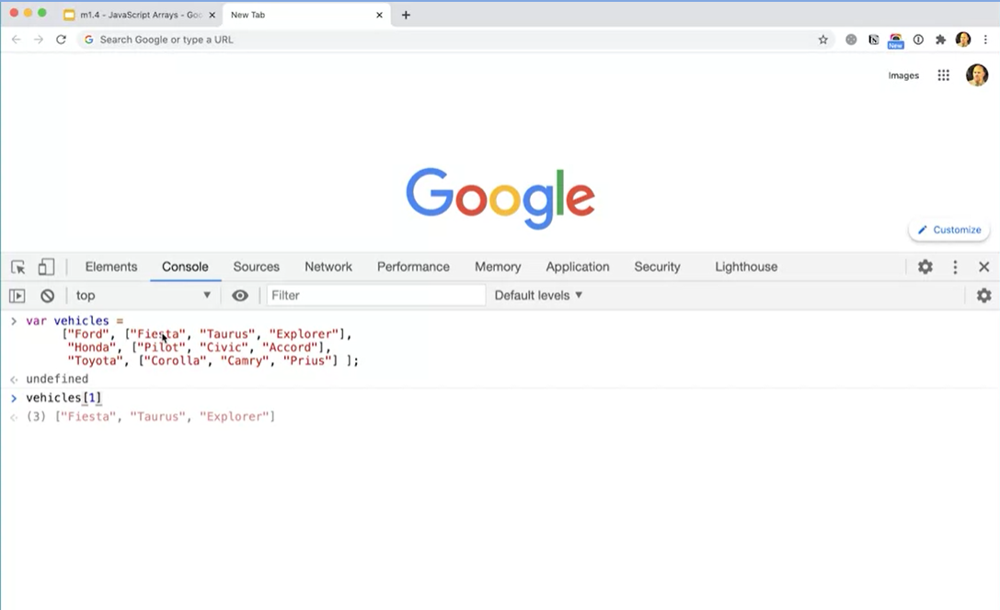
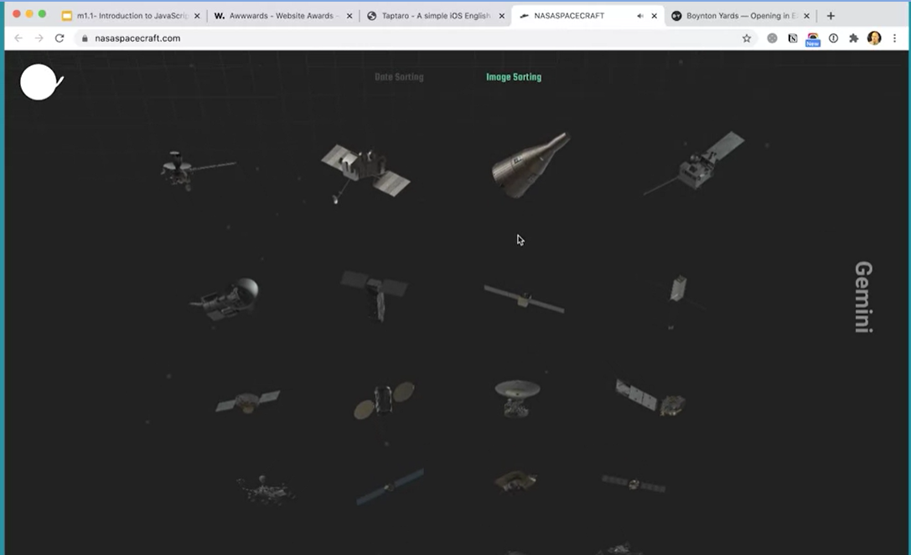
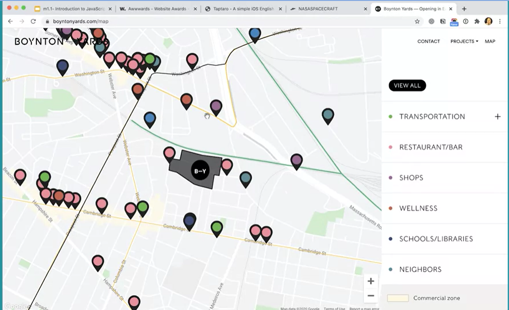

<h1 align="center">JavaScript Basics</h1>

<h6 align="center">(by William Mead, Lecturer - University of California @Davis)</h6>
<!--~~~~~~~~~~~~~~~~~~~~~~~~~~~~~~~~~~~~~~~~~~~~~~~~~~~~~~~~~~~~~~~~~~~~~~~~~~~~~~~~~~~~~~~~~~~~-->
<!--~~~~~~~~~~~~~~~~~~~ readme.md of UC-Davis-JS-Basics in bbauska.github.io ~~~~~~~~~~~~~~~~~~~-->
<!--~~~~~~~~~~~~~~~~~~~~~~~~~~~~~~~~~~~~~~~~~~~~~~~~~~~~~~~~~~~~~~~~~~~~~~~~~~~~~~~~~~~~~~~~~~~~-->
<!--~~~~~~~~~~~~~~~~ 01/02. javascript (coffee cup) logo / UC Davis log (01) ~~~~~~~~~~~~~~~~~~~-->
<!--~~~~~~~~~~~~~~~~~~~~~~~~~~~~~~~~~~~~~~~~~~~~~~~~~~~~~~~~~~~~~~~~~~~~~~~~~~~~~~~~~~~~~~~~~~~~-->

<!-- {width="2.0in" height="1.773685476815398in"}{width="2.0995866141732282in" height="1.77in"} -->

<h2 id="#about">About this Course</h2>

This course introduces the programming language JavaScript and shows the
websites that include the type of interactions students will eventually
be able to develop. Learners will understand the importance of how
JavaScript was developed and why such history impacts the way JavaScript
is currently written and in future releases. Learners will write their
first scripts, have their HTML and CSS skills assessed, create variables
and arrays and assign values to them. If student's skills are lacking,
resources and recommendations are provided to improve these skills.
There is ample opportunity for students to practice these first, core
skills.

<!--~~ Hoverable Dropdown Menu ~~-->
<h2><a href="#table-of-contents">Table of Contents</a></h2>

## [**Week 1: Getting Started, Intro to JS, Variables, and Arrays**](#ch1)
>	- ### [**1.00 A Note from UC Davis**](#ch1-00-note)
>	- ### [**1.00 Learning Objectives**](#ch1-00-obj)
>	- ### [**1.00 Welcome/Intro to this Course!**](#ch1-00-intro)
>### [**1.01 Intro to JavaScript - Part 1**](#ch1-01)
>### [**1.02 Intro to JavaScript - Part 2**](#ch1-02)
>### [**1.03 Intro to JavaScript - Part 3**](#ch1-03)
>### [**1.04 Tools Needed for Success**](#ch1-04)
>### [**1.05 Skills Needed for Success**](#ch1-05)
>	- ### [**1.05.Assessing Your Skills**](#ch1-05-assess)
>	- ### [**1.05.Additional Resources**](#ch1-05-add)
>### [**1.06 JavaScript Variables**](#ch1-06)
>### [**1.07 JavaScript Variables Practice - Part 1**](#ch1-07)
>### [**1.08 JavaScript Variables Practice - Part 2**](#ch1-08)
>### [**1.09 JavaScript Variables Practice - Part 3**](#ch1-09)
>### [**1.10 JavaScript Arrays - Part 1**](#ch1-10)
>### [**1.11 JavaScript Arrays - Part 2**](#ch1-11)
>### [**1.12 JavaScript Arrays Practice**](#ch1-12)
>	- ### [**1.12.Additional Resources**](#ch1-12-add)
>	- ### [**1.12.Reserved Words**](#ch1-12-res)
>	- ### [**1.12.Array Methods**](#ch1-12-array)

## [**Week 2: Controlling Logical Flow in JavaScript**](#ch2)
>	- ### [**2.00 Learning Objectives**](#ch2-00-obj)
>	- ### [**2.00 Module 2 Introduction**](#ch2-00-intro)
>### [**2.01 Visual Studio - Part 1**](#ch2-01)
>### [**2.02 Visual Studio - Part 2**](#ch2-02)
>### [**2.03 Visual Studio - Part 3**](#ch2-03)
>### [**2.04 Operators, Boolean &amp; Selection in JavaScript**](#ch2-04)
>### [**2.05 Try This!**](#ch2-05)
>### [**2.06 Comparing Values**](#ch2-06)
>### [**2.07 Else If**](#ch2-07)
>### [**2.08 Switch Statements**](#ch2-08)
>### [**2.09 Using &amp;&amp;**](#ch2-09)
>	- ### [**2.09.Additional Resources**](#ch2-09-add)
>### [**2.10 Loops in JavaScript**](#ch2-10)
>### [**2.11 Working With Arrays**](#ch2-11)
>### [**2.12 The For...Of Loop**](#ch2-12)
>### [**2.13 While Loops**](#ch2-13)
>	- ### [**2.13.JavaScript-Loops Additional-Resources**](ch2-13-add)
>### [**2.14 Structured Programming, Sequence - Part 1**](#ch2-14)
>### [**2.15 Sequence - Part 2**](#ch2-15)
>### [**2.16 Sequence - Part 3, Loop**](#ch2-16)
>### [**2.17 Loop + Selection**](#ch2-17)
>	- ### [**2.17.JavaScript Basic Challenges Introduction 1-9**](ch2-17-intro)
>### [**2.18 JavaScript Basic Challenges**](#ch2-18)
>### [**2.19 JavaScript Basic Challenges**](#ch2-19)
>### [**2.20 JavaScript Basic Challenges**](#ch2-20)
>### [**2.21 Useful Example - Step 1**](#ch2-21)
>### [**2.22 Useful Example - Steps 2-4**](#ch2-22)
>### [**2.23 Useful Example - Step 5**](#ch2-23)
>### [**2.24 More on Functions**](#ch2-24)
>	- ### [**2.24.Additional Resources**](ch2-17-add)
>	- ### [**2.24.JavaScript Function Challenges 10-16**](ch2-17-func)
>	- ### [**2.24.Module 2 Reflection**](ch2-24-refl)

## [**Week 3: Using JavaScript in the Web Browser**](#ch3)
>	- ### [**3.00 Learning Objectives**](#ch3-00-obj)
>	- ### [**3.00 Module 3 Introduction**](#ch3-00-intro)
>### [**3.01 JavaScript and the DOM**](#ch3-01)
>### [**3.02 Dot Syntax and Methods**](#ch3-02)
>### [**3.03 DOM; getElementsByTagName();**](#ch3-03)
>### [**3.04 DOM; getElementsByClassName();**](#ch3-04)
>### [**3.05 DOM; querySelector()**](#ch3-05)
>### [**3.06 DOM; querySelectorAll();**](#ch3-06)

<h2>Syllabus</h2>

<h3>Week 1</h3>
<h3>Getting Started, Introduction to JavaScript, Variables, and Arrays</h3>

In this module, you will be introduced to JavaScript and what it can do. You will be 
able to identify websites that include the types of interactions you will be able to 
produce at the end of the entire Specialization. You will also be able to discuss the 
history of JavaScript and explore why this history impacts how we write JavaScript.
On the web, JavaScript is used to manipulate the HTML and CSS of a webpage, after it 
has loaded from the server. You will be able to assess your understanding of HTML and 
CSS and have the opportunity through resources and recommendations for improving your 
skills in this area, if necessary. You will write simple JavaScript statements in the 
web browser console and be able to create variables and arrays. You will be able to assign 
values to these variables and arrays and be able to read values from them.

<h4>12 videos, 5 readings</h4>

<ul>
  <li>1.00.A Note From UC Davis</li>
  <li>1.00.Learning Objectives</li>
  <li><a href="https://www.coursera.org/lecture/javascript-basics/welcome-to-this-course-EGMim">1.00.Welcome/Intro to this Course!</a></li>
</ul>

<ol type="1">
  <li>Introduction to JavaScript - Part 1</li>
  <li>Introduction to JavaScript - Part 2</li>
  <li>Introduction to JavaScript - Part 3</li>
  <li>Tools Needed for Success</li>
  <li>Skills Needed for Success</li>
</ol>

<ul>
  <li>1.05.Assessing Your Skills</li>
  <li>1.05.Additional Resources</li>
</ul>

<ol type="1" start="6">
  <li>JavaScript Variables</li>
  <li>JavaScript Variables Practice - Part 1</li>
  <li>JavaScript Variables Practice - Part 2</li>
  <li>JavaScript Variables Practice - Part 3</li>
  <li>JavaScript Arrays - Part 1</li>
  <li>JavaScript Arrays - Part 2</li>
  <li>JavaScript Arrays Practice</li>
</ol>

<ul>
  <li>1.12.Additional Resources</li>
  <li>1.12.Module 1 Reflection</li>
</ul>

<h3>Week 2</h3>

<h3>Controlling Logical Flow in JavaScript</h3>

In this module, you will be able to download, install and use of a code editor as 
a tool for writing code, and properly save and manage their files. You will be introduced 
to the selection control structure. This basic control structure allows programs to follow 
a path based on conditions, and is one of the three major logic and flow control structures 
found in any modern programming language.

You will be able to identify, write, and trouble shoot scripts using this basic 
control structure. You will be able to correctly identify loop structures and
practice using some of the syntax available in JavaScript to create loops. You 
will then be able to put all three logical flow control structures (sequence, selection, 
and loop) together to create basic JavaScript programs that can be tested. Finally you 
will be able to combine sets of program instructions into named functions and create
custom functions that can be called to complete the instructions they contain.

<h4>25 lessons, 5 readings</h4>

<ul>
  <li>2.00.Learning Objectives</li>
  <li><a href="https://www.coursera.org/lecture/javascript-basics/module-2-introduction-8y2ue">2.00.Module 2 Introduction</a></li>
</ul>

<ol>
  <li>Visual Studio - Part 1</li>
  <li>Visual Studio - Part 1</li>
  <li>Visual Studio - Part 2</li>
  <li>Visual Studio - Part 3</li>
  <li>Operators, Booleans & Selection in JavaScript</li>
  <li>Try This!</li>
  <li>Comparing Values</li>
  <li>Else If</li>
  <li>Switch Statements</li>
  <li>Using &&</li>
</ol>

<ul>
  <li>2.09.Additional Resources</li>
</ul>

<ol type="1" start="11">
  <li>Loops in JavaScript</li>
  <li>Working With Arrays</li>
  <li>The For..Of Loop</li>
  <li>While Loops</li>
</ol>

<ul>
  <li>2.13.JavaScript-LoopsAdditional-Resources</li>
</ul>

<ol type="1" start="15">
  <li>Structured Programming, Sequence - Part 1</li>
  <li>Sequence - Part 2</li>
  <li>Sequence - Part 3, Loop</li>
  <li>Loop + Selection</li>
</ol>

<ul>
  <li>2.17.JavaScript Basic Challenges Introduction 01-09</li>
</ul>

<ol type="1" start="20">
  <li>Functions in JavaScript</li>
  <li>Passing In and Returning Data</li>
  <li>Useful Example - Step 1</li>
  <li>Useful Example - Steps 2-4</li>
  <li>Useful Example - Step 5</li>
  <li>More On Functions</li>
</ol>

<ul>
  <li>2.24.Additional Resources</li>
  <li>2.24.JavaScript Function Challengs 10-16</li>
  <li>2.24.Module 2 Reflection</li>
</ul>

<h3>Week 3</h3>

<h3>Using JavaScript in the Web Browser</h3>

In this module, you will be introduced to the methods built into
JavaScript for accessing and manipulating DOM elements in the web
browser. You will be able to capture user events with JavaScript and use
those events to trigger changes to the DOM using the document methods
and element properties. You will be able to identify how scope works in
JavaScript and be introduced to best practices for working with
variables in JavaScript so that scope does not become a problem. You
will be able to practice all the skills and techniques learned so far in
the course by putting together a simple slideshow on a web page.

<h4>37 videos, 7 readings</h4>

<ul>
  <li>3.00.Learning Objectives</li>
  <li><a href="https://www.coursera.org/lecture/javascript-basics/module-3-introduction-xK7aE">3.00.Module 3 Introduction</a></li>
</ul>

<ol type="1">
  <li>JavaScript and the DOM</li>
  <li>Dot Syntax and Methods</li>
  <li>DOM: getElementsByTagName();</li>
  <li>DOM: getElementsByClassName();</li>
  <li>DOM: querySelector();</li>
  <li>DOM: querySelectorAll();</li>
  <li>innerHTML</li>
  <li>className</li>
  <li>Creating Elements and Text Nodes</li>
  <li>Removing Elements</li>
</ol>

<ul>
  <li>3.10.Additional Resources</li>
  <li>3.10.JavaScript DOM Challengs 17-21</li>
</ul>

<ol type="1" start="11">
  <li>Capturing Events with JavaScript</li>
  <li>Event Listeners</li>
  <li>The Event Object</li>
  <li>More On Events</li>
  <li>Mouseover, Mouseover Events: HTML</li>
  <li>Scroll Events: HTML</li>
  <li>deo: Window Resizing</li>
  <li>Key Down Event</li>
</ol>

<ul>
  <li>3.18.Additional Resources</li>
</ul>

<ol type="1" start="19">
  <li>JavaScript Event Challenges 22-30</li>
  <li>Scope in JavaScript</li>
  <li>Strategy 1: Never Use Global Scope</li>
  <li>Strategy 2: &ldquo;use strict;&rdquo;</li>
  <li>Strategy 3: const and let</li>
  <li>Scope in JavaScript Summary</li>
</ol>

<ul>
  <li>3.24.Additional Resources</li>
  <li>3.24.Simple Slide Show START Files</li>
</ul>

<ol type="1" start="25">
  <li>Simple JS Slideshow - Part 1</li>
  <li>Simple JS Slideshow - Part 2</li>
  <li>Simple JS Slideshow - Part 3</li>
  <li>Simple JS Slideshow - Part 4</li>
  <li>Simple JS Slideshow - Part 5</li>
</ol>

<ul>
  <li>3.29.Simple JS Slideshow Open Discussion</li>
  <li>3.29.Advanced Slide Show START Files</li>
</ul>

<ol type="1" start="30">
  <li>Slideshow with Cross Fade Effect - Part 1</li>
  <li>Slideshow with Cross Fade Effect - Part 2</li>
  <li>Slideshow with Cross Fade Effect - Part 3</li>
  <li>Slideshow with Cross Fade Effect - Part 4</li>
  <li>Slideshow with Cross Fade Effect - Part 5</li>
  <li>Slideshow with Cross Fade Effect - Part 6</li>
  <li>Slideshow with Cross Fade Effect - Part 7</li>
</ol>

<ul>
  <li>3.36.Slideshow With Cross Fade Effect Open Discussion</li>
  <li>3.36.Prompt: Module 3 Reflection</li>
</ul>

<h3>Week 4</h3>

<h3>Basic JavaScript Application Projects</h3>

In this module, you will be able to apply and practice the skills and
techniques you have learned in the course by building a basic and a more
advanced distance converter. You will be able to further apply and
practice to extend your skills and techniques by building a simple
vacation destination list application.

<h4>26 videos, 4 readings</h4>

<ol type="1" start="1">
  <li><a href="https://www.coursera.org/lecture/javascript-basics/module-4-introduction-FqHR0">Module 4 Introduction</a></li>
</ol>

<ul>
  <li>4.00.Learning Objectives</li>
  <li>4.00.Module 4 Introduction</li>
  <li>4.00.Basic Distance Converter START Files</li>
</ul>

<ol type="1" start="1">
  <li>Basic Distance Converter Project - Part 1</li>
  <li>Basic Distance Converter Project - Part 2</li>
  <li>Basic Distance Converter Project - Part 3</li>
  <li>Basic Distance Converter Project - Part 4</li>
  <li>Basic Distance Converter Project - Part 5</li>
</ol>

<ul>
  <li>4.05.Basic Distance Converter Project Open Discussion</li>
  <li>4.05.Advanced Distance Converter START Files</li>
</ul>

<ol type="1" start="6">
  <li>Advanced Distance Converter Project - Part 1</li>
  <li>Advanced Distance Converter Project - Part 2</li>
  <li>Advanced Distance Converter Project - Part 3</li>
  <li>Advanced Distance Converter Project - Part 4</li>
  <li>Advanced Distance Converter Project - Part 5</li>
</ol>

<ul>
  <li>4.10.Advanced Distance Converter Project Open Discussion</li>
  <li>4.10.Vacation Destination Project - Part 1 START Files</li>
</ul>

<ol type="1" start="11">
  <li>Vacation Destination Project: HTML & CSS - Part 1</li>
  <li>Vacation Destination Project: HTML & CSS - Part 2</li>
  <li>Vacation Destination Project: HTML & CSS - Part 3</li>
  <li>Vacation Destination Project: HTML & CSS - Part 4</li>
  <li>Vacation Destination Project: HTML & CSS - Part 5</li>
  <li>Vacation Destination Project: HTML & CSS - Part 6</li>
</ol>

<ul>
  <li>4.16.Vacation Destination Project - Part 1 Open Discussion</li>
  <li>4.16.Vacation Destination Project - Part 2 START Files</li>
</ul>

<ol type="1" start="17">
  <li>Vacation Destination Project: JavaScript - Part 1</li>
  <li>Vacation Destination Project: JavaScript - Part 2</li>
  <li>Vacation Destination Project: JavaScript - Part 3</li>
  <li>Vacation Destination Project: JavaScript - Part 4</li>
  <li>Vacation Destination Project: JavaScript - Part 5</li>
  <li>Vacation Destination Project: JavaScript - Part 6</li>
  <li>Vacation Destination Project: JavaScript - Part 7</li>
  <li>Vacation Destination Project: JavaScript - Part 8</li>
</ol>

<ul>
  <li>4.24.Vacation Destination Project: Part 2 Open Discussion</li>
  <li>4.24.Module 4 Reflection</li>
</ul>

<ol type="1" start="25">
  <li>Course Summary</li>
</ol>

<ul>
  <li>4.25.Self-Reflection</li>
</ul>
<!--~~~~~~~~~~~~~~~~~~~~~~~~~~~~~~~~~~~~~~~~~~~~~~~~~~~~~~~~~~~~~~~~~~~~~~~~~~~~~~~~~~~~~~~~~~~~-->
<!--~~~~~ week 1 - getting started, introduction to javascript, variables and arrays (09) ~~~~~~-->
<!--~~~~~~~~~~~~~~~~~~~~~~~~~~~~~~~~~~~~~~~~~~~~~~~~~~~~~~~~~~~~~~~~~~~~~~~~~~~~~~~~~~~~~~~~~~~~-->
<h1 name="ch1">Week 1</h1>
<!--~~~~~~~~~~~~~~~~~~~~~~~~~~~~~~~~~~~~~~~~~~~~~~~~~~~~~~~~~~~~~~~~~~~~~~~~~~~~~~~~~~~~~~~~~~~~-->
<h2 name="ch1-00-note">1.00. A Note From UC Davis</h2>

<h3>Welcome to this course!</h3>

We are delighted to be a part of your continuing education. This course will provide you 
with a variety of tools and learning opportunities, to include video lectures, readings, 
assessments, peer reviews, and an opportunity to contribute to the Coursera learning 
community in the discussion forums.

In each of the lesson sections, you'll find learning objectives, lecture videos, readings, 
activities, and an opportunity to test your knowledge in quiz format. In some of the module 
sections you'll also work on assignments and grade the work of your peers. A peer-review 
assignment, is one where you and your fellow learners have an opportunity to review and 
grade each other's work. We'll dive more into peer reviews later on in this course.

When navigating the course, you can find available <b>course resources</b> under each of 
the lecture videos in a section labeled "[Downloads]" -- here you can download the lecture 
video, view transcripts, PDFs of the lecture slides, and <b>find additional readings or 
files</b>.

If you run into any issues during this course, <b>learner support</b> is available to all 
Coursera students. The link for Coursera's Learner support is included below. The 
<a href="https://learner.coursera.help/hc/en-us">Help Center/Learner Support</a> includes 
topics such as account setup, payments, enrollment questions, and troubleshooting common problems.

If you find any content issues, be sure to let the course staff know by <b>flagging the 
lecture</b>, assignment, reading, or quiz and this will inform us of where these issues occur. 
Here is the link for more information on how to 
<a href="https://learner.coursera.help/hc/en-us/articles/208280106-Report-a-problem-with-a-course">
Flag an Issue</a> &minus; it is also listed below.

One of the great things about Coursera courses is that they are
self-paced. The course dates are based on the average time it takes to
complete a course. However, if you need additional time to complete a
course you can <b>reset your deadlines</b> with no penalties. More
information on resetting deadlines can be found here: 
<a href="https://learner.coursera.help/hc/en-us/articles/208279866-Assignment-deadlines">
Assignment Deadlines</a>.

Need additional help during your course session? Be sure to utilize the
<b>discussion forums</b> and interact with your fellow peers. In this area,
you can ask questions or search for similar issues that have already
been posted in the forums. Learner support is also a great place to find
answers, but specific course content questions can typically be found
and answered in the discussion forums. This is also a great place to
post your assignment if additional peer reviews are needed. Here is a
link with more information on the discussion forums: 
<a href="https://learner.coursera.help/hc/en-us/articles/208279996-Get-help-with-course-content-in-the-discussion-forums">
Discussion Forums</a>.

Because of the self-paced nature of Coursera courses, this is an excellent opportunity 
to show your commitment to your work and the work of your peers through academic integrity. 
Be sure to read the Coursera guidelines and the <b>Coursera Honor Code</b> here: 
<a href="https://learner.coursera.help/hc/en-us/articles/209818863-Coursera-Honor-Code">
Coursera Honor Code</a>.

We look forward to having you in this course. Happy learning! 
<b><i>UC Davis Coursera Team</i></b>

<h3>Additional Links:</h3>

<ul>
  <li><a href="https://learner.coursera.help/hc/en-us">1.00.Coursera's Learner Support/Help Center:</a></li>
</ul>
<!--~~~~~~~~~~~~~~~~~~~~~~~~~~~~~~~~~~~~~~~~~~~~~~~~~~~~~~~~~~~~~~~~~~~~~~~~~~~~~~~~~~~~~~~~~~~~-->
<h1 id="ch1">Week One:</h1>
<!--~~~~~~~~~~~~~~~~~~~~~~~~~~~~~~~~~~~~~~~~~~~~~~~~~~~~~~~~~~~~~~~~~~~~~~~~~~~~~~~~~~~~~~~~~~~~-->
<h2 id="ch1-00-obj">1.00 Learning Objectives</h2>
<!--~~~~~~~~~~~~~~~~~~~~~~~~~~~~~~~~~~~~~~~~~~~~~~~~~~~~~~~~~~~~~~~~~~~~~~~~~~~~~~~~~~~~~~~~~~~~-->
<ul>
  <li>Identify interactions on web pages created with JavaScript.</li>
  <li>Articulate, in general terms, the importance of how JavaScript was developed and how that impacts the way JavaScript is written.</li>
  <li>Identify properly formed semantic HTML.</li>
  <li>Articulate major concepts in CSS.</li>
  <li>Identify properly formed CSS syntax.</li>
  <li>Write simple JavaScript statements in the web browser console.</li>
  <li>Assign and retrieve values from variables and arrays in JavaScript.</li>
</ul>
<!--~~~~~~~~~~~~~~~~~~~~~~~~~~~~~~~~~~~~~~~~~~~~~~~~~~~~~~~~~~~~~~~~~~~~~~~~~~~~~~~~~~~~~~~~~~~~-->
<h2 id="ch1-00-welcome">1.00 Welcome to JavaScript Basics (1:01)</h2>
<!--~~~~~~~~~~~~~~~~~~~~~~~~~~~~~~~~~~~~~~~~~~~~~~~~~~~~~~~~~~~~~~~~~~~~~~~~~~~~~~~~~~~~~~~~~~~~-->
<!--~~~~~~~~~~~~~~~~~~~~~~~~~ 03. module 1 welcome to js basics (09) ~~~~~~~~~~~~~~~~~~~~~~~~~~~-->
<!--~~~~~~~~~~~~~~~~~~~~~~~~~~~~~~~~~~~~~~~~~~~~~~~~~~~~~~~~~~~~~~~~~~~~~~~~~~~~~~~~~~~~~~~~~~~~-->

Hello, and welcome to our course on JavaScript. My name is Bill Mead,
and I&apos;ve been teaching and learning about JavaScript for many years.
Here I am in California, outside on this beautiful day not that many
miles away from where JavaScript was invented over 25 years ago. It&apos;s a
fun programming language, I think you&apos;ll enjoy learning it. It can be
frustrating and maddening at times when you can&apos;t get it to work, but
when you do get things to work the way you want them to work, it&apos;s
super satisfying. It&apos;s become one of the most popular programming
languages in the planet.

As we go through this course and through this specialization, I think
you&apos;ll start to understand why it&apos;s satisfying and easy to get started
with and if you&apos;re new to programming, don&apos;t worry, we&apos;re going to
start at the very beginning and get you going all on the right track.
Buckle in and let&apos;s get started learning JavaScript.

<!--~~~~~~~~~~~~~~~~~~~~~~~~~~~~~~~~~~~~~~~~~~~~~~~~~~~~~~~~~~~~~~~~~~~~~~~~~~~~~~~~~~~~~~~~~~~~-->
<h2 id="ch1-00-intro">1.00. Week 1 - Getting Started, Intro to JS, Variables &amp; Arrays (0:57)</h2>
<!--~~~~~~~~~~~~~~~~~~~~~~~~~~~~~~~~~~~~~~~~~~~~~~~~~~~~~~~~~~~~~~~~~~~~~~~~~~~~~~~~~~~~~~~~~~~~-->

Welcome to the first module on JavaScript. In this module we&apos;ll get
into the basics of the language. We&apos;ll talk about variables and arrays
and these kinds of things that you see in a lot of programming
languages. But we&apos;ll also talk about the history of JavaScript and do a
real introduction to the language. And the history of JavaScript is
super interesting because it has an impact on how we write JavaScript.
And that&apos;s really interesting to see how a language has evolved and
developed and how that affects the way you write modern, up to date
JavaScript. And I think you&apos;ll learn a lot from this and you&apos;ll be
able to do some interesting things with JavaScript as you go along. So
stick with me and we will have a lot of fun in this first module
learning about JavaScript in the basics of the language.

<!--~~~~~~~~~~~~~~~~~~~~~~~~~~~~~~~~~~~~~~~~~~~~~~~~~~~~~~~~~~~~~~~~~~~~~~~~~~~~~~~~~~~~~~~~~~~~-->
<h2 id="ch1-01">1.01. Intro to JavaScript -- Part 1 (3:13)</h2>
<!--~~~~~~~~~~~~~~~~~~~~~~~~~~~~~~~~~~~~~~~~~~~~~~~~~~~~~~~~~~~~~~~~~~~~~~~~~~~~~~~~~~~~~~~~~~~~-->
<!--~~~~~~~~~~~~~~~~~~~~~~~ 04. intro to javascript - part 1 (3:13) (10) ~~~~~~~~~~~~~~~~~~~~~~~-->
<!--~~~~~~~~~~~~~~~~~~~~~~~~~~~~~~~~~~~~~~~~~~~~~~~~~~~~~~~~~~~~~~~~~~~~~~~~~~~~~~~~~~~~~~~~~~~~-->

<!-- {width="4.0in" height="2.261538713910761in"} -->

Unlike a pillbox which really can&apos;t hold much more than just pills, you can put 
anything into an array in JavaScript.

<!--~~~~~~~~~~~~~~~~~~~~~~~~~~~~~~~~~~~~~~~~~~~~~~~~~~~~~~~~~~~~~~~~~~~~~~~~~~~~~~~~~~~~~~~~~~~~-->
<!--~~~~~~~~~~~~~~~~~~~~~~~~~~~~~~ 05. arrays in javascript (11) ~~~~~~~~~~~~~~~~~~~~~~~~~~~~~~~-->
<!--~~~~~~~~~~~~~~~~~~~~~~~~~~~~~~~~~~~~~~~~~~~~~~~~~~~~~~~~~~~~~~~~~~~~~~~~~~~~~~~~~~~~~~~~~~~~-->

<!-- {width="5.0in" height="2.8269225721784776in"} -->

You can even put in an array and an array. You think about a pillbox with a sub-container 
with even smaller divisions in it.

<!--~~~~~~~~~~~~~~~~~~~~~~~~~~~~~~~~~~~~~~~~~~~~~~~~~~~~~~~~~~~~~~~~~~~~~~~~~~~~~~~~~~~~~~~~~~~~-->
<!--~~~~~~~~~~~~~~~~~~~~~~~~~~~~~ 06. inspect console arrays (11) ~~~~~~~~~~~~~~~~~~~~~~~~~~~~~~-->

<!-- {width="5.0in" height="3.0544870953630796in"} -->

Let&apos;s take a look at what that looks like. Let me switch back over to
my tab here. I&apos;m just going to paste this in, but you might want to
type it. It&apos;s a little bit hard to type and get right, but it&apos;s worth
trying if you can. I&apos;m going to paste this vehicle&apos;s array in here.

<!--~~~~~~~~~~~~~~~~~~~~~~~~~~~~~~~~~~~~~~~~~~~~~~~~~~~~~~~~~~~~~~~~~~~~~~~~~~~~~~~~~~~~~~~~~~~~-->
<!--~~~~~~~~~~~~~~~~~~~~~~~ 07/08. console inspect array elements (12) ~~~~~~~~~~~~~~~~~~~~~~~~~-->

<!-- {width="3.5in" height="2.138140857392826in"}
{width="3.5in" height="2.138140857392826in"}
-->

Now if I do, if I want to access an element from this array, I could do
vehicles, square bracket one. That&apos;s going to go and get the line that
starts with which element. There we go. Then, it&apos;s going to give me
this because this is zero, and now this is one. Right? It&apos;s going to
get me that into that sub-array. You can see it&apos;s sort of showing up
down there. Then if I do square bracket two, that&apos;s going to get me the
explorer elements in that sub-array. You can do things like that with
arrays.

That&apos;s kind of complicated and you&apos;re not probably going to be doing
arrays inside of arrays to start off with. But it&apos;s an important thing
to understand about arrays is that they&apos;re very flexible tools that you
can use to hold groups of data, and that&apos;s very useful.

<!--~~~~~~~~~~~~~~~~~~~~~~~~~~~~~~~~~~~~~~~~~~~~~~~~~~~~~~~~~~~~~~~~~~~~~~~~~~~~~~~~~~~~~~~~~~~~-->
<!--~~~~~~~~~~~~~~~~~~~~~~~ 09. console inspect array elements, #3 (12) ~~~~~~~~~~~~~~~~~~~~~~~~-->

<!-- {width="5.0in" height="3.0544870953630796in"} -->

Another thing that&apos;s interesting is that a regular variable holding a string can 
be treated as an array in JavaScript. If I make a variable var joke equals the chicken 
crossed the road, now I&apos;ve got a variable called joke, but I can actually treat 
it as an array. I could do. Joke square bracket four, and that&apos;s going to get me 
the C in chicken. Because zero, one, two, three, four is going to get me that C in
chicken. Or I could do, joke dot length, and it will tell me that there are 28 characters 
in that string. That&apos;s kind of an interesting thing to understand about arrays as well.

<!--~~~~~~~~~~~~~~~~~~~~~~~~~~~~~~~~~~~~~~~~~~~~~~~~~~~~~~~~~~~~~~~~~~~~~~~~~~~~~~~~~~~~~~~~~~~~-->
<h2 id="ch1-02">1.02. Intro to JavaScript -- Part 2</h2>
<!--~~~~~~~~~~~~~~~~~~~~~~~~~~~~~~~~~~~~~~~~~~~~~~~~~~~~~~~~~~~~~~~~~~~~~~~~~~~~~~~~~~~~~~~~~~~~-->
<!--~~~~~~~~~~~~~~~~~~~~~~~~~~ 10. inro to javascript - part 2 (13) ~~~~~~~~~~~~~~~~~~~~~~~~~~~~-->

<!-- {width="4.0in" height="2.261538713910761in"} -->

A great place to go to find some websites that will show you the way JavaScript can 
interact with the website is this Awwwards website with the extra w&apos;s in here.

<!--~~~~~~~~~~~~~~~~~~~~~~~~~~~~~~~~~~~~~~~~~~~~~~~~~~~~~~~~~~~~~~~~~~~~~~~~~~~~~~~~~~~~~~~~~~~~-->
<!--~~~~~~~~~~~~~~~~~~~~~~ 11. javascript interaction: awwwards.com (14) ~~~~~~~~~~~~~~~~~~~~~~~-->

<!-- {width="5.0in" height="3.0544870953630796in"} -->

I have that website pulled up over here. You can come here and look through some of 
the different sites that have won awards on <a href="https://www.awwwards.com/">
awwwards.com.</a>. They tend to be pretty innovative and interesting sites.

<!--~~~~~~~~~~~~~~~~~~~~~~~~~~~~~~~~~~~~~~~~~~~~~~~~~~~~~~~~~~~~~~~~~~~~~~~~~~~~~~~~~~~~~~~~~~~~-->
<!--~~~~~~~~~~~~~~~~~~~~~~~~~ 12. taptaro example in awwwards.com (14) ~~~~~~~~~~~~~~~~~~~~~~~~~-->

<!-- {width="5.0in" height="3.0544870953630796in"} -->

I have <a href="https://www.awwwards.com/sites/taptaro">this one</a>. Whether you&apos;re 
talking about following the mouse, or coming over here and the animation around the circle, 
or the way these images pop in, this is all being done with JavaScript, this kind of thing.

<!--~~~~~~~~~~~~~~~~~~~~~~~~~~~~~~~~~~~~~~~~~~~~~~~~~~~~~~~~~~~~~~~~~~~~~~~~~~~~~~~~~~~~~~~~~~~~-->
<!--~~~~~~~~~~~~~~~~~~~~~~ 13. javascript example, no longer there (15) ~~~~~~~~~~~~~~~~~~~~~~~~-->

<!-- {width="5.0in" height="3.0544870953630796in"} -->

Then here we are in one of the NASA spacecraft website here (no longer active). Click 
on one of these things it will come up and show you the different pictures and give you 
some other interactions including some sounds as you work around it.

<!--~~~~~~~~~~~~~~~~~~~~~~~~~~~~~~~~~~~~~~~~~~~~~~~~~~~~~~~~~~~~~~~~~~~~~~~~~~~~~~~~~~~~~~~~~~~~-->
<!--~~~~~~~~~~~~~~~~~~~~~~~~ 14. boyntonyards.com - awwwards.com (15) ~~~~~~~~~~~~~~~~~~~~~~~~~~-->

<!-- {width="5.0in" height="3.0544870953630796in"} -->

Or <a href="https://boyntonyards.com/">this website</a> which has some interesting 
interactions as you&apos;re scrolling through the website.

<!--~~~~~~~~~~~~~~~~~~~~~~~~~~~~~~~~~~~~~~~~~~~~~~~~~~~~~~~~~~~~~~~~~~~~~~~~~~~~~~~~~~~~~~~~~~~~-->
<!--~~~~~~~~~~~~~~~~~~~~~~~~~~~~ 15. boyntonyards.com, cont'd (16) ~~~~~~~~~~~~~~~~~~~~~~~~~~~~~-->

<!-- {width="5.0in" height="3.0544870953630796in"} -->

Yeah, look around on the web and wherever you see interactions happening, whether it&apos;s 
a map like this or all kinds of interactions are being created by JavaScript. You&apos;ve 
seen some interactions and websites and you&apos;ve probably seen plenty of others in other 
websites or you&apos;ve gone off and found your own.

<!--~~~~~~~~~~~~~~~~~~~~~~~~~~~~~~~~~~~~~~~~~~~~~~~~~~~~~~~~~~~~~~~~~~~~~~~~~~~~~~~~~~~~~~~~~~~~-->
<!--~~~~~~~~~~~~~~~~~~~~~~~~~~~~~~ 16. why learn javascript? (17) ~~~~~~~~~~~~~~~~~~~~~~~~~~~~~~-->

<!-- {width="5.0in" height="3.0544870953630796in"} -->

But let&apos;s talk about some other reasons why we should learn JavaScript.
First of all, it&apos;s the most popular programming language in the world.

There&apos;s also a low barrier of entry to the field. Whereas if you&apos;re
learning Java, or C, or C++, you&apos;re going to need a lot of experience
before you can get to a really good paying job. But JavaScript in the
web is the gateway to programming into the tech industry in this way.
It&apos;s really good to learn JavaScript for that reason.

Then finally, it is the language of the web. Now it goes well beyond the
web. We have Raspberry Pi and other devices that can all be programmed
with JavaScript robots and all kinds of things where JavaScript exists.
The Unity gaming engine uses JavaScript as well as C#. There are lots of
places where you can use JavaScript, but it is ultimately the language
of the web. It is the programming, the scripting language for the web
browser, and it&apos;s native to the web browser. That&apos;s a really great
place to start with programming.

<!--~~~~~~~~~~~~~~~~~~~~~~~~~~~~~~~~~~~~~~~~~~~~~~~~~~~~~~~~~~~~~~~~~~~~~~~~~~~~~~~~~~~~~~~~~~~~-->
<!--~~~~~~~~~~~~~~~~~~~~~~~~ 17. 1995 - beginnings of javascript (18) ~~~~~~~~~~~~~~~~~~~~~~~~~~-->

<!-- {width="5.0in" height="3.0544870953630796in"} -->

The story of JavaScript is really interesting. It really is the story of
an underdog who became king. JavaScript didn&apos;t start off as the most
popular programming language. It&apos;s really important to understand this
path that JavaScript has taken through history because it has a big
impact on how we write JavaScript. JavaScript was written by this
gentleman here, Brendan Eich, in 1995 over the course of 10 days while
he was working at Netscape. I&apos;m not going to go into great detail on
the history here, but it&apos;s a really good thing to look up. It&apos;s a very
interesting story in and of itself. But he wrote the language in a very
short amount of time and that&apos;s an important thing to understand about
this language.

Another important thing to understand about the JavaScript programming
language is it&apos;s not the same language as Java. It was originally a
language called Mocha and they changed the name to JavaScript, really as
a marketing ploy. But it&apos;s not actually the same language as Java,
they&apos;re two completely different languages. It&apos;s easy as a beginner to
get confused between Java and JavaScript.

<!--~~~~~~~~~~~~~~~~~~~~~~~~~~~~~~~~~~~~~~~~~~~~~~~~~~~~~~~~~~~~~~~~~~~~~~~~~~~~~~~~~~~~~~~~~~~~-->
<!--~~~~~~~~~~~~~~~~~~~~~~~~~~ 18. javascript rough beginnings (19) ~~~~~~~~~~~~~~~~~~~~~~~~~~~~-->

<!-- {width="5.0in" height="3.0544870953630796in"} -->

As I said before, JavaScript had some rough beginnings. The early years
of JavaScript were plagued by bad implementations, developers who just
despised the language mostly due to poor documentation and it was
greatly misunderstood as a language. This gentleman, Douglas Crockford,
did a lot to help people understand the incredible value of JavaScript
as a language and its strengths as well as its weaknesses.

<!--~~~~~~~~~~~~~~~~~~~~~~~~~~~~~~~~~~~~~~~~~~~~~~~~~~~~~~~~~~~~~~~~~~~~~~~~~~~~~~~~~~~~~~~~~~~~-->
<!--~~~~~~~~~~~~~~~~~~~~~~~ 19. javascript - the good and the bad  (19) ~~~~~~~~~~~~~~~~~~~~~~~~-->

<!-- {width="5.0in" height="3.0544870953630796in"} -->

He wrote a book called JavaScript: The Good Parts. It&apos;s a legendary
book because in this book he really talks about how JavaScript has some
of the best features any programming language has ever had right
alongside some of the worst features. Becoming a good JavaScript
developer is about understanding how to leverage the best parts of the
language while minimizing the worst parts of the language. We&apos;ll be
seeing some examples of some parts of the language that are good and
not-so-good right off the bat, and I&apos;ll be pointing those out.

You&apos;ll see that as we go along, we write JavaScript in ways to minimize
the bad features of the language. When I say bad features, what I mean
are features that can lead to more errors, lead to confusion in the
programming, and so on and so forth. But it&apos;s also a very expressive
language, it&apos;s a very powerful language. Some of the ideas behind it
are very interesting and very powerful, even though they&apos;re different
from other languages, which was behind some of the frustration that
people had with it initially is they just didn&apos;t understand it because
it was different.

<!--~~~~~~~~~~~~~~~~~~~~~~~~~~~~~~~~~~~~~~~~~~~~~~~~~~~~~~~~~~~~~~~~~~~~~~~~~~~~~~~~~~~~~~~~~~~~-->
<h2 id="ch1-03">1.03. Intro to JavaScript -- Part 3 (5:33)</h2>
<!--~~~~~~~~~~~~~~~~~~~~~~~~~~~~~~~~~~~~~~~~~~~~~~~~~~~~~~~~~~~~~~~~~~~~~~~~~~~~~~~~~~~~~~~~~~~~-->
<!--~~~~~~~~~~~~~~~~~~~~~~~~~~ 20. intro to javascript - part 3 (20) ~~~~~~~~~~~~~~~~~~~~~~~~~~~-->

<!-- {width="4.0in" height="2.261538713910761in"} -->

It&apos;s really important to understand the development of JavaScript over
the years, and this is because the way JavaScript is developed has
really impacted the way that we write JavaScript.

<!--~~~~~~~~~~~~~~~~~~~~~~~~~~~~~~~~~~~~~~~~~~~~~~~~~~~~~~~~~~~~~~~~~~~~~~~~~~~~~~~~~~~~~~~~~~~~-->
<!--~~~~~~~~~~~~~~~~~~~~~~~~~~~~~~ 21. javascript versions (21) ~~~~~~~~~~~~~~~~~~~~~~~~~~~~~~~~-->

<!-- {width="5.0in" height="2.823183508311461in"} -->

So having a little bit of understanding of this history is really important as you 
learn the language. Again, I&apos;m just going to cover just the very basics, but 
there&apos;s a lot of this history. It&apos;s a fascinating history and worth looking 
into if you&apos;re interested in that kind of thing and you can find out about it by 
looking it up on the web where there&apos;s plenty of books about it and that kind of 
stuff.

We know that JavaScript was originally written in 1995 in 10 days by Brendan Eich and 
his team at Netscape. Then in 1997, the first version of the standard was released, and 
the standard is created by the European Computer Manufacturers Association. Essentially 
the people in California went to Europe to this association to get this language rubber-
stamped. It didn&apos;t turn out to be quite that easy, but that&apos;s a longer story. 
But in 1997, the first version, <b>ECMAScript 1,</b> was standardized and released, and 
then a third version.

The second version never really quite happened, but the third version came out in 1999 
with some minor changes and fixes. The fourth version is an interesting story and one 
that I won&apos;t go into great depth on, but again, you can look it up for yourself. But 
essentially, if you&apos;ll recall, I had said earlier that there was a lot of arguing 
about the direction of JavaScript and there were a lot of developers that didn&apos;t
really understand it. There was some push to make JavaScript more like other programming 
languages that we&apos;re already familiar with and comfortable with. Douglas Crockford 
really stepped in and said,&quot; Wait, look, JavaScript is its own language and it has 
its own powerful features in its own right and if you understand it and make use of that
power then it really is valuable to keep it the way it is&quot;. It took a while for him 
to convince people of that.

But in 2009, they released <b>ECMAScript 5</b>, and <b>ECMAScript 4</b> was scrapped. 
They started to go a different direction entirely and then they scrapped that direction 
entirely. They released <b>ECMAScript 5</b> in 2009. This is the version that when it was 
released, everybody had kind of come together around the table and said, &quot;JavaScript 
is going to be the scripting language for the web&quot;. Because everybody had agreed with
that, this is when JavaScript really took off and made it past its troubled beginnings and 
its difficult beginnings was here in 2009. In 2009 is when JavaScript became King of the 
web because all of the major players agreed that this is going to be the scripting language, 
the programming language of the web. They built in a lot of features. There&apos;s a lot 
that&apos;s built into <b>ECMAScript 5</b> that we&apos;ll be using throughout this course.

Over the next 10 years, there was a lot of work on JavaScript. They really wanted to move 
it from being a scripting language to a general all-purpose language, something that was very 
powerful. In 2015, <b>ES6</b>, what is commonly referred to as <b>ES6</b>, was released,
sometimes it&apos;s called <b>ECMAScript 2015</b>. These two terms are interchangeable, but 
<b>ES6</b> was released and it&apos;s a big release, a lot changed and a lot was added, and a 
lot of JavaScript has been made more powerful and turned into a more general all purpose 
programming language. A lot of what you&apos;ll be learning in this course are pieces from 
the <b>2009 ECMAScript 5</b> standard and pieces from the <b>ECMAScript 2015 ES6</b> standard 
together, which really make up the major part of JavaScript.

Since 2015, the standardizing body has been in a nice cadence of
releasing new versions each year. From then on, instead of calling it
<b>ES7</b> and <b>ES8</b> and that kind of stuff, they stuck with the year.
They came out with <b>ECMAScript 2016, ECMAScript 2017</b>, and so on and
so forth. In each year there are smaller new additions added, but on the
whole, these additions are fairly small and they are being more advanced
pieces that we won&apos;t see nearly as much of in this course because this
is a beginner&apos;s course, but we will be doing a lot with <b>ECMAScript
5</b> and <b>ES6</b> or <b>ECMAScript 2015</b>. Dive in and I hope you enjoy
learning about JavaScript as we go along here.

<!--~~~~~~~~~~~~~~~~~~~~~~~~~~~~~~~~~~~~~~~~~~~~~~~~~~~~~~~~~~~~~~~~~~~~~~~~~~~~~~~~~~~~~~~~~~~~-->
<h2 id="ch1-04">1.04 Tools Needed for Success</h2>
<!--~~~~~~~~~~~~~~~~~~~~~~~~~~~~~~~~~~~~~~~~~~~~~~~~~~~~~~~~~~~~~~~~~~~~~~~~~~~~~~~~~~~~~~~~~~~~-->
<!--~~~~~~~~~~~~~~~~ 22. tools needed for success in learning javascript (23) ~~~~~~~~~~~~~~~~~~-->
<!--~~~~~~~~~~~~~~~~~~~~~~~~~~~~~~~~~~~~~~~~~~~~~~~~~~~~~~~~~~~~~~~~~~~~~~~~~~~~~~~~~~~~~~~~~~~~-->

<!-- {width="4.0in" height="2.261538713910761in"} -->

Tools and skills needed for success for learning JavaScript.

<!--~~~~~~~~~~~~~~~~~~~~~~~~~~~~~~~~~~~~~~~~~~~~~~~~~~~~~~~~~~~~~~~~~~~~~~~~~~~~~~~~~~~~~~~~~~~~-->
<!--~~~~~~~~~~~~~~~~~~~~~~~ 23. tools and skills needed for success (23) ~~~~~~~~~~~~~~~~~~~~~~~-->
<!--~~~~~~~~~~~~~~~~~~~~~~~~~~~~~~~~~~~~~~~~~~~~~~~~~~~~~~~~~~~~~~~~~~~~~~~~~~~~~~~~~~~~~~~~~~~~-->

<!-- {width="4.0in" height="2.258546587926509in"} -->

First, we&apos;ll talk about software and then we&apos;ll talk a little bit about hardware.

<!--~~~~~~~~~~~~~~~~~~~~~~~~~~~~~~~~~~~~~~~~~~~~~~~~~~~~~~~~~~~~~~~~~~~~~~~~~~~~~~~~~~~~~~~~~~~~-->
<!--~~~~~~~~~~~~~~~~~~~~~~~~~~~~~~~~~ 24/25. code editor (24) ~~~~~~~~~~~~~~~~~~~~~~~~~~~~~~~~~~-->
<!--~~~~~~~~~~~~~~~~~~~~~~~~~~~~~~~~~~~~~~~~~~~~~~~~~~~~~~~~~~~~~~~~~~~~~~~~~~~~~~~~~~~~~~~~~~~~-->

<!--~~~~~~~~~~~~~~~~~~~~~~~~~~~~~~~~~~~~~~~~~~~~~~~~~~~~~~~~~~~~~~~~~~~~~~~~~~~~~~~~~~~~~~~~~~~~-->
<!--~~~~~~~~~~~~~~~~~~~~~~~~~~ 26. visual studio code editor (24) ~~~~~~~~~~~~~~~~~~~~~~~~~~~-->
<!--~~~~~~~~~~~~~~~~~~~~~~~~~~~~~~~~~~~~~~~~~~~~~~~~~~~~~~~~~~~~~~~~~~~~~~~~~~~~~~~~~~~~~~~~~~~~-->

<!--
{width="3.5in"
height="1.8064632545931758in"}{width="3.5in"
height="1.8064632545931758in"}{width="5.0in"
height="2.9594017935258092in"}
-->

The first thing you&apos;re going to need in order to work with JavaScript and write 
JavaScript is a good code editor, and I recommend using Visual Studio Code. Not to be 
confused with Visual Studio product, but Visual Studio Code, and I have that in this 
browser tab here. You can download that for Mac or for Windows, or I believe also for 
Linux you can get Visual Studio Code. It&apos;s a really good code editor. It&apos;s 
very popular these days. There are plenty of other code editors out there.

<!--~~~~~~~~~~~~~~~~~~~~~~~~~~~~~~~~~~~~~~~~~~~~~~~~~~~~~~~~~~~~~~~~~~~~~~~~~~~~~~~~~~~~~~~~~~~~-->
<!--~~~~~~~~~~~~~~~~~~~~~~~~~~~~~~ 27/28. atom and sublime (25) ~~~~~~~~~~~~~~~~~~~~~~~~~~~~~~~~-->
<!--~~~~~~~~~~~~~~~~~~~~~~~~~~~~~~~~~~~~~~~~~~~~~~~~~~~~~~~~~~~~~~~~~~~~~~~~~~~~~~~~~~~~~~~~~~~~-->

<!-- {width="3.5in"
height="2.435042650918635in"}{width="3.5in"
height="2.435042650918635in"}
-->

You could use Atom, you could use Sublime Text, even if you have Dreamweaver, you could 
use that as a code editor.

<!--~~~~~~~~~~~~~~~~~~~~~~~~~~~~~~~~~~~~~~~~~~~~~~~~~~~~~~~~~~~~~~~~~~~~~~~~~~~~~~~~~~~~~~~~~~~~-->
<!--~~~~~~~~~~~~~~~~~~~~~~~~~~~~~~~ 29. adobe dreamweaver (25) ~~~~~~~~~~~~~~~~~~~~~~~~~~~~~~~~~-->
<!--~~~~~~~~~~~~~~~~~~~~~~~~~~~~~~~~~~~~~~~~~~~~~~~~~~~~~~~~~~~~~~~~~~~~~~~~~~~~~~~~~~~~~~~~~~~~-->

<!-- {width="5.0in" height="3.073718285214348in"} -->

Dreamweaver has a lot of other stuff built into it that you don&apos;t need, but it works 
perfectly fine as code editor if you want to use that as well.

<!--~~~~~~~~~~~~~~~~~~~~~~~~~~~~~~~~~~~~~~~~~~~~~~~~~~~~~~~~~~~~~~~~~~~~~~~~~~~~~~~~~~~~~~~~~~~~-->
<!--~~~~~~~~~~~~~~~~~~~~~~~~~~~~~~~~~~ 30. web browser (26) ~~~~~~~~~~~~~~~~~~~~~~~~~~~~~~~~~~~~-->
<!--~~~~~~~~~~~~~~~~~~~~~~~~~~~~~~~~~~~~~~~~~~~~~~~~~~~~~~~~~~~~~~~~~~~~~~~~~~~~~~~~~~~~~~~~~~~~-->

The second thing you&apos;re going to need is a web browser, and I&apos;m going
to recommend that you use <b>Chrome</b>. <b>Chrome</b> has a lot of the
developer tools that developers use. They&apos;re built right into
<b>Chrome</b> and they&apos;re easy to access. You can also use <b>Safari</b> or
<b>Firefox</b> or <b>Microsoft Edge</b> or <b>Brave</b>. There are other browsers
out there as well and many of them also have developer tools, but most
developers use <b>Chrome</b> and get comfortable with the <b>Chrome</b>
developer tools. So I recommend that you download <b>Chrome</b> and use
that browser. Do NOT use <b>IE</b> or <b>Edge</b> developed by Microsoft.
Unless you LOVE advertisements and poor coding techniques.

<!--~~~~~~~~~~~~~~~~~~~~~~~~~~~~~~~~~~~~~~~~~~~~~~~~~~~~~~~~~~~~~~~~~~~~~~~~~~~~~~~~~~~~~~~~~~~~-->
<!--~~~~~~~~~~~~~~~~~~~~~~~~~~ 31. image editor - nice to have (26) ~~~~~~~~~~~~~~~~~~~~~~~~~~~~-->
<!--~~~~~~~~~~~~~~~~~~~~~~~~~~~~~~~~~~~~~~~~~~~~~~~~~~~~~~~~~~~~~~~~~~~~~~~~~~~~~~~~~~~~~~~~~~~~-->

<!-- {width="4.0in" height="2.259401793525809in"} -->

You&apos;re also going to need an image editor. If you have access to
Photoshop, that&apos;s great. Photoshop is fantastic for this kind of thing,
but if you don&apos;t have access to Photoshop, there&apos;s another one called
GIMP, which is free.

<!--~~~~~~~~~~~~~~~~~~~~~~~~~~~~~~~~~~~~~~~~~~~~~~~~~~~~~~~~~~~~~~~~~~~~~~~~~~~~~~~~~~~~~~~~~~~~-->
<!--~~~~~~~~~~~~~~~~~~~~~~~~~~~~~~~~~~~~~~ 32. gimp (27) ~~~~~~~~~~~~~~~~~~~~~~~~~~~~~~~~~~~~~~~-->
<!--~~~~~~~~~~~~~~~~~~~~~~~~~~~~~~~~~~~~~~~~~~~~~~~~~~~~~~~~~~~~~~~~~~~~~~~~~~~~~~~~~~~~~~~~~~~~-->

<!-- {width="5.0in" height="2.824251968503937in"} -->

You can go download <b>GIMP</b> and I have that pulled up here. You can actually download 
<b>GIMP</b> for Mac or for Windows and that kind of stuff. <b>IrfanView</b> is even better 
&amp; easier. There are also online tools, webpages that will allow you to upload your image 
and optimize it for the web and do some different kinds of image editing right through your 
browser. You might find some of those types of tools as well, but you will need some image 
editor to help you working with images. That&apos;s a nice to have. It&apos;s not absolutely 
necessary, but it&apos;s really nice to have.

<!--~~~~~~~~~~~~~~~~~~~~~~~~~~~~~~~~~~~~~~~~~~~~~~~~~~~~~~~~~~~~~~~~~~~~~~~~~~~~~~~~~~~~~~~~~~~~-->
<!--~~~~~~~~~~~~~~~~~~~~~~~~~~ 33. computer and internet access (27) ~~~~~~~~~~~~~~~~~~~~~~~~~~~-->

<!-- {width="4.0in" height="2.06965769903762in"} -->

Next, you&apos;re going to need a computer and internet access. It may sound
obvious that you&apos;re going to need internet access to do an internet
class, but you are going to need that and you will need a computer,
whether it&apos;s a laptop or desktop.

What&apos;s not going to work very well is either a Chromebook or a tablet
or a phone. You&apos;re really going to need something that you can write
code on and save files to. iOS you can make it work, but it&apos;s not
really up to the task. You&apos;ll be fighting it every step along the way.
You want to be working with <b>Mac OS X</b> or <b>Windows 10</b> on a computer
in order to really make this work.

<!--~~~~~~~~~~~~~~~~~~~~~~~~~~~~~~~~~~~~~~~~~~~~~~~~~~~~~~~~~~~~~~~~~~~~~~~~~~~~~~~~~~~~~~~~~~~~-->
<h2 id="ch1-05">1.05 Skills Needed for Success (5:38)</h2>
<!--~~~~~~~~~~~~~~~~~~~~~~~~~~~~~~~~~~~~~~~~~~~~~~~~~~~~~~~~~~~~~~~~~~~~~~~~~~~~~~~~~~~~~~~~~~~~-->
<!--~~~~~~~~~~~~~~~~~~~ 34. skills needed for success with javascript (28) ~~~~~~~~~~~~~~~~~~~~~-->

Let&apos;s talk about some of the skills you need in order to be successful learning 
JavaScript.

<!--~~~~~~~~~~~~~~~~~~~~~~~~~~~~~~~~~~~~~~~~~~~~~~~~~~~~~~~~~~~~~~~~~~~~~~~~~~~~~~~~~~~~~~~~~~~~-->
<!--~~~~~~~~~~~~~~~~~~~~~~~~~~~~~~~ 35. keyboarding skills (28) ~~~~~~~~~~~~~~~~~~~~~~~~~~~~~~~~-->

<!-- {width="4.0in" height="2.06965769903762in"} -->

<b>First and foremost</b>, you need to be able to type. I mean typing with 10 fingers 
without looking at your fingers, touch typing. And it will really help you to be able to 
do this. If you&apos;re somebody who hunts in packs with one finger or two fingers, you 
may be pretty fast at it. But it really will slow you down for programming. And so I 
recommend that you do some online typing programs. There&apos;s plenty of places online
where you can learn how to type. You don&apos;t have to be terribly fast at typing. But 
you do need to be accurate. Or if you&apos;re not accurate with typing, you have to at 
least stop and go back and fix every single error. And I have known a lot of students 
over the years that struggle a lot with typing. And it really impedes their ability to 
learn something like JavaScript. So I recommend that you get those keyboarding skills 
if you don&apos;t have them already.

<!--~~~~~~~~~~~~~~~~~~~~~~~~~~~~~~~~~~~~~~~~~~~~~~~~~~~~~~~~~~~~~~~~~~~~~~~~~~~~~~~~~~~~~~~~~~~~-->
<!--~~~~~~~~~~~~~~~~~~~~~~~~~~~~~~~~ 36. file management (29) ~~~~~~~~~~~~~~~~~~~~~~~~~~~~~~~~~~-->

<!-- {width="4.0in" height="2.06965769903762in"} -->

The <b>second</b> thing that you need is you need to be able to manage your
files. That means when you save a file on your computer, you know where
it is. Not just going into the file menu and choosing the most recent
files thing. If that&apos;s what you do to find your files, then you need to
get good at file management. And if your desktop looks like the picture
here, then you&apos;re going to be in trouble.

Make sure you&apos;re comfortable
with saving files into folders. And you know how to do that and where
those folders are on the web, everything is linked. So if a file cannot
be found, if a file is not in the right place, then your project will
break. And we don&apos;t want that to happen. So make sure you clean up all
of your files. And work with a clean desktop. And for every project, you
should have a folder and all the files you need for that project should
be in that folder.

<!--~~~~~~~~~~~~~~~~~~~~~~~~~~~~~~~~~~~~~~~~~~~~~~~~~~~~~~~~~~~~~~~~~~~~~~~~~~~~~~~~~~~~~~~~~~~~-->
<!--~~~~~~~~~~~~~~~~~~~~~~~~~~~~~~~~~~ 37. persistence (30) ~~~~~~~~~~~~~~~~~~~~~~~~~~~~~~~~~~~~-->

<!-- {width="4.0in" height="2.06965769903762in"} -->

The <b>third</b> thing that you need is persistence. Learning JavaScript is
not easy. It&apos;s challenging and maybe that&apos;s true for every programming
language. But JavaScript in particular it&apos;s got some quirks to it and
it takes some getting used to. And there will be times when you&apos;re
frustrated when things aren&apos;t working the way you think they should.
And you just need to take a break, step away from it and then come back
to it. But come back to it, because it&apos;s worth learning. And even
though it&apos;s hard, it&apos;s definitely worth putting in the effort and
being persistent to get there.

I&apos;ve told many students over the years
if you&apos;re not banging your head against the wall, you&apos;re not learning
JavaScript. All my students will tell you that I say that over and over
and over again. And it&apos;s frustrating especially in that moment when you
realize you just left that one character or semi colon or something like
that, and that broke the entire script. But stick with it, keep working
at it, stay calm, keep pushing forward. And you&apos;ll make a lot of
progress with it, I promise.

<!--~~~~~~~~~~~~~~~~~~~~~~~~~~~~~~~~~~~~~~~~~~~~~~~~~~~~~~~~~~~~~~~~~~~~~~~~~~~~~~~~~~~~~~~~~~~~-->
<!--~~~~~~~~~~~~~~~~~~~~~~~~~~~~~~~~ 38. logic (not math) (30) ~~~~~~~~~~~~~~~~~~~~~~~~~~~~~~~~~-->

<!-- {width="4.0in" height="2.06965769903762in"} -->

The <b>fourth</b> skill that you need is to be good with logic. And logic
is a learned skill. Some people are naturally very logical but it&apos;s
something that you can practice and develop. And there are lots of tools
and games out there that will help you build your logic skills. Sudoku
is a great place to go for puzzles that will help you build your ability
to use logic. Programmers often use math as well. But math is not that
important to begin with. It&apos;s really the logic skills that you need.
You might need some basic arithmetic. But I don&apos;t do a lot of
programming that involves very sophisticated math and a lot of
programmers don&apos;t. There are programmers that do. But we don&apos;t need
that in order to get good at JavaScript. But you do need to be good with
logic.

<!--~~~~~~~~~~~~~~~~~~~~~~~~~~~~~~~~~~~~~~~~~~~~~~~~~~~~~~~~~~~~~~~~~~~~~~~~~~~~~~~~~~~~~~~~~~~~-->
<!--~~~~~~~~~~~~~~~~~~~~~~~~~~~~~~~~~~ 39. html and css (31) ~~~~~~~~~~~~~~~~~~~~~~~~~~~~~~~~~~~-->
<!--~~~~~~~~~~~~~~~~~~~~~~~~~~~~~~~~~~~~~~~~~~~~~~~~~~~~~~~~~~~~~~~~~~~~~~~~~~~~~~~~~~~~~~~~~~~~-->

<!-- {width="4.0in" height="2.06965769903762in"} -->

The next thing is, you really should know HTML and CSS as well as you
can. JavaScript manipulates the HTML and CSS that makes up the page.
That&apos;s how it works, that&apos;s what it does. And if you don&apos;t know HTML
and CSS, you don&apos;t really know what you&apos;re manipulating. So I
recommend building some skills with HTML and CSS if you don&apos;t already
have them.

<!--~~~~~~~~~~~~~~~~~~~~~~~~~~~~~~~~~~~~~~~~~~~~~~~~~~~~~~~~~~~~~~~~~~~~~~~~~~~~~~~~~~~~~~~~~~~~-->
<!--~~~~~~~~~~~~~~~~~ 40. interneting is hard: great place for learning (31) ~~~~~~~~~~~~~~~~~~~-->
<!--~~~~~~~~~~~~~~~~~~~~~~~~~~~~~~~~~~~~~~~~~~~~~~~~~~~~~~~~~~~~~~~~~~~~~~~~~~~~~~~~~~~~~~~~~~~~-->

<!-- {width="4.0in" height="2.06965769903762in"} -->

And a good place to go is this <a href="https://internetishard.com">
Interneting Is Hard website</a>. This is a really great tutorial. They&apos;ve got 
a lot of really great, it&apos;s very simple the way they&apos;ve explained things. 
And they&apos;ve got a lot of great examples and tutorials here that will help you 
with learning HTML and CSS, and it&apos;s free. So I recommend going and looking 
through the Interneting Is Hard website if you need to get caught up I need you to 
know in CSS. Well, if you&apos;ve never done any HTML and CSS at all, then maybe 
take a course in HTML and CSS before diving into JavaScript.

<!--~~~~~~~~~~~~~~~~~~~~~~~~~~~~~~~~~~~~~~~~~~~~~~~~~~~~~~~~~~~~~~~~~~~~~~~~~~~~~~~~~~~~~~~~~~~~-->
<!--~~~~~~~~~~~~~~~~~~~~~~~ 41. summary: learn javascript for free (32) ~~~~~~~~~~~~~~~~~~~~~~~~-->
<!--~~~~~~~~~~~~~~~~~~~~~~~~~~~~~~~~~~~~~~~~~~~~~~~~~~~~~~~~~~~~~~~~~~~~~~~~~~~~~~~~~~~~~~~~~~~~-->

<!-- {width="4.0in" height="2.2508552055993003in"} -->

In summary, there&apos;s a low barrier for entry to this class. The software
is free. You don&apos;t need a super fast, or super fancy computer. And
getting good at JavaScript can be a ticket to a high paying job, and a
good life. But it&apos;s not easy. You&apos;re going to have to work hard to get
there. But it really is worth it if you keep working at it. And I hope
that you continue with us and see all the cool things that you can do
with JavaScript.

<h3><a href="https://www.coursera.org/learn/javascript-basics/quiz/Ff15D/assessing-your-skills-in-html-css">
Assessing your Skills in HTML & CSS</a></h3>

<h3>Additional Resources</h3>

<h4>Here are resources related to these lessons:</h4>

<ul>
  <li><a href="https://www.awwwards.com/">Awwwards website</a></li>
  <li><a href="https://code.visualstudio.com/">Visual Studio Code</a></li>
  <li><a href="https://www.google.com/chrome/">Google Chrome</a></li>
  <li><a href="https://www.adobe.com/products/photoshop.html">Adobe Photoshop</a></li>
  <li><a href="https://www.gimp.org/) https://www.gimp.org/">GNU Gimp</a></li>
</ul>

<h2 id="ch1-06">1.06 JavaScript Variables (6:27)</h2>
<!--~~~~~~~~~~~~~~~~~~~~~~~~~~~~~~~~~~~~~~~~~~~~~~~~~~~~~~~~~~~~~~~~~~~~~~~~~~~~~~~~~~~~~~~~~~~~-->
<!--~~~~~~~~~~~~~~~~~~~~~~~~~~~~~~ 42. javascript variables (33) ~~~~~~~~~~~~~~~~~~~~~~~~~~~~~~~-->
<!--~~~~~~~~~~~~~~~~~~~~~~~~~~~~~~~~~~~~~~~~~~~~~~~~~~~~~~~~~~~~~~~~~~~~~~~~~~~~~~~~~~~~~~~~~~~~-->

<!-- {width="4.0in" height="2.261538713910761in"} -->

JavaScript variables.

<!--~~~~~~~~~~~~~~~~~~~~~~~~~~~~~~~~~~~~~~~~~~~~~~~~~~~~~~~~~~~~~~~~~~~~~~~~~~~~~~~~~~~~~~~~~~~~-->
<!--~~~~~~~~~~~~~~~~~~~~~~~~~~~~~~ 43. javascript variables (33) ~~~~~~~~~~~~~~~~~~~~~~~~~~~~~~~-->
<!--~~~~~~~~~~~~~~~~~~~~~~~~~~~~~~~~~~~~~~~~~~~~~~~~~~~~~~~~~~~~~~~~~~~~~~~~~~~~~~~~~~~~~~~~~~~~-->

<!-- {width="4.0in" height="2.2508552055993003in"} -->

It&apos;s good practice when programming to write code that is as
generalizable as possible. It allows the code to be reused and helps
limit the effort of writing and maintaining redundant code. Imagine
somebody gave you a robot as a gift to do chores around your house. You
have to teach it how to do your chores.

<!--~~~~~~~~~~~~~~~~~~~~~~~~~~~~~~~~~~~~~~~~~~~~~~~~~~~~~~~~~~~~~~~~~~~~~~~~~~~~~~~~~~~~~~~~~~~~-->
<!--~~~~~~~~~~~~~~~~~~~~~~~~~~~~~~~ 44. washing the dishes (34) ~~~~~~~~~~~~~~~~~~~~~~~~~~~~~~~~-->
<!--~~~~~~~~~~~~~~~~~~~~~~~~~~~~~~~~~~~~~~~~~~~~~~~~~~~~~~~~~~~~~~~~~~~~~~~~~~~~~~~~~~~~~~~~~~~~-->

<!-- {width="4.0in" height="2.2508552055993003in"} -->

What if you wanted to teach it to wash the dishes? That would be great.
It will be really helpful to have a robot wash the dishes for you. But
what if you had to write different instructions for each dish in your
house? That would be a lot of dishes and perhaps a lot of instructions.
That wouldn&apos;t be so great.

<!--~~~~~~~~~~~~~~~~~~~~~~~~~~~~~~~~~~~~~~~~~~~~~~~~~~~~~~~~~~~~~~~~~~~~~~~~~~~~~~~~~~~~~~~~~~~~-->
<!--~~~~~~~~~~~~~~~~~~~~~~~~~~~~~~~~ 45. using a variable (34) ~~~~~~~~~~~~~~~~~~~~~~~~~~~~~~~~~-->
<!--~~~~~~~~~~~~~~~~~~~~~~~~~~~~~~~~~~~~~~~~~~~~~~~~~~~~~~~~~~~~~~~~~~~~~~~~~~~~~~~~~~~~~~~~~~~~-->

<!-- {width="4.0in" height="2.2508552055993003in"} -->

What we can do with a variable is that we can treat it as like a
container, and then we can write a set of directions and pass each item
through that set of directions. Here in this diagram, currently, we&apos;re
going to rinse the food off the silverware and then wash the silverware
with soap and water, and then dry the silverware with towel and then
move on to the next thing which perhaps might be a cup. The red box that
you see here is really the variable. It&apos;s a temporary container that we
can pass these items through, and we can teach our robot to wash all of
the items one at a time using this container. That will make your
instructions more modular and more reusable and that&apos;s really helpful.

<!--~~~~~~~~~~~~~~~~~~~~~~~~~~~~~~~~~~~~~~~~~~~~~~~~~~~~~~~~~~~~~~~~~~~~~~~~~~~~~~~~~~~~~~~~~~~~-->
<!--~~~~~~~~~~~~~~~~~~~~~~~ 46. declaring a variable in javascript (35) ~~~~~~~~~~~~~~~~~~~~~~~~-->
<!--~~~~~~~~~~~~~~~~~~~~~~~~~~~~~~~~~~~~~~~~~~~~~~~~~~~~~~~~~~~~~~~~~~~~~~~~~~~~~~~~~~~~~~~~~~~~-->

<!-- {width="4.0in" height="2.2508552055993003in"}-->

There are many ways of declaring a variable in JavaScript. We&apos;ll start
with one of the most basic ways which is using the <b>var</b> keyword
<b>V-A-R</b>. Here I have a variable called <b>x</b>, I&apos;m creating and
JavaScript will then recognize <b>x</b> as a variable and I&apos;m assigning it
an empty string, two sets of quote marks there followed by a semicolon.
That means that variable x holds an empty string.

On the next example, I have a variable called <b>cheese</b> that I&apos;ve
created, and it&apos;s holding a string called yummy. The equal sign here is
an assignment operator, it means assigned. So yummy is assigned to
<b>cheese</b>. It&apos;s easy to use the word equals because we&apos;re used to
seeing the symbol in association with math, where we see 2 plus 2 equals
4 and we say equals but in programming, we want to say assigned. Yummy
is assigned to <b>cheese</b>.

Then the next example we have a variable called <b>age</b> and it&apos;s
assigned a value of 25. Twenty-five is a number. It doesn&apos;t need to go
inside quotes because JavaScript knows what a 25 is.

<!--~~~~~~~~~~~~~~~~~~~~~~~~~~~~~~~~~~~~~~~~~~~~~~~~~~~~~~~~~~~~~~~~~~~~~~~~~~~~~~~~~~~~~~~~~~~~-->
<!--~~~~~~~~~~~~~~~~~~~~~~~~~~ 47. variables are case sensitive (35) ~~~~~~~~~~~~~~~~~~~~~~~~~~~-->
<!--~~~~~~~~~~~~~~~~~~~~~~~~~~~~~~~~~~~~~~~~~~~~~~~~~~~~~~~~~~~~~~~~~~~~~~~~~~~~~~~~~~~~~~~~~~~~-->

<!-- {width="4.0in" height="2.2508552055993003in"} -->

In JavaScript, variables are case-sensitive. They have to follow certain
rules. For example, a variable has to start with a letter, you can&apos;t
start with a number.

This variable over here that says <b>1cat</b> is not going to work because
it starts with a number. Also, you should not start variables with
something like a dollar sign. They&apos;re used a lot by libraries, so you
should not do that as well. The third example, <b>my-cat</b> is not going
to work because JavaScript sees the dash as a minus sign. It thinks your
just trying to subtract cat from my which is not going to work it all
either.

Also, you can&apos;t have a space in a variable name because <b>var</b> my
might be a variable, but then it doesn&apos;t know what to do with cat
because it sees that as a separate thing because there&apos;s a space in
there.

<!--~~~~~~~~~~~~~~~~~~~~~~~~~~~~~~~~~~~~~~~~~~~~~~~~~~~~~~~~~~~~~~~~~~~~~~~~~~~~~~~~~~~~~~~~~~~~-->
<!--~~~~~~~~~~~~~~~~~~~~~~~~~ 48. reserved keywords in javascript (36) ~~~~~~~~~~~~~~~~~~~~~~~~~-->
<!--~~~~~~~~~~~~~~~~~~~~~~~~~~~~~~~~~~~~~~~~~~~~~~~~~~~~~~~~~~~~~~~~~~~~~~~~~~~~~~~~~~~~~~~~~~~~-->

<!-- {width="5.0in" height="2.8135684601924758in"} -->

Finally, there are certain keywords in JavaScript that you can use as
names of variables like <b>new</b> is a keyword. Up here I have some of the
keywords pulled up on the W3Schools website. W3Schools is one of the
places you can go to get a lot of information about JavaScript, basic
information. We&apos;ll also look a lot at the MDN, the Mozilla Developer
Network, which is really the most authoritative place to get information
about JavaScript, but it can be a little bit overwhelming at first as
well. The W3Schools is a little bit easier to understand.

You can see here that there are a bunch of keywords. You&apos;ll notice that
some of them have an asterisk in here. Words marked with an asterisk are
new in <b>ECMAScript 5 and 6</b>. Remember, we talked about the versions of
JavaScript, so now when you see <b>ECMAScript 5 and 6,</b> you know that
we&apos;re talking about <b>ECMAScript 5</b> which was released in 2009, that
was the big release then, and <b>ECMAScript 6</b> or <b>ES6</b> was the
version that was released in 2015. These are all keywords that you can
use as names for variables in JavaScript.

<!--~~~~~~~~~~~~~~~~~~~~~~~~~~~~~~~~~~~~~~~~~~~~~~~~~~~~~~~~~~~~~~~~~~~~~~~~~~~~~~~~~~~~~~~~~~~~-->
<!--~~~~~~~~~~~~~~~~~~~~~~~~~~ 49. variable rules and examples (37) ~~~~~~~~~~~~~~~~~~~~~~~~~~~~-->
<!--~~~~~~~~~~~~~~~~~~~~~~~~~~~~~~~~~~~~~~~~~~~~~~~~~~~~~~~~~~~~~~~~~~~~~~~~~~~~~~~~~~~~~~~~~~~~-->

<!-- {width="4.0in" height="2.2508552055993003in"} -->

Over on the right in this image here you&apos;ll see we have variable cat
with lowercase c, variable cat all in uppercase letters, and variable
Cat with a capital C. These are three different variables that hold
three different values. It&apos;s generally better practice to use lowercase
letters when creating variables or to do what&apos;s called camel casing
like we have done at the bottom here; myCat with a capital C in the
middle, so it&apos;s like a hump in the middle. We like camels in
JavaScript. That&apos;s called camel casing. That&apos;s not specific to
JavaScript but it&apos;s something that is in a lot of programming
languages. But we use that frequently in JavaScript. You&apos;ll frequently
see variables that are using camel casing.

<!--~~~~~~~~~~~~~~~~~~~~~~~~~~~~~~~~~~~~~~~~~~~~~~~~~~~~~~~~~~~~~~~~~~~~~~~~~~~~~~~~~~~~~~~~~~~~-->
<h2 id="ch1-07">1.07. JavaScript Variables Practice -- Part 1 (7:12)</h2>
<!--~~~~~~~~~~~~~~~~~~~~~~~~~~~~~~~~~~~~~~~~~~~~~~~~~~~~~~~~~~~~~~~~~~~~~~~~~~~~~~~~~~~~~~~~~~~~-->
<!--~~~~~~~~~~~~~~~~~~~~~ 50. javascript variables practice - part 1 (38) ~~~~~~~~~~~~~~~~~~~~~~-->
<!--~~~~~~~~~~~~~~~~~~~~~~~~~~~~~~~~~~~~~~~~~~~~~~~~~~~~~~~~~~~~~~~~~~~~~~~~~~~~~~~~~~~~~~~~~~~~-->

<!-- {width="4.0in" height="2.2508552055993003in"} -->

We&apos;ve been talking long enough about JavaScript. So now it&apos;s time to
actually get down and write some. And I hope you&apos;re ready to do that
because it&apos;s pretty exciting to start seeing you come alive on web
pages. And it&apos;ll be a little while before we start making really
interesting things, but we&apos;ll be working with the basics now. So let&apos;s
get started with that.

<!--~~~~~~~~~~~~~~~~~~~~~~~~~~~~~~~~~~~~~~~~~~~~~~~~~~~~~~~~~~~~~~~~~~~~~~~~~~~~~~~~~~~~~~~~~~~~-->
<!--~~~~~~~~~~~~~~~~~~~~~~~~ 51. practice chrome inspect console (38) ~~~~~~~~~~~~~~~~~~~~~~~~~~-->
<!--~~~~~~~~~~~~~~~~~~~~~~~~~~~~~~~~~~~~~~~~~~~~~~~~~~~~~~~~~~~~~~~~~~~~~~~~~~~~~~~~~~~~~~~~~~~~-->

<!-- {width="5.0in" height="3.071581364829396in"} -->

And what we can do with our browser is we can actually open just a new
browser tab and use the console to write some JavaScript. Because
JavaScript is native to the browser, we can write it right into the
browser and it&apos;ll actually do stuff in the browser. I have a new tab
over here and you can create a new tab for yourself. And I&apos;m just going
to right click and choose <b>inspect</b>.

<!--~~~~~~~~~~~~~~~~~~~~~~~~~~~~~~~~~~~~~~~~~~~~~~~~~~~~~~~~~~~~~~~~~~~~~~~~~~~~~~~~~~~~~~~~~~~~-->
<!--~~~~~~~~~~~~~~~~~~~~~~~~~ 52. google chrome inspect console (39) ~~~~~~~~~~~~~~~~~~~~~~~~~~~-->
<!--~~~~~~~~~~~~~~~~~~~~~~~~~~~~~~~~~~~~~~~~~~~~~~~~~~~~~~~~~~~~~~~~~~~~~~~~~~~~~~~~~~~~~~~~~~~~-->

<!-- {width="5.0in" height="3.071581364829396in"} -->

And you have to right click on the white area, you can&apos;t right click on
an element.

<!--~~~~~~~~~~~~~~~~~~~~~~~~~~~~~~~~~~~~~~~~~~~~~~~~~~~~~~~~~~~~~~~~~~~~~~~~~~~~~~~~~~~~~~~~~~~~-->
<!--~~~~~~~~~~~~~~~~~~~~~~~~~~~ 53. inspect console right side (39) ~~~~~~~~~~~~~~~~~~~~~~~~~~~~-->
<!--~~~~~~~~~~~~~~~~~~~~~~~~~~~~~~~~~~~~~~~~~~~~~~~~~~~~~~~~~~~~~~~~~~~~~~~~~~~~~~~~~~~~~~~~~~~~-->

<!-- {width="5.0in" height="3.071581364829396in"} -->

Right click on the white area and choose inspect. And that&apos;ll bring up
the inspector in Chrome. And again, I&apos;m in Chrome. And when I do that,
it might put the inspector over here it might do some different kinds of
things. Some different buttons might be selected. But what you can do is
you can use these buttons here. You can arrange this thing, make it
bigger or smaller. You can use these buttons to move this inspector
around. So this button here will allow me to choose where I want it to
display.

<!--~~~~~~~~~~~~~~~~~~~~~~~~~~~~~~~~~~~~~~~~~~~~~~~~~~~~~~~~~~~~~~~~~~~~~~~~~~~~~~~~~~~~~~~~~~~~-->
<!--~~~~~~~~~~~~~~~~~~~~~~~~ 54. inspect console docking button (40) ~~~~~~~~~~~~~~~~~~~~~~~~~~~-->
<!--~~~~~~~~~~~~~~~~~~~~~~~~~~~~~~~~~~~~~~~~~~~~~~~~~~~~~~~~~~~~~~~~~~~~~~~~~~~~~~~~~~~~~~~~~~~~-->

<!-- {width="5.0in" height="3.071581364829396in"} -->

Right now, it&apos;s on the right but I could put it on the left or I could
put it on the bottom. I want it on the bottom in this case.

<!--~~~~~~~~~~~~~~~~~~~~~~~~~~~~~~~~~~~~~~~~~~~~~~~~~~~~~~~~~~~~~~~~~~~~~~~~~~~~~~~~~~~~~~~~~~~~-->
<!--~~~~~~~~~~~~~~~~~~~~~~~~ 55. inspect console dock to bottom (40) ~~~~~~~~~~~~~~~~~~~~~~~~~~~-->
<!--~~~~~~~~~~~~~~~~~~~~~~~~~~~~~~~~~~~~~~~~~~~~~~~~~~~~~~~~~~~~~~~~~~~~~~~~~~~~~~~~~~~~~~~~~~~~-->

<!-- {width="5.0in" height="3.0673075240594927in"} -->

Sometimes, it&apos;s helpful to tear it off entirely into a different
window, which is this icon, but I&apos;m going to leave it down here on the
bottom. And then I want to close this thing down here because that&apos;s
just giving me some information. And I&apos;m going to make this come up
here.

<!--~~~~~~~~~~~~~~~~~~~~~~~~~~~~~~~~~~~~~~~~~~~~~~~~~~~~~~~~~~~~~~~~~~~~~~~~~~~~~~~~~~~~~~~~~~~~-->
<!--~~~~~~~~~~~~~~~~~~~~~~~~ 56. select elements tab to highlight (41) ~~~~~~~~~~~~~~~~~~~~~~~~~-->
<!--~~~~~~~~~~~~~~~~~~~~~~~~~~~~~~~~~~~~~~~~~~~~~~~~~~~~~~~~~~~~~~~~~~~~~~~~~~~~~~~~~~~~~~~~~~~~-->

<!-- {width="5.0in" height="3.0673075240594927in"} -->

And right now and on the elements tab, and I can see the HTML that is
making up this page. And you can actually drag around on here and
you&apos;ll see different elements of the page will get highlighted.

<!--~~~~~~~~~~~~~~~~~~~~~~~~~~~~~~~~~~~~~~~~~~~~~~~~~~~~~~~~~~~~~~~~~~~~~~~~~~~~~~~~~~~~~~~~~~~~-->
<!--~~~~~~~~~~~~~~~~~~~~~~~~ 57. select console tab to write js (41) ~~~~~~~~~~~~~~~~~~~~~~~~~~~-->
<!--~~~~~~~~~~~~~~~~~~~~~~~~~~~~~~~~~~~~~~~~~~~~~~~~~~~~~~~~~~~~~~~~~~~~~~~~~~~~~~~~~~~~~~~~~~~~-->

<!-- {width="5.0in" height="3.071581364829396in"} -->

But what I really want to do to write some JavaScript is the console. So
click on the console. And click the garbage can to clear console screen.
And now I can do things like create a variable, var cheese = &quot;yummy&quot;.
And again, yummy is assigned to cheese, the variable cheese here, put a
semi colon and press Enter.

<!--~~~~~~~~~~~~~~~~~~~~~~~~~~~~~~~~~~~~~~~~~~~~~~~~~~~~~~~~~~~~~~~~~~~~~~~~~~~~~~~~~~~~~~~~~~~~-->
<!--~~~~~~~~~~~~~~~~~~~~~~~~~~~~~ 58. var cheese = "yummy"; (42) ~~~~~~~~~~~~~~~~~~~~~~~~~~~~~~~-->
<!--~~~~~~~~~~~~~~~~~~~~~~~~~~~~~~~~~~~~~~~~~~~~~~~~~~~~~~~~~~~~~~~~~~~~~~~~~~~~~~~~~~~~~~~~~~~~-->

<!-- {width="5.0in" height="3.071581364829396in"} -->

Now before I do this, another thing that&apos;s useful is if this is seeming
very small in your screen, you can use Ctrl on Windows or Cmd at Mac and
the plus key to make the text larger or the minus key to make it
smaller. Plus and minus or you can do command zero to put it back to the
default size. So, a lot of times when I&apos;m working with students, they
have trouble seeing the syntax and I recommend making the actual code
larger so that you can see it better. So I&apos;m going to make it larger
like that. So var cheese = &quot;yummy&quot;. Great, undefined is sort of the
return value. This doesn&apos;t have a return value. I&apos;m just assigning a
variable here so don&apos;t worry factor that says undefined here. Now that
I&apos;ve defined this variable, if I type cheese, you&apos;ll see that I get
yummy. That comes back. That&apos;s the return value for that variable, for
that variable name.

<!--~~~~~~~~~~~~~~~~~~~~~~~~~~~~~~~~~~~~~~~~~~~~~~~~~~~~~~~~~~~~~~~~~~~~~~~~~~~~~~~~~~~~~~~~~~~~-->
<!--~~~~~~~~~~~~~~~~~~~~~~~~ 59. practice chrome inspect console (43) ~~~~~~~~~~~~~~~~~~~~~~~~~~-->
<!--~~~~~~~~~~~~~~~~~~~~~~~~~~~~~~~~~~~~~~~~~~~~~~~~~~~~~~~~~~~~~~~~~~~~~~~~~~~~~~~~~~~~~~~~~~~~-->

<!-- {width="5.0in" height="3.071581364829396in"} -->

I&apos;m going to make a new variable. Line and assign it a value of 5. And
I get a 5 back. That returns the value of 5. So I could make another
variable. When I created my num, you&apos;ll notice I forgot to use the var
keyword. And that&apos;s fine. JavaScript will adjust for that in this case
and we&apos;ll talk later about what happens when you don&apos;t use the var
keyword. But in this case, it&apos;s fine. It actually created a variable
called <b>myNum</b> and assigned it 5.

<!--~~~~~~~~~~~~~~~~~~~~~~~~~~~~~~~~~~~~~~~~~~~~~~~~~~~~~~~~~~~~~~~~~~~~~~~~~~~~~~~~~~~~~~~~~~~~-->
<!--~~~~~~~~~~~~~~~~~~~~~~ 60/61. without var, value is undefined (43) ~~~~~~~~~~~~~~~~~~~~~~~~~-->
<!--~~~~~~~~~~~~~~~~~~~~~~~~~~~~~~~~~~~~~~~~~~~~~~~~~~~~~~~~~~~~~~~~~~~~~~~~~~~~~~~~~~~~~~~~~~~~-->

<!--
{width="3.5in"
height="2.150107174103237in"}
{width="3.5in"
height="2.150107174103237in"}
-->

But it would be better to use the var keyword for <b>myOtherNum</b> = 6,
that comes back undefined. And this came back with 5 because of the fact
that I didn&apos;t use the var keyword. But if I do <b>myNum</b>, you&apos;ll see
I&apos;ll still get 5. If I do <b>myOtherNum</b>, and you&apos;ll notice that in
Chrome, it&apos;s predicting what I&apos;m going to type. And if I press tab on
the keyboard, I don&apos;t even have to type that whole thing. I can do
something like, Var sum = myNum Plus myOtherNum, I can even pick it from
the list using my keyboard here. So I don&apos;t even have to type it. Now
if I do sum, you&apos;ll notice I get an 11 because it&apos;s doing basic
arithmetic.

<!--~~~~~~~~~~~~~~~~~~~~~~~~~~~~~~~~~~~~~~~~~~~~~~~~~~~~~~~~~~~~~~~~~~~~~~~~~~~~~~~~~~~~~~~~~~~~-->
<!--~~~~~~~~~~~~~~~~~~~~~~~~ 62. examples utilizing console.log (44) ~~~~~~~~~~~~~~~~~~~~~~~~~~~-->
<!--~~~~~~~~~~~~~~~~~~~~~~~~~~~~~~~~~~~~~~~~~~~~~~~~~~~~~~~~~~~~~~~~~~~~~~~~~~~~~~~~~~~~~~~~~~~~-->

<!-- {width="5.0in" height="3.071581364829396in"} -->

I can also use a method called <b>console.log</b>. <b>Console.log</b>, and I
could do <b>myNum, Times, MyOtherNum</b>. Semi colon, and you&apos;ll notice
that I get 30 because it&apos;s taken 5 and multiplied it by 6. Now we&apos;re
in the console, so we don&apos;t have to use the <b>console.log</b> statement
here. The <b>console.log</b> method, but because I can just do <b>myNum</b>
times <b>myOtherNum</b>. And you&apos;ll see I still get 30. But I&apos;m showing
you the <b>console.log</b> method because when we start working with files,
we&apos;ll use this method a lot to send things to this console. While I&apos;m
in the console, I don&apos;t actually need to use it.

<!--~~~~~~~~~~~~~~~~~~~~~~~~~~~~~~~~~~~~~~~~~~~~~~~~~~~~~~~~~~~~~~~~~~~~~~~~~~~~~~~~~~~~~~~~~~~~-->
<h2 id="ch1-08">1.08 JavaScript Variables Practice -- Part 2</h2>
<!--~~~~~~~~~~~~~~~~~~~~~~~~~~~~~~~~~~~~~~~~~~~~~~~~~~~~~~~~~~~~~~~~~~~~~~~~~~~~~~~~~~~~~~~~~~~~-->
<!--~~~~~~~~~~~~~~~~~ 63. javascript variables practice - part 2 (1.08) (45) ~~~~~~~~~~~~~~~~~~~-->
<!--~~~~~~~~~~~~~~~~~~~~~~~~~~~~~~~~~~~~~~~~~~~~~~~~~~~~~~~~~~~~~~~~~~~~~~~~~~~~~~~~~~~~~~~~~~~~-->

<!-- {width="4.0in" height="2.2508552055993003in"} -->

Here you can see a cleared out the console by clicking this clear thing here.

That won&apos;t actually forget any of the code that you&apos;ve put.

<!--~~~~~~~~~~~~~~~~~~~~~~~~~~~~~~~~~~~~~~~~~~~~~~~~~~~~~~~~~~~~~~~~~~~~~~~~~~~~~~~~~~~~~~~~~~~~-->
<!--~~~~~~~~~~~~~~~~~~~~~~~~ 64. click refresh to forget variable (45) ~~~~~~~~~~~~~~~~~~~~~~~~~-->
<!--~~~~~~~~~~~~~~~~~~~~~~~~~~~~~~~~~~~~~~~~~~~~~~~~~~~~~~~~~~~~~~~~~~~~~~~~~~~~~~~~~~~~~~~~~~~~-->

<!-- {width="5.0in" height="3.053418635170604in"} -->

If you do want to actually forget the variables, you can click the
Refresh button up here that will actually forget everything.

<!--~~~~~~~~~~~~~~~~~~~~~~~~~~~~~~~~~~~~~~~~~~~~~~~~~~~~~~~~~~~~~~~~~~~~~~~~~~~~~~~~~~~~~~~~~~~~-->
<!--~~~~~~~~~~~~~~~~~~~~~~~~~ 65. add number to string = string (46) ~~~~~~~~~~~~~~~~~~~~~~~~~~~-->
<!--~~~~~~~~~~~~~~~~~~~~~~~~~~~~~~~~~~~~~~~~~~~~~~~~~~~~~~~~~~~~~~~~~~~~~~~~~~~~~~~~~~~~~~~~~~~~-->

<!-- {width="5.0in" height="3.053418635170604in"} -->

Now I&apos;m getting the error that came back just with the Google page, but
I can clear that here. I can actually create variables fresh that way.
But let&apos;s do this, I&apos;m going to make a variable <b>var notNum</b>, I&apos;m
going to assign it a value of five. But I&apos;m putting it in quotes
because it&apos;s not really a number. It&apos;s a string with a number in it. I
can make another <b>var newNum</b>, I&apos;m going to assign it a value of ten.
That&apos;s actually a number. Now watch this. If I do <b>newNum</b> plus
<b>notNum</b>, it gives me 105 inside quotes.

Now, JavaScript is loosely typed. You do not have to specify what type
of data a variable&apos;s going to hold when you create the variable. A lot
of people don&apos;t like that about JavaScript. Way back in the day when
they were working on ECMAScript 4, you&apos;ll remember that version was
never released. They were thinking seriously about switching JavaScript
to being a more strongly typed language. Like other languages, where you
have to declare what type of data a particular variable will hold when
you create the variable. But in JavaScript, you don&apos;t have to do that.

Douglas Crockford, who we mentioned earlier, made a strong argument that
the loosely-typed nature of JavaScript is actually very expressive and
very powerful in its own way if you know how to use it properly. But it
can lead to confusion. Here&apos;s a good example of that, where we might
get something that we don&apos;t expect. Perhaps we expected to add 10 to 5
and get 15, but instead, we got 105 in a string. So that&apos;s an important
distinction and something important to understand about the way
JavaScript works.

<!--~~~~~~~~~~~~~~~~~~~~~~~~~~~~~~~~~~~~~~~~~~~~~~~~~~~~~~~~~~~~~~~~~~~~~~~~~~~~~~~~~~~~~~~~~~~~-->
<!--~~~~~~~~~~~~~~~~~~~~~~~~ 66. plus operator to add or concatinate (47) ~~~~~~~~~~~~~~~~~~~~~~~~~~-->
<!--~~~~~~~~~~~~~~~~~~~~~~~~~~~~~~~~~~~~~~~~~~~~~~~~~~~~~~~~~~~~~~~~~~~~~~~~~~~~~~~~~~~~~~~~~~~~-->

<!-- {width="5.0in" height="3.053418635170604in"} -->

Another thing to know is that the plus operator in JavaScript does
double duty. It will add numbers together, so we can make another
variable, var newNum 2, and assign it a value of six. Then I could do
newNum plus newnum2 and it&apos;ll give me 16. So it&apos;ll add numbers
together, but it will also <b>concatenate</b> strings. Here we were seeing
the plus sign actually doing some <b>concatenating</b> because one of those
elements was a string. So it can <b>concatenate</b> it together and I got
105. Then here, when we use the plus sign, it&apos;s actually adding. This
is a problem in JavaScript and they&apos;ve done some things in the language
to help mitigate the fact that the plus sign does both things. We&apos;ll
look at what we can do to deal with that. We&apos;ll look at some better
ways of putting strings together other than using the plus sign. But
these features of JavaScript that were built in from the beginning,
persists to this day.

The plus signs still does two things, it <b>concatenates</b> and it adds.
Here we&apos;re seeing already, very much at the beginning of the course,
things about JavaScript that are a little bit different. We&apos;re seeing
that it is a loosely typed language and that&apos;s unusual. We&apos;re also
seeing that the plus sign does double duty. That&apos;s not only unusual but
a little bit problematic. Already you&apos;re learning a little bit about
why we use JavaScript in certain ways or why we type in certain ways.
We&apos;ll get into more detail about that as we go along.

<!--~~~~~~~~~~~~~~~~~~~~~~~~~~~~~~~~~~~~~~~~~~~~~~~~~~~~~~~~~~~~~~~~~~~~~~~~~~~~~~~~~~~~~~~~~~~~-->
<h2 id="ch1-09">1.09. JavaScript Variables Practice -- Part 3 (5:21)</h2>
<!--~~~~~~~~~~~~~~~~~~~~~~~~~~~~~~~~~~~~~~~~~~~~~~~~~~~~~~~~~~~~~~~~~~~~~~~~~~~~~~~~~~~~~~~~~~~~-->
<!--~~~~~~~~~~~~~~~~~ 67. javascript variables practice - part 3 (1.09) (48) ~~~~~~~~~~~~~~~~~~~-->
<!--~~~~~~~~~~~~~~~~~~~~~~~~~~~~~~~~~~~~~~~~~~~~~~~~~~~~~~~~~~~~~~~~~~~~~~~~~~~~~~~~~~~~~~~~~~~~-->

<!-- {width="4.0in" height="2.2508552055993003in"} -->

I&apos;m going to clear out my console here, press the clear button there,
and then I&apos;m going to create a new variable, var myNum equals 10,
We&apos;ll put that in there.

<!--~~~~~~~~~~~~~~~~~~~~~~~~~~~~~~~~~~~~~~~~~~~~~~~~~~~~~~~~~~~~~~~~~~~~~~~~~~~~~~~~~~~~~~~~~~~~-->
<!--~~~~~~~~~~~~~~~~~~~~ 68. differentiating between num and string (48) ~~~~~~~~~~~~~~~~~~~~~~~-->
<!--~~~~~~~~~~~~~~~~~~~~~~~~~~~~~~~~~~~~~~~~~~~~~~~~~~~~~~~~~~~~~~~~~~~~~~~~~~~~~~~~~~~~~~~~~~~~-->

<!-- {width="5.0in" height="3.053418635170604in"} -->

Then I&apos;m going to make another variable, var, myNumAsString. I&apos;m going
to make a variable there and we&apos;ll call it five. But that variable
again is a string. Now it&apos;s important to note that even though
JavaScript is loosely typed, it doesn&apos;t mean that variables don&apos;t have
a type. If I do typed, which is a method that allows me to pass in a
variable like myNum. It&apos;ll tell me that it is in fact a number. Whereas
if I do typeof myNumAsString, I can actually pick it from the list here
so I don&apos;t have to type the whole thing. It&apos;ll tell me that&apos;s a
string. If I make a variable, var undefinedvariable, and leave it empty,
so there&apos;s nothing in here. I could do typeof undefinedvariable to get
my variable here. You&apos;ll see that I get undefined. Or I could do var
nothingAtAll and assign it null, and I could do typeof nothingAtAll, and
I get object, so that&apos;s kind of interesting. These are all very
different variables with different values. That&apos;s an important thing to
understand about JavaScript, but they do have type associated with them.

<!--~~~~~~~~~~~~~~~~~~~~~~~~~~~~~~~~~~~~~~~~~~~~~~~~~~~~~~~~~~~~~~~~~~~~~~~~~~~~~~~~~~~~~~~~~~~~-->
<!--~~~~~~~~~~~~~~~~~~~~~~~~~~~~~~~~ 69. var empty string (49) ~~~~~~~~~~~~~~~~~~~~~~~~~~~~~~~~~-->
<!--~~~~~~~~~~~~~~~~~~~~~~~~~~~~~~~~~~~~~~~~~~~~~~~~~~~~~~~~~~~~~~~~~~~~~~~~~~~~~~~~~~~~~~~~~~~~-->

<!-- {width="5.0in" height="3.053418635170604in"} -->

Let&apos;s try one more. I&apos;m going to make another variable var
emptyString. I&apos;m going to assign it a couple of quotes, and if I do
typeof emptyString, you&apos;ll see even though there&apos;s nothing in there,
there&apos;s nothing really assigned to this variable. The fact that I put a
pair of quotes there means that it is in fact a string. It&apos;s also kind
of important to note that I could use single quotes or double quotes in
JavaScript.

<!--~~~~~~~~~~~~~~~~~~~~~~~~~~~~~~~~~~~~~~~~~~~~~~~~~~~~~~~~~~~~~~~~~~~~~~~~~~~~~~~~~~~~~~~~~~~~-->
<!--~~~~~~~~~~~~~~~~~~~~~~~~~~~~~ 70/71. mdn & w3schools.com (50) ~~~~~~~~~~~~~~~~~~~~~~~~~~~~~~-->
<!--~~~~~~~~~~~~~~~~~~~~~~~~~~~~~~~~~~~~~~~~~~~~~~~~~~~~~~~~~~~~~~~~~~~~~~~~~~~~~~~~~~~~~~~~~~~~-->

<!--
{width="3.5in"
height="2.1373928258967627in"}{width="3.5in"
height="2.1373928258967627in"}
-->

Now if you want to find out more about the type of method, you could
come over here and just Google JavaScript typeof. The MDN will come up
very quickly, if not the first, sometimes you&apos;ll get W3Schools. The
MDN, which is the Mozilla Developer Network, is the definitive resource
for web technologies such as HTML and CSS and will give you a lot of
information about different methods and different things you can use.

<!--~~~~~~~~~~~~~~~~~~~~~~~~~~~~~~~~~~~~~~~~~~~~~~~~~~~~~~~~~~~~~~~~~~~~~~~~~~~~~~~~~~~~~~~~~~~~-->
<!--~~~~~~~~~~~~~~~~~~~~~~~~~~~~~ 72. console.log(typeof x) (50) ~~~~~~~~~~~~~~~~~~~~~~~~~~~~~~~-->
<!--~~~~~~~~~~~~~~~~~~~~~~~~~~~~~~~~~~~~~~~~~~~~~~~~~~~~~~~~~~~~~~~~~~~~~~~~~~~~~~~~~~~~~~~~~~~~-->

<!-- {width="5.0in" height="3.053418635170604in"} -->

We&apos;ll be referring a lot to the MDN throughout this course, sometimes
the W3Schools website as well, but the MDN really is sort of the
definitive resource, but it can be a little bit confusing at first.
Sometimes the W3Schools website is a little bit easier to understand,
but the MDN is very thorough. That gives us a very basic start at
creating some variables that can hold different pieces of data. At this
point, you&apos;re probably wondering yeah, so what? But remember that as
we&apos;re learning a language, right now we&apos;re just learning the alphabet
and the letters by themselves don&apos;t really do all that much. It&apos;s not
until you start putting them together to form words they can start to
have meaning.

We&apos;ll be working on some more of these very basic elements of
JavaScript, but then pretty quickly we&apos;re going to be getting into more
interesting aspects of the language, and you&apos;ll be creating more
interesting little programs that will actually do things on web pages
and on websites.

<!--~~~~~~~~~~~~~~~~~~~~~~~~~~~~~~~~~~~~~~~~~~~~~~~~~~~~~~~~~~~~~~~~~~~~~~~~~~~~~~~~~~~~~~~~~~~~-->
<h2 id="ch1-10">1.10. JavaScript Arrays -- Part 1 (5:27)</h2>
<!--~~~~~~~~~~~~~~~~~~~~~~~~~~~~~~~~~~~~~~~~~~~~~~~~~~~~~~~~~~~~~~~~~~~~~~~~~~~~~~~~~~~~~~~~~~~~-->
<!--~~~~~~~~~~~~~~~~~~~~~~~ 73. javascript arrays - part 1 (1.10) (51) ~~~~~~~~~~~~~~~~~~~~~~~~~-->

<!-- {width="4.0in" height="2.2508552055993003in"} -->

JavaScript arrays.

<!--~~~~~~~~~~~~~~~~~~~~~~~~~~~~~~~~~~~~~~~~~~~~~~~~~~~~~~~~~~~~~~~~~~~~~~~~~~~~~~~~~~~~~~~~~~~~-->
<!--~~~~~~~~~~~~~~~~~~ 74. an array is a container with sub-containers (51) ~~~~~~~~~~~~~~~~~~~~-->

<!-- {width="4.0in" height="2.4427351268591426in"} -->

An array is really just a container with sub-containers and it&apos;s the
next piece of the puzzle that we need to talk about in terms of
JavaScript. We talked about variables, and an array is just another type
of variable. But instead of holding one piece of data, it can hold
multiple pieces of data. Think of it like a pillbox. Perhaps you or a
friend or relative has to take medications each day and perhaps they
have a box that looks like the image here on your screen where you have
different containers that are going to hold different pills for the
week. Frequently in JavaScript, we have to deal with groups of things.

<!--~~~~~~~~~~~~~~~~~~~~~~~~~~~~~~~~~~~~~~~~~~~~~~~~~~~~~~~~~~~~~~~~~~~~~~~~~~~~~~~~~~~~~~~~~~~~-->
<!--~~~~~~~~~~~~~~~~~~~~~~~~~~~~~~ 75. working with groups (52) ~~~~~~~~~~~~~~~~~~~~~~~~~~~~~~~~-->

<!-- {width="4.0in" height="2.4427351268591426in"} -->

If we go back to our robot analogy, if we&apos;re teaching our robot how to
wash the dishes, perhaps glasses need to be handled in a certain way or
perhaps plates need to be handled in a certain way. Then when it comes
to working with the silverware, the silverware needs to be handled in a
certain way, but then we&apos;ve got a subgroup of spoons, and knives, and
forks, and maybe other pieces of silverware. That&apos;s a group within a
group. The analogy that works best for that is thinking about groups of
things with arrays.

<!--~~~~~~~~~~~~~~~~~~~~~~~~~~~~~~~~~~~~~~~~~~~~~~~~~~~~~~~~~~~~~~~~~~~~~~~~~~~~~~~~~~~~~~~~~~~~-->
<!--~~~~~~~~~~~~~~~~~~~~~~~~ 76. creating an array in javascript (53) ~~~~~~~~~~~~~~~~~~~~~~~~~~-->

<!-- {width="4.0in" height="2.4427351268591426in"} -->

Let&apos;s take a look at what that looks like. In JavaScript, we can create
a new array in a couple of different ways. We can use the new keyword
with array and parentheses as shown here or we can create it more
explicitly using the square brackets as shown below on the right here.
Let&apos;s actually do this over the console. I think it&apos;s helpful to
actually see us create these elements.

<!--~~~~~~~~~~~~~~~~~~~~~~~~~~~~~~~~~~~~~~~~~~~~~~~~~~~~~~~~~~~~~~~~~~~~~~~~~~~~~~~~~~~~~~~~~~~~-->
<!--~~~~~~~~~~~~~~~~~~~~~ 77. inspect, console.log new array example (53) ~~~~~~~~~~~~~~~~~~~~~~-->

<!-- {width="5.0in" height="3.053418635170604in"} -->

I&apos;m going to come over here and make a new tab, and choose Inspect,
right-click and choose Inspect. Then I&apos;m going to run the console here,
clear out this area. Then I&apos;m going to make an array, var. I&apos;m going
to call it colors one equals new array. Then in here, in quotes, I&apos;m
going to put some colors, &quot;red,&quot; &quot;green,&quot; &quot;blue.&quot; Now I&apos;ve
created that array. I can access those colors by typing
<b>colors1&lbrack;0&rbrack;.</b> That will get me the first color in that array.
That&apos;ll give me the red or I could make an array more explicitly. This
is the more common way that you&apos;ll see it done is var colors 2 equals
square bracket and then &quot;yellow,&quot; &quot;orange,&quot; &quot;purple,&quot; square
bracket, semicolon. Now I&apos;ve created a second array and I could do
colors 2 square bracket 2. That will get me the third element in the
array.

Now, square bracket two gets me the third element. Arrays are
zero-indexed. The length of the array is 3, <b>colors2.length</b>. Because
there are three elements in the array. It&apos;s just they&apos;re numbered 0,
1, and 2. Normally, we start counting with 1 first, 1, 2, 3. But in
programming, frequently we start counting with 0 first, 0, 1, 2, but the
length of the array is 3. That&apos;s an important distinction and something
to be aware of.

<!--~~~~~~~~~~~~~~~~~~~~~~~~~~~~~~~~~~~~~~~~~~~~~~~~~~~~~~~~~~~~~~~~~~~~~~~~~~~~~~~~~~~~~~~~~~~~-->
<h2 id="ch1-11">1.11. JavaScript Arrays -- Part 2 (3:17)</h2>
<!--~~~~~~~~~~~~~~~~~~~~~~~~~~~~~~~~~~~~~~~~~~~~~~~~~~~~~~~~~~~~~~~~~~~~~~~~~~~~~~~~~~~~~~~~~~~~-->
<!--~~~~~~~~~~~~~~~~~~~~~~~ 78. javascript arrays - part 2 (1.11) (54) ~~~~~~~~~~~~~~~~~~~~~~~~~-->

<!-- {width="4.0in" height="2.2508552055993003in"} -->

Unlike a pill box, which really can&apos;t hold much more than just pills,
you can put anything into an array in JavaScript.

<!--~~~~~~~~~~~~~~~~~~~~~~~~~~~~~~~~~~~~~~~~~~~~~~~~~~~~~~~~~~~~~~~~~~~~~~~~~~~~~~~~~~~~~~~~~~~~-->
<!--~~~~~~~~~~~~~~~~~~~~~~~~ 79. you can put anything in an array (55) ~~~~~~~~~~~~~~~~~~~~~~~~~-->

<!-- {width="5.0in" height="3.053419728783902in"} -->

You can even put in an array in array. So you think about a pillbox with
a sub container with even smaller divisions in it. So let&apos;s take a look
at what that looks like.

<!--~~~~~~~~~~~~~~~~~~~~~~~~~~~~~~~~~~~~~~~~~~~~~~~~~~~~~~~~~~~~~~~~~~~~~~~~~~~~~~~~~~~~~~~~~~~~-->
<!--~~~~~~~~~~~~~~~~~~~~ 80. example array; vehicles, make and model (55) ~~~~~~~~~~~~~~~~~~~~~~-->

<!-- {width="5.0in" height="3.053418635170604in"} -->

Let me switch back over to my tab here. And I&apos;m going to clear out this
tab by clicking the clear button there. And I&apos;m just going to paste
this in but you might want to type it, it&apos;s a little bit hard to type
and get right but it&apos;s worth trying if you can, but I&apos;m going to paste
this vehicles array in here. And now if I do, if I want to access an
element from this array I could do vehicles &lbrack;1&rbrack;. That&apos;s going to go
and get the line that starts with which element, there we go. And then
so it&apos;s going to give me this because this is zero, and then this is
one, right? So that&apos;s going to get me that into that sub array. You can
see it sort of showing up down there. And then if I do &lbrack;2&rbrack;, that&apos;s
going to get me the Explorer element in that sub array. So you can do
things like that with arrays. That&apos;s kind of complicated. And you&apos;re
not probably going to be doing arrays inside of arrays to start off
with. But it&apos;s an important thing to understand about arrays is
they&apos;re very flexible tools for you can use to hold groups of data, and
that&apos;s very useful.

<!--~~~~~~~~~~~~~~~~~~~~~~~~~~~~~~~~~~~~~~~~~~~~~~~~~~~~~~~~~~~~~~~~~~~~~~~~~~~~~~~~~~~~~~~~~~~~-->
<!--~~~~~~~~~~~~~~~~~~~~~~ 81. example string variable as an array (56) ~~~~~~~~~~~~~~~~~~~~~~~~-->

<!-- {width="5.0in" height="3.053418635170604in"} -->

Another thing that&apos;s interesting is that a regular variable holding a
string can be treated like an array in JavaScript. So if I make a
variable, var joke = &quot;The chicken crossed the road&quot;. Now I&apos;ve got a
variable called joke, but I can actually treat it like an array. I can
do joke &lbrack;4&rbrack;, and that&apos;s going to get me the c in chicken because
zero, one, two, three, four is going to give me that c in chicken. Or I
could do joke.length and it&apos;ll tell me that there are 28 characters in
that string. So that&apos;s kind of an interesting thing to understand about
arrays as well.

<!--~~~~~~~~~~~~~~~~~~~~~~~~~~~~~~~~~~~~~~~~~~~~~~~~~~~~~~~~~~~~~~~~~~~~~~~~~~~~~~~~~~~~~~~~~~~~-->
<h2 id="ch1-12">1.12. JavaScript Arrays Practice (6:16)</h2>
<!--~~~~~~~~~~~~~~~~~~~~~~~~~~~~~~~~~~~~~~~~~~~~~~~~~~~~~~~~~~~~~~~~~~~~~~~~~~~~~~~~~~~~~~~~~~~~-->
<!--~~~~~~~~~~~~~~~~~~~~~~~ 82. javascript arrays practice (1.12) (57) ~~~~~~~~~~~~~~~~~~~~~~~~~-->

<!-- {width="4.0in" height="2.2508552055993003in"} -->

Let&apos;s do a little bit of practice with arrays, so I can make a new
variable bar Animals and assign an array.

<!--~~~~~~~~~~~~~~~~~~~~~~~~~~~~~~~~~~~~~~~~~~~~~~~~~~~~~~~~~~~~~~~~~~~~~~~~~~~~~~~~~~~~~~~~~~~~-->
<!--~~~~~~~~~~~~~~~~ 83. define var animals = ['cat', 'dog', 'chicken']; (57) ~~~~~~~~~~~~~~~~~~-->

<!-- {width="5.0in" height="3.053418635170604in"} -->

Cat, dog, chicken and all of those animals will be in the array. So if I
just do animals. You&apos;ll see that I get back an array with three
elements, cat, dog and chicken. Now, arrays come with certain array
methods that you can do to arrays specifically, so if I do animals.

<!--~~~~~~~~~~~~~~~~~~~~~~~~~~~~~~~~~~~~~~~~~~~~~~~~~~~~~~~~~~~~~~~~~~~~~~~~~~~~~~~~~~~~~~~~~~~~-->
<!--~~~~~~~~~~~~~~~~~~~~~~~~ 84. animals.push('llama'); to array (58) ~~~~~~~~~~~~~~~~~~~~~~~~~~-->

<!-- {width="5.0in" height="3.053418635170604in"} -->

That push llama, now there are four elements in the animals array. The
cat, dog, chicken and the llama are all in the array.

<!--~~~~~~~~~~~~~~~~~~~~~~~~~~~~~~~~~~~~~~~~~~~~~~~~~~~~~~~~~~~~~~~~~~~~~~~~~~~~~~~~~~~~~~~~~~~~-->
<!--~~~~~~~~~~~~~~~~~~~~~~~~~~~~~~~ 85. push array method (58) ~~~~~~~~~~~~~~~~~~~~~~~~~~~~~~~~~-->

<!-- {width="5.0in" height="3.053418635170604in"} -->

Remember, we can use the console log method we don&apos;t really need to
hear in the console, but we will when we go to using file shortly. So
it&apos;s worth remembering that we can do console dot log. Parentheses,
that&apos;s a parentheses, animals. Square bracket, one or two. Let&apos;s do
two since I put a two in their square bracket, and then the parentheses,
console log animals square bracket two. And then if I press return
there, it&apos;ll give me the chicken. I don&apos;t really need to use the
console log method here in the console. But you can, and it&apos;s worth
remembering that you can do that.

<!--~~~~~~~~~~~~~~~~~~~~~~~~~~~~~~~~~~~~~~~~~~~~~~~~~~~~~~~~~~~~~~~~~~~~~~~~~~~~~~~~~~~~~~~~~~~~-->
<!--~~~~~~~~~~~~~~~~~~~~~~~~~ 86. splice array method to remove (59) ~~~~~~~~~~~~~~~~~~~~~~~~~~~-->

<!-- {width="5.0in" height="3.053418635170604in"} -->

Now, what if I wanted to remove an element from the array or we could do
animals that splice (1, 1) and that will take the dog out of the array.
So now, if I do animals, you can see it&apos;s got the cat, chicken, and the
lama,but not the dog.
<!--~~~~~~~~~~~~~~~~~~~~~~~~~~~~~~~~~~~~~~~~~~~~~~~~~~~~~~~~~~~~~~~~~~~~~~~~~~~~~~~~~~~~~~~~~~~~-->
<!--~~~~~~~~~~~~~~~~~~~~~~~~~~ 87. push and sort array methods (59) ~~~~~~~~~~~~~~~~~~~~~~~~~~~~-->

<!-- {width="5.0in" height="3.053418635170604in"} -->

And I could do push and push the dog back into the array. Let&apos;s do
that, animals don&apos;t push, dog and now the dog is back in the array.
Another array method is sort, animals. dot sort. And notice now that the
order of the animals in the array has changed slightly, so that the dog
is in the third position based on alphabetical order. So there are a lot
of array methods that you can use.
<!--~~~~~~~~~~~~~~~~~~~~~~~~~~~~~~~~~~~~~~~~~~~~~~~~~~~~~~~~~~~~~~~~~~~~~~~~~~~~~~~~~~~~~~~~~~~~-->
<!--~~~~~~~~~~~~~~~~~~~~~~ 88. w3schools javascript arrays methods (60) ~~~~~~~~~~~~~~~~~~~~~~~~-->

<!-- {width="5.0in" height="3.053418635170604in"} -->
<!--~~~~~~~~~~~~~~~~~~~~~~~~~~~~~~~~~~~~~~~~~~~~~~~~~~~~~~~~~~~~~~~~~~~~~~~~~~~~~~~~~~~~~~~~~~~~-->
<!--~~~~~~~~~~~~~~~~~~~~~~~~~~~~~~~ 89. basic array methods (60) ~~~~~~~~~~~~~~~~~~~~~~~~~~~~~~~-->

And a really good place to go look at them would be the <b>W3schools.com</b> website or the 
MDN JavaScript arrays. And here it is here and then they&apos;ll have array methods here. 
There are all kinds of examples of array methods that you can use. You can join, we can 
do all kinds of things. And it&apos;s worth exploring some of the different methods and 
trying them out on your own with just messing around with arrays. And just working in the 
console and getting used to how this works, because that&apos;s a really great way of 
learning sort of the basics of JavaScript.

<!--~~~~~~~~~~~~~~~~~~~~~~~~~~~~~~~~~~~~~~~~~~~~~~~~~~~~~~~~~~~~~~~~~~~~~~~~~~~~~~~~~~~~~~~~~~~~-->
<!--~~~~~~~~~~~~~~~~~~~~~~~~~~~~~ 90. array of four animals (61) ~~~~~~~~~~~~~~~~~~~~~~~~~~~~~~~-->

<!-- {width="5.0in" height="3.053418635170604in"} -->

Here&apos;s a challenge for you, we have an array for animals here, and we
can see that the length of the array is four but you could also find out
by doing animals dot length and you&apos;ll get four. Now, what if you
didn&apos;t know how long the array was? How could you always get the last
element in the array? What would be the code that I could type in here
that would always give me the final element in the array no matter how
long it is. <b>animals&lbrack;animals.length-1&rbrack;;</b> Here&apos;s what I would do. I
would do animals, then square bracket, then I want to get the length,
animals dot length but I need to subtract one because the length of the
array is four. Actually the last element is element number three and
you&apos;ll see that that will in fact get me the Llama at the very end.

So I&apos;m going into my animals array and what I&apos;m passing in is
<b>animals&lbrack;animals.length-1&rbrack;;</b> animals dot length, which will be a 4-
1 which gets me this element here. Zero, one, two three and that may
seem a little counterintuitive to begin with, but you&apos;ll get used to
working with arrays and with the lengths of arrays and with different
ways of getting elements out of arrays.

<!--~~~~~~~~~~~~~~~~~~~~~~~~~~~~~~~~~~~~~~~~~~~~~~~~~~~~~~~~~~~~~~~~~~~~~~~~~~~~~~~~~~~~~~~~~~~~-->
<h3>Additional Resources</h3>
<!--~~~~~~~~~~~~~~~~~~~~~~~~~~~~~~~~~~~~~~~~~~~~~~~~~~~~~~~~~~~~~~~~~~~~~~~~~~~~~~~~~~~~~~~~~~~~-->

Here are resources related to these lessons:

<ul>
  <li id="ch1-12-add"><a href="https://www.coursera.org/learn/javascript-basics/supplement/vzVsq/additional-resources">
    1.12.Additional Resources</a></li>
  <li id="ch1-12-res"><a href="https://www.w3schools.com/js/js_reserved.asp">
    1.12.Reserved Words</a></li>
  <li id="ch1-12-array"><a href="https://developer.mozilla.org/en-US/docs/Web/JavaScript/Reference/Global_Objects/Array">
    1.12.Array Methods</a></li>
</ul>
<!--~~~~~~~~~~~~~~~~~~~~~~~~~~~~~~~~~~~~~~~~~~~~~~~~~~~~~~~~~~~~~~~~~~~~~~~~~~~~~~~~~~~~~~~~~~~~-->
<h1 id="ch2">Week Two:</h1>
<!--~~~~~~~~~~~~~~~~~~~~~~~~~~~~~~~~~~~~~~~~~~~~~~~~~~~~~~~~~~~~~~~~~~~~~~~~~~~~~~~~~~~~~~~~~~~~-->
<h2 id="ch2-00-obj">2.00 Learning Objectives</h2>
<!--~~~~~~~~~~~~~~~~~~~~~~~~~~~~~~~~~~~~~~~~~~~~~~~~~~~~~~~~~~~~~~~~~~~~~~~~~~~~~~~~~~~~~~~~~~~~-->
  <ul>
    <li>Download and install a code editor.</li>
    <li>Use the code editor to create HTML files.</li>
    <li>Manage files and folders.</li>
    <li>Use the explorer in Visual Studio Code to organize and link to files.</li>
    <li>Identify selection structures within programs.</li>
    <li>Identify expressions that evaluate to true or false in JavaScript.</li>
    <li>Write the syntax necessary for creating selection structures in JavaScript.</li>
    <li>Troubleshoot scripts when they have errors.</li>
    <li>Use a code editor to write scripts.</li>
    <li>Correctly identify loop structures in programming.</li>
    <li>Use correct syntax to write loops in JavaScript.</li>
    <li>Identify and fix errors in the program when they occur.</li>
    <li>Write basic JavaScript programs in a code editor and run them in the browser.</li>
    <li>Combine logic flow control structures within simple programs.</li>
    <li>Output program results to the console window.</li>
    <li>Create custom functions that can be called to complete the instructions they contain.</li>
    <li>Practice working with combining control structures (sequence, selection and loop) and creating functions to create
	  basic programs that output to the browser console.</li>
</ul>
<!--~~~~~~~~~~~~~~~~~~~~~~~~~~~~~~~~~~~~~~~~~~~~~~~~~~~~~~~~~~~~~~~~~~~~~~~~~~~~~~~~~~~~~~~~~~~~-->
<h2 id="ch2-00-intro">2.00 Module 2 - Controlling Logical Flow in JS (0:51)</h2>
<!--~~~~~~~~~~~~~~~~~~~~~~~~~~~~~~~~~~~~~~~~~~~~~~~~~~~~~~~~~~~~~~~~~~~~~~~~~~~~~~~~~~~~~~~~~~~~-->
<!--~~~~~~~~~~~~~~~~~~~~~~~~~~~~~ 91. module 2 introduction (63) ~~~~~~~~~~~~~~~~~~~~~~~~~~~~~~~-->

Welcome to the second module. In this module, we'll get further into the basics of the 
JavaScript language. There are certain things that you'll find in many modern programming 
languages, such as control structures, such as being able to figure out if something is 
true or how to handle something in a loop and these kinds of things. We'll be doing that 
sort of work in this second module. There's a lot of practice and there's a lot of 
opportunities along the way to get used to the JavaScript syntax. I encourage you to do 
as much of that as you possibly can.

<!--~~~~~~~~~~~~~~~~~~~~~~~~~~~~~~~~~~~~~~~~~~~~~~~~~~~~~~~~~~~~~~~~~~~~~~~~~~~~~~~~~~~~~~~~~~~~-->
<!--~~~~~~~~~~~~~~~~~~~~~~~~~ 92. visual studio - part 1 (2.01) (63) ~~~~~~~~~~~~~~~~~~~~~~~~~~~-->
<!--~~~~~~~~~~~~~~~~~~~~~~~~~~~~~~~~~~~~~~~~~~~~~~~~~~~~~~~~~~~~~~~~~~~~~~~~~~~~~~~~~~~~~~~~~~~~-->
<h2 id="ch2-01">2.01 Visual Studio  Part 1 (4:39)</h2>
<!--~~~~~~~~~~~~~~~~~~~~~~~~~~~~~~~~~~~~~~~~~~~~~~~~~~~~~~~~~~~~~~~~~~~~~~~~~~~~~~~~~~~~~~~~~~~~-->

 

In this lesson, we're going to be talking about working with the code editor and I'm 
going to be specifically looking at Visual Studio Code, which I have pictured here 
on this slide (see below). But I also have it open over here in this tab and you 
can go down the download Visual Studio Code for Mac or Windows for free and it's a 
great code editor if you prefer to use a different code editor such as Atom or Sublime 
Text or something else. That's fine too. As long as it's got great features for editing 
code and it's not a word processor like Microsoft Word. But I'll be using Visual Studio 
Code throughout this course, so it might be helpful for you to use that as well.

<!--~~~~~~~~~~~~~~~~~~~~~~~~~~~~~~~~~~~~~~~~~~~~~~~~~~~~~~~~~~~~~~~~~~~~~~~~~~~~~~~~~~~~~~~~~~~~-->
<!--~~~~~~~~~~~~~~~~~~~~~~~~ 93. visual studio editor on startup (64) ~~~~~~~~~~~~~~~~~~~~~~~~~~-->
<!--~~~~~~~~~~~~~~~~~~~~~~~~~~~~~~~~~~~~~~~~~~~~~~~~~~~~~~~~~~~~~~~~~~~~~~~~~~~~~~~~~~~~~~~~~~~~-->

 

Sometimes when you open Visual Studio Code, you'll get these tabs open with the Welcome 
or with new release notes if they've come out with a new version and you can just close 
those tabs by clicking on the "X". You'll notice I have Visual Studio Code open in running 
here, but I don't have any of those editors open and I can make a new file by just going 
and choosing a new file, and that creates a new file here.

<!--~~~~~~~~~~~~~~~~~~~~~~~~~~~~~~~~~~~~~~~~~~~~~~~~~~~~~~~~~~~~~~~~~~~~~~~~~~~~~~~~~~~~~~~~~~~~-->
<!--~~~~~~~~~~~~~~~~~~~~~~~~~~ 94. visual studio startup screen (65) ~~~~~~~~~~~~~~~~~~~~~~~~~~~-->
<!--~~~~~~~~~~~~~~~~~~~~~~~~~~~~~~~~~~~~~~~~~~~~~~~~~~~~~~~~~~~~~~~~~~~~~~~~~~~~~~~~~~~~~~~~~~~~-->

 

It's important with Visual Studio Code that before you do anything else, you save your 
file. That way it knows what type of file you're working with. I'm going to choose file 
save as, and I'm going to just save this as "myfile.hml". I'm going to save an HTML file, 
to begin with on my desktop. Once I have an HTML file, then I can get the basic HTML 
structure by holding down "Shift", pressing an exclamation point, and then pressing "Tab" 
and that will give me the basic structure for my page.

<!--~~~~~~~~~~~~~~~~~~~~~~~~~~~~~~~~~~~~~~~~~~~~~~~~~~~~~~~~~~~~~~~~~~~~~~~~~~~~~~~~~~~~~~~~~~~~-->
<!--~~~~~~~~~~~~~~~~~~~~~~~~~~ 95. visual studio startup screen (65) ~~~~~~~~~~~~~~~~~~~~~~~~~~~-->
<!--~~~~~~~~~~~~~~~~~~~~~~~~~~~~~~~~~~~~~~~~~~~~~~~~~~~~~~~~~~~~~~~~~~~~~~~~~~~~~~~~~~~~~~~~~~~~-->

If you take an HTML class, you'll learn to type the doctype and to type all these tags, 
we can use the shortcut. Again, what you did to get it, I'll just type exclamation point 
and then press "Tab" and then you can come in here and give your document a name, "My File". 
The title shows up in the tab in the browser. That's important. Great. I can save that.

<!--~~~~~~~~~~~~~~~~~~~~~~~~~~~~~~~~~~~~~~~~~~~~~~~~~~~~~~~~~~~~~~~~~~~~~~~~~~~~~~~~~~~~~~~~~~~~-->
<!--~~~~~~~~~~~~~~~~~~~~~~~~~~ 96. visual studio startup screen (66) ~~~~~~~~~~~~~~~~~~~~~~~~~~~-->
<!--~~~~~~~~~~~~~~~~~~~~~~~~~~~~~~~~~~~~~~~~~~~~~~~~~~~~~~~~~~~~~~~~~~~~~~~~~~~~~~~~~~~~~~~~~~~~-->

Now, one thing to notice really quickly while we're here, see this dot up here, 
that means this file has changed and it has not yet been saved. One of the frequent 
mistakes I see at the beginning with users getting started with, working with HTML 
and CSS and JavaScript is they'll add things to the file and then they'll forget to 
save them, and then they're going to run the file and they realize their changes 
aren't showing up, so watch out for that little dot. You can get that to go away by 
doing "File", "Save" over here or "Command S", "Control S" in windows, and then it'll 
go back to just the X, which you would use to close that tab and close that window app, 
and then I can open this back up again by dropping it here and that will open that file 
back up again. That gets me some basics of getting files opened and working here in 
Visual Studio Code.

<!--~~~~~~~~~~~~~~~~~~~~~~~~~~~~~~~~~~~~~~~~~~~~~~~~~~~~~~~~~~~~~~~~~~~~~~~~~~~~~~~~~~~~~~~~~~~~-->
<!--~~~~~~~~~~~~~~~~~~~~~~ 97. windows users: show file extensions (67) ~~~~~~~~~~~~~~~~~~~~~~~~-->
<!--~~~~~~~~~~~~~~~~~~~~~~~~~~~~~~~~~~~~~~~~~~~~~~~~~~~~~~~~~~~~~~~~~~~~~~~~~~~~~~~~~~~~~~~~~~~~-->

A important note, if you're on Windows is, open up any Explorer Window. Click on the 
"View" tab and then go over and verify box is checked in "File name extensions". That 
way when you save your files, you'll see the ".html" file extension, and that's important. 
But here I have a screenshot of it so please make sure you do that. Also. Make sure that 
when you save files, make sure that the filename is always lowercase and never has a 
space in it so I have "myfile" all as one word here. Do not put spaces in filenames, 
they cannot be more explicit about that.

<!--~~~~~~~~~~~~~~~~~~~~~~~~~~~~~~~~~~~~~~~~~~~~~~~~~~~~~~~~~~~~~~~~~~~~~~~~~~~~~~~~~~~~~~~~~~~~-->
<h2 id="ch2-02">2.02 Visual Studio  Part 2 (5:48)</h2>
<!--~~~~~~~~~~~~~~~~~~~~~~~~~~~~~~~~~~~~~~~~~~~~~~~~~~~~~~~~~~~~~~~~~~~~~~~~~~~~~~~~~~~~~~~~~~~~-->
<!--~~~~~~~~~~~~~~~~~~~~~~~~~ 98. visual studio - part 2 (2.02) (67) ~~~~~~~~~~~~~~~~~~~~~~~~~~~-->
<!--~~~~~~~~~~~~~~~~~~~~~~~~~~~~~~~~~~~~~~~~~~~~~~~~~~~~~~~~~~~~~~~~~~~~~~~~~~~~~~~~~~~~~~~~~~~~-->

I'm back in my code editor. And now, I'm ready to add a script. So let's add a script 
to this file. And we can see some JavaScript actually happened here.

<!--~~~~~~~~~~~~~~~~~~~~~~~~~~~~~~~~~~~~~~~~~~~~~~~~~~~~~~~~~~~~~~~~~~~~~~~~~~~~~~~~~~~~~~~~~~~~-->
<!--~~~~~~~~~~~~~~~~~~~~~~~~~ 99. add 'my first script' as an h1 (68) ~~~~~~~~~~~~~~~~~~~~~~~~~~-->
<!--~~~~~~~~~~~~~~~~~~~~~~~~~~~~~~~~~~~~~~~~~~~~~~~~~~~~~~~~~~~~~~~~~~~~~~~~~~~~~~~~~~~~~~~~~~~~-->

 

First, I'm going to put some HTML on the page, My First Script. And then you can 
actually put scripts really anywhere inside this file. Sometimes they go in the head 
of the page here inside the head tag. Frequently, you'll see them down here just 
before the closing body tag. So I'm going to make a script tag. And then it puts 
the cursor between the two, and I can move that down.

<!--~~~~~~~~~~~~~~~~~~~~~~~~~~~~~~~~~~~~~~~~~~~~~~~~~~~~~~~~~~~~~~~~~~~~~~~~~~~~~~~~~~~~~~~~~~~~-->
<!--~~~~~~~~~~~~~~~~~~~~~~~~~~ 100. add new variable var hello (69) ~~~~~~~~~~~~~~~~~~~~~~~~~~~~-->
<!--~~~~~~~~~~~~~~~~~~~~~~~~~~~~~~~~~~~~~~~~~~~~~~~~~~~~~~~~~~~~~~~~~~~~~~~~~~~~~~~~~~~~~~~~~~~~-->

And here I can make a variable, var hello = Good Morning Bill!;. And then in order 
to get it to do something currently what we have to work with is the console. because 
that's what I've shown you so far in the other videos, we'll get to other things later. 
And really pretty soon, but for right now we just have the console. So I can use 
console.log, remember, we talked about this method before. (hello) to put that variable 
or really the string associated with that variable into the console. So I can save this 
file and there's the data up here, I have to save it. I can save the file and then I can 
go over to Chrome over here.

<!--~~~~~~~~~~~~~~~~~~~~~~~~~~~~~~~~~~~~~~~~~~~~~~~~~~~~~~~~~~~~~~~~~~~~~~~~~~~~~~~~~~~~~~~~~~~~-->
<!--~~~~~~~~~~~~~~~~~~~~~~~~~~ 101. file open, my first script (69) ~~~~~~~~~~~~~~~~~~~~~~~~~~~~-->
<!--~~~~~~~~~~~~~~~~~~~~~~~~~~~~~~~~~~~~~~~~~~~~~~~~~~~~~~~~~~~~~~~~~~~~~~~~~~~~~~~~~~~~~~~~~~~~-->

 

And I can go to File and open, or on Windows, you can do Cmd+O. And then here I am on my 
desktop and I can open this file. And it comes up and it doesn't really look like much, 
it's just a webpage and we're not even seeing the script run.

<!--~~~~~~~~~~~~~~~~~~~~~~~~~~~~~~~~~~~~~~~~~~~~~~~~~~~~~~~~~~~~~~~~~~~~~~~~~~~~~~~~~~~~~~~~~~~~-->
<!--~~~~~~~~~~~~~~~~~~~~~~~~ 102. test, inspect, my first script (70) ~~~~~~~~~~~~~~~~~~~~~~~~~~-->
<!--~~~~~~~~~~~~~~~~~~~~~~~~~~~~~~~~~~~~~~~~~~~~~~~~~~~~~~~~~~~~~~~~~~~~~~~~~~~~~~~~~~~~~~~~~~~~-->

But if we go and choose Inspect and then click on the Console, you'll see that it comes 
up here. And my JavaScript is actually running. We've gotten our first script to run. 
The next thing to talk about is how we can make some comments in JavaScript in case we 
want to remind ourselves exactly what we're doing. It's always good practice to add 
comments to your scripts so that when you come back to them later, you know what's going on.

<!--~~~~~~~~~~~~~~~~~~~~~~~~~~~~~~~~~~~~~~~~~~~~~~~~~~~~~~~~~~~~~~~~~~~~~~~~~~~~~~~~~~~~~~~~~~~~-->
<!--~~~~~~~~~~~~~~~~~ 103. comments with slash slash or slash, asterisk (70) ~~~~~~~~~~~~~~~~~~~-->
<!--~~~~~~~~~~~~~~~~~~~~~~~~~~~~~~~~~~~~~~~~~~~~~~~~~~~~~~~~~~~~~~~~~~~~~~~~~~~~~~~~~~~~~~~~~~~~-->

There are two ways of making comments in JavaScript. I can use the slash twice, two 
slashes, and I can type the variable is below, something like that, or the variable 
below, I don't know we could say something else about it. But putting two slashes //, 
two forward slashes here, will keep JavaScript from trying to do anything with this 
line here. If you want to have a longer comment, you can use the slash and a star /* 
and then end comment with a star and a slash */. And then I can put a longer comment 
about anything that I want and it can go multiple lines. See example in image.

<!--~~~~~~~~~~~~~~~~~~~~~~~~~~~~~~~~~~~~~~~~~~~~~~~~~~~~~~~~~~~~~~~~~~~~~~~~~~~~~~~~~~~~~~~~~~~~-->
<!--~~~~~~~~~~~~~~~~~~~~~~~~~ 104. make code larger with shift + (71) ~~~~~~~~~~~~~~~~~~~~~~~~~~-->
<!--~~~~~~~~~~~~~~~~~~~~~~~~~~~~~~~~~~~~~~~~~~~~~~~~~~~~~~~~~~~~~~~~~~~~~~~~~~~~~~~~~~~~~~~~~~~~-->

While we're here, another thing that's important is I can actually make the code in the 
browser larger or smaller by pressing the Cmd plus or Ctrl plus in Windows on my keyboard 
here, let's click on that. And that will make the code larger or smaller. And I can make 
this window over here smaller too if the code is getting squished in there, you can close 
it all together. This thing opens and closes that Explorer. But I can make the code 
larger or smaller. And depending on how good your eyes are, you might want the code to be 
larger or smaller, Cmd+0 will put it at its default size, but command minus will make it 
smaller. So make sure you're setting your code to a size that's comfortable for you to read.

<!--~~~~~~~~~~~~~~~~~~~~~~~~~~~~~~~~~~~~~~~~~~~~~~~~~~~~~~~~~~~~~~~~~~~~~~~~~~~~~~~~~~~~~~~~~~~~-->
<h2 id="ch2-03">2.03 Visual Studio  Part 3 (9:48)</h2>
<!--~~~~~~~~~~~~~~~~~~~~~~~~~~~~~~~~~~~~~~~~~~~~~~~~~~~~~~~~~~~~~~~~~~~~~~~~~~~~~~~~~~~~~~~~~~~~-->
<!--~~~~~~~~~~~~~~~~~~~~~~~~ 105. visual studio - part 3 (2.03) (72) ~~~~~~~~~~~~~~~~~~~~~~~~~~~-->
<!--~~~~~~~~~~~~~~~~~~~~~~~~~~~~~~~~~~~~~~~~~~~~~~~~~~~~~~~~~~~~~~~~~~~~~~~~~~~~~~~~~~~~~~~~~~~~-->

The next thing to talk about is folders and working with folders for projects.

<!--~~~~~~~~~~~~~~~~~~~~~~~~~~~~~~~~~~~~~~~~~~~~~~~~~~~~~~~~~~~~~~~~~~~~~~~~~~~~~~~~~~~~~~~~~~~~-->
<!--~~~~~~~~~~~~~~~~~~~~~~~~~~~~~~~~~~ 106. myfile.html (72) ~~~~~~~~~~~~~~~~~~~~~~~~~~~~~~~~~~~-->
<!--~~~~~~~~~~~~~~~~~~~~~~~~~~~~~~~~~~~~~~~~~~~~~~~~~~~~~~~~~~~~~~~~~~~~~~~~~~~~~~~~~~~~~~~~~~~~-->

This file, myfile.html, this file here is just sitting on my desktop. That's fine for a 
single file, but usually, if I'm working on a project, I'm going to have a folder with a 
bunch of related files. I might have an HTML file. I might have a CSS file, I might have 
multiple JavaScript files as we get going here. But for right now this is just a single 
file. That's not really very useful by itself.

<!--~~~~~~~~~~~~~~~~~~~~~~~~~~~~~~~~~~~~~~~~~~~~~~~~~~~~~~~~~~~~~~~~~~~~~~~~~~~~~~~~~~~~~~~~~~~~-->
<!--~~~~~~~~~~~~~~~~~~~~~~~~~~~ 107/108. make folder and file (73) ~~~~~~~~~~~~~~~~~~~~~~~~~~~~~-->
<!--~~~~~~~~~~~~~~~~~~~~~~~~~~~~~~~~~~~~~~~~~~~~~~~~~~~~~~~~~~~~~~~~~~~~~~~~~~~~~~~~~~~~~~~~~~~~-->

Over here I'm going to make a folder, and I'm going to give the folder a name, myProject. 
Notice there are no spaces in that folder name. Also all the letters or lowercase. It doesn't 
have to be, so myProject. Then over here, close this file, and open up the sidebar here, 
and no folder opened. I can actually open that folder, myProject.

<!--~~~~~~~~~~~~~~~~~~~~~~~~~~~~~~~~~~~~~~~~~~~~~~~~~~~~~~~~~~~~~~~~~~~~~~~~~~~~~~~~~~~~~~~~~~~~-->
<!--~~~~~~~~~~~~~~~~~~~~~~~~~~ 109. visual studio welcome menu (73) ~~~~~~~~~~~~~~~~~~~~~~~~~~~~-->
<!--~~~~~~~~~~~~~~~~~~~~~~~~~~~~~~~~~~~~~~~~~~~~~~~~~~~~~~~~~~~~~~~~~~~~~~~~~~~~~~~~~~~~~~~~~~~~-->

Now you can see I've got my welcome screen again and I've got MYPROJECT here. There's 
no files in this folder currently. I just made a folder and it's empty, but I can put 
a file in that folder and close that welcome screen.

If I make a new file, suppose I make a file and call it index.html. That's going to be 
an HTML file. I can put that in my folder.

<!--~~~~~~~~~~~~~~~~~~~~~~~~~~~~~~~~~~~~~~~~~~~~~~~~~~~~~~~~~~~~~~~~~~~~~~~~~~~~~~~~~~~~~~~~~~~~-->
<!--~~~~~~~~~~~~~~~~~~~~~~~~~~~ 110. myfolder and index.hmtl (74) ~~~~~~~~~~~~~~~~~~~~~~~~~~~~~~-->
<!--~~~~~~~~~~~~~~~~~~~~~~~~~~~~~~~~~~~~~~~~~~~~~~~~~~~~~~~~~~~~~~~~~~~~~~~~~~~~~~~~~~~~~~~~~~~~-->

 

Now you'll notice it's created the index file. Not only that, but if I look in 
myProject folder over here, you can see that index.html has been created in that 
folder. I can manage my whole project from here.

<!--~~~~~~~~~~~~~~~~~~~~~~~~~~~~~~~~~~~~~~~~~~~~~~~~~~~~~~~~~~~~~~~~~~~~~~~~~~~~~~~~~~~~~~~~~~~~-->
<!--~~~~~~~~~~~~~~~~~~~~~~~~~~~~~~~ 111. blank index.html (74) ~~~~~~~~~~~~~~~~~~~~~~~~~~~~~~~~~-->
<!--~~~~~~~~~~~~~~~~~~~~~~~~~~~~~~~~~~~~~~~~~~~~~~~~~~~~~~~~~~~~~~~~~~~~~~~~~~~~~~~~~~~~~~~~~~~~-->

Perhaps I have another file in here. I'm going to have styles.css. Maybe that's going 
to have some styles for my webpage, and it's going to go into that file.

<!--~~~~~~~~~~~~~~~~~~~~~~~~~~~~~~~~~~~~~~~~~~~~~~~~~~~~~~~~~~~~~~~~~~~~~~~~~~~~~~~~~~~~~~~~~~~~-->
<!--~~~~~~~~~~~~~~~~~~~~~~~~~~~~~~ 112. files in myproject (75) ~~~~~~~~~~~~~~~~~~~~~~~~~~~~~~~~-->
<!--~~~~~~~~~~~~~~~~~~~~~~~~~~~~~~~~~~~~~~~~~~~~~~~~~~~~~~~~~~~~~~~~~~~~~~~~~~~~~~~~~~~~~~~~~~~~-->

Now that file is in the folder over here. In this way, I can control and keep track 
of all the files for myProject and they're all in one place. Remember I said earlier, 
you have to get really good at file management and you have to make sure that all the 
files for a project stay in the folder. You might have other folders in the folder.

<!--~~~~~~~~~~~~~~~~~~~~~~~~~~~~~~~~~~~~~~~~~~~~~~~~~~~~~~~~~~~~~~~~~~~~~~~~~~~~~~~~~~~~~~~~~~~~-->
<!--~~~~~~~~~~~~~~~~~~~~~~~~~~ 113. empty visual studio screen (75) ~~~~~~~~~~~~~~~~~~~~~~~~~~~~-->
<!--~~~~~~~~~~~~~~~~~~~~~~~~~~~~~~~~~~~~~~~~~~~~~~~~~~~~~~~~~~~~~~~~~~~~~~~~~~~~~~~~~~~~~~~~~~~~-->

If I come back here, I might make a folder for images. Now this is a folder, and currently 
there's nothing in the folder, but if I look in this folder over here, you can see that the 
folder images is here, and I can put images in there. Be careful when you're creating files, 
not to accidentally put the file inside the folder if you don't mean to. If I click "New File" 
here, it's going to create this file inside of Images, oops.html. This file is actually inside 
the Images folder here, and I can see it over here as well. If I decide I don't want that file, 
I can right-click here and choose "Delete". It will ask me, do I really want to move it to the 
trash? and sure enough, from over here, that file is now not inside that folder and folder is 
empty again. By working with this Explorer, we can create files and manage files for our 
projects and make sure that the files are in the correct places at all times.

<!--~~~~~~~~~~~~~~~~~~~~~~~~~~~~~~~~~~~~~~~~~~~~~~~~~~~~~~~~~~~~~~~~~~~~~~~~~~~~~~~~~~~~~~~~~~~~-->
<!--~~~~~~~~~~~~~~~~~~~~ 114. empty visual studio menu screen, again (76) ~~~~~~~~~~~~~~~~~~~~~~-->
<!--~~~~~~~~~~~~~~~~~~~~~~~~~~~~~~~~~~~~~~~~~~~~~~~~~~~~~~~~~~~~~~~~~~~~~~~~~~~~~~~~~~~~~~~~~~~~-->

The last new thing that I have for this lesson is I just want to show you that Visual 
Studio Code is very customizable. You can add all extensions to it. If I click on this 
Gear icon down here, I can get into the Settings. I can do all things in here with 
extensions and other things.

<!--~~~~~~~~~~~~~~~~~~~~~~~~~~~~~~~~~~~~~~~~~~~~~~~~~~~~~~~~~~~~~~~~~~~~~~~~~~~~~~~~~~~~~~~~~~~~-->
<!--~~~~~~~~~~~~~~~~~~~~~ 115. visual studio extensions and settings (76) ~~~~~~~~~~~~~~~~~~~~~~-->
<!--~~~~~~~~~~~~~~~~~~~~~~~~~~~~~~~~~~~~~~~~~~~~~~~~~~~~~~~~~~~~~~~~~~~~~~~~~~~~~~~~~~~~~~~~~~~~-->

For example, you can search for Settings or Extensions. You can do all fun things 
to make Visual Studio Code more personalized. Maybe you like this black look for 
your code editor, or perhaps you prefer a lighter theme.

<!--~~~~~~~~~~~~~~~~~~~~~~~~~~~~~~~~~~~~~~~~~~~~~~~~~~~~~~~~~~~~~~~~~~~~~~~~~~~~~~~~~~~~~~~~~~~~-->
<!--~~~~~~~~~~~~~~~~~~~~~~~~~~~ 116/117. atom one light theme (77) ~~~~~~~~~~~~~~~~~~~~~~~~~~~~~-->
<!--~~~~~~~~~~~~~~~~~~~~~~~~~~~~~~~~~~~~~~~~~~~~~~~~~~~~~~~~~~~~~~~~~~~~~~~~~~~~~~~~~~~~~~~~~~~~-->

I installed this Extension here called Atom One Light Theme. You can click on that, 
and currently it's disabled, but I can enable this theme.

<!--~~~~~~~~~~~~~~~~~~~~~~~~~~~~~~~~~~~~~~~~~~~~~~~~~~~~~~~~~~~~~~~~~~~~~~~~~~~~~~~~~~~~~~~~~~~~-->
<!--~~~~~~~~~~~~~~~~~~~~~~~~~~~~~~ 118. color theme editor (77) ~~~~~~~~~~~~~~~~~~~~~~~~~~~~~~~~-->
<!--~~~~~~~~~~~~~~~~~~~~~~~~~~~~~~~~~~~~~~~~~~~~~~~~~~~~~~~~~~~~~~~~~~~~~~~~~~~~~~~~~~~~~~~~~~~~-->

Select Color Theme. There we go. Here I've got the Color Themes and I can select 
that. Sometimes you have to mess around with Extensions in the Theme Editor, in the 
Settings to really figure it out. There's all themes that you can get for Visual 
Studio Code to customize it and make it look the way you want it to look. I go back 
to my files and here I am.

<!--~~~~~~~~~~~~~~~~~~~~~~~~~~~~~~~~~~~~~~~~~~~~~~~~~~~~~~~~~~~~~~~~~~~~~~~~~~~~~~~~~~~~~~~~~~~~-->
<!--~~~~~~~~~~~~~~~~~~~~~~~~~~~~ 119. new menu screen theme (78) ~~~~~~~~~~~~~~~~~~~~~~~~~~~~~~~-->
<!--~~~~~~~~~~~~~~~~~~~~~~~~~~~~~~~~~~~~~~~~~~~~~~~~~~~~~~~~~~~~~~~~~~~~~~~~~~~~~~~~~~~~~~~~~~~~-->

Now you'll notice that my files will look a little bit different because I'm using 
the Atom one light theme. Just to remember here, we've done quite a lot to make this 
page. You can see here I am in myProject again for my Index file. I come over here 
and click.

 <!--~~~~~~~~~~~~~~~~~~~~~~~~~~~~~~~~~~~~~~~~~~~~~~~~~~~~~~~~~~~~~~~~~~~~~~~~~~~~~~~~~~~~~~~~~~~~-->
<!--~~~~~~~~~~~~~~~~~~~~~~~~~~~ 120. type exclamation, then tab (78) ~~~~~~~~~~~~~~~~~~~~~~~~~~~~-->
<!--~~~~~~~~~~~~~~~~~~~~~~~~~~~~~~~~~~~~~~~~~~~~~~~~~~~~~~~~~~~~~~~~~~~~~~~~~~~~~~~~~~~~~~~~~~~~~-->

Just to review what we did in this lesson, I can type an exclamation point press 
tab (![tab]) to get the basic structure of a page. I can add a title for my document 
that will show up on my page. I can add some HTML. I'm just going to add an h1. Here 
is a heading. Then I can add some script tags, and I can add a script to my page. I 
could do something like var myVariable and set it to "hello". Then I could cancel 
logout console.log myVariable. Notice it pops up here. I can even just press carriage 
return, don't even have to type the whole thing. I can just press return to get it to 
pop that in place so I make sure I don't spell it wrong. Then a semicolon. Semicolons 
are used in JavaScript at the ends of statements. I can save that file, and then I 
can come back to the browser and test it.

<!--~~~~~~~~~~~~~~~~~~~~~~~~~~~~~~~~~~~~~~~~~~~~~~~~~~~~~~~~~~~~~~~~~~~~~~~~~~~~~~~~~~~~~~~~~~~~-->
<!--~~~~~~~~~~~~~~~~~~~~~~~~~~~~ 121. test, here is a heading (79) ~~~~~~~~~~~~~~~~~~~~~~~~~~~~~-->
<!--~~~~~~~~~~~~~~~~~~~~~~~~~~~~~~~~~~~~~~~~~~~~~~~~~~~~~~~~~~~~~~~~~~~~~~~~~~~~~~~~~~~~~~~~~~~~-->

Let's do that real quick. Comeback here to Chrome. This is the other file. I'm going 
to open this file. I could do Command All, there we go myProject index, and there it 
is. It's doing Hello there. The Hello came up in the Console lock there. That's a 
review of everything we learned in this lesson. Your now able to work with files 
and get those files to output content into the console that you can then test in 
your browser. That's a great way of working.

Another way of opening your file is to right-click on the file and choose "Open 
With" and I want to open with the browser, you could even try a different browser. 
Brave is a great browser to try. Brave is using the same rendering engine as Chrome. 
It actually works the same way as Chrome generally. What's interesting about Brave is 
that the CEO of Brave is actually that Brendan Eich guy who invented JavaScript. It's 
interesting to note that the guy invented Java Script is now in the business of 
creating a browser. That's interesting. Great. This will get you started and I look 
forward to seeing you in the next lesson where we can start writing some interesting 
scripts.

<!--~~~~~~~~~~~~~~~~~~~~~~~~~~~~~~~~~~~~~~~~~~~~~~~~~~~~~~~~~~~~~~~~~~~~~~~~~~~~~~~~~~~~~~~~~~~~-->
<h2 id="ch2-04">2.04 Operators, Booleans & Selection in JavaScript (8:11)</h2>
<!--~~~~~~~~~~~~~~~~~~~~~~~~~~~~~~~~~~~~~~~~~~~~~~~~~~~~~~~~~~~~~~~~~~~~~~~~~~~~~~~~~~~~~~~~~~~~-->
<!--~~~~~~~~~~~~~ 122. operators, booleans & selection in javascript (2.04) (80) ~~~~~~~~~~~~~~~-->
<!--~~~~~~~~~~~~~~~~~~~~~~~~~~~~~~~~~~~~~~~~~~~~~~~~~~~~~~~~~~~~~~~~~~~~~~~~~~~~~~~~~~~~~~~~~~~~-->

Operators, Booleans and Selection in JavaScript.

<!--~~~~~~~~~~~~~~~~~~~~~~~~~~~~~~~~~~~~~~~~~~~~~~~~~~~~~~~~~~~~~~~~~~~~~~~~~~~~~~~~~~~~~~~~~~~~-->
<!--~~~~~~~~~~~~~~~~~~~~~~~~~~~~~ 123. javascript operators (80) ~~~~~~~~~~~~~~~~~~~~~~~~~~~~~~~-->
<!--~~~~~~~~~~~~~~~~~~~~~~~~~~~~~~~~~~~~~~~~~~~~~~~~~~~~~~~~~~~~~~~~~~~~~~~~~~~~~~~~~~~~~~~~~~~~-->

Operators in JavaScript are the symbols that will allow us to create different 
expressions in JavaScript. And here are just a few of them. We've already seen the 
plus sign and the equal sign, which remember, equals is an assignment operator. 
There's also minus and the asterisk is used to multiply and forward slashes used 
to divide and the percent is a modules operator.

<!--~~~~~~~~~~~~~~~~~~~~~~~~~~~~~~~~~~~~~~~~~~~~~~~~~~~~~~~~~~~~~~~~~~~~~~~~~~~~~~~~~~~~~~~~~~~~-->
<!--~~~~~~~~~~~~~~~~~~ 124/125. comparison operators/bitwise operators (81) ~~~~~~~~~~~~~~~~~~~~-->
<!--~~~~~~~~~~~~~~~~~~~~~~~~~~~~~~~~~~~~~~~~~~~~~~~~~~~~~~~~~~~~~~~~~~~~~~~~~~~~~~~~~~~~~~~~~~~~-->

If you want to find out more about operators you can come over to the W3schools.com 
website and look at the different operators though. Get all listed here comparison 
operators, logical operators, all kinds of stuff here. So you can come through and 
find all the details about all of the different operators if you want to there. But 
we're just going to start with a few of them so it's not too overwhelming and most 
of the operators are very similar to what you would find in other C-based programming 
languages. C, C++, C sharp, Objective C, and so forth.

<!--~~~~~~~~~~~~~~~~~~~~~~~~~~~~~~~~~~~~~~~~~~~~~~~~~~~~~~~~~~~~~~~~~~~~~~~~~~~~~~~~~~~~~~~~~~~~-->
<!--~~~~~~~~~~~~~~~~~~~~~~~~~~~~ 126. booleans in javascript (81) ~~~~~~~~~~~~~~~~~~~~~~~~~~~~~~-->
<!--~~~~~~~~~~~~~~~~~~~~~~~~~~~~~~~~~~~~~~~~~~~~~~~~~~~~~~~~~~~~~~~~~~~~~~~~~~~~~~~~~~~~~~~~~~~~-->

Okay, so there's also Booleans in JavaScript. And it's very nice to know that a 
Boolean can have two values true or false. And that's it. So here I'm making a 
variable called happy. And I've set I've assigned it the value of true. Notice 
that true is not inside quotes. JavaScript knows what true means true is a key 
word that means that something is true. And false is a key word that means that 
something is false.

So I have a variable here sad, that's false. I can use an if statement to check 
to see if something is true. So if happy, now happy has assigned true to it, so 
it's going to do something here. If I were to replace happy with sad. Then the else 
would fire it instead of they have and we would do something down here if happy was 
false. Or if I change the value here from true to false, then happy would be false. 
And it would do this down here. So that gets us started with a little bit of that.

<!--~~~~~~~~~~~~~~~~~~~~~~~~~~~~~~~~~~~~~~~~~~~~~~~~~~~~~~~~~~~~~~~~~~~~~~~~~~~~~~~~~~~~~~~~~~~~-->
<!--~~~~~~~~~~~~~~~~~~~~~~~~~~~ 127. vs code editor customize (82) ~~~~~~~~~~~~~~~~~~~~~~~~~~~~~-->
<!--~~~~~~~~~~~~~~~~~~~~~~~~~~~~~~~~~~~~~~~~~~~~~~~~~~~~~~~~~~~~~~~~~~~~~~~~~~~~~~~~~~~~~~~~~~~~-->

So next we're going to move to our code editor and make a file and try working with 
some selections and Booleans and that kind of fun stuff.

<!--~~~~~~~~~~~~~~~~~~~~~~~~~~~~~~~~~~~~~~~~~~~~~~~~~~~~~~~~~~~~~~~~~~~~~~~~~~~~~~~~~~~~~~~~~~~~-->
<!--~~~~~~~~~~~~~~~~~~~~~~~~~~~ 128. vs code editor, make file (82) ~~~~~~~~~~~~~~~~~~~~~~~~~~~~-->
<!--~~~~~~~~~~~~~~~~~~~~~~~~~~~~~~~~~~~~~~~~~~~~~~~~~~~~~~~~~~~~~~~~~~~~~~~~~~~~~~~~~~~~~~~~~~~~-->

Here I am in my code editor, and I'm going to make a new file. And I'm going to make 
a file and before I do anything, I'm going to save the file. Save an image, just save 
it on the desktop, and I'm going to call it selections.html. Notice all lowercase no 
spaces in the dot html extension. I'm going to save that on the desktop.

<!--~~~~~~~~~~~~~~~~~~~~~~~~~~~~~~~~~~~~~~~~~~~~~~~~~~~~~~~~~~~~~~~~~~~~~~~~~~~~~~~~~~~~~~~~~~~~-->
<!--~~~~~~~~~~~~~~~~~~~~~~ 129. exclamation/tab for basic structure (83) ~~~~~~~~~~~~~~~~~~~~~~~-->
<!--~~~~~~~~~~~~~~~~~~~~~~~~~~~~~~~~~~~~~~~~~~~~~~~~~~~~~~~~~~~~~~~~~~~~~~~~~~~~~~~~~~~~~~~~~~~~-->

Exclamation point will allow me to press tab, which gives me kind of my basic 
structure for an HTML page. And then I'm going to type in here. Testing selections 
and there we go. And then in here I'm just going to add an h1 testing selections.

<!--~~~~~~~~~~~~~~~~~~~~~~~~~~~~~~~~~~~~~~~~~~~~~~~~~~~~~~~~~~~~~~~~~~~~~~~~~~~~~~~~~~~~~~~~~~~~-->
<!--~~~~~~~~~~~~~~~~~~~~~~~~~~ 130. add script & two variables (83) ~~~~~~~~~~~~~~~~~~~~~~~~~~~~-->
<!--~~~~~~~~~~~~~~~~~~~~~~~~~~~~~~~~~~~~~~~~~~~~~~~~~~~~~~~~~~~~~~~~~~~~~~~~~~~~~~~~~~~~~~~~~~~~-->

Now, I'm going to add a script tag. So we'll go ahead and add a script in here. And 
then what are we going to put in the script? Well, let's make some bullets I'm going 
to have Var red and I'm going to set that to value true. Then we have var blue and 
I'm going to set that to value of false. There we go. So I've got two values here. 
One is set to true and the other one is set to false.

<!--~~~~~~~~~~~~~~~~~~~~~~~~~~~~~~~~~~~~~~~~~~~~~~~~~~~~~~~~~~~~~~~~~~~~~~~~~~~~~~~~~~~~~~~~~~~~-->
<!--~~~~~~~~~~~~~~~~~~~~~~~~~~ 131. if red, then do something (84) ~~~~~~~~~~~~~~~~~~~~~~~~~~~~~-->
<!--~~~~~~~~~~~~~~~~~~~~~~~~~~~~~~~~~~~~~~~~~~~~~~~~~~~~~~~~~~~~~~~~~~~~~~~~~~~~~~~~~~~~~~~~~~~~-->

Now if I were to make an if statement if parentheses, and I were to check the value 
of those red. I'm going to check the value of red. If red is true, which is it is, 
then something's going to happen here. Red is going to evaluate to true because I 
have true assigned to the red variable here. If I were to put blue in here, then 
this would not be true, in which case something else would happen.

<!--~~~~~~~~~~~~~~~~~~~~~~~~~~~~~~~~~~~~~~~~~~~~~~~~~~~~~~~~~~~~~~~~~~~~~~~~~~~~~~~~~~~~~~~~~~~~-->
<!--~~~~~~~~~~~~~~~~~~~~~~~~~ 132. add else statement for false (84) ~~~~~~~~~~~~~~~~~~~~~~~~~~~-->
<!--~~~~~~~~~~~~~~~~~~~~~~~~~~~~~~~~~~~~~~~~~~~~~~~~~~~~~~~~~~~~~~~~~~~~~~~~~~~~~~~~~~~~~~~~~~~~-->

I'm going to come down here and add else, which is exectued when false. Therefore,
console.log states false.

<!--~~~~~~~~~~~~~~~~~~~~~~~~~~~~~~~~~~~~~~~~~~~~~~~~~~~~~~~~~~~~~~~~~~~~~~~~~~~~~~~~~~~~~~~~~~~~-->
<!--~~~~~~~~~~~~~~~~~~~~~~~~~ 133. test, inspect console boolean (85) ~~~~~~~~~~~~~~~~~~~~~~~~~~-->
<!--~~~~~~~~~~~~~~~~~~~~~~~~~~~~~~~~~~~~~~~~~~~~~~~~~~~~~~~~~~~~~~~~~~~~~~~~~~~~~~~~~~~~~~~~~~~~-->

Now we can try this out and come over here to our browser. I'm going to make a new 
tab here and open this file selections. Open, and I've got my testing selections. If I 
right click and choose inspect, I can go to the console and sure enough, the statement 
is true.

<!--~~~~~~~~~~~~~~~~~~~~~~~~~~~~~~~~~~~~~~~~~~~~~~~~~~~~~~~~~~~~~~~~~~~~~~~~~~~~~~~~~~~~~~~~~~~~-->
<!--~~~~~~~~~~~~~~~~~~~~~~~~ 134. if blue (false) else statement (85) ~~~~~~~~~~~~~~~~~~~~~~~~~~-->
<!--~~~~~~~~~~~~~~~~~~~~~~~~~~~~~~~~~~~~~~~~~~~~~~~~~~~~~~~~~~~~~~~~~~~~~~~~~~~~~~~~~~~~~~~~~~~~-->

I'm going to come down here and add else is executed when false. Therefore, 
console.log states false.

<!--~~~~~~~~~~~~~~~~~~~~~~~~~~~~~~~~~~~~~~~~~~~~~~~~~~~~~~~~~~~~~~~~~~~~~~~~~~~~~~~~~~~~~~~~~~~~-->
<!--~~~~~~~~~~~~~~~~~ 135/136. testing selections; red=true, blue=false (86) ~~~~~~~~~~~~~~~~~~~-->
<!--~~~~~~~~~~~~~~~~~~~~~~~~~~~~~~~~~~~~~~~~~~~~~~~~~~~~~~~~~~~~~~~~~~~~~~~~~~~~~~~~~~~~~~~~~~~~-->

Usually you'll see more like this, I just add the extra space in there just to make it a little bit easier to read and a little bit easier to evaluate. So red is either blue false or true. And blue is either false or true because I've used these Boolean 's here.

<!--~~~~~~~~~~~~~~~~~~~~~~~~~~~~~~~~~~~~~~~~~~~~~~~~~~~~~~~~~~~~~~~~~~~~~~~~~~~~~~~~~~~~~~~~~~~~-->
<h2 id="ch2-05">2.05 Try This! (3:10)</h2>
<!--~~~~~~~~~~~~~~~~~~~~~~~~~~~~~~~~~~~~~~~~~~~~~~~~~~~~~~~~~~~~~~~~~~~~~~~~~~~~~~~~~~~~~~~~~~~~-->
<!--~~~~~~~~~~~~~~~~~~~~~~~~~~~~~~~~ 137. try this! (2.05) (86) ~~~~~~~~~~~~~~~~~~~~~~~~~~~~~~~~-->
<!--~~~~~~~~~~~~~~~~~~~~~~~~~~~~~~~~~~~~~~~~~~~~~~~~~~~~~~~~~~~~~~~~~~~~~~~~~~~~~~~~~~~~~~~~~~~~-->

<!--~~~~~~~~~~~~~~~~~~~~~~~~~~~~~~~~~~~~~~~~~~~~~~~~~~~~~~~~~~~~~~~~~~~~~~~~~~~~~~~~~~~~~~~~~~~~-->
<!--~~~~~~~~~~~~~~~~~~~~~~~~~~~~~~ xxx.  (##) ~~~~~~~~~~~~~~~~~~~~~~~~~~~~~~~~-->
<!--~~~~~~~~~~~~~~~~~~~~~~~~~~~~~~~~~~~~~~~~~~~~~~~~~~~~~~~~~~~~~~~~~~~~~~~~~~~~~~~~~~~~~~~~~~~~-->
<!--

-->
